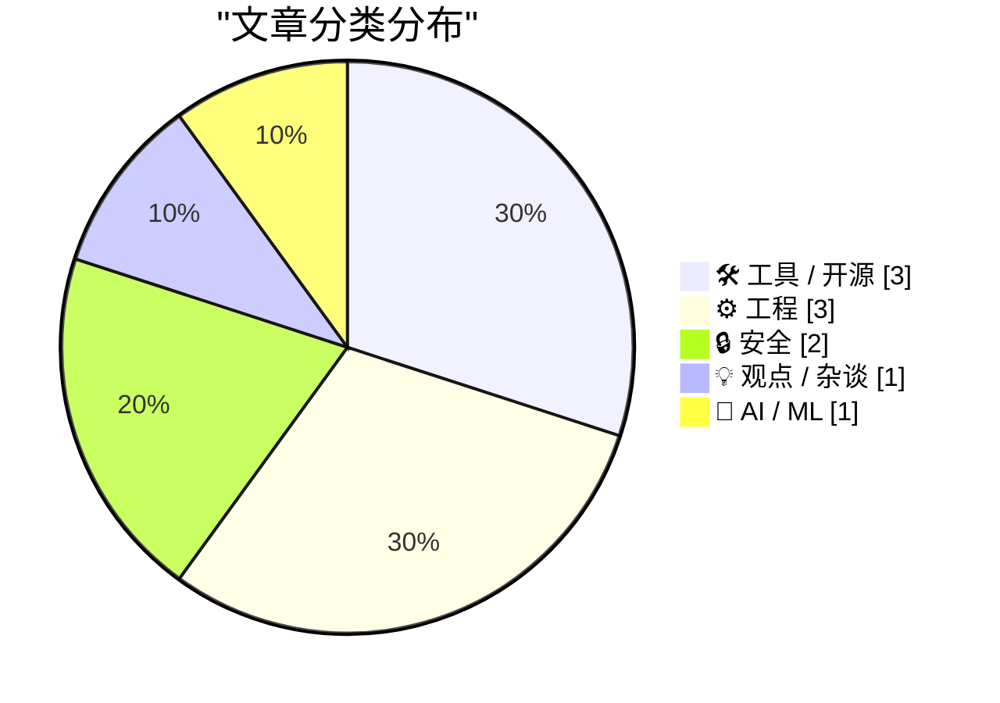
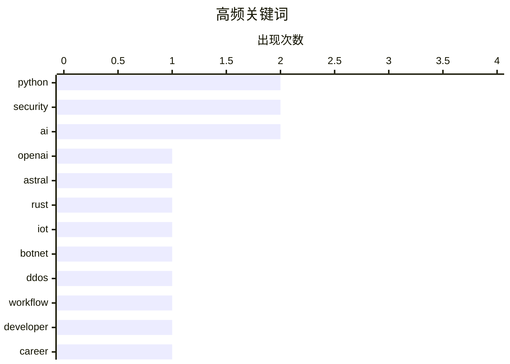

# 📰 AI 博客每日精选 — 2026-03-20

> 来自 Karpathy 推荐的 92 个顶级技术博客，AI 精选 Top 10

## 📝 今日看点

AI 基础设施争夺与网络安全治理成为今日技术焦点。OpenAI 收购 Python 工具链巨头 Astral，显示大厂正夯实底层生态。与此同时社区也在反思 AI 幻觉与实际工作流的落差，提示技术落地仍需冷静。安全领域动作频频，FBI 瓦解百万级 IoT 僵尸网络配合 Google 收紧安卓侧加载政策，凸显出网络威胁与平台管控的双重升级。

---

## 🏆 今日必读

🥇 **OpenAI 收购 Astral 及其 uv/ruff/ty 项目的思考**

[Thoughts on OpenAI acquiring Astral and uv/ruff/ty](https://simonwillison.net/2026/Mar/19/openai-acquiring-astral/#atom-everything) — simonwillison.net · 20 小时前 · 🛠 工具 / 开源

> OpenAI 宣布收购 Python 工具链公司 Astral，后者维护着 uv、ruff 和 ty 三个关键开源项目。此次收购意味着 Python 生态中日益重要的基础设施将纳入 OpenAI 体系，可能影响未来工具开发方向。Astral 的工具以高性能著称，uv 作为包安装器已显著改变 Python 工作流。社区关注焦点在于这些负载型开源项目被大厂整合后的维护承诺与许可证变化。这是一次标志性的开源商业化合并，显示了 AI 公司对底层开发者工具的重视。

💡 **为什么值得读**: 洞察 Python 核心基础设施被 AI 巨头收购后的生态走向及潜在影响。

🏷️ OpenAI, Astral, Python, Rust

🥈 **联邦调查局瓦解引发巨大 DDoS 攻击的 IoT 僵尸网络**

[Feds Disrupt IoT Botnets Behind Huge DDoS Attacks](https://krebsonsecurity.com/2026/03/feds-disrupt-iot-botnets-behind-huge-ddos-attacks/) — krebsonsecurity.com · 12 小时前 · 🔒 安全

> 美国司法部联合加拿大和德国当局瓦解了四个破坏性极强的僵尸网络基础设施。这些名为 Aisuru、Kimwolf、JackSkid 和 Mossad 的僵尸网络控制了超过 300 万台被黑的 IoT 设备，包括路由器和网络摄像头。它们负责了一系列近期打破记录的分布式拒绝服务 (DDoS) 攻击，能够几乎使任何目标离线。执法行动旨在切断这些僵尸网络的指挥控制通道，防止进一步的网络瘫痪。此次行动展示了跨国合作在应对大规模 IoT 安全威胁上的有效性。

💡 **为什么值得读**: 关注跨国执法如何应对控制数百万设备的巨型 IoT 僵尸网络威胁。

🏷️ IoT, Botnet, DDoS, Security

🥉 **如果机器能思考，为何大家都被认为注定灭亡？**

[Why Is Everyone Supposed to Die If Machines Can Think?](https://idiallo.com/blog/everyone-is-supposed-to-die-when-machines-can-think?src=feed) — idiallo.com · 1 小时前 · 💡 观点 / 杂谈

> 文章质疑 AI 公司发言人关于 AI 融入职场的片面观点，指出开发者实际集成方式各不相同。作者观察到结对编程时不同开发者的设置差异巨大，但都不愿互相抱怨，因为彼此都会觉得对方的配置令人烦恼。开发工作的美感在于最终结果重于过程，强制统一 AI 工作流往往适得其反。尽管 AI 工具普及，但开发者保留个性化配置的权利至关重要，不应被公司政策强制规定。核心观点反对将 AI 使用标准化，强调工作流程的多样性比工具本身更重要。

💡 **为什么值得读**: 探讨在 AI 渗透职场的背景下，开发者如何保持工作流的自主性与多样性。

🏷️ AI, Workflow, Developer, Career

---

## 📊 数据概览

| 扫描源 | 抓取文章 | 时间范围 | 精选 |
|:---:|:---:|:---:|:---:|
| 76/92 | 2288 篇 → 17 篇 | 24h | **10 篇** |

### 分类分布



### 高频关键词



<details>
<summary>📈 纯文本关键词图（终端友好）</summary>

```
python   │ ████████████████████ 2
security │ ████████████████████ 2
ai       │ ████████████████████ 2
openai   │ ██████████░░░░░░░░░░ 1
astral   │ ██████████░░░░░░░░░░ 1
rust     │ ██████████░░░░░░░░░░ 1
iot      │ ██████████░░░░░░░░░░ 1
botnet   │ ██████████░░░░░░░░░░ 1
ddos     │ ██████████░░░░░░░░░░ 1
workflow │ ██████████░░░░░░░░░░ 1
```

</details>

### 🏷️ 话题标签

**python**(2) · **security**(2) · **ai**(2) · openai(1) · astral(1) · rust(1) · iot(1) · botnet(1) · ddos(1) · workflow(1) · developer(1) · career(1) · sqlalchemy(1) · database(1) · tutorial(1) · android(1) · sideloading(1) · google(1) · hallucination(1) · reliability(1)

---

## 🛠 工具 / 开源

### 1. OpenAI 收购 Astral 及其 uv/ruff/ty 项目的思考

[Thoughts on OpenAI acquiring Astral and uv/ruff/ty](https://simonwillison.net/2026/Mar/19/openai-acquiring-astral/#atom-everything) — **simonwillison.net** · 20 小时前 · ⭐ 27/30

> OpenAI 宣布收购 Python 工具链公司 Astral，后者维护着 uv、ruff 和 ty 三个关键开源项目。此次收购意味着 Python 生态中日益重要的基础设施将纳入 OpenAI 体系，可能影响未来工具开发方向。Astral 的工具以高性能著称，uv 作为包安装器已显著改变 Python 工作流。社区关注焦点在于这些负载型开源项目被大厂整合后的维护承诺与许可证变化。这是一次标志性的开源商业化合并，显示了 AI 公司对底层开发者工具的重视。

🏷️ OpenAI, Astral, Python, Rust

---

### 2. 包管理器镜像

[Package Manager Mirroring](https://nesbitt.io/2026/03/20/package-manager-mirroring.html) — **nesbitt.io** · 3 小时前 · ⭐ 20/30

> 文章调查了作者能找到的每一个镜像工具及其底层协议，涵盖了主流包管理器的同步方案。内容分析了现有工具在协议支持上的差异与局限性，对比了不同实现的技术细节。这是一份关于构建和维护软件包镜像基础设施的技术综述，旨在解决分发效率问题。作者整理了各类工具的优缺点，为需要搭建镜像服务的开发者提供选型参考。核心目的是帮助团队在本地或私有环境中可靠地复制公共包仓库内容。

🏷️ package-manager, mirroring, infrastructure, devops

---

### 3. Safari 的 StopTheMadness Pro 和 StopTheScript 扩展

[StopTheMadness Pro and StopTheScript Extensions for Safari](https://mastodon.social/@lapcatsoftware/116252960395480568) — **daringfireball.net** · 16 小时前 · ⭐ 17/30

> Jeff Johnson 推荐了两款 Safari 扩展，其中 StopTheMadness Pro 可停止自动播放视频并隐藏全站'Google 登录’按钮。该扩展还能隐藏许多网站上的粘性视频和通知请求，显著提升浏览体验。对于更极端的措施，StopTheScript 扩展可在选定网站上彻底禁用 JavaScript，还原页面本质。例如使用该扩展可使 The Guardian 网站变得可读，有效去除干扰元素与追踪脚本。这两款扩展被视为对抗网页过度脚本化和干扰元素的有效工具，适合追求纯净浏览的用户。

🏷️ Safari, Extension, UX, Privacy

---

## ⚙️ 工程

### 4. SQLAlchemy 2 实战 - 第 1 章 - 数据库设置

[SQLAlchemy 2 In Practice - Chapter 1 - Database Setup](https://blog.miguelgrinberg.com/post/sqlalchemy-2-in-practice---chapter-1---database-setup) — **miguelgrinberg.com** · 13 小时前 · ⭐ 25/30

> 这是《SQLAlchemy 2 in Practice》书籍的第一章，旨在帮助读者设置系统以便运行示例和练习。内容专注于如何在 Python 应用程序中配置关系型数据库环境，确保后续代码可执行。作为一本实操书籍，本章为后续深入讲解 SQLAlchemy 2 新特性奠定基础。读者将通过实际操作完成数据库初始化，为学习新技巧做好准备。这是提升 Python 数据库工作效率系列教程的起点，适合希望系统学习 ORM 的开发者。

🏷️ Python, SQLAlchemy, database, tutorial

---

### 5. Hacker News 讨论 Shubham Bose 的'49MB 网页’

[Hacker News Discussion on Shubham Bose’s ‘The 49MB Web Page’](https://news.ycombinator.com/item?id=47390945) — **daringfireball.net** · 19 小时前 · ⭐ 23/30

> 作者重申了一个长期持有的争议观点，即浏览器支持 JavaScript 是一个糟糕的错误。这一决定将原本作为文档的网页变成了嵌入式计算机程序，导致了如今 49 MB 大小网页的出现。如果没有脚本支持，就不会存在如此臃肿的页面，也不会形成大规模监控追踪工业综合体。文章认为网页文本内容本应轻量化，脚本化破坏了 Web 作为文档的初衷。核心观点呼吁反思 Web 技术栈过度复杂化的根源，主张回归轻量级文档模式。

🏷️ JavaScript, Web, Performance, Bloat

---

### 6. Windows 栈限制检查回顾：amd64 (x86-64)

[Windows stack limit checking retrospective: amd64, also known as x86-64](https://devblogs.microsoft.com/oldnewthing/20260319-00/?p=112152) — **devblogs.microsoft.com/oldnewthing** · 23 小时前 · ⭐ 21/30

> 文章回顾了 Windows 在 amd64 架构也称为 x86-64 上的栈限制检查机制演变。这是'The Old New Thing'系列关于到达现代的技术回顾部分，聚焦底层系统如何处理栈溢出保护。内容涉及架构差异对栈管理策略的影响，分析了从早期系统到 64 位系统的变化。作者详细解释了操作系统内核在特定硬件架构下的内存安全保护措施。这是一篇关于 Windows 内部机制的历史性技术文档，适合系统程序员阅读。

🏷️ Windows, amd64, stack, internals

---

## 🔒 安全

### 7. 联邦调查局瓦解引发巨大 DDoS 攻击的 IoT 僵尸网络

[Feds Disrupt IoT Botnets Behind Huge DDoS Attacks](https://krebsonsecurity.com/2026/03/feds-disrupt-iot-botnets-behind-huge-ddos-attacks/) — **krebsonsecurity.com** · 12 小时前 · ⭐ 26/30

> 美国司法部联合加拿大和德国当局瓦解了四个破坏性极强的僵尸网络基础设施。这些名为 Aisuru、Kimwolf、JackSkid 和 Mossad 的僵尸网络控制了超过 300 万台被黑的 IoT 设备，包括路由器和网络摄像头。它们负责了一系列近期打破记录的分布式拒绝服务 (DDoS) 攻击，能够几乎使任何目标离线。执法行动旨在切断这些僵尸网络的指挥控制通道，防止进一步的网络瘫痪。此次行动展示了跨国合作在应对大规模 IoT 安全威胁上的有效性。

🏷️ IoT, Botnet, DDoS, Security

---

### 8. Google 新侧加载限制包含 24 小时等待期

[Google’s New Sideloading Restrictions for Android Include a 24-Hour Waiting Period](https://www.androidauthority.com/google-android-sideloading-unverified-apps-new-rules-3650343/) — **daringfireball.net** · 18 小时前 · ⭐ 24/30

> Google 最终分享了 Android 新侧加载流程的具体细节，证实了此前关于高摩擦流程的说法。新规实施后，从 Play Store 以外安装应用的用户将立即感受到深刻影响，包括安装未验证开发者应用时的 24 小时等待期。这一措施显著增加了侧加载的摩擦成本，旨在保护用户安全但限制了自由度。报道指出这会让习惯侧加载的用户感到深切的不便，安装外部开发者应用变得更为困难。Google 高管此前言论并非玩笑，新规则确实大幅提高了外部安装门槛，改变了 Android 开放特性。

🏷️ Android, Sideloading, Google, Security

---

## 💡 观点 / 杂谈

### 9. 如果机器能思考，为何大家都被认为注定灭亡？

[Why Is Everyone Supposed to Die If Machines Can Think?](https://idiallo.com/blog/everyone-is-supposed-to-die-when-machines-can-think?src=feed) — **idiallo.com** · 1 小时前 · ⭐ 25/30

> 文章质疑 AI 公司发言人关于 AI 融入职场的片面观点，指出开发者实际集成方式各不相同。作者观察到结对编程时不同开发者的设置差异巨大，但都不愿互相抱怨，因为彼此都会觉得对方的配置令人烦恼。开发工作的美感在于最终结果重于过程，强制统一 AI 工作流往往适得其反。尽管 AI 工具普及，但开发者保留个性化配置的权利至关重要，不应被公司政策强制规定。核心观点反对将 AI 使用标准化，强调工作流程的多样性比工具本身更重要。

🏷️ AI, Workflow, Developer, Career

---

## 🤖 AI / ML

### 10. EnshittifAIcation（AI 化屎论）

[EnshittifAIcation](https://it-notes.dragas.net/2026/03/20/enshittifaication/) — **it-notes.dragas.net** · 2 小时前 · ⭐ 24/30

> 文章记录了一周内发生的三起事件，涉及 AI 机器人幻觉产生 VPN 需求、在 nginx 服务器上推荐 Apache 配置以及建议用云 VPS 替换 128 GB 内存。这些案例展示了将自信误认为能力的代价，反映了当前 AI 工具在实际运维中的不可靠性。作者通过实地笔记形式批评了 AI 生成内容中的荒谬建议，指出其缺乏基本常识。这种现象被称为'EnshittifAIcation'，暗示 AI 技术正在经历类似平台衰退的过程，质量下降。核心观点警示不要盲目信任 AI 输出的技术方案，需人工核实关键配置与硬件建议。

🏷️ AI, hallucination, reliability, LLM

---

*生成于 2026-03-20 13:24 | 扫描 76 源 → 获取 2288 篇 → 精选 10 篇*
*基于 [Hacker News Popularity Contest 2025](https://refactoringenglish.com/tools/hn-popularity/) RSS 源列表，由 [Andrej Karpathy](https://x.com/karpathy) 推荐*
*由「懂点儿AI」制作，欢迎关注同名微信公众号获取更多 AI 实用技巧 💡*
