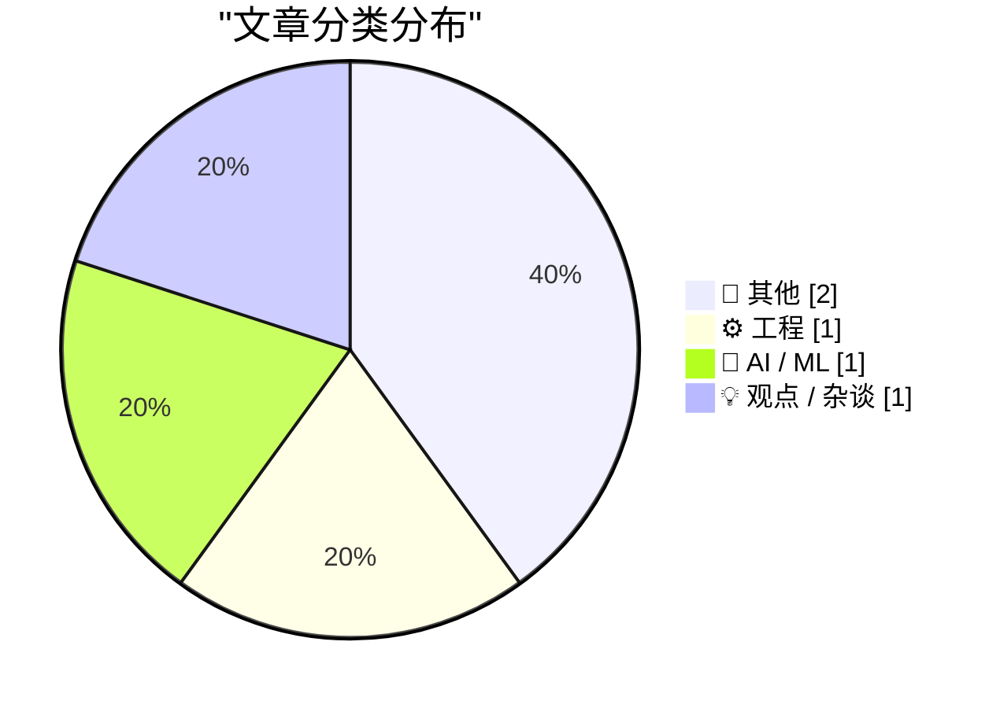
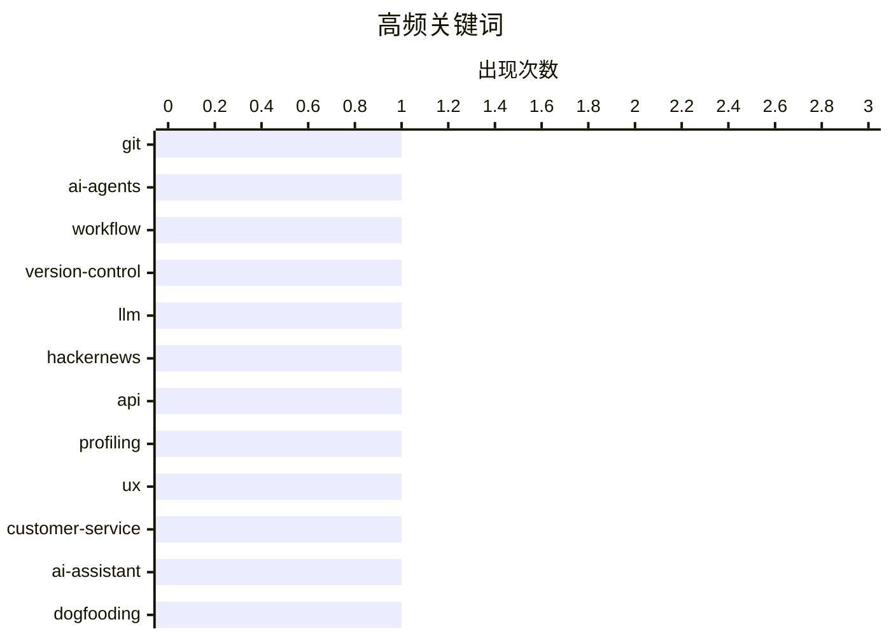

# 📰 AI 博客每日精选 — 2026-03-22

> 来自 Karpathy 推荐的 92 个顶级技术博客，AI 精选 Top 5

## 📝 今日看点

今日技术风向显示，AI 正从代码协作延伸至硬件终端与数据分析，编码代理重塑 Git 工作流的同时，亚马逊亦被曝计划重返智能手机市场。与之形成对比的是，业界开始警惕 AI 滥用带来的体验降级，尖锐批评企业强制推行自动化客服而忽视用户实际需求。与此同时，能源危机下的绿色可持续发展议题，仍在宏观层面制约着科技行业的未来走向。

---

## 🏆 今日必读

🥇 **与编码代理协作使用 Git**

[Using Git with coding agents](https://simonwillison.net/guides/agentic-engineering-patterns/using-git-with-coding-agents/#atom-everything) — simonwillison.net · 15 小时前 · ⚙️ 工程

> Git 是与编码代理协作的核心工具，版本控制能记录代码变更并支持撤销错误。编码代理熟练掌握 Git 的基础及高级功能，无需人类记忆复杂命令。利用这一特性，开发者可以更激进地使用 Git 分支和提交策略，将代理操作纳入版本管理流程。作者主张将 Git 作为人机协作的安全网，确保 AI 生成的代码可追溯且可回滚。这种模式改变了开发者与版本控制系统的交互方式，提升了工程安全性。

💡 **为什么值得读**: 为 AI 编程工作流提供了具体的版本控制实践指南，显著提升协作过程的安全性与可追溯性。

🏷️ Git, AI-agents, workflow, version-control

🥈 **基于评论分析 Hacker News 用户画像**

[Profiling Hacker News users based on their comments](https://simonwillison.net/2026/Mar/21/profiling-hacker-news-users/#atom-everything) — simonwillison.net · 13 小时前 · 🤖 AI / ML

> 通过向 LLM 提供用户最近 1,000 条 Hacker News 评论，实验分析此用户的提示词效果。利用 Algolia Hacker News API 按日期和作者用户名提取评论数据，构建 JSON feed 作为输入。这种操作揭示了基于公开言论进行用户画像的可行性与潜在风险。作者展示了如何轻松获取公开数据并结合 AI 进行深度分析的技术路径。该实验引发了对公共数据隐私边界及 AI 画像能力的深刻思考。

💡 **为什么值得读**: 揭示了公开数据结合 AI 进行用户画像的技术实现与隐私边界，引发对数据伦理的思考。

🏷️ LLM, HackerNews, API, profiling

🥉 **厌倦了吃自家狗粮？试试闻自己的屁！**

[Bored of eating your own dogfood? Try smelling your own farts!](https://shkspr.mobi/blog/2026/03/bored-of-eating-your-own-dogfood-try-smelling-your-own-farts/) — shkspr.mobi · 35 分钟前 · 💡 观点 / 杂谈

> 文章讽刺大型企业在客户服务中强制推行 AI 助手而忽视基本用户体验的现象。作者遭遇电话占线却被建议通过 WhatsApp 联系 AI 助手，揭露了企业预测模型与实际服务能力的脱节。这种吃自家狗粮的变体实则是自我陶醉，未能解决用户实际需求。核心观点在于技术部署应以解决用户问题为导向，而非单纯展示自动化能力。标题隐喻了企业沉溺于内部测试而忽略外部真实反馈的荒谬状态。

💡 **为什么值得读**: 以幽默犀利的视角批判了企业盲目推行 AI 客服而忽视真实用户体验的行业通病。

🏷️ UX, customer-service, AI-assistant, dogfooding

---

## 📊 数据概览

| 扫描源 | 抓取文章 | 时间范围 | 精选 |
|:---:|:---:|:---:|:---:|
| 76/92 | 2289 篇 → 5 篇 | 24h | **5 篇** |

### 分类分布



### 高频关键词



<details>
<summary>📈 纯文本关键词图（终端友好）</summary>

```
git              │ ████████████████████ 1
ai-agents        │ ████████████████████ 1
workflow         │ ████████████████████ 1
version-control  │ ████████████████████ 1
llm              │ ████████████████████ 1
hackernews       │ ████████████████████ 1
api              │ ████████████████████ 1
profiling        │ ████████████████████ 1
ux               │ ████████████████████ 1
customer-service │ ████████████████████ 1
```

</details>

### 🏷️ 话题标签

**git**(1) · **ai-agents**(1) · **workflow**(1) · version-control(1) · llm(1) · hackernews(1) · api(1) · profiling(1) · ux(1) · customer-service(1) · ai-assistant(1) · dogfooding(1) · amazon(1) · smartphone(1) · hardware(1) · news(1) · energy(1) · policy(1) · sustainability(1) · geopolitics(1)

---

## 📝 其他

### 1. 路透社：亚马逊计划在 Fire Phone 失败十多年后重返智能手机市场

[Reuters: ‘Amazon Plans Smartphone Comeback More Than a Decade After Fire Phone Flop’](https://www.reuters.com/technology/amazon-plans-smartphone-comeback-more-than-decade-after-fire-phone-flop-2026-03-20/) — **daringfireball.net** · 12 小时前 · ⭐ 19/30

> 路透社报道亚马逊计划在 Fire Phone 失败十多年后重返智能手机市场，内部代号为 Transformer。新设备定位为移动个性化终端，旨在与家庭语音助手 Alexa 同步并作为全天候连接亚马逊客户的渠道。该项目由设备与服务部门开发，重点在于购物和观看体验的个人化功能。尽管曾有失败历史，亚马逊仍试图通过深度生态整合寻找新的硬件切入点。此举标志着亚马逊在 AI 硬件布局上的最新战略调整。

🏷️ Amazon, smartphone, hardware, news

---

### 2. 为何我们现在必须节约能源，并坚持推进绿色能源

[Waarom we nu WEL zuinig moeten doen, en door moeten met groene energie](https://berthub.eu/articles/posts/waarom-we-nu-wel-zuinig-moeten-doen-en-meer-groene-energie/) — **berthub.eu** · 3 小时前 · ⭐ 18/30

> 针对国际能源署因中东战争呼吁节能，荷兰部长却声称本地无短缺的矛盾现象提出质疑。文章指出汽油价格已飙升，能源短缺终将波及本国，反驳了政府盲目乐观的态度。作者强调即使在夏季也应明智使用能源，并坚持推进绿色能源转型。核心观点在于地缘政治风险下，节能与绿色能源政策不应因短期局部稳定而松懈。这种政策分歧反映了国家利益与全球能源安全之间的张力。

🏷️ energy, policy, sustainability, geopolitics

---

## ⚙️ 工程

### 3. 与编码代理协作使用 Git

[Using Git with coding agents](https://simonwillison.net/guides/agentic-engineering-patterns/using-git-with-coding-agents/#atom-everything) — **simonwillison.net** · 15 小时前 · ⭐ 27/30

> Git 是与编码代理协作的核心工具，版本控制能记录代码变更并支持撤销错误。编码代理熟练掌握 Git 的基础及高级功能，无需人类记忆复杂命令。利用这一特性，开发者可以更激进地使用 Git 分支和提交策略，将代理操作纳入版本管理流程。作者主张将 Git 作为人机协作的安全网，确保 AI 生成的代码可追溯且可回滚。这种模式改变了开发者与版本控制系统的交互方式，提升了工程安全性。

🏷️ Git, AI-agents, workflow, version-control

---

## 🤖 AI / ML

### 4. 基于评论分析 Hacker News 用户画像

[Profiling Hacker News users based on their comments](https://simonwillison.net/2026/Mar/21/profiling-hacker-news-users/#atom-everything) — **simonwillison.net** · 13 小时前 · ⭐ 25/30

> 通过向 LLM 提供用户最近 1,000 条 Hacker News 评论，实验分析此用户的提示词效果。利用 Algolia Hacker News API 按日期和作者用户名提取评论数据，构建 JSON feed 作为输入。这种操作揭示了基于公开言论进行用户画像的可行性与潜在风险。作者展示了如何轻松获取公开数据并结合 AI 进行深度分析的技术路径。该实验引发了对公共数据隐私边界及 AI 画像能力的深刻思考。

🏷️ LLM, HackerNews, API, profiling

---

## 💡 观点 / 杂谈

### 5. 厌倦了吃自家狗粮？试试闻自己的屁！

[Bored of eating your own dogfood? Try smelling your own farts!](https://shkspr.mobi/blog/2026/03/bored-of-eating-your-own-dogfood-try-smelling-your-own-farts/) — **shkspr.mobi** · 35 分钟前 · ⭐ 20/30

> 文章讽刺大型企业在客户服务中强制推行 AI 助手而忽视基本用户体验的现象。作者遭遇电话占线却被建议通过 WhatsApp 联系 AI 助手，揭露了企业预测模型与实际服务能力的脱节。这种吃自家狗粮的变体实则是自我陶醉，未能解决用户实际需求。核心观点在于技术部署应以解决用户问题为导向，而非单纯展示自动化能力。标题隐喻了企业沉溺于内部测试而忽略外部真实反馈的荒谬状态。

🏷️ UX, customer-service, AI-assistant, dogfooding

---

*生成于 2026-03-22 13:09 | 扫描 76 源 → 获取 2289 篇 → 精选 5 篇*
*基于 [Hacker News Popularity Contest 2025](https://refactoringenglish.com/tools/hn-popularity/) RSS 源列表，由 [Andrej Karpathy](https://x.com/karpathy) 推荐*
*由「懂点儿AI」制作，欢迎关注同名微信公众号获取更多 AI 实用技巧 💡*
