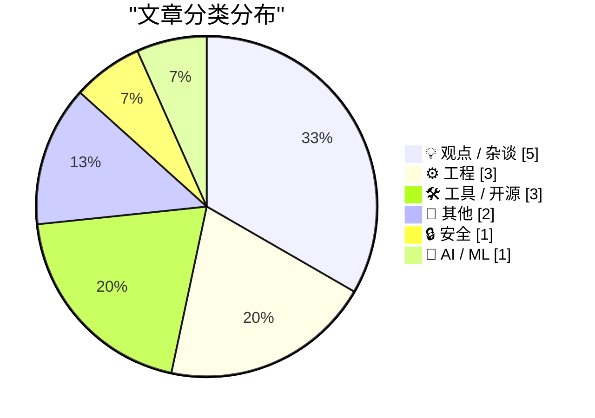
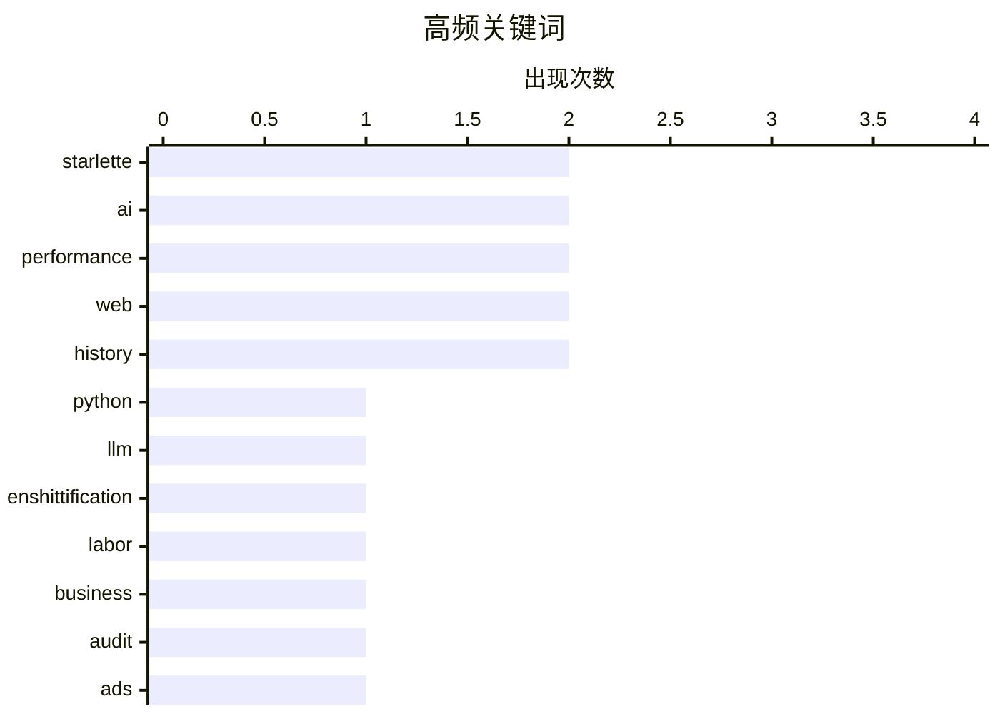

# 📰 AI 博客每日精选 — 2026-03-23

> 来自 Karpathy 推荐的 92 个顶级技术博客，AI 精选 Top 15

## 📝 今日看点

今日技术圈围绕网页性能、职场管理与开发工具展开讨论。媒体网站因广告加载导致页面极度膨胀，引发对现代网页资源浪费的强烈批评。业界同时质疑过度自动化与人员配备不足的管理策略，指出其牺牲用户体验换取短期收益的本质。而在开发领域，后端框架更新与 AI 辅助工具的演进，持续推动着底层基础设施与编码效率的提升。

---

## 🏆 今日必读

🥇 **使用 Claude 技能实验 Starlette 1.0**

[Experimenting with Starlette 1.0 with Claude skills](https://simonwillison.net/2026/Mar/22/starlette/#atom-everything) — simonwillison.net · 12 小时前 · ⚙️ 工程

> Starlette 1.0 正式发布，作为 FastAPI 的底层基础框架，其知名度虽低于 FastAPI 但使用量巨大。该框架由 Kim Christie 于 2018 年开始开发，此次更新标志着其成熟度的重要里程碑。作者利用 Claude 技能对新版 Starlette 进行了实验性测试，探索其在实际开发中的表现。尽管 FastAPI 吸引了大量关注，但 Starlette 本身作为异步 ASGI 框架的价值不容忽视。此次版本更新为 Python 异步开发生态提供了更稳定的底层支持。

💡 **为什么值得读**: 了解 FastAPI 底层依赖的重大版本更新及其对 Python 异步开发生态的影响。

🏷️ Starlette, Python, LLM

🥈 **多元主义：人员配备不足作为一种"屎化"形式**

[Pluralistic: Understaffing as a form of enshittification (23 Mar 2026)](https://pluralistic.net/2026/03/22/nobodys-home/) — pluralistic.net · 6 小时前 · 💡 观点 / 杂谈

> 人员配备不足正成为一种"屎化"手段，将价值从员工、患者和消费者转移至投资者。这种管理策略通过削减人力成本来最大化短期收益，却牺牲了服务质量和用户体验。作者列举了多个案例，包括 AI 无法替代工作、安全模型及版权斗争等关联议题。核心观点认为这种剥削性策略正在系统性破坏商业和社会结构。这种趋势在科技和服务行业尤为明显，导致长期价值受损。

💡 **为什么值得读**: 深入理解现代企业管理中隐蔽的价值转移机制及其对社会服务的负面影响。

🏷️ enshittification, labor, AI, business

🥉 **PCGamer 文章性能审计**

[PCGamer Article Performance Audit](https://simonwillison.net/2026/Mar/22/pcgamer-audit/#atom-everything) — simonwillison.net · 13 小时前 · ⚙️ 工程

> PC Gamer 一篇推荐 RSS 阅读器的文章初始加载高达 37MB，性能审计揭示了这一惊人数据。由于自动播放视频广告的存在，五分钟内页面下载量额外增加了数百 MB。该案例揭示了现代网页膨胀的极端情况，严重影响了用户体验和网络资源消耗。具体数据量化了广告技术对网页性能的破坏性影响。这项研究展示了未经优化的内容发布如何导致惊人的带宽浪费。

💡 **为什么值得读**: 通过极端案例直观感受网页膨胀问题的严重性及广告技术对性能的侵蚀。

🏷️ performance, web, audit

---

## 📊 数据概览

| 扫描源 | 抓取文章 | 时间范围 | 精选 |
|:---:|:---:|:---:|:---:|
| 78/92 | 2329 篇 → 17 篇 | 24h | **15 篇** |

### 分类分布



### 高频关键词



<details>
<summary>📈 纯文本关键词图（终端友好）</summary>

```
starlette        │ ████████████████████ 2
ai               │ ████████████████████ 2
performance      │ ████████████████████ 2
web              │ ████████████████████ 2
history          │ ████████████████████ 2
python           │ ██████████░░░░░░░░░░ 1
llm              │ ██████████░░░░░░░░░░ 1
enshittification │ ██████████░░░░░░░░░░ 1
labor            │ ██████████░░░░░░░░░░ 1
business         │ ██████████░░░░░░░░░░ 1
```

</details>

### 🏷️ 话题标签

**starlette**(2) · **ai**(2) · **performance**(2) · web(2) · history(2) · python(1) · llm(1) · enshittification(1) · labor(1) · business(1) · audit(1) · ads(1) · ux(1) · customer-service(1) · automation(1) · javascript(1) · sandbox(1) · security(1) · git(1) · crdt(1)

---

## 💡 观点 / 杂谈

### 1. 多元主义：人员配备不足作为一种"屎化"形式

[Pluralistic: Understaffing as a form of enshittification (23 Mar 2026)](https://pluralistic.net/2026/03/22/nobodys-home/) — **pluralistic.net** · 6 小时前 · ⭐ 25/30

> 人员配备不足正成为一种"屎化"手段，将价值从员工、患者和消费者转移至投资者。这种管理策略通过削减人力成本来最大化短期收益，却牺牲了服务质量和用户体验。作者列举了多个案例，包括 AI 无法替代工作、安全模型及版权斗争等关联议题。核心观点认为这种剥削性策略正在系统性破坏商业和社会结构。这种趋势在科技和服务行业尤为明显，导致长期价值受损。

🏷️ enshittification, labor, AI, business

---

### 2. 半千兆字节的广告

[Half a Gigabyte of Ads](https://stuartbreckenridge.net/2026-03-19-pc-gamer-recommends-rss-readers-in-a-37mb-article/) — **daringfireball.net** · 19 小时前 · ⭐ 24/30

> 分析指出 PC Gamer 某网页初始加载达 37MB，五分钟内因广告下载了近 0.5GB 数据。这种不负责任的行为被视为极不专业，严重浪费了用户带宽和设备资源。作者建议浏览器默认应将页面加载上限设为 5MB，超出部分需用户明确同意。核心观点呼吁浏览器厂商介入防御此类过度下载行为。这种机制能有效防止恶意或贪婪的广告脚本耗尽用户资源。

🏷️ ads, performance, web

---

### 3. 厌倦了吃自己的狗粮？试试闻自己的屁！

[Bored of eating your own dogfood? Try smelling your own farts!](https://shkspr.mobi/blog/2026/03/bored-of-eating-your-own-dogfood-try-smelling-your-own-farts/) — **shkspr.mobi** · 23 小时前 · ⭐ 22/30

> 大型企业在客户服务中过度依赖自动化而忽视人工支持的现象遭到讽刺。用户致电咨询时被告知信息均在网站或由 AI 助手处理，导致电话等待时间过长。这种"吃狗粮"式的内部测试失效，暴露了企业预测呼叫量和服务设计的严重失误。核心观点批评了为了降低成本而牺牲用户体验的虚假效率策略。最终导致用户无法获得有效帮助，损害了品牌信任度。

🏷️ UX, AI, customer-service, automation

---

### 4. "协作"都是胡扯

["Collaboration" is bullshit.](https://www.joanwestenberg.com/collaboration-is-bullshit/) — **joanwestenberg.com** · 12 小时前 · ⭐ 20/30

> 现代职场中过度推崇的"协作"概念遭到尖锐批评，认为其常被滥用为低效的借口。作者通过付费订阅模式提供更深度的社区访问和直接问答服务，定价为每月 2.50 美元。内容强调独立工作价值与高质量交流的重要性，区别于表面的团队协作。核心观点主张重新评估协作的实际产出而非盲目跟随潮流。这种反思有助于团队识别真正的生产力障碍而非形式主义的会议。

🏷️ collaboration, workplace, culture, management

---

### 5. “很好，我很高兴他死了。”

[‘Good, I’m Glad He’s Dead.’](https://truthsocial.com/@realDonaldTrump/116268334535345382) — **daringfireball.net** · 18 小时前 · ⭐ 15/30

> 美国前总统特朗普在 TruthSocial 上关于罗伯特·穆勒去世的争议性言论引发关注。核心议题是对政治人物公开表达不当情绪的行为进行分析评论。作者指出随着年长者认知能力下降，可能会失去得体感并直接表达想法，甚至混淆签名习惯。文中对比了特朗普一贯的真实性争议，认为此次言论展现了某种残酷的诚实。结论暗示这种缺乏掩饰的表达反映了特定的心理或生理状态。

🏷️ politics, Trump, news

---

## ⚙️ 工程

### 6. 使用 Claude 技能实验 Starlette 1.0

[Experimenting with Starlette 1.0 with Claude skills](https://simonwillison.net/2026/Mar/22/starlette/#atom-everything) — **simonwillison.net** · 12 小时前 · ⭐ 25/30

> Starlette 1.0 正式发布，作为 FastAPI 的底层基础框架，其知名度虽低于 FastAPI 但使用量巨大。该框架由 Kim Christie 于 2018 年开始开发，此次更新标志着其成熟度的重要里程碑。作者利用 Claude 技能对新版 Starlette 进行了实验性测试，探索其在实际开发中的表现。尽管 FastAPI 吸引了大量关注，但 Starlette 本身作为异步 ASGI 框架的价值不容忽视。此次版本更新为 Python 异步开发生态提供了更稳定的底层支持。

🏷️ Starlette, Python, LLM

---

### 7. PCGamer 文章性能审计

[PCGamer Article Performance Audit](https://simonwillison.net/2026/Mar/22/pcgamer-audit/#atom-everything) — **simonwillison.net** · 13 小时前 · ⭐ 24/30

> PC Gamer 一篇推荐 RSS 阅读器的文章初始加载高达 37MB，性能审计揭示了这一惊人数据。由于自动播放视频广告的存在，五分钟内页面下载量额外增加了数百 MB。该案例揭示了现代网页膨胀的极端情况，严重影响了用户体验和网络资源消耗。具体数据量化了广告技术对网页性能的破坏性影响。这项研究展示了未经优化的内容发布如何导致惊人的带宽浪费。

🏷️ performance, web, audit

---

### 8. Beats 现在支持备注了

[Beats now have notes](https://simonwillison.net/2026/Mar/23/beats-now-have-notes/#atom-everything) — **simonwillison.net** · 9 小时前 · ⭐ 19/30

> 博客新增了"beats"功能的备注能力，此前该功能仅用于聚合外部来源内容至首页和归档页。由于 beats 数量常超过常规帖子且缺乏解释，此次更新允许作者为每条 beat 添加注释说明。这一改进增强了聚合内容的上下文信息，提升了读者的阅读体验。核心观点是通过补充元数据来完善内容聚合策略的有效性。这使得外部链接分享不再是孤立的信息点，而是带有作者见解的知识流。

🏷️ blog, features, aggregation

---

## 🛠 工具 / 开源

### 9. 合并状态可视化器

[Merge State Visualizer](https://simonwillison.net/2026/Mar/22/manyana/#atom-everything) — **simonwillison.net** · 17 小时前 · ⭐ 20/30

> 基于 Bram Cohen 提出的使用 CRDT 实现版本控制的愿景，开发了一个合并状态可视化工具。原始方案仅用 470 行 Python 代码阐述了相干版本控制的核心逻辑。作者通过 Claude 将该逻辑转化为可视化的交互工具，帮助开发者理解复杂的合并状态。该工具展示了 AI 辅助将理论代码转化为实用调试工具的高效流程。这对于理解分布式版本控制系统的内部状态变化具有直观帮助。

🏷️ git, CRDT, visualization

---

### 10. 命令行下的集合交集与差集

[Set intersection and difference at the command line](https://www.johndcook.com/blog/2026/03/23/intersection-difference/) — **johndcook.com** · 30 分钟前 · ⭐ 20/30

> 命令行下进行集合理论运算的实用方法得到介绍，重点分析了 `comm` 工具的局限性。虽然 `comm` 功能强大，但其语法难以记忆且要求输入文件必须预先排序。文章探讨了针对未排序文件或更直观语法的替代方案，以提升命令行数据处理效率。核心观点是优化现有工具链以降低集合运算的操作门槛。这对于需要频繁处理文本数据对比的开发人员具有实际指导意义。

🏷️ CLI, unix, set-theory, scripting

---

### 11. DNS 查询工具

[DNS Lookup](https://simonwillison.net/2026/Mar/22/dns/#atom-everything) — **simonwillison.net** · 16 小时前 · ⭐ 18/30

> 新开发的 DNS 查询工具利用了 Cloudflare 公共 DNS 服务的 JSON API 构建。核心发现是 Cloudflare 的 1.1.1.1、1.1.1.2 和 1.1.1.3 解析器均支持启用 CORS 的 JSON 接口。作者使用 Claude Code 快速构建了一个用户界面，用于同时对这三个解析器运行 DNS 查询。该工具允许用户直接在前端执行查询，无需后端代理，简化了调试流程。这一发现展示了公共 DNS 服务在开发者工具集成方面的便利性。

🏷️ DNS, Cloudflare, API

---

## 📝 其他

### 12. 486 之后是什么？

[What came after 486?](https://dfarq.homeip.net/what-came-after-486/?utm_source=rss&#038;utm_medium=rss&#038;utm_campaign=what-came-after-486) — **dfarq.homeip.net** · 1 小时前 · ⭐ 17/30

> 1990 年代之前 CPU 命名规则的历史演变过程揭示了硬件品牌化的背景。核心问题是英特尔为何不再沿用数字型号命名，而是转向品牌名称。关键事实指出 486 的完整型号为 80486，且当时 CPU 仅靠制造商和部件编号区分。文中提到法院禁止英特尔将数字注册为商标，这直接导致了命名策略的改变。虽然文章未完整展示后续方案，但揭示了法律因素对硬件品牌化的影响。

🏷️ CPU, Intel, hardware, history

---

### 13. 日立有限公司，第一部分

[Hitachi Ltd, Part I](https://www.abortretry.fail/p/hitachi-ltd-part-i) — **abortretry.fail** · 11 小时前 · ⭐ 16/30

> 关于日立有限公司历史系列报道的开篇之作展示了公司的原始日文名称。核心内容聚焦于“株式会社日立制作所”这一早期企业标识及其起源。文本仅提供了公司全名作为系列文章的索引入口。具体技术细节或历史背景需结合后续部分阅读。这标志着对这家日本工业巨头历史追溯的开始。

🏷️ Hitachi, corporate, history, industry

---

## 🔒 安全

### 14. JavaScript 沙箱研究

[JavaScript Sandboxing Research](https://simonwillison.net/2026/Mar/22/javascript-sandboxing-research/#atom-everything) — **simonwillison.net** · 16 小时前 · ⭐ 20/30

> 受 Aaron Harper 关于 Node.js worker threads 文章启发，开展了 JavaScript 沙箱运行的研究任务。利用 Claude Code 对比了多种沙箱方案，包括基于 worker threads 的实现及其他现有库。研究旨在探索在 Node.js 环境中安全执行不可信 JavaScript 代码的最佳实践。通过自动化代码分析，得出了不同方案在隔离性和性能上的对比结论。这为构建安全的插件系统或代码执行环境提供了技术参考。

🏷️ JavaScript, sandbox, security

---

## 🤖 AI / ML

### 15. Starlette 1.0 技能研究

[Starlette 1.0 skill](https://simonwillison.net/2026/Mar/23/starlette-1-skill/#atom-everything) — **simonwillison.net** · 12 小时前 · ⭐ 19/30

> 针对 Starlette 1.0 版本进行的 Claude Skills 技术研究项目记录了具体实验过程。核心主题是如何利用 AI 技能工具链来辅助理解和实验新的 Web 框架版本。关键内容包括指向 GitHub 上的具体研究仓库以及此前关于 Claude 与 Starlette 交互的实验文章。作者通过实际构建技能来验证 AI 在框架适配过程中的辅助能力。结论表明这是一种值得记录的技术探索路径，为后续开发提供参考。

🏷️ Starlette, Claude, skills

---

*生成于 2026-03-23 12:10 | 扫描 78 源 → 获取 2329 篇 → 精选 15 篇*
*基于 [Hacker News Popularity Contest 2025](https://refactoringenglish.com/tools/hn-popularity/) RSS 源列表，由 [Andrej Karpathy](https://x.com/karpathy) 推荐*
*由「懂点儿AI」制作，欢迎关注同名微信公众号获取更多 AI 实用技巧 💡*
