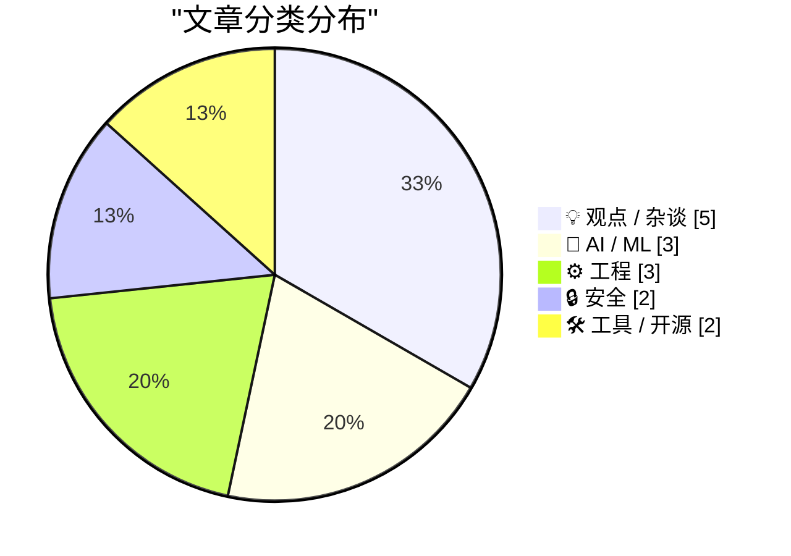
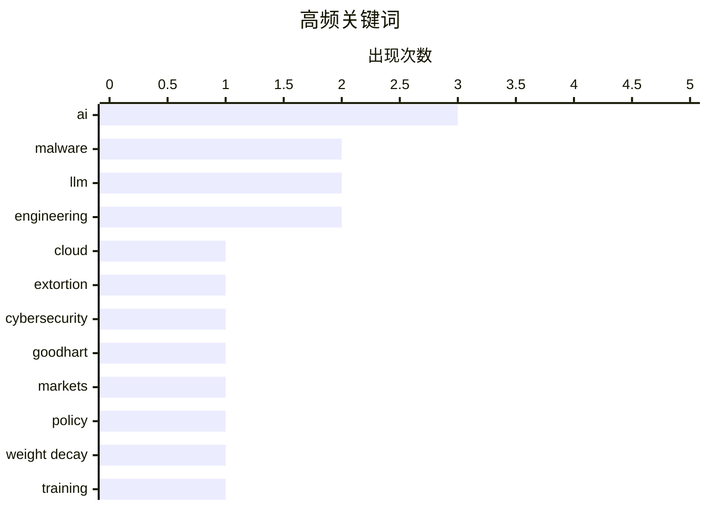

# 📰 AI 博客每日精选 — 2026-03-24

> 来自 Karpathy 推荐的 92 个顶级技术博客，AI 精选 Top 15

## 📝 今日看点

AI 底层优化与网络安全地缘化成为今日技术圈焦点。大模型研发正深入权重衰减与流式专家等底层机制优化，同时业界冷静反思 AI 在架构设计与内容质量上的边界。安全领域则呈现攻防升级态势，针对特定国家的擦除攻击与反封锁代理技术的出现，标志着网络空间对抗日益激烈。此外，工程实践中的合规与度量衡博弈问题，也提醒开发者在技术狂热中保持清醒。

---

## 🏆 今日必读

🥇 **'CanisterWorm' 发起针对伊朗的擦除攻击**

[‘CanisterWorm’ Springs Wiper Attack Targeting Iran](https://krebsonsecurity.com/2026/03/canisterworm-springs-wiper-attack-targeting-iran/) — krebsonsecurity.com · 20 小时前 · 🔒 安全

> 一个以经济利益为动机的数据窃取团伙正试图介入伊朗战争，利用蠕虫病毒通过安全性不足的云服务传播。该蠕虫会识别系统时区或默认语言是否为伊朗/波斯语，一旦匹配即触发数据擦除功能。攻击者结合了数据窃取与勒索手段，旨在破坏特定区域的基础设施。这种针对特定地域语言的定向攻击展示了网络武器在地缘冲突中的新趋势。安全团队需立即检查云服务配置以防止此类横向移动。

💡 **为什么值得读**: 了解针对特定地域语言特征的新型蠕虫攻击手法及其地缘政治背景。

🏷️ malware, cloud, extortion, cybersecurity

🥈 **多元主义：古德哈特定律对抗“预测市场”**

[Pluralistic: Goodhart's Law vs "prediction markets" (24 Mar 2026)](https://pluralistic.net/2026/03/24/degenerated-gambling/) — pluralistic.net · 54 分钟前 · 💡 观点 / 杂谈

> 文章探讨了古德哈特定律在预测市场中的应用困境，指出当指标成为目标时就不再是好指标。作者通过“将枪口对准指标头部”的比喻，揭示了度量衡被博弈化后的失效风险。文中列举了专利流氓对抗苹果、雅虎对抗世界等多个冲突场景作为类比。核心观点在于这种机制已退化为赌博而非预测，破坏了市场原有的信息聚合功能。读者可从中看到对量化评估体系失效的深刻批判及作者的最新动态。

💡 **为什么值得读**: 洞察量化指标被博弈化后如何导致预测市场失效的本质原因。

🏷️ Goodhart, markets, policy

🥉 **从零编写 LLM 第 32f 部分 -- 干预：权重衰减**

[Writing an LLM from scratch, part 32f -- Interventions: weight decay](https://www.gilesthomas.com/2026/03/llm-from-scratch-32f-interventions-weight-decay) — gilesthomas.com · 12 小时前 · 🤖 AI / ML

> 作者基于 Sebastian Raschka 的书籍代码，继续优化从头训练的 GPT-2 small base 模型的测试损失。本文重点介绍了在训练代码中创建优化器时引入权重衰减（weight decay）的具体干预措施。通过调整优化器参数，旨在解决模型过拟合问题并提升泛化能力。这是系列教程中关于模型调优的关键步骤，展示了手动调整超参数的实际效果。后续将继续探索其他干预手段以进一步降低损失。

💡 **为什么值得读**: 学习从头训练 LLM 时如何通过权重衰减优化器来降低测试损失的具体实践。

🏷️ LLM, weight decay, training

---

## 📊 数据概览

| 扫描源 | 抓取文章 | 时间范围 | 精选 |
|:---:|:---:|:---:|:---:|
| 78/92 | 2330 篇 → 22 篇 | 24h | **15 篇** |

### 分类分布



### 高频关键词



<details>
<summary>📈 纯文本关键词图（终端友好）</summary>

```
ai            │ ████████████████████ 3
malware       │ █████████████░░░░░░░ 2
llm           │ █████████████░░░░░░░ 2
engineering   │ █████████████░░░░░░░ 2
cloud         │ ███████░░░░░░░░░░░░░ 1
extortion     │ ███████░░░░░░░░░░░░░ 1
cybersecurity │ ███████░░░░░░░░░░░░░ 1
goodhart      │ ███████░░░░░░░░░░░░░ 1
markets       │ ███████░░░░░░░░░░░░░ 1
policy        │ ███████░░░░░░░░░░░░░ 1
```

</details>

### 🏷️ 话题标签

**ai**(3) · **malware**(2) · **llm**(2) · engineering(2) · cloud(1) · extortion(1) · cybersecurity(1) · goodhart(1) · markets(1) · policy(1) · weight decay(1) · training(1) · snowflake(1) · tor(1) · privacy(1) · agents(1) · openclaw(1) · automation(1) · moe(1) · inference(1)

---

## 💡 观点 / 杂谈

### 1. 多元主义：古德哈特定律对抗“预测市场”

[Pluralistic: Goodhart's Law vs "prediction markets" (24 Mar 2026)](https://pluralistic.net/2026/03/24/degenerated-gambling/) — **pluralistic.net** · 54 分钟前 · ⭐ 25/30

> 文章探讨了古德哈特定律在预测市场中的应用困境，指出当指标成为目标时就不再是好指标。作者通过“将枪口对准指标头部”的比喻，揭示了度量衡被博弈化后的失效风险。文中列举了专利流氓对抗苹果、雅虎对抗世界等多个冲突场景作为类比。核心观点在于这种机制已退化为赌博而非预测，破坏了市场原有的信息聚合功能。读者可从中看到对量化评估体系失效的深刻批判及作者的最新动态。

🏷️ Goodhart, markets, policy

---

### 2. 引用 David Abram

[Quoting David Abram](https://simonwillison.net/2026/Mar/23/david-abram/#atom-everything) — **simonwillison.net** · 17 小时前 · ⭐ 22/30

> 引用指出编程工作中最难的部分从来不是敲代码，而是理解系统、调试无意义的问题及设计架构。LLM 可以建议代码或帮助编写样板文件，但无法解决系统理解或高负载下的架构设计问题。作者强调这些核心工程决策能节省数月痛苦，是 AI 目前无法替代的人类技能。真正的技术挑战在于决策而非实现，这是区分初级与高级工程师的关键。LLM 在此类高层设计任务中仍存在明显局限。

🏷️ engineering, AI, craft, debugging

---

### 3. 引用 Neurotica

[Quoting Neurotica](https://simonwillison.net/2026/Mar/23/neurotica/#atom-everything) — **simonwillison.net** · 12 小时前 · ⭐ 21/30

> 引用指出“垃圾内容”（slop）是指消耗人类精力超过其生产精力的内容。当同事发送未经处理的 Gemini 输出时，并非表达创作自由，而是不尊重接收者的时间价值。这种低质量 AI 生成内容增加了下游处理成本，破坏了工作效率。作者强调人类时间价值应高于机器生成内容的泛滥。这是对人机协作中礼仪与效率平衡的深刻反思。

🏷️ AI, workplace, culture, productivity

---

### 4. Markdown Ate The World

[Markdown Ate The World](https://matduggan.com/markdown-ate-the-world/) — **matduggan.com** · 23 小时前 · ⭐ 18/30

> Markdown Ate The World

🏷️ Markdown, writing, text, publishing

---

### 5. Lines of code are useful

[Lines of code are useful](https://entropicthoughts.com/lines-of-code) — **entropicthoughts.com** · 13 小时前 · ⭐ 17/30

> Lines of code are useful

🏷️ LOC, metrics, engineering

---

## 🤖 AI / ML

### 6. 从零编写 LLM 第 32f 部分 -- 干预：权重衰减

[Writing an LLM from scratch, part 32f -- Interventions: weight decay](https://www.gilesthomas.com/2026/03/llm-from-scratch-32f-interventions-weight-decay) — **gilesthomas.com** · 12 小时前 · ⭐ 25/30

> 作者基于 Sebastian Raschka 的书籍代码，继续优化从头训练的 GPT-2 small base 模型的测试损失。本文重点介绍了在训练代码中创建优化器时引入权重衰减（weight decay）的具体干预措施。通过调整优化器参数，旨在解决模型过拟合问题并提升泛化能力。这是系列教程中关于模型调优的关键步骤，展示了手动调整超参数的实际效果。后续将继续探索其他干预手段以进一步降低损失。

🏷️ LLM, weight decay, training

---

### 7. 每周更新 496

[Weekly Update 496](https://www.troyhunt.com/weekly-update-496/) — **troyhunt.com** · 7 小时前 · ⭐ 25/30

> Troy Hunt 将观察 OpenClaw 的运行比作观看第一架飞机起飞，虽显粗糙但潜力巨大。文章指出代理 AI（agentic AI）正在改变世界，尽管目前技术还像用胶带粘起来的一样不稳定。这种早期阶段的技术展示了自动化代理在未来安全及工作流程中的可能性。作者通过每周更新分享了对此类新兴技术形态的敏锐观察。读者可从中了解安全专家对 AI 代理早期发展的评估。

🏷️ AI, agents, OpenClaw, automation

---

### 8. 流式专家模型

[Streaming experts](https://simonwillison.net/2026/Mar/24/streaming-experts/#atom-everything) — **simonwillison.net** · 7 小时前 · ⭐ 24/30

> 文章介绍了 Dan Woods 实验的流式专家（streaming experts）技术，旨在解决大模型显存不足的问题。该技术通过从 SSD 流式传输所需的专家权重来处理每个 token，而非将整个模型加载到 RAM 中。五天前 Dan 已在 48GB RAM 上运行了 Qwen3.5-397B-A17B 模型，展示了显著的硬件效率提升。这种混合专家模型（MoE）的加载策略让消费级硬件运行超大参数模型成为可能。这是突破显存限制运行大模型的关键技术方案。

🏷️ LLM, MoE, inference, optimization

---

## ⚙️ 工程

### 9. WWDC 2026：6 月 8 日至 12 日

[WWDC 2026: June 8–12](https://www.apple.com/newsroom/2026/03/apples-worldwide-developers-conference-returns-the-week-of-june-8/) — **daringfireball.net** · 17 小时前 · ⭐ 22/30

> 苹果宣布 2026 年全球开发者大会（WWDC）将于 6 月 8 日那一周举行，keynote 定于周一。会议将通过 Apple Developer app、网站、YouTube 及中国区的 bilibili 频道在线进行。整个星期将提供超过 100 个视频会话及互动实验室，开发者可直接与苹果工程师对接。这是苹果年度最重要的技术发布窗口，涵盖 iOS、macOS 等平台的最新动向。开发者需提前准备以获取最新平台状态联盟信息。

🏷️ Apple, WWDC, iOS, conference

---

### 10. 如何确保反恶意软件不终止我的自定义服务？

[How can I make sure the anti-malware software doesn’t terminate my custom service?](https://devblogs.microsoft.com/oldnewthing/20260323-00/?p=112157) — **devblogs.microsoft.com/oldnewthing** · 22 小时前 · ⭐ 22/30

> 针对自定义服务被反恶意软件误杀的问题，文章指出唯一的方法是“礼貌地请求”。这意味着需要通过正式的白名单申请流程或与厂商沟通来获得豁免。没有技术手段能强制反恶意软件忽略特定行为，必须遵循安全厂商的规则。这是 Windows 开发中常见的兼容性陷阱，需要开发者提前规划认证。强行绕过会导致服务被标记为恶意软件而终止。

🏷️ Windows, malware, services

---

### 11. The HTML Review: Issue 05

[The HTML Review: Issue 05](https://thehtml.review/05/) — **daringfireball.net** · 18 小时前 · ⭐ 20/30

> The HTML Review: Issue 05

🏷️ HTML, web-design, CSS, newsletter

---

## 🔒 安全

### 12. 'CanisterWorm' 发起针对伊朗的擦除攻击

[‘CanisterWorm’ Springs Wiper Attack Targeting Iran](https://krebsonsecurity.com/2026/03/canisterworm-springs-wiper-attack-targeting-iran/) — **krebsonsecurity.com** · 20 小时前 · ⭐ 27/30

> 一个以经济利益为动机的数据窃取团伙正试图介入伊朗战争，利用蠕虫病毒通过安全性不足的云服务传播。该蠕虫会识别系统时区或默认语言是否为伊朗/波斯语，一旦匹配即触发数据擦除功能。攻击者结合了数据窃取与勒索手段，旨在破坏特定区域的基础设施。这种针对特定地域语言的定向攻击展示了网络武器在地缘冲突中的新趋势。安全团队需立即检查云服务配置以防止此类横向移动。

🏷️ malware, cloud, extortion, cybersecurity

---

### 13. 托管 Snowflake 代理

[Hosting a Snowflake Proxy](https://matduggan.com/hosting-a-snowflake-proxy/) — **matduggan.com** · 1 小时前 · ⭐ 25/30

> 在 2026 年的动荡环境下，作者提供了一种简单可行的协助方式来对抗网络封锁。文章详细介绍了托管 Snowflake 代理的具体步骤，这是一种通过志愿者浏览器扩展帮助受限制用户访问互联网的技术。尽管全球危机频发，但这种低门槛的技术贡献能有效注入少量援助。操作过程简单，适合普通用户快速部署以支持网络自由。这是个人在技术层面参与人道主义援助的直接途径。

🏷️ Snowflake, Tor, privacy

---

## 🛠 工具 / 开源

### 14. Wander 0.2.0

[Wander 0.2.0](https://susam.net/code/news/wander/0.2.0.html) — **susam.net** · 12 小时前 · ⭐ 21/30

> Wander 0.2.0

🏷️ web console, decentralized, open source

---

### 15. datasette-files 0.1a2

[datasette-files 0.1a2](https://simonwillison.net/2026/Mar/23/datasette-files/#atom-everything) — **simonwillison.net** · 13 小时前 · ⭐ 18/30

> datasette-files 0.1a2

🏷️ Datasette, plugin, files, release

---

*生成于 2026-03-24 12:12 | 扫描 78 源 → 获取 2330 篇 → 精选 15 篇*
*基于 [Hacker News Popularity Contest 2025](https://refactoringenglish.com/tools/hn-popularity/) RSS 源列表，由 [Andrej Karpathy](https://x.com/karpathy) 推荐*
*由「懂点儿AI」制作，欢迎关注同名微信公众号获取更多 AI 实用技巧 💡*
