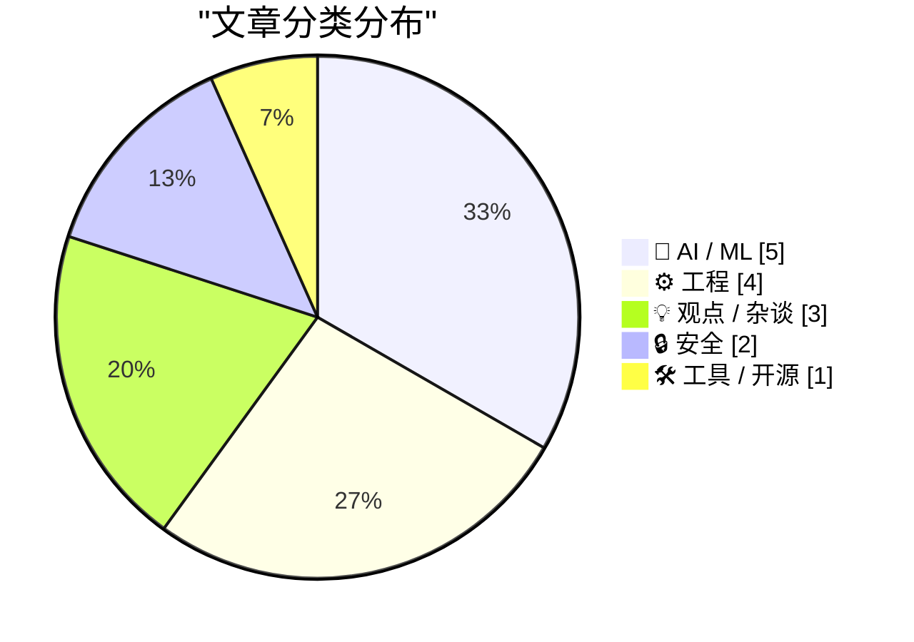
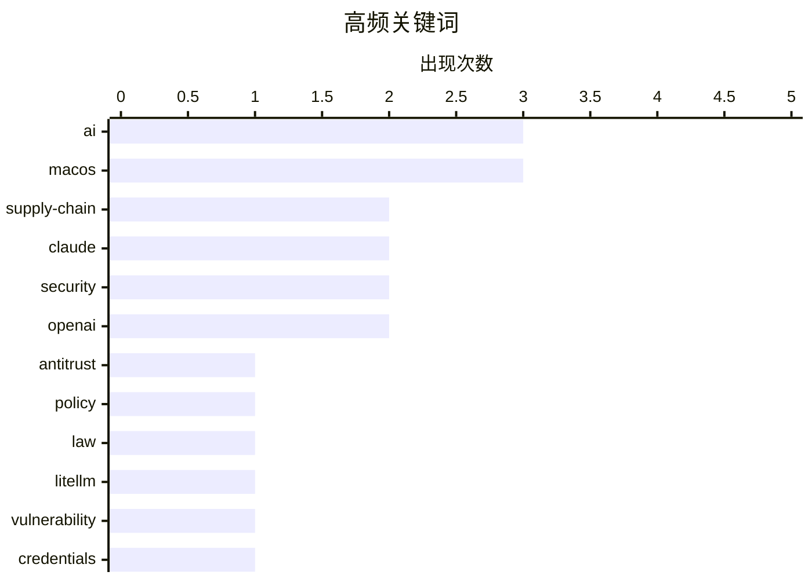

# 📰 AI 博客每日精选 — 2026-03-25

> 来自 Karpathy 推荐的 92 个顶级技术博客，AI 精选 Top 15

## 📝 今日看点

AI 代理正加速渗透操作系统，桌面控制与超级应用整合标志着人机交互范式向自主执行转变。供应链安全警报拉响，近期依赖包投毒事件促使社区重提冷却期机制，警示盲目更新的风险。与此同时，关于选择无聊技术与反思行业泡沫的讨论，提醒开发者在创新热潮中保持务实与冷静。今日技术圈在追求自主 AI 能力的同时，更需正视安全底线与工程成本。

---

## 🏆 今日必读

🥇 **Pluralistic：做生意的代价**

[Pluralistic: The cost of doing business (25 Mar 2026)](https://pluralistic.net/2026/03/25/fact-intensive/) — pluralistic.net · 5 小时前 · 💡 观点 / 杂谈

> 内容核心探讨反垄断法中“市场定义”被滥用为拒绝服务攻击的问题。作者列举了 Union Pacific 诉模型铁路、华纳诉 Potter 粉丝等多个案例，说明知识产权和商标滥用如何增加商业成本。文中还提到了 Grenfell 成本与租户的对比以及作者近期的演讲行程。链接集涵盖了从法律滥用至文化现象的广泛议题。核心观点在于当前的法律框架被用作阻碍竞争而非保护市场的工具。

💡 **为什么值得读**: 适合关注反垄断法、知识产权滥用及科技政策影响的读者深入了解法律如何被异化为商业武器。

🏷️ antitrust, policy, law

🥈 **LiteLLM 1.82.8 中存在恶意 litellm_init.pth 凭证窃取器**

[Malicious litellm_init.pth in litellm 1.82.8 — credential stealer](https://simonwillison.net/2026/Mar/24/malicious-litellm/#atom-everything) — simonwillison.net · 21 小时前 · 🔒 安全

> LiteLLM v1.82.8 PyPI 包被植入隐藏在 base64 编码 `litellm_init.pth` 文件中的凭证窃取器。该漏洞无需运行 `import litellm`，仅安装包即可触发，1.82.7 版本也存在类似利用但位置不同。这是一种严重的供应链攻击，直接影响开发者的本地凭证安全。作者强调了立即检查受影响版本并撤销凭证的重要性。此类攻击展示了开源依赖链中潜伏的高危风险。

💡 **为什么值得读**: 涉及热门 LLM 库的重大安全漏洞，开发者需紧急排查以避免凭证泄露。

🏷️ LiteLLM, vulnerability, credentials, supply-chain

🥉 **从零编写 LLM 第 32g 部分：干预措施之权重绑定**

[Writing an LLM from scratch, part 32g -- Interventions: weight tying](https://www.gilesthomas.com/2026/03/llm-from-scratch-32g-interventions-weight-tying) — gilesthomas.com · 16 小时前 · 🤖 AI / ML

> 内容探讨了 Sebastian Raschka 书中提到的权重绑定（weight tying）技术在现代 LLM 中较少使用的原因。虽然权重绑定能减少参数量，但经验表明它会使模型性能变差，直觉上这与模型表达能力受限有关。作者计划通过实验解释为何现代架构倾向于放弃这一优化手段。核心观点是参数效率的提升不应以牺牲模型最终表现为代价。这为理解模型架构演进提供了具体的技术视角。

💡 **为什么值得读**: 适合想深入理解 LLM 架构细节及权重绑定技术取舍的深度学习实践者。

🏷️ LLM, weights, tutorial

---

## 📊 数据概览

| 扫描源 | 抓取文章 | 时间范围 | 精选 |
|:---:|:---:|:---:|:---:|
| 78/92 | 2330 篇 → 22 篇 | 24h | **15 篇** |

### 分类分布



### 高频关键词



<details>
<summary>📈 纯文本关键词图（终端友好）</summary>

```
ai           │ ████████████████████ 3
macos        │ ████████████████████ 3
supply-chain │ █████████████░░░░░░░ 2
claude       │ █████████████░░░░░░░ 2
security     │ █████████████░░░░░░░ 2
openai       │ █████████████░░░░░░░ 2
antitrust    │ ███████░░░░░░░░░░░░░ 1
policy       │ ███████░░░░░░░░░░░░░ 1
law          │ ███████░░░░░░░░░░░░░ 1
litellm      │ ███████░░░░░░░░░░░░░ 1
```

</details>

### 🏷️ 话题标签

**ai**(3) · **macos**(3) · **supply-chain**(2) · claude(2) · security(2) · openai(2) · antitrust(1) · policy(1) · law(1) · litellm(1) · vulnerability(1) · credentials(1) · llm(1) · weights(1) · tutorial(1) · architecture(1) · practices(1) · technology(1) · ai-agents(1) · permissions(1)

---

## 🤖 AI / ML

### 1. 从零编写 LLM 第 32g 部分：干预措施之权重绑定

[Writing an LLM from scratch, part 32g -- Interventions: weight tying](https://www.gilesthomas.com/2026/03/llm-from-scratch-32g-interventions-weight-tying) — **gilesthomas.com** · 16 小时前 · ⭐ 26/30

> 内容探讨了 Sebastian Raschka 书中提到的权重绑定（weight tying）技术在现代 LLM 中较少使用的原因。虽然权重绑定能减少参数量，但经验表明它会使模型性能变差，直觉上这与模型表达能力受限有关。作者计划通过实验解释为何现代架构倾向于放弃这一优化手段。核心观点是参数效率的提升不应以牺牲模型最终表现为代价。这为理解模型架构演进提供了具体的技术视角。

🏷️ LLM, weights, tutorial

---

### 2. Claude Code 推出自动模式

[Auto mode for Claude Code](https://simonwillison.net/2026/Mar/24/auto-mode-for-claude-code/#atom-everything) — **simonwillison.net** · 12 小时前 · ⭐ 25/30

> Claude Code 推出了新的自动模式（auto mode），作为 `--dangerously-skip-permissions` 的替代方案。在此模式下，Claude 代表用户做出权限决策，但在行动运行前有 safeguards 监控。该功能似乎使用 Claude Sonnet 来实现安全监控逻辑。这标志着 AI 编程助手在自主性与安全性之间找到了新的平衡点。用户无需手动确认每个步骤即可享受自动化便利。

🏷️ Claude, AI-agents, permissions, coding

---

### 3. Claude 现在可以控制你的 Mac

[Claude Can Now Take Control of Your Mac](https://claude.com/blog/dispatch-and-computer-use) — **daringfireball.net** · 11 小时前 · ⭐ 22/30

> Claude 在 Cowork 和 Code 中新增功能，允许 AI 直接使用计算机完成任务。当缺乏特定工具访问权限时，Claude 可指向、点击并导航屏幕内容，自动打开文件、使用浏览器或运行开发工具。该功能无需设置，目前处于研究预览阶段，仅向 Claude Pro 和 Max 订阅者开放。它与 Dispatch 功能配合尤佳，可分配任务给 Claude 自主执行。这代表了 AI 代理操作能力的显著跃升。

🏷️ Claude, macOS, automation, AI

---

### 4. 华尔街日报：OpenAI 计划推出桌面“超级应用”

[WSJ: ‘OpenAI Plans Launch of Desktop “Superapp”’](https://www.wsj.com/tech/openai-plans-launch-of-desktop-superapp-to-refocus-simplify-user-experience-9e19931d?st=25wiu1) — **daringfireball.net** · 11 小时前 · ⭐ 21/30

> OpenAI 计划统一 ChatGPT 应用、编码平台 Codex 和浏览器到一个桌面“超级应用”中。此举旨在简化用户体验，并专注于工程和商业客户。应用主管 Fidji Simo 将监督变更，总裁 Greg Brockman 目前领导计算部门。这反映了 OpenAI 从单一聊天界面向综合生产力平台转型的战略。整合后的应用有望改变开发者与 AI 交互的方式。

🏷️ OpenAI, desktop-app, strategy, ChatGPT

---

### 5. OpenAI 正在关闭 Sora

[OpenAI Is Closing Sora](https://x.com/soraofficialapp/status/2036546752535470382) — **daringfireball.net** · 11 小时前 · ⭐ 20/30

> Sora 应用即将停止服务，官方承诺后续公布 API 时间表及作品保存方案。社区反馈显示该工具仅维持了短暂的热度，实际产出价值有限。John Gruber 评论称其为昂贵的昙花一现，用户创作内容并未产生实质影响。官方正在处理善后事宜，包括时间线和数据保留细节。这一决定标志着 OpenAI 在视频生成 C 端应用上的策略调整。

🏷️ OpenAI, Sora, video, shutdown

---

## ⚙️ 工程

### 6. 选择无聊的技术与创新实践

[Choose Boring Technology and Innovative Practices](https://buttondown.com/hillelwayne/archive/choose-boring-technology-and-innovative-practices/) — **buttondown.com/hillelwayne** · 21 小时前 · ⭐ 26/30

> 基于经典观点“选择无聊的技术”，指出新技术存在太多“未知的未知”，而成熟技术的陷阱已为人知。采用炫技科技会带来长期的维护负担，即使在热度消退后依然存在。作者主张在技术选型上保守，但在实践方法上保持创新。结论是平衡技术稳定性与工程实践的创新才是可持续之道。这种策略有助于降低项目长期风险。

🏷️ architecture, practices, technology

---

### 7. Windows 95 防止安装程序覆盖旧版本文件的机制

[Windows 95 defenses against installers that overwrite a file with an older version](https://devblogs.microsoft.com/oldnewthing/20260324-00/?p=112159) — **devblogs.microsoft.com/oldnewthing** · 22 小时前 · ⭐ 20/30

> Windows 95 内置了防止安装程序用旧版本文件覆盖系统文件的防御机制。这是一种非常原始的系统恢复保护形式，旨在维护系统稳定性。该机制通过检查文件版本来阻止潜在的回退操作。虽然技术古老，但体现了早期操作系统对文件完整性的重视。这种设计思路为后续系统文件保护奠定了基础。

🏷️ Windows, installer, legacy

---

### 8. 在树莓派上使用 FireWire

[Using FireWire on a Raspberry Pi](https://www.jeffgeerling.com/blog/2026/firewire-on-a-raspberry-pi/) — **jeffgeerling.com** · 20 小时前 · ⭐ 19/30

> 随着 macOS 26 Tahoe 移除 FireWire (IEEE 1394) 支持，旧式硬件如 DV 摄像机面临连接困境。作者探索使用树莓派作为替代方案来驱动老式 FireWire 设备。方案涉及硬盘、音视频 gear 等 legacy 硬件的兼容性测试。这为保留旧媒体资料提供了低成本的技术路径。实验证明了树莓派在接口转换上的灵活性。

🏷️ Raspberry-Pi, FireWire, hardware, macOS

---

### 9. iOS 26.4

[iOS 26.4](https://www.macrumors.com/guide/ios-26-4-features/) — **daringfireball.net** · 11 小时前 · ⭐ 19/30

> iOS 26.4 更新将 App Store 的应用与购买记录合并，并设立了独立的更新专区。现在访问应用更新需要两次点击，而非直接在个人资料页底部显示。这一改动虽增加了操作步骤，但使更新入口逻辑更加清晰。作者习惯手动更新应用以便阅读发布说明，新设计更符合此需求。整体交互变化影响了用户获取更新信息的效率。

🏷️ iOS, App-Store, update, mobile

---

## 💡 观点 / 杂谈

### 10. Pluralistic：做生意的代价

[Pluralistic: The cost of doing business (25 Mar 2026)](https://pluralistic.net/2026/03/25/fact-intensive/) — **pluralistic.net** · 5 小时前 · ⭐ 27/30

> 内容核心探讨反垄断法中“市场定义”被滥用为拒绝服务攻击的问题。作者列举了 Union Pacific 诉模型铁路、华纳诉 Potter 粉丝等多个案例，说明知识产权和商标滥用如何增加商业成本。文中还提到了 Grenfell 成本与租户的对比以及作者近期的演讲行程。链接集涵盖了从法律滥用至文化现象的广泛议题。核心观点在于当前的法律框架被用作阻碍竞争而非保护市场的工具。

🏷️ antitrust, policy, law

---

### 11. AI 行业正在对你撒谎

[The AI Industry Is Lying To You](https://www.wheresyoured.at/the-ai-industry-is-lying-to-you/) — **wheresyoured.at** · 18 小时前 · ⭐ 25/30

> 标题直指 AI 行业存在虚假宣传问题，作者通过独立报道和分析揭示行业真相。内容涉及订阅制通讯，年费 70 美元或月费 7 美元，提供每周 5000 至 18000 字的深度通讯。虽然具体技术细节未在片段中展开，但核心立场是质疑当前 AI 行业的叙事真实性。作者鼓励读者订阅以支持独立调查报道。这种独立资助模式旨在保持报道的客观性与深度。

🏷️ AI, business, ethics

---

### 12. 引用 Christopher Mims 的观点

[Quoting Christopher Mims](https://simonwillison.net/2026/Mar/24/christopher-mims/#atom-everything) — **simonwillison.net** · 15 小时前 · ⭐ 18/30

> 《华尔街日报》科技专栏作家 Christopher Mims 质疑将计算机完全控制权交给 AI 的做法。他认为未来回顾此举会显得极其愚蠢，堪比 Jimmy Fallon 展示无聊猿 NFT 图片。该观点直指当前 AI 代理（Agent）过度授权的安全与隐私风险。核心论点在于反对 AI 对个人生活设备的全面接管。这种批评反映了对 AI 自主权边界的深刻担忧。

🏷️ AI, security, risk, opinion

---

## 🔒 安全

### 13. LiteLLM 1.82.8 中存在恶意 litellm_init.pth 凭证窃取器

[Malicious litellm_init.pth in litellm 1.82.8 — credential stealer](https://simonwillison.net/2026/Mar/24/malicious-litellm/#atom-everything) — **simonwillison.net** · 21 小时前 · ⭐ 26/30

> LiteLLM v1.82.8 PyPI 包被植入隐藏在 base64 编码 `litellm_init.pth` 文件中的凭证窃取器。该漏洞无需运行 `import litellm`，仅安装包即可触发，1.82.7 版本也存在类似利用但位置不同。这是一种严重的供应链攻击，直接影响开发者的本地凭证安全。作者强调了立即检查受影响版本并撤销凭证的重要性。此类攻击展示了开源依赖链中潜伏的高危风险。

🏷️ LiteLLM, vulnerability, credentials, supply-chain

---

### 14. 包管理器需要冷静下来

[Package Managers Need to Cool Down](https://simonwillison.net/2026/Mar/24/package-managers-need-to-cool-down/#atom-everything) — **simonwillison.net** · 14 小时前 · ⭐ 25/30

> 受 LiteLLM 供应链攻击启发，内容重提“依赖冷却期”（dependency cooldowns）的概念。建议只在依赖包发布几天后再安装，以便社区有时间发现潜在问题。这种做法能有效降低引入恶意更新或严重 bug 的风险。核心观点是包管理器应默认引入延迟机制以换取更高的供应链安全性。这是一种以时间换安全的具体工程实践建议。

🏷️ supply-chain, package-manager, security, PyPI

---

## 🛠 工具 / 开源

### 15. 如何应对 MacOS 26 Tahoe 中的菜单项图标

[★ What to Do About Those Menu Item Icons in MacOS 26 Tahoe](https://daringfireball.net/2026/03/what_to_do_about_those_menu_item_icons_in_macos_26_tahoe) — **daringfireball.net** · 16 小时前 · ⭐ 21/30

> 内容讨论了 MacOS 26 Tahoe 系统应用菜单栏中出现的图标问题，作者形容其为“被诅咒的小疙瘩”。虽然存在隐藏偏好设置可以隐藏部分图标，但效果有限，仅能解决一半问题。作者比喻这更像是“半杯温水”而非“地狱中的冰水”。核心观点是系统 UI 设计的这一变化令人不满且解决方案不完善。用户需等待更完善的系统更新来彻底解决此体验问题。

🏷️ macOS, UI, menu-bar

---

*生成于 2026-03-25 12:09 | 扫描 78 源 → 获取 2330 篇 → 精选 15 篇*
*基于 [Hacker News Popularity Contest 2025](https://refactoringenglish.com/tools/hn-popularity/) RSS 源列表，由 [Andrej Karpathy](https://x.com/karpathy) 推荐*
*由「懂点儿AI」制作，欢迎关注同名微信公众号获取更多 AI 实用技巧 💡*
