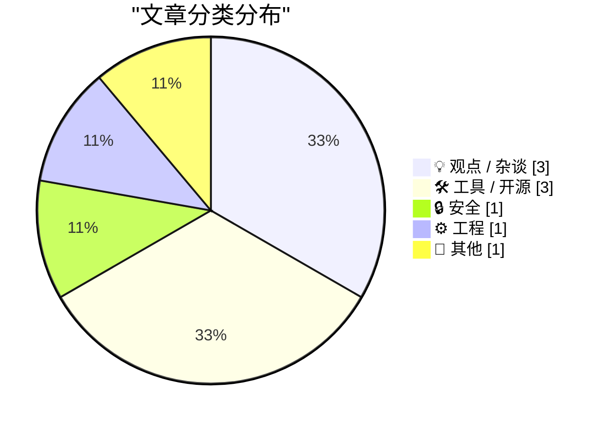
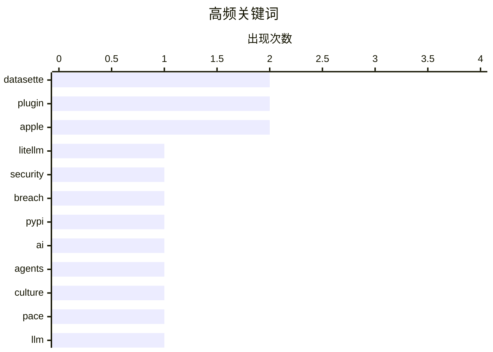

# 📰 AI 博客每日精选 — 2026-03-26

> 来自 Karpathy 推荐的 92 个顶级技术博客，AI 精选 Top 9

## 📝 今日看点

今日技术圈涌现出对 AI 狂热与大厂体制的双重反思。面对供应链安全事件及代理工程过热现象，社区开始呼吁在追求速度之余重拾安全纪律与理性。与此同时，关于简单代码晋升价值与企业愿景缺失的讨论，揭示了行业对务实工程主义及创新活力的迫切渴望。开发工具链与系统底层的持续迭代，则为生态稳健性提供了必要支撑。

---

## 🏆 今日必读

🥇 **LiteLLM 黑客攻击：你是 47,000 人之一吗？**

[LiteLLM Hack: Were You One of the 47,000?](https://simonwillison.net/2026/Mar/25/litellm-hack/#atom-everything) — simonwillison.net · 18 小时前 · 🔒 安全

> Daniel Hnyk 利用 BigQuery PyPI 数据集分析了被利用的 LiteLLM 包在 PyPI 上存活 46 分钟期间的下载量。统计结果显示该窗口期内实际下载次数仅为 46 次，远低于标题暗示的 47,000 人规模。这一数据通过公开的大数据查询验证了安全事件的实际影响范围。分析过程展示了如何利用公共数据集进行快速的安全影响评估。对于关心供应链安全的开发者来说，这是一个具体的数据参考案例。

💡 **为什么值得读**: 展示了如何利用公共数据源快速验证安全事件的实际影响范围，避免恐慌。

🏷️ LiteLLM, Security, Breach, PyPI

🥈 **关于彻底慢下来的思考**

[Thoughts on slowing the fuck down](https://simonwillison.net/2026/Mar/25/thoughts-on-slowing-the-fuck-down/#atom-everything) — simonwillison.net · 14 小时前 · 💡 观点 / 杂谈

> Mario Zechner 作为 OpenClaw 使用的 Pi agent 框架创作者，对当前的代理工程趋势提出了尖锐批评。他认为行业为了追求产出速度放弃了纪律和代理权，陷入了一种成瘾状态。这种观点来自具有实际框架开发经验的专家，而非单纯的理论推测。文章揭示了 agentic engineering 领域可能存在的过度炒作问题。对于正在构建 AI 代理系统的团队，这是一个必要的冷静视角。

💡 **为什么值得读**: 来自一线框架作者的逆向思考，有助于警惕 AI 代理开发中的过度工程化风险。

🏷️ AI, Agents, Culture, Pace

🥉 **datasette-llm 0.1a1 发布**

[datasette-llm 0.1a1](https://simonwillison.net/2026/Mar/25/datasette-llm/#atom-everything) — simonwillison.net · 14 小时前 · 🛠 工具 / 开源

> datasette-llm 0.1a1 版本发布，作为基础插件使 LLM 模型可供其他 Datasette 插件使用。该更新支持像 datasette-enrichments-llm 这样的插件调用模型功能。新版本引入了新的模型注册机制来增强能力。这是 Datasette 生态集成大语言模型能力的关键基础设施更新。开发者现在可以在数据探索工具中直接嵌入 AI 处理能力。

💡 **为什么值得读**: 标志着 Datasette 生态正式集成 LLM 能力，为数据探索插件开发提供了新基础。

🏷️ Datasette, LLM, Plugin, Python

---

## 📊 数据概览

| 扫描源 | 抓取文章 | 时间范围 | 精选 |
|:---:|:---:|:---:|:---:|
| 76/92 | 2291 篇 → 9 篇 | 24h | **9 篇** |

### 分类分布



### 高频关键词



<details>
<summary>📈 纯文本关键词图（终端友好）</summary>

```
datasette │ ████████████████████ 2
plugin    │ ████████████████████ 2
apple     │ ████████████████████ 2
litellm   │ ██████████░░░░░░░░░░ 1
security  │ ██████████░░░░░░░░░░ 1
breach    │ ██████████░░░░░░░░░░ 1
pypi      │ ██████████░░░░░░░░░░ 1
ai        │ ██████████░░░░░░░░░░ 1
agents    │ ██████████░░░░░░░░░░ 1
culture   │ ██████████░░░░░░░░░░ 1
```

</details>

### 🏷️ 话题标签

**datasette**(2) · **plugin**(2) · **apple**(2) · litellm(1) · security(1) · breach(1) · pypi(1) · ai(1) · agents(1) · culture(1) · pace(1) · llm(1) · python(1) · s3(1) · storage(1) · career(1) · code(1) · simplicity(1) · management(1) · ios(1)

---

## 💡 观点 / 杂谈

### 1. 关于彻底慢下来的思考

[Thoughts on slowing the fuck down](https://simonwillison.net/2026/Mar/25/thoughts-on-slowing-the-fuck-down/#atom-everything) — **simonwillison.net** · 14 小时前 · ⭐ 22/30

> Mario Zechner 作为 OpenClaw 使用的 Pi agent 框架创作者，对当前的代理工程趋势提出了尖锐批评。他认为行业为了追求产出速度放弃了纪律和代理权，陷入了一种成瘾状态。这种观点来自具有实际框架开发经验的专家，而非单纯的理论推测。文章揭示了 agentic engineering 领域可能存在的过度炒作问题。对于正在构建 AI 代理系统的团队，这是一个必要的冷静视角。

🏷️ AI, Agents, Culture, Pace

---

### 2. 工程师确实会因编写简单代码而获得晋升

[Engineers do get promoted for writing simple code](https://seangoedecke.com/simple-work-gets-rewarded/) — **seangoedecke.com** · 12 小时前 · ⭐ 21/30

> 文章反驳了“编写复杂代码才能保障职位安全”的流行笑话，指出简单代码同样能获得晋升机会。针对“没人因简单性而晋升”的观点，作者论证了交付可维护代码的工程师更受非技术管理者青睐。过度复杂的系统往往被视为技术债务而非成就。职业生涯的长期发展依赖于代码的可维护性而非复杂度。这是一个对软件工程职业价值观的重要纠正。

🏷️ Career, Code, Simplicity, Management

---

### 3. 我看不到苹果的愿景

[I Can't See Apple's Vision](https://matduggan.com/i-cant-see-apples-vision/) — **matduggan.com** · 14 分钟前 · ⭐ 20/30

> 文章批评大公司成长为数十亿美元实体后往往失去愿景，中间管理层级过多。管理层与执行层之间的隔阂导致公司失去对产品的固有感觉和热情。创意人员在这种结构中被边缘化，导致产品创新力下降。这是对当前苹果及其他科技巨头组织僵化现象的直接抨击。作者认为这种结构性的愿景缺失是大型企业的通病。

🏷️ Apple, Corporate, Vision, Critique

---

## 🛠 工具 / 开源

### 4. datasette-llm 0.1a1 发布

[datasette-llm 0.1a1](https://simonwillison.net/2026/Mar/25/datasette-llm/#atom-everything) — **simonwillison.net** · 14 小时前 · ⭐ 22/30

> datasette-llm 0.1a1 版本发布，作为基础插件使 LLM 模型可供其他 Datasette 插件使用。该更新支持像 datasette-enrichments-llm 这样的插件调用模型功能。新版本引入了新的模型注册机制来增强能力。这是 Datasette 生态集成大语言模型能力的关键基础设施更新。开发者现在可以在数据探索工具中直接嵌入 AI 处理能力。

🏷️ Datasette, LLM, Plugin, Python

---

### 5. datasette-files-s3 0.1a1 发布

[datasette-files-s3 0.1a1](https://simonwillison.net/2026/Mar/25/datasette-files-s3/#atom-everything) — **simonwillison.net** · 14 小时前 · ⭐ 21/30

> datasette-files-s3 0.1a1 版本为 datasette-files 添加了基于 S3 存储桶的文件存取后端。该 release 增加了一种从 URL 定期获取 S3 配置的机制，增强了凭证管理的灵活性。这使得 Datasette 实例能够更灵活地对接云存储服务而无需硬编码配置。对于需要处理大规模文件存储的数据集项目，这是一个实用的后端扩展。更新体现了 Datasette 插件系统在云原生存储方面的适应性。

🏷️ Datasette, S3, Storage, Plugin

---

### 6. App Store Connect 分析功能改进

[Improved Analytics in App Store Connect](https://developer.apple.com/news/?id=hh6v4b55) — **daringfireball.net** · 16 小时前 · ⭐ 20/30

> Apple 开发者宣布 App Store Connect 中的 Analytics 迎来了自发布以来最大的更新。新界面刷新了用户体验，使衡量应用和游戏性能变得更加容易，同时强调用户隐私保护。更新包含了全新的支持指南以记录所有变更细节。尽管功能增强，但社区仍存在关于数据隐私的担忧。这是苹果开发者工具链中数据分析能力的一次显著提升。

🏷️ Apple, iOS, Analytics, Developer

---

## 🔒 安全

### 7. LiteLLM 黑客攻击：你是 47,000 人之一吗？

[LiteLLM Hack: Were You One of the 47,000?](https://simonwillison.net/2026/Mar/25/litellm-hack/#atom-everything) — **simonwillison.net** · 18 小时前 · ⭐ 25/30

> Daniel Hnyk 利用 BigQuery PyPI 数据集分析了被利用的 LiteLLM 包在 PyPI 上存活 46 分钟期间的下载量。统计结果显示该窗口期内实际下载次数仅为 46 次，远低于标题暗示的 47,000 人规模。这一数据通过公开的大数据查询验证了安全事件的实际影响范围。分析过程展示了如何利用公共数据集进行快速的安全影响评估。对于关心供应链安全的开发者来说，这是一个具体的数据参考案例。

🏷️ LiteLLM, Security, Breach, PyPI

---

## ⚙️ 工程

### 8. 如何将对话框的消息循环改为 MsgWaitForMultipleObjects 而非 GetMessage

[How can I change a dialog box’s message loop to do a Msg­Wait­For­Multiple­Objects instead of Get­Message?](https://devblogs.microsoft.com/oldnewthing/20260325-00/?p=112165) — **devblogs.microsoft.com/oldnewthing** · 22 小时前 · ⭐ 20/30

> The Old New Thing 博客探讨了如何更改对话框等待机制，使用 MsgWaitForMultipleObjects 替代 GetMessage。文章解释了对话框允许更改其等待方式的技术细节。这涉及 Windows API 中消息循环的高级定制方法。对于需要处理多对象等待状态的 Windows 桌面开发者，这是一个具体的实现指南。内容深入到底层消息处理机制，适合系统级编程人员参考。

🏷️ Windows, API, Messaging, Legacy

---

## 📝 其他

### 9. “包含不寻常结构的连锁餐厅名称列表”

[‘A List of Chain Restaurants Whose Names Contain Unusual Structures’](https://onefoottsunami.com/2026/03/18/a-list-of-chain-restaurants-whose-names-contain-unusual-structures/) — **daringfireball.net** · 16 小时前 · ⭐ 11/30

> John Gruber 评论了 Paul Kafasis 关于连锁餐厅名称中包含不寻常结构的文章。作者试图寻找遗漏的例子，最终提到 80 年代 Chuck E. Cheese 的竞争对手 ShowBiz Pizza Place。虽然 Place 是不寻常的名词，但不属于结构范畴，因此不在原列表之列。这篇博文展示了语言结构在商业命名中的趣味性观察。这是科技博客中罕见的语言学与文化观察内容。

🏷️ Restaurants, Names, Trivia, Humor

---

*生成于 2026-03-26 12:08 | 扫描 76 源 → 获取 2291 篇 → 精选 9 篇*
*基于 [Hacker News Popularity Contest 2025](https://refactoringenglish.com/tools/hn-popularity/) RSS 源列表，由 [Andrej Karpathy](https://x.com/karpathy) 推荐*
*由「懂点儿AI」制作，欢迎关注同名微信公众号获取更多 AI 实用技巧 💡*
