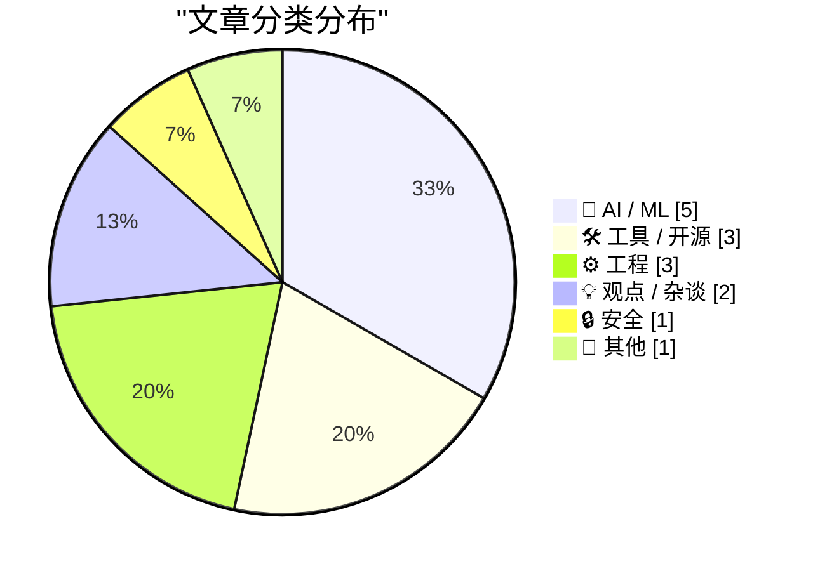
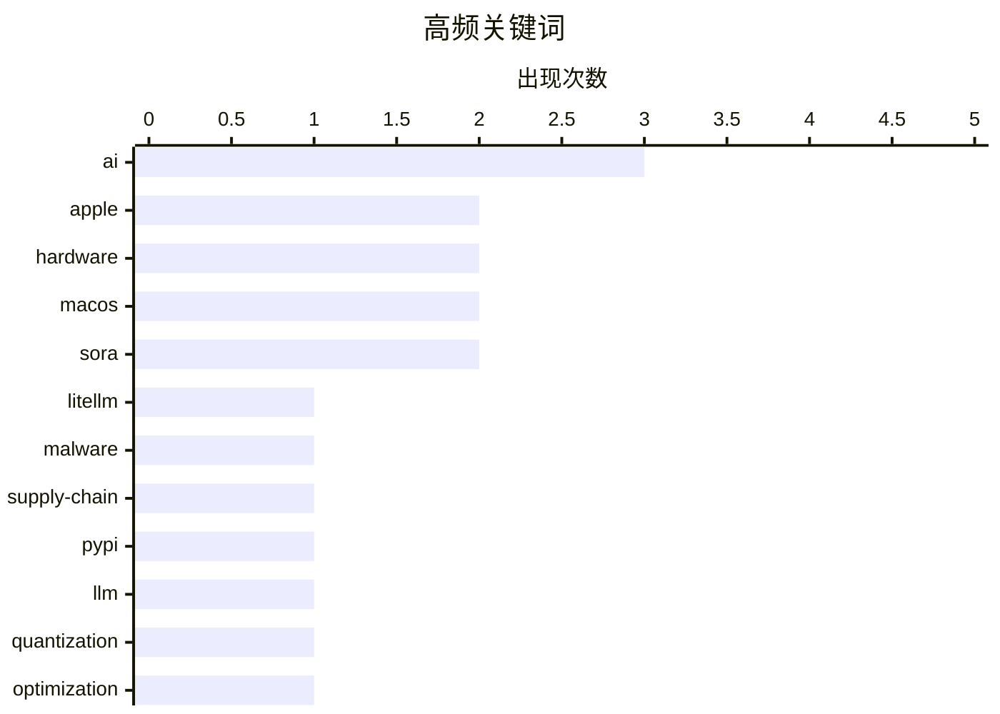

# 📰 AI 博客每日精选 — 2026-03-27

> 来自 Karpathy 推荐的 92 个顶级技术博客，AI 精选 Top 15

## 📝 今日看点

今日技术圈聚焦 AI 落地的双面性，一方面是利用模型高效重写代码的效率奇迹，另一方面则是 LiteLLM 遭遇恶意攻击的安全警报。商业层面同样动荡，迪士尼终止投资 OpenAI 凸显了技术繁荣背后的合作风险。硬件生态迎来重大转折，苹果确认停产 Mac Pro 标志专业工作站时代落幕，配合谷歌安卓性能争议，引发对平台未来走向的深思。开发者需在拥抱 AI 提效的同时，警惕供应链安全并适应硬件生态的剧烈变迁。

---

## 🏆 今日必读

🥇 **我对 LiteLLM 恶意软件攻击的分钟级响应记录**

[My minute-by-minute response to the LiteLLM malware attack](https://simonwillison.net/2026/Mar/26/response-to-the-litellm-malware-attack/#atom-everything) — simonwillison.net · 12 小时前 · 🔒 安全

> 文章记录了作者面对 LiteLLM 恶意软件攻击时的实时响应过程。Callum McMahon 向 PyPI 报告了该漏洞，并分享了利用 Claude 辅助确认恶意代码及决策的对话转录。Claude 不仅帮助确认了文档中的恶意代码，还建议了联系 PyPI 安全团队的具体地址。整个过程展示了 AI 助手在安全应急响应中的实际辅助作用。作者通过分钟级的记录还原了从发现到上报的完整链条。

💡 **为什么值得读**: 适合安全从业者参考如何利用 AI 辅助进行漏洞确认和应急响应流程。

🏷️ LiteLLM, malware, supply-chain, PyPI

🥈 **从零开始理解量化**

[Quantization from the ground up](https://simonwillison.net/2026/Mar/26/quantization-from-the-ground-up/#atom-everything) — simonwillison.net · 19 小时前 · 🤖 AI / ML

> 本文通过交互式文章深入解释了大型语言模型（LLM）量化的工作原理。作者 Sam Rose 提供了可能是目前最好的可视化解释，帮助读者从头理解量化技术。文章延续了作者以往高质量技术文章的风格，旨在降低理解门槛。内容涵盖了量化的核心概念及其对模型性能的影响。这种直观的教学方式适合希望深入底层机制的开发者和研究者。

💡 **为什么值得读**: 拥有极佳的可视化交互体验，是理解 LLM 量化底层机制的入门首选。

🏷️ LLM, quantization, optimization, tutorial

🥉 **SQLAlchemy 2 实战 - 第二章 - 数据库表**

[SQLAlchemy 2 In Practice - Chapter 2 - Database Tables](https://blog.miguelgrinberg.com/post/sqlalchemy-2-in-practice---chapter-1---database-tables) — miguelgrinberg.com · 23 小时前 · 🛠 工具 / 开源

> 这是《SQLAlchemy 2 实战》书籍的第二章，专注于数据库表的基础用法。文章概述了如何使用 SQLAlchemy 库创建和管理数据库表结构。内容适合正在学习 SQLAlchemy 2 新特性的 Python 开发者。作者提供了购买书籍的支持链接，表明这是系列教程的一部分。本章重点在于构建稳固的数据库底层架构。

💡 **为什么值得读**: 适合需要系统学习 SQLAlchemy 2 新特性及表结构设计的 Python 开发者。

🏷️ Python, SQLAlchemy, database

---

## 📊 数据概览

| 扫描源 | 抓取文章 | 时间范围 | 精选 |
|:---:|:---:|:---:|:---:|
| 77/92 | 2301 篇 → 27 篇 | 24h | **15 篇** |

### 分类分布



### 高频关键词



<details>
<summary>📈 纯文本关键词图（终端友好）</summary>

```
ai           │ ████████████████████ 3
apple        │ █████████████░░░░░░░ 2
hardware     │ █████████████░░░░░░░ 2
macos        │ █████████████░░░░░░░ 2
sora         │ █████████████░░░░░░░ 2
litellm      │ ███████░░░░░░░░░░░░░ 1
malware      │ ███████░░░░░░░░░░░░░ 1
supply-chain │ ███████░░░░░░░░░░░░░ 1
pypi         │ ███████░░░░░░░░░░░░░ 1
llm          │ ███████░░░░░░░░░░░░░ 1
```

</details>

### 🏷️ 话题标签

**ai**(3) · **apple**(2) · **hardware**(2) · macos(2) · sora(2) · litellm(1) · malware(1) · supply-chain(1) · pypi(1) · llm(1) · quantization(1) · optimization(1) · tutorial(1) · python(1) · sqlalchemy(1) · database(1) · jsonata(1) · go(1) · cost-savings(1) · gemini(1)

---

## 🤖 AI / ML

### 1. 从零开始理解量化

[Quantization from the ground up](https://simonwillison.net/2026/Mar/26/quantization-from-the-ground-up/#atom-everything) — **simonwillison.net** · 19 小时前 · ⭐ 26/30

> 本文通过交互式文章深入解释了大型语言模型（LLM）量化的工作原理。作者 Sam Rose 提供了可能是目前最好的可视化解释，帮助读者从头理解量化技术。文章延续了作者以往高质量技术文章的风格，旨在降低理解门槛。内容涵盖了量化的核心概念及其对模型性能的影响。这种直观的教学方式适合希望深入底层机制的开发者和研究者。

🏷️ LLM, quantization, optimization, tutorial

---

### 2. 我们用 AI 在一天内重写了 JSONata，每年节省 50 万美元

[We Rewrote JSONata with AI in a Day, Saved $500K/Year](https://simonwillison.net/2026/Mar/27/vine-porting-jsonata/#atom-everything) — **simonwillison.net** · 11 小时前 · ⭐ 24/30

> 文章分享了一个利用 AI 进行"vibe porting"的案例，即在一天内用 Go 语言重写了 JSONata JSON 表达式语言。该项目旨在替代原有的实现，类似 jq 的功能，常与 Node-RED 平台关联使用。作者声称此举每年可节省 50 万美元成本，展示了 AI 辅助代码迁移的潜力。虽然标题略显夸张，但提供了具体的技术选型和成本效益分析。这为评估 AI 在遗留系统重构中的价值提供了参考数据。

🏷️ AI, JSONata, Go, cost-savings

---

### 3. The Information：苹果可“蒸馏”谷歌的大型 Gemini 模型

[The Information: ‘Apple Can “Distill” Google’s Big Gemini Model’](https://www.theinformation.com/newsletters/ai-agenda/apple-can-distill-googles-big-gemini-model?rc=jfy0lk) — **daringfireball.net** · 18 小时前 · ⭐ 24/30

> 报道披露苹果与谷歌的协议允许苹果完全访问谷歌 Gemini 模型并在自家数据中心使用。苹果不仅能微调模型以响应特定查询，还能利用访问权限生成用于特定任务的小型模型。这种“蒸馏”能力赋予了苹果在技术使用上极大的自由度。合作细节显示苹果对谷歌技术的掌控力远超预期。这标志着科技巨头间 AI 合作模式的新动向。

🏷️ Apple, Gemini, AI, distillation

---

### 4. 迪士尼在 Sora 被砍后放弃对 OpenAI 的 10 亿美元虚空投资

[Disney Drops Vaporware $1B Investment in OpenAI After Sora Got Axed](https://variety.com/2026/digital/news/openai-shutting-down-sora-video-disney-1236698277/) — **daringfireball.net** · 16 小时前 · ⭐ 20/30

> 迪士尼已终止与 OpenAI 的合作伙伴关系，其中包括原本计划对 OpenAI 进行的 10 亿美元股权投资。此举发生在 OpenAI 决定退出视频生成业务并砍掉 Sora 项目之后。迪士尼发言人表示尊重 OpenAI 优先级的转变，并感谢双方的建设性合作。这反映了 AI 视频生成领域的不确定性及巨头战略的调整。投资计划的落空显示了 AI 商业化路径的波动性。

🏷️ OpenAI, Disney, investment, Sora

---

### 5. Katie Notopoulos Bids Farewell to Sora: ‘You Were Too Beautiful and Stupid for This World’

[Katie Notopoulos Bids Farewell to Sora: ‘You Were Too Beautiful and Stupid for This World’](https://www.businessinsider.com/sora-openai-chatgpt-sam-altman-ai-shutting-down-farewell-why-2026-3) — **daringfireball.net** · 18 小时前 · ⭐ 20/30

> Katie Notopoulos Bids Farewell to Sora: ‘You Were Too Beautiful and Stupid for This World’

🏷️ Sora, AI, adoption

---

## 🛠 工具 / 开源

### 6. SQLAlchemy 2 实战 - 第二章 - 数据库表

[SQLAlchemy 2 In Practice - Chapter 2 - Database Tables](https://blog.miguelgrinberg.com/post/sqlalchemy-2-in-practice---chapter-1---database-tables) — **miguelgrinberg.com** · 23 小时前 · ⭐ 25/30

> 这是《SQLAlchemy 2 实战》书籍的第二章，专注于数据库表的基础用法。文章概述了如何使用 SQLAlchemy 库创建和管理数据库表结构。内容适合正在学习 SQLAlchemy 2 新特性的 Python 开发者。作者提供了购买书籍的支持链接，表明这是系列教程的一部分。本章重点在于构建稳固的数据库底层架构。

🏷️ Python, SQLAlchemy, database

---

### 7. Mr. Macintosh 解释另一种阻止 MacOS 26 Tahoe 软件更新提示的方法

[Mr. Macintosh Explains Another Way to Block the Software Update Prompts for MacOS 26 Tahoe](https://www.youtube.com/watch?v=uRg1pW8TSYk) — **daringfireball.net** · 21 小时前 · ⭐ 22/30

> 视频教程展示了如何使用免费的 iMazing Profile Editor 创建设备配置文件，从而阻止 MacOS 26 Tahoe 的更新提示。相比之前需要手动编辑 XML 属性列表的方法，该方案降低了操作门槛。适合希望停留在 MacOS 15 Sequoia 而不愿升级的用户。内容提供了具体的工具使用步骤和配置细节。这为不想参与测试版或新版本的用户提供了便利途径。

🏷️ macOS, updates, administration

---

### 8. MacOS 26.4 Adds ‘Slow Charger’ Indicator for MacBooks

[MacOS 26.4 Adds ‘Slow Charger’ Indicator for MacBooks](https://www.macrumors.com/2026/03/25/macos-tahoe-26-4-slow-charger-macbooks/) — **daringfireball.net** · 18 小时前 · ⭐ 18/30

> MacOS 26.4 Adds ‘Slow Charger’ Indicator for MacBooks

🏷️ macOS, battery, hardware

---

## ⚙️ 工程

### 9. 为什么对话框是 MessageBox 时 WM_ENTERIDLE 不生效？

[Why doesn’t WM_ENTER­IDLE work if the dialog box is a Message­Box?](https://devblogs.microsoft.com/oldnewthing/20260326-00/?p=112167) — **devblogs.microsoft.com/oldnewthing** · 22 小时前 · ⭐ 23/30

> 文章解释了在 Windows 编程中，当对话框为 MessageBox 时 WM_ENTERIDLE 消息不生效的原因。核心在于 MessageBox 实现主动选择了退出该消息的处理机制。这是"The Old New Thing"博客对 Windows 内部机制的经典剖析。内容涉及底层消息循环和对话框实现细节。适合需要深入理解 Windows API 行为的系统级开发者。

🏷️ Windows, API, debugging

---

### 10. 谷歌吹嘘未具名设备上的 Android 网页浏览器基准测试分数；轻信记者信以为真

[Google Brags About Android Web Browser Benchmark Scores on Unnamed Devices; Gullible Reporters Fall for It](https://blog.chromium.org/2026/03/android-sets-new-record-for-mobile-web.html) — **daringfireball.net** · 17 小时前 · ⭐ 20/30

> 谷歌 Chrome 工程师宣称 Android 已成为网页浏览速度最快的移动平台，基于硬件、OS 和 Chrome 引擎的深度垂直整合。文章指出该声明基于未具名的最新旗舰设备，在 Speedometer 等关键基准测试中超越了所有竞争对手。作者质疑这种营销手段，认为记者轻信了缺乏具体设备信息的基准测试数据。内容揭示了基准测试优化与真实性能之间的潜在差距。这提醒读者看待厂商性能宣传时需保持批判性。

🏷️ Android, benchmark, web, performance

---

### 11. Adding human.json to WordPress

[Adding human.json to WordPress](https://shkspr.mobi/blog/2026/03/adding-human-json-to-wordpress/) — **shkspr.mobi** · 23 小时前 · ⭐ 19/30

> Adding human.json to WordPress

🏷️ WordPress, JSON, identity

---

## 💡 观点 / 杂谈

### 12. The Age of the Amplifier

[The Age of the Amplifier](https://www.construction-physics.com/p/the-age-of-the-amplifier) — **construction-physics.com** · 11 分钟前 · ⭐ 20/30

> The Age of the Amplifier

🏷️ research, innovation, history

---

### 13. Members Only: On Cathedral thinking

[Members Only: On Cathedral thinking](https://www.joanwestenberg.com/members-only-on-cathedral-thinking/) — **joanwestenberg.com** · 13 小时前 · ⭐ 19/30

> Members Only: On Cathedral thinking

🏷️ culture, strategy, thinking

---

## 🔒 安全

### 14. 我对 LiteLLM 恶意软件攻击的分钟级响应记录

[My minute-by-minute response to the LiteLLM malware attack](https://simonwillison.net/2026/Mar/26/response-to-the-litellm-malware-attack/#atom-everything) — **simonwillison.net** · 12 小时前 · ⭐ 27/30

> 文章记录了作者面对 LiteLLM 恶意软件攻击时的实时响应过程。Callum McMahon 向 PyPI 报告了该漏洞，并分享了利用 Claude 辅助确认恶意代码及决策的对话转录。Claude 不仅帮助确认了文档中的恶意代码，还建议了联系 PyPI 安全团队的具体地址。整个过程展示了 AI 助手在安全应急响应中的实际辅助作用。作者通过分钟级的记录还原了从发现到上报的完整链条。

🏷️ LiteLLM, malware, supply-chain, PyPI

---

## 📝 其他

### 15. 苹果停产 Mac Pro 且无后续计划

[Apple Discontinues the Mac Pro With No Plans to Bring It Back](https://9to5mac.com/2026/03/26/apple-discontinues-the-mac-pro/) — **daringfireball.net** · 11 小时前 · ⭐ 22/30

> 苹果已向 9to5Mac 确认 Mac Pro 正式停产，并从官网移除了所有购买页面和相关引用。公司明确表示未来没有计划推出新的 Mac Pro 硬件，标志着一个时代的结束。Mac Pro 多年来经历了多次形态演变，如今彻底退出产品线。这一决定反映了苹果对专业桌面硬件战略的重大调整。用户需转向 Mac Studio 等其他高性能解决方案。

🏷️ Apple, Mac Pro, hardware, EOL

---

*生成于 2026-03-27 12:11 | 扫描 77 源 → 获取 2301 篇 → 精选 15 篇*
*基于 [Hacker News Popularity Contest 2025](https://refactoringenglish.com/tools/hn-popularity/) RSS 源列表，由 [Andrej Karpathy](https://x.com/karpathy) 推荐*
*由「懂点儿AI」制作，欢迎关注同名微信公众号获取更多 AI 实用技巧 💡*
