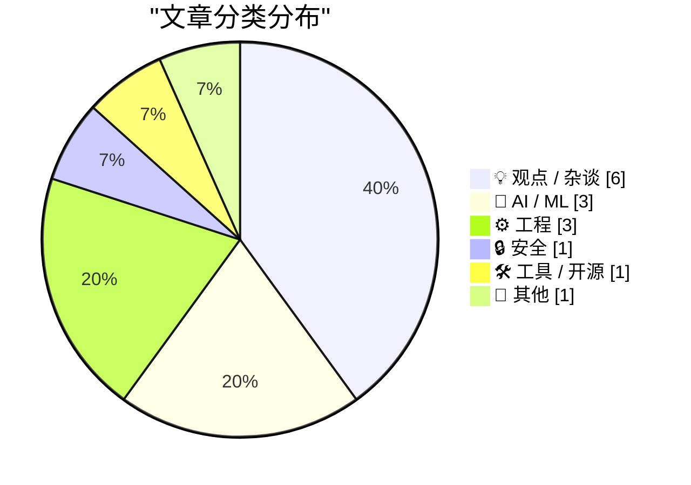
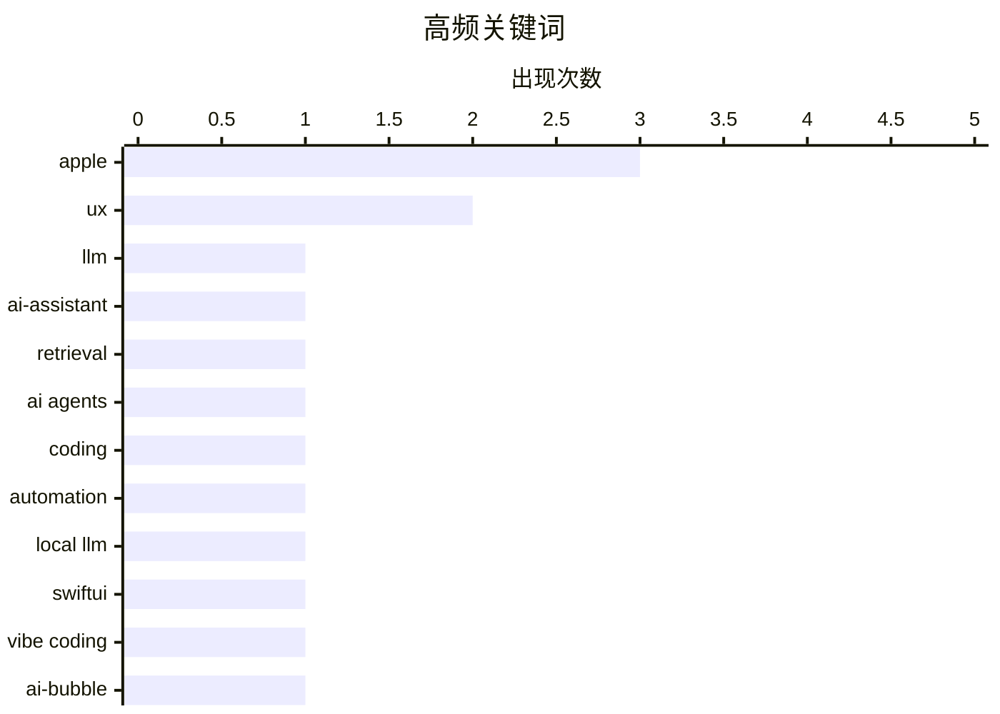

# 📰 AI 博客每日精选 — 2026-03-28

> 来自 Karpathy 推荐的 92 个顶级技术博客，AI 精选 Top 15

## 🏆 今日必读

🥇 **An AI Odyssey, Part 3: Lost Needle in the Haystack**

[An AI Odyssey, Part 3: Lost Needle in the Haystack](https://www.johndcook.com/blog/2026/03/27/an-ai-odyssey-part-3-lost-needle-in-the-haystack/) — johndcook.com · 23 小时前 · 🤖 AI / ML

> An AI Odyssey, Part 3: Lost Needle in the Haystack

🏷️ LLM, AI-assistant, retrieval

🥈 **Quoting Matt Webb**

[Quoting Matt Webb](https://simonwillison.net/2026/Mar/28/matt-webb/#atom-everything) — simonwillison.net · 3 小时前 · 🤖 AI / ML

> Quoting Matt Webb

🏷️ AI agents, coding, automation

🥉 **Vibe coding SwiftUI apps is a lot of fun**

[Vibe coding SwiftUI apps is a lot of fun](https://simonwillison.net/2026/Mar/27/vibe-coding-swiftui/#atom-everything) — simonwillison.net · 18 小时前 · 🤖 AI / ML

> Vibe coding SwiftUI apps is a lot of fun

🏷️ local LLM, SwiftUI, vibe coding

---

## 📊 数据概览

| 扫描源 | 抓取文章 | 时间范围 | 精选 |
|:---:|:---:|:---:|:---:|
| 76/92 | 2223 篇 → 18 篇 | 24h | **15 篇** |

### 分类分布



### 高频关键词



<details>
<summary>📈 纯文本关键词图（终端友好）</summary>

```
apple        │ ████████████████████ 3
ux           │ █████████████░░░░░░░ 2
llm          │ ███████░░░░░░░░░░░░░ 1
ai-assistant │ ███████░░░░░░░░░░░░░ 1
retrieval    │ ███████░░░░░░░░░░░░░ 1
ai agents    │ ███████░░░░░░░░░░░░░ 1
coding       │ ███████░░░░░░░░░░░░░ 1
automation   │ ███████░░░░░░░░░░░░░ 1
local llm    │ ███████░░░░░░░░░░░░░ 1
swiftui      │ ███████░░░░░░░░░░░░░ 1
```

</details>

### 🏷️ 话题标签

**apple**(3) · **ux**(2) · **llm**(1) · ai-assistant(1) · retrieval(1) · ai agents(1) · coding(1) · automation(1) · local llm(1) · swiftui(1) · vibe coding(1) · ai-bubble(1) · openai(1) · industry-analysis(1) · security(1) · lockdown mode(1) · licensing(1) · open source(1) · chardet(1) · windows(1)

---

## 💡 观点 / 杂谈

### 1. Premium: How Much Of The AI Bubble Is Real?

[Premium: How Much Of The AI Bubble Is Real?](https://www.wheresyoured.at/premium-how-much-of-the-ai-bubble-is-real/) — **wheresyoured.at** · 21 小时前 · ⭐ 24/30

> Premium: How Much Of The AI Bubble Is Real?

🏷️ AI-bubble, OpenAI, industry-analysis

---

### 2. “Good Taste” Is Just Experience

[“Good Taste” Is Just Experience](https://terriblesoftware.org/2026/03/27/good-taste-is-just-experience/) — **terriblesoftware.org** · 19 小时前 · ⭐ 20/30

> “Good Taste” Is Just Experience

🏷️ craftsmanship, experience, career

---

### 3. An Intention Upgrade

[An Intention Upgrade](https://feed.tedium.co/link/15204/17307620/apple-mac-pro-discontinued-anniversary) — **tedium.co** · 23 小时前 · ⭐ 20/30

> An Intention Upgrade

🏷️ Apple, Mac-Pro, strategy

---

### 4. Apple Announces Ads Are Coming to Apple Maps

[Apple Announces Ads Are Coming to Apple Maps](https://www.apple.com/newsroom/2026/03/introducing-apple-business-a-new-all-in-one-platform-for-businesses-of-all-sizes/) — **daringfireball.net** · 15 小时前 · ⭐ 18/30

> Apple Announces Ads Are Coming to Apple Maps

🏷️ Apple, ads, Maps

---

### 5. ★ Apple Giveth, Apple Taketh Away

[★ Apple Giveth, Apple Taketh Away](https://daringfireball.net/2026/03/apple_giveth_apple_taketh_away) — **daringfireball.net** · 18 小时前 · ⭐ 18/30

> ★ Apple Giveth, Apple Taketh Away

🏷️ macOS, Safari, UX

---

### 6. UX books not written by white men

[UX books not written by white men](https://aresluna.org/ux-books-not-written-by-white-men) — **aresluna.org** · 1 天前 · ⭐ 17/30

> UX books not written by white men

🏷️ UX, diversity, books

---

## 🤖 AI / ML

### 7. An AI Odyssey, Part 3: Lost Needle in the Haystack

[An AI Odyssey, Part 3: Lost Needle in the Haystack](https://www.johndcook.com/blog/2026/03/27/an-ai-odyssey-part-3-lost-needle-in-the-haystack/) — **johndcook.com** · 23 小时前 · ⭐ 25/30

> An AI Odyssey, Part 3: Lost Needle in the Haystack

🏷️ LLM, AI-assistant, retrieval

---

### 8. Quoting Matt Webb

[Quoting Matt Webb](https://simonwillison.net/2026/Mar/28/matt-webb/#atom-everything) — **simonwillison.net** · 3 小时前 · ⭐ 24/30

> Quoting Matt Webb

🏷️ AI agents, coding, automation

---

### 9. Vibe coding SwiftUI apps is a lot of fun

[Vibe coding SwiftUI apps is a lot of fun](https://simonwillison.net/2026/Mar/27/vibe-coding-swiftui/#atom-everything) — **simonwillison.net** · 18 小时前 · ⭐ 24/30

> Vibe coding SwiftUI apps is a lot of fun

🏷️ local LLM, SwiftUI, vibe coding

---

## ⚙️ 工程

### 10. Quoting Richard Fontana

[Quoting Richard Fontana](https://simonwillison.net/2026/Mar/27/richard-fontana/#atom-everything) — **simonwillison.net** · 18 小时前 · ⭐ 20/30

> Quoting Richard Fontana

🏷️ licensing, open source, chardet

---

### 11. What if a dialog wants to intercept its own message loop?

[What if a dialog wants to intercept its own message loop?](https://devblogs.microsoft.com/oldnewthing/20260327-00/?p=112172) — **devblogs.microsoft.com/oldnewthing** · 1 天前 · ⭐ 20/30

> What if a dialog wants to intercept its own message loop?

🏷️ Windows, API, message-loop

---

### 12. Bring back MiniDV with this Raspberry Pi FireWire HAT

[Bring back MiniDV with this Raspberry Pi FireWire HAT](https://www.jeffgeerling.com/blog/2026/minidv-with-raspberry-pi-firewire-hat/) — **jeffgeerling.com** · 1 天前 · ⭐ 19/30

> Bring back MiniDV with this Raspberry Pi FireWire HAT

🏷️ Raspberry Pi, FireWire, hardware

---

## 🔒 安全

### 13. Apple Says It’s Not Aware of Lockdown Mode Ever Having Been Exploited

[Apple Says It’s Not Aware of Lockdown Mode Ever Having Been Exploited](https://techcrunch.com/2026/03/27/apple-says-no-one-using-lockdown-mode-has-been-hacked-with-spyware/) — **daringfireball.net** · 15 小时前 · ⭐ 22/30

> Apple Says It’s Not Aware of Lockdown Mode Ever Having Been Exploited

🏷️ Apple, security, Lockdown Mode

---

## 🛠 工具 / 开源

### 14. datasette-showboat 0.1a2

[datasette-showboat 0.1a2](https://simonwillison.net/2026/Mar/27/datasette-showboat/#atom-everything) — **simonwillison.net** · 15 小时前 · ⭐ 19/30

> datasette-showboat 0.1a2

🏷️ Datasette, Python, release

---

## 📝 其他

### 15. Reading List 03/28/26

[Reading List 03/28/26](https://www.construction-physics.com/p/reading-list-032826) — **construction-physics.com** · 3 小时前 · ⭐ 18/30

> Reading List 03/28/26

🏷️ newsletter, industry-news, AI-datacenters

---

*生成于 2026-03-28 15:16 | 扫描 76 源 → 获取 2223 篇 → 精选 15 篇*
*基于 [Hacker News Popularity Contest 2025](https://refactoringenglish.com/tools/hn-popularity/) RSS 源列表，由 [Andrej Karpathy](https://x.com/karpathy) 推荐*
*由「懂点儿AI」制作，欢迎关注同名微信公众号获取更多 AI 实用技巧 💡*
