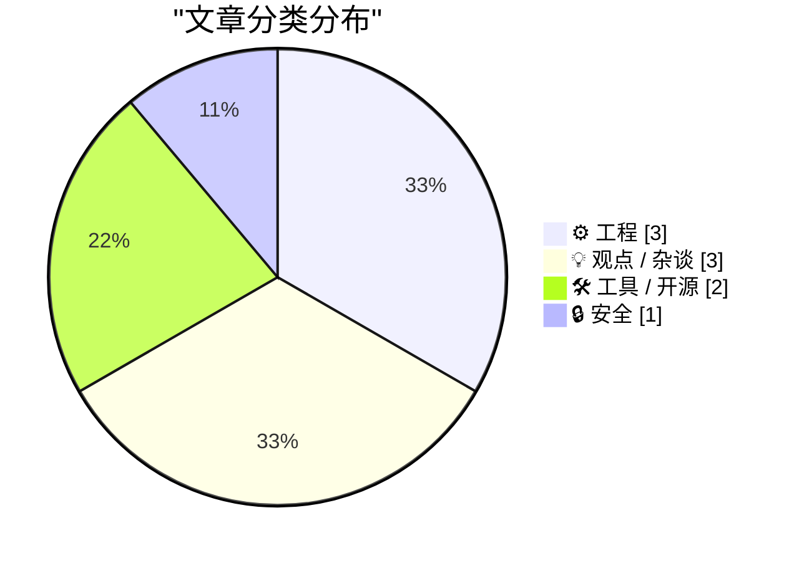
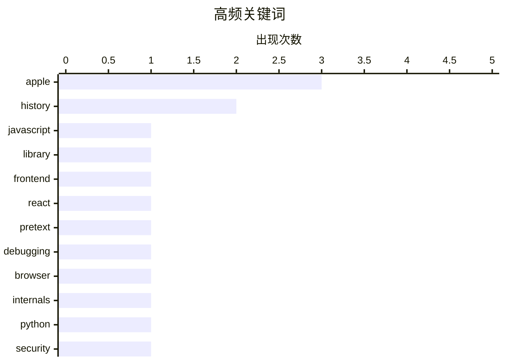

# 📰 AI 博客每日精选 — 2026-03-30

> 来自 Karpathy 推荐的 92 个顶级技术博客，AI 精选 Top 9

## 📝 今日看点

今日技术圈呈现开发工具革新与硬件历史回顾并行的态势。前端性能优化突破 DOM 限制，结合 AI 驱动集成及安全依赖管理新工具，正在重塑开发者体验。与此同时，社区沉浸于计算机发展史的回望，从 IBM 航天计算机到苹果经典产品榜单，引发对技术演进轨迹的热烈讨论。

---

## 🏆 今日必读

🥇 **Pretext：无需触碰 DOM 的文本高度计算库**

[Pretext](https://simonwillison.net/2026/Mar/29/pretext/#atom-everything) — simonwillison.net · 4 小时前 · 🛠 工具 / 开源

> 计算换行文本高度通常需要渲染并测量 DOM 尺寸，但这会带来性能开销。Pretext 是一个由前 React 核心开发者 Cheng Lou 推出的新浏览器库，旨在无需触碰 DOM 即可解决这一难题。该库避免了传统方法中渲染文本再测量维度的繁琐过程，显著减少了重排和重绘。开发者可以直接获取段落的高度信息而无需将其插入文档流。这对于需要频繁计算文本布局的场景尤为重要。它提供了一种更高效的方式来获取段落的高度信息。

💡 **为什么值得读**: 前端性能优化利器，解决了 DOM 测量带来的布局抖动痛点。

🏷️ JavaScript, library, frontend, React

🥈 **Pretext 原理揭秘：内部工作机制解析**

[Pretext — Under the Hood](https://simonwillison.net/2026/Mar/29/pretext-explainer/#atom-everything) — simonwillison.net · 4 小时前 · ⚙️ 工程

> 该工具提供了 Pretext 库内部工作原理的可视化解释器。开发者可以通过它理解无需触碰 DOM 计算文本高度的具体实现机制。界面直观地展示了 Pretext 如何处理文本布局计算，补充了主篇文章的技术细节。底层算法逻辑得以清晰呈现，揭示了避免 DOM 操作的核心技巧。想要深入理解该库实现原理的高级前端工程师可从中获益。工具链接指向 Simon Willison 的笔记页面。

💡 **为什么值得读**: 透过可视化工具深入理解无 DOM 文本测量的底层算法实现。

🏷️ Pretext, debugging, browser, internals

🥉 **Python 漏洞查询工具**

[Python Vulnerability Lookup](https://simonwillison.net/2026/Mar/29/python-vulnerability-lookup/#atom-everything) — simonwillison.net · 6 小时前 · 🔒 安全

> Python 开发者需要快速检查项目依赖中的安全漏洞，但手动查询效率低下。该工具利用 OSV.dev 开源漏洞数据库的开放 CORS JSON API 构建，支持直接粘贴 `pyproject.toml` 或 `requirements.txt` 文件。由 Claude Code 辅助开发，实现了自动化的漏洞扫描与匹配。用户无需配置即可在浏览器中完成依赖包的风险评估。这大大简化了 Python 项目的安全审计流程。工具地址托管在 Simon Willison 的工具集页面。

💡 **为什么值得读**: 利用 OSV.dev API 实现的轻量级工具，能快速审计 Python 依赖安全风险。

🏷️ Python, security, vulnerabilities, OSV

---

## 📊 数据概览

| 扫描源 | 抓取文章 | 时间范围 | 精选 |
|:---:|:---:|:---:|:---:|
| 78/92 | 2333 篇 → 9 篇 | 24h | **9 篇** |

### 分类分布



### 高频关键词



<details>
<summary>📈 纯文本关键词图（终端友好）</summary>

```
apple      │ ████████████████████ 3
history    │ █████████████░░░░░░░ 2
javascript │ ███████░░░░░░░░░░░░░ 1
library    │ ███████░░░░░░░░░░░░░ 1
frontend   │ ███████░░░░░░░░░░░░░ 1
react      │ ███████░░░░░░░░░░░░░ 1
pretext    │ ███████░░░░░░░░░░░░░ 1
debugging  │ ███████░░░░░░░░░░░░░ 1
browser    │ ███████░░░░░░░░░░░░░ 1
internals  │ ███████░░░░░░░░░░░░░ 1
```

</details>

### 🏷️ 话题标签

**apple**(3) · **history**(2) · **javascript**(1) · library(1) · frontend(1) · react(1) · pretext(1) · debugging(1) · browser(1) · internals(1) · python(1) · security(1) · vulnerabilities(1) · osv(1) · ibm(1) · aerospace(1) · computers(1) · ai(1) · authentication(1) · cli(1)

---

## ⚙️ 工程

### 1. Pretext 原理揭秘：内部工作机制解析

[Pretext — Under the Hood](https://simonwillison.net/2026/Mar/29/pretext-explainer/#atom-everything) — **simonwillison.net** · 4 小时前 · ⭐ 24/30

> 该工具提供了 Pretext 库内部工作原理的可视化解释器。开发者可以通过它理解无需触碰 DOM 计算文本高度的具体实现机制。界面直观地展示了 Pretext 如何处理文本布局计算，补充了主篇文章的技术细节。底层算法逻辑得以清晰呈现，揭示了避免 DOM 操作的核心技巧。想要深入理解该库实现原理的高级前端工程师可从中获益。工具链接指向 Simon Willison 的笔记页面。

🏷️ Pretext, debugging, browser, internals

---

### 2. IBM 4 Pi 航天计算机的兴衰史：图解历史

[The rise and fall of IBM's 4 Pi aerospace computers: an illustrated history](http://www.righto.com/feeds/542341856603240438/comments/default) — **righto.com** · 8 小时前 · ⭐ 22/30

> 1981 年 4 月 12 日航天飞机首飞时，其飞行控制依赖于 avionics bays 中的四台计算机，另有一台备用。本文详细回顾了 IBM 4 Pi 系列航天计算机的发展历程及其在航空航天领域的关键作用。文章通过丰富的插图展示了这些计算机如何控制航天飞机的发射与飞行过程。探讨了该系列计算机从兴起到最终被淘汰的技术演变历史。揭示了早期航天计算系统的冗余设计架构。这是 Ken Shirriff 带来的图解历史分析。

🏷️ IBM, aerospace, computers, history

---

### 3. 包的角色：跨包管理器的变量角色理论应用

[The Roles of Packages](https://nesbitt.io/2026/03/29/the-roles-of-packages.html) — **nesbitt.io** · 14 小时前 · ⭐ 18/30

> 理解软件包在系统中的具体作用对于依赖管理至关重要，但缺乏统一的理论框架。本文尝试将 Sajaniemi 的变量角色理论应用到各种包管理器中的软件包分类上。通过跨不同生态系统的分析，定义了包在依赖树中扮演的不同角色。这种方法有助于开发者更清晰地理解依赖关系的本质及其维护策略。为包管理器的设计和优化提供了新的理论视角。文章发表于 nesbitt.io 技术博客。

🏷️ packages, software-design, theory, managers

---

## 💡 观点 / 杂谈

### 4. The Talk Show：聊聊苹果新品与 Mac Pro 的落幕

[The Talk Show: ‘You’re Going to Have the Niggles’](https://daringfireball.net/thetalkshow/2026/03/29/ep-444) — **daringfireball.net** · 4 小时前 · ⭐ 17/30

> Christina Warren 回归节目，重点讨论苹果最近一个月的产品发布动态。对话深入分析了 iPhone 17e 和 MacBook Neo 等新硬件的市场定位与技术特点。节目特别缅怀了 Mac Pro 产品线的现状及其在专业工作流中的变化。听众可以了解到苹果产品策略调整背后的行业趋势。这是了解苹果生态最新动向的高质量音频内容。节目由 Squarespace 和 Sentry 赞助支持。

🏷️ Apple, podcast, iPhone, MacBook

---

### 5. 版本历史：Macintosh 如何永久改变计算机行业

[Version History: ‘The Macintosh’](https://www.theverge.com/podcast/903068/macintosh-1984-version-history) — **daringfireball.net** · 4 小时前 · ⭐ 17/30

> 1984 年推出的 Macintosh 虽然在销量上并非最初就取得成功，但它永久改变了计算机行业的发展轨迹。节目讲述了 Macintosh 的故事，强调其在计算机使用方式上的前瞻性判断。内容证明了计算机需要变得更简单，且软硬件设计的深度结合能产生巨大影响。回顾展示了这款经典产品如何确立现代个人计算机的标准。历史回顾揭示了苹果设计哲学的起源。这是 Version History 播客系列的特别节目。

🏷️ Apple, Macintosh, history, computing

---

### 6. The Verge 评选苹果 50 年最佳产品榜单引争议

[The Verge: ‘Rank the Best Apple Products From the Last 50 Years’](https://www.theverge.com/cs/tech/900477/apple-50-anniversary-rank-products) — **daringfireball.net** · 4 小时前 · ⭐ 14/30

> The Verge 发起了一项关于过去 50 年最佳苹果产品的排名投票，结果引发了社区讨论。作者对榜单中将 Extended Keyboard II 排在第 47 位表示强烈不满，认为这低估了该产品的历史地位。文章通过这一争议点探讨了苹果硬件遗产的评价标准。反映了不同用户群体对经典外设价值的认知差异。这是一个引发苹果粉丝共鸣与讨论的话题性内容。榜单结果目前显示在 The Verge 网站上。

🏷️ Apple, products, ranking, opinion

---

## 🛠 工具 / 开源

### 7. Pretext：无需触碰 DOM 的文本高度计算库

[Pretext](https://simonwillison.net/2026/Mar/29/pretext/#atom-everything) — **simonwillison.net** · 4 小时前 · ⭐ 24/30

> 计算换行文本高度通常需要渲染并测量 DOM 尺寸，但这会带来性能开销。Pretext 是一个由前 React 核心开发者 Cheng Lou 推出的新浏览器库，旨在无需触碰 DOM 即可解决这一难题。该库避免了传统方法中渲染文本再测量维度的繁琐过程，显著减少了重排和重绘。开发者可以直接获取段落的高度信息而无需将其插入文档流。这对于需要频繁计算文本布局的场景尤为重要。它提供了一种更高效的方式来获取段落的高度信息。

🏷️ JavaScript, library, frontend, React

---

### 8. WorkOS：AI 驱动的身份验证集成 CLI

[WorkOS](https://workos.com/docs/authkit/cli-installer?utm_source=daringfireball&amp;utm_medium=newsletter&amp;utm_campaign=q12026) — **daringfireball.net** · 4 小时前 · ⭐ 20/30

> 为项目集成身份验证通常耗时且容易出错，WorkOS 推出了全新的 CLI 工具来解决这一痛点。该 CLI 启动由 Claude 驱动的 AI 代理，自动读取项目代码并检测框架，随后写入完整的 auth 集成代码。无需预先注册即可运行，它会自动创建环境并填充密钥，用户后续再认领账户。通过 WorkOS Skills 功能，编码代理能成为 WorkOS 专家，`workos seed` 命令则将环境定义为代码。这极大地简化了开发者在项目中添加企业级身份验证的流程。该工具由 Daring Fireball 赞助推荐。

🏷️ AI, authentication, CLI, development

---

## 🔒 安全

### 9. Python 漏洞查询工具

[Python Vulnerability Lookup](https://simonwillison.net/2026/Mar/29/python-vulnerability-lookup/#atom-everything) — **simonwillison.net** · 6 小时前 · ⭐ 24/30

> Python 开发者需要快速检查项目依赖中的安全漏洞，但手动查询效率低下。该工具利用 OSV.dev 开源漏洞数据库的开放 CORS JSON API 构建，支持直接粘贴 `pyproject.toml` 或 `requirements.txt` 文件。由 Claude Code 辅助开发，实现了自动化的漏洞扫描与匹配。用户无需配置即可在浏览器中完成依赖包的风险评估。这大大简化了 Python 项目的安全审计流程。工具地址托管在 Simon Willison 的工具集页面。

🏷️ Python, security, vulnerabilities, OSV

---

*生成于 2026-03-30 00:50 | 扫描 78 源 → 获取 2333 篇 → 精选 9 篇*
*基于 [Hacker News Popularity Contest 2025](https://refactoringenglish.com/tools/hn-popularity/) RSS 源列表，由 [Andrej Karpathy](https://x.com/karpathy) 推荐*
*由「懂点儿AI」制作，欢迎关注同名微信公众号获取更多 AI 实用技巧 💡*
