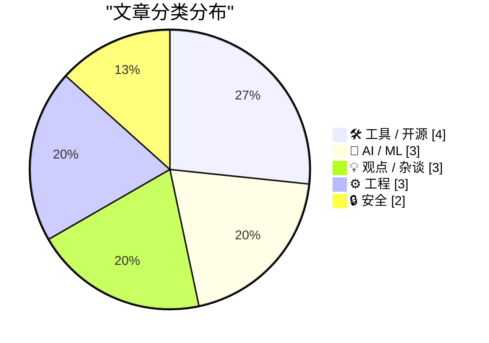
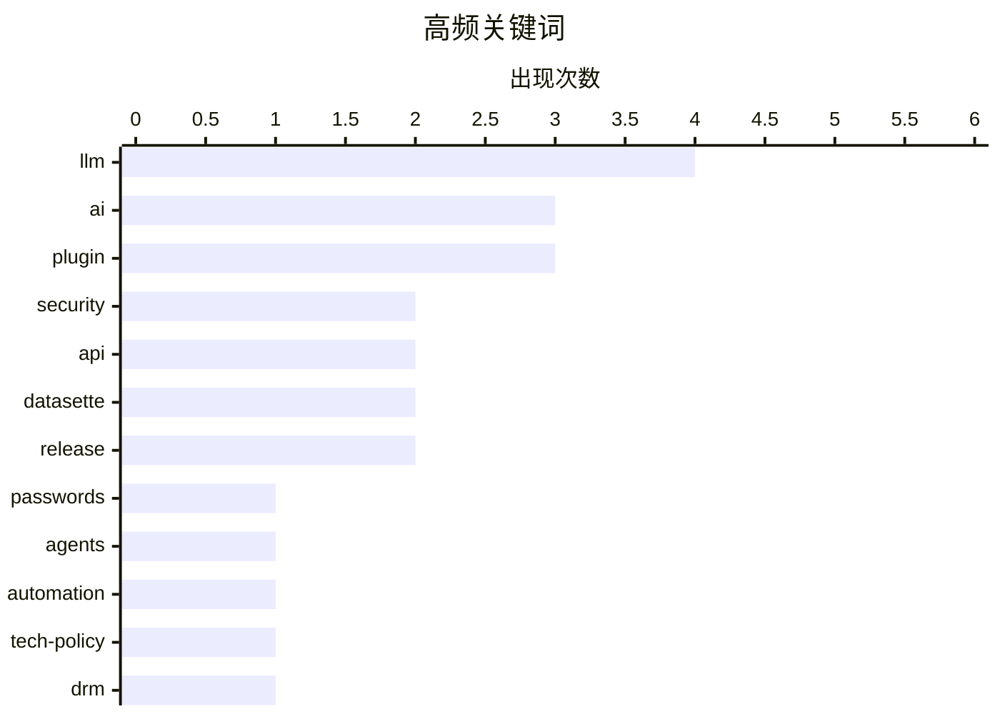

# 📰 AI 博客每日精选 — 2026-03-31

> 来自 Karpathy 推荐的 92 个顶级技术博客，AI 精选 Top 15

## 📝 今日看点

今日技术焦点集中于 AI 去伪存真、安全攻防升级与工程回归本质。AI 领域正摆脱营销炒作，转向代理自动化与人机协作的深层探索，版权伦理与本地模型架构问题引发行业反思。安全战线面临大模型辅助逆向工程的严峻挑战，传统数字锁机制失效，隐私保护工具正加速升级。工程实践则回归文档质量与底层认知，强调在复杂环境中保持严谨。

---

## 🏆 今日必读

🥇 **HIBP 重大更新：Passkeys、k-匿名搜索、大幅速度提升及批量域名验证 API**

[HIBP Mega Update: Passkeys, k-Anonymity Searches, Massive Speed Enhancements and a Bulk Domain Verification API](https://www.troyhunt.com/passkeys-k-anonymity-searches-massive-speed-enhancements-bulk-domain-verification-api/) — troyhunt.com · 6 小时前 · 🔒 安全

> Have I Been Pwned 服务已扩展至每日数十万访客及数亿次密码搜索规模。本次更新引入了 Passkeys 支持、k-匿名搜索机制以及批量域名验证 API，显著提升了查询效率与隐私保护能力。系统架构经过优化以实现大规模速度增强，能够承载每日数千万次 API 查询负载。新的批量域名验证 API 允许企业高效检查整个域名的泄露情况。作者强调该项目已从业余爱好演变为关键社区服务基础设施，持续应对不断增长的查询需求。

💡 **为什么值得读**: 了解全球最大泄露查询服务的技术架构演进及隐私保护新特性。

🏷️ security, passwords, API

🥈 **每周更新 497**

[Weekly Update 497](https://www.troyhunt.com/weekly-update-497/) — troyhunt.com · 7 分钟前 · 🤖 AI / ML

> 文章探讨了 OpenClaw 项目中人类工作与 AI 代理自主任务之间的平衡点。团队正在逐步将更多工作负载转移给 AI 代理，以挖掘其自动化潜力。通过日常迭代，发现代理在处理特定任务时能有效释放人力。这种协作模式旨在优化效率，同时保留人类在关键环节的判断力。作者认为找到人机协作的甜蜜点是当前开发的重点。

💡 **为什么值得读**: 洞察 AI 代理在实际工作流中与人类协作的最佳实践与负载分配策略。

🏷️ AI, agents, automation

🥉 **Pluralistic：市场参与令人疲惫（2026 年 3 月 30 日）**

[Pluralistic: Market participation is exhausting (30 Mar 2026)](https://pluralistic.net/2026/03/30/players-of-games/) — pluralistic.net · 7 小时前 · 💡 观点 / 杂谈

> 本文汇集了关于科技、版权、AI 及社会现象的多重链接与评论。核心观点指出当前市场参与令人疲惫，无人愿意成为桌上的傻瓜。内容涵盖 EMI DRM 与巴西的法律纠纷、AI 艺术质量争议以及微软聊天机器人的伦理问题。作者还提及了瑞士康 wifi 高价、新闻合作社及勒索软件医院等具体案例。这些片段共同反映了技术垄断与资本运作对普通用户的消耗。

💡 **为什么值得读**: 快速浏览科技圈多元热点，洞察版权、AI 伦理与市场博弈背后的深层逻辑。

🏷️ tech-policy, DRM, copyright, privacy

---

## 📊 数据概览

| 扫描源 | 抓取文章 | 时间范围 | 精选 |
|:---:|:---:|:---:|:---:|
| 78/92 | 2334 篇 → 20 篇 | 24h | **15 篇** |

### 分类分布



### 高频关键词



<details>
<summary>📈 纯文本关键词图（终端友好）</summary>

```
llm        │ ████████████████████ 4
ai         │ ███████████████░░░░░ 3
plugin     │ ███████████████░░░░░ 3
security   │ ██████████░░░░░░░░░░ 2
api        │ ██████████░░░░░░░░░░ 2
datasette  │ ██████████░░░░░░░░░░ 2
release    │ ██████████░░░░░░░░░░ 2
passwords  │ █████░░░░░░░░░░░░░░░ 1
agents     │ █████░░░░░░░░░░░░░░░ 1
automation │ █████░░░░░░░░░░░░░░░ 1
```

</details>

### 🏷️ 话题标签

**llm**(4) · **ai**(3) · **plugin**(3) · security(2) · api(2) · datasette(2) · release(2) · passwords(1) · agents(1) · automation(1) · tech-policy(1) · drm(1) · copyright(1) · privacy(1) · startups(1) · hype(1) · reverse-engineering(1) · documentation(1) · developers(1) · engineering(1)

---

## 🛠 工具 / 开源

### 1. Git Diff 驱动程序

[Git Diff Drivers](https://nesbitt.io/2026/03/30/git-diff-drivers.html) — **nesbitt.io** · 14 小时前 · ⭐ 21/30

> 文章介绍了 Git diff 驱动程序的功能，从内置语言支持到自定义 textconv 过滤器。开发者可以利用该机制优化二进制文件或特定格式的 diff 显示效果。通过配置自定义过滤器，能够将不可读的内容转换为可读文本进行比较。这显著提升了代码审查的准确性与效率，特别是在处理非纯文本资产时。掌握此功能有助于完善团队版本控制工作流。

🏷️ Git, diff, workflow

---

### 2. datasette-llm 0.1a3 发布

[datasette-llm 0.1a3](https://simonwillison.net/2026/Mar/30/datasette-llm/#atom-everything) — **simonwillison.net** · 5 小时前 · ⭐ 20/30

> 此次更新核心在于增强了 LLM 模型的目的特定配置能力。用户现在可以限制特定插件可使用的模型列表，实现更细粒度的权限控制。该功能解决了 Issue #3 提出的需求，优化了插件生态中的模型调用安全。开发者可通过配置文件指定不同用途可用的 LLM 后端。这一改进使得 datasette-llm 在多模型混合使用场景下更加灵活可控。

🏷️ datasette, LLM, plugin, config

---

### 3. datasette-files 0.1a3 发布

[datasette-files 0.1a3](https://simonwillison.net/2026/Mar/30/datasette-files/#atom-everything) — **simonwillison.net** · 50 分钟前 · ⭐ 19/30

> 本次发布旨在支持与其他插件（如 datasette-extract）的深度集成。新增 `owners_can_edit` 和 `owners_can_delete` 配置选项，强化了文件权限管理。同时引入 `files-edit` 功能，允许所有者对上传文件进行后续操作。这是基础插件为了适应生态扩展而进行的必要迭代。更新后的版本为构建更复杂的文件处理工作流奠定了基础。

🏷️ datasette, plugin, files, release

---

### 4. llm-mrchatterbox 0.1 发布

[llm-mrchatterbox 0.1](https://simonwillison.net/2026/Mar/30/llm-mrchatterbox-2/#atom-everything) — **simonwillison.net** · 22 小时前 · ⭐ 18/30

> 这是一个名为"Mr. Chatterbox"的本地运行 LLM 插件版本发布。该模型定位为维多利亚时代伦理训练的弱模型，专为个人计算机本地部署设计。文章链接提供了关于模型训练背景和伦理对齐的详细说明。版本 0.1 标志着该实验性模型正式可供社区测试和使用。它展示了在本地资源受限环境下运行特定风格模型的技术尝试。

🏷️ llm-cli, plugin, model, release

---

## 🤖 AI / ML

### 5. 每周更新 497

[Weekly Update 497](https://www.troyhunt.com/weekly-update-497/) — **troyhunt.com** · 7 分钟前 · ⭐ 25/30

> 文章探讨了 OpenClaw 项目中人类工作与 AI 代理自主任务之间的平衡点。团队正在逐步将更多工作负载转移给 AI 代理，以挖掘其自动化潜力。通过日常迭代，发现代理在处理特定任务时能有效释放人力。这种协作模式旨在优化效率，同时保留人类在关键环节的判断力。作者认为找到人机协作的甜蜜点是当前开发的重点。

🏷️ AI, agents, automation

---

### 6. 引用 Georgi Gerganov 的观点

[Quoting Georgi Gerganov](https://simonwillison.net/2026/Mar/30/georgi-gerganov/#atom-everything) — **simonwillison.net** · 3 小时前 · ⭐ 22/30

> Georgi Gerganov 指出本地模型面临的主要问题集中在 harness、聊天模板及提示词构建的复杂性上。当前从客户端输入到实际结果的链条中存在多个脆弱组件，甚至包含纯推理错误。这些组件由不同方开发，导致集成困难且稳定性不足。用户往往在不知情的情况下受到这些底层技术缺陷的影响。解决这些碎片化问题对于提升本地模型体验至关重要。

🏷️ LLM, local-models, prompt, inference

---

### 7. Mr. Chatterbox：一个可在本地运行的维多利亚时代伦理训练模型

[Mr. Chatterbox is a (weak) Victorian-era ethically trained model you can run on your own computer](https://simonwillison.net/2026/Mar/30/mr-chatterbox/#atom-everything) — **simonwillison.net** · 10 小时前 · ⭐ 21/30

> Trip Venturella 发布了 Mr. Chatterbox，这是一个完全使用版权过期文本训练的语言模型。训练语料库包含来自大英图书馆的 28,000 多篇维多利亚时代 1837-1899 年英国文本。该模型旨在解决版权争议，提供一种伦理上安全的本地运行方案。尽管被描述为弱模型，但它展示了特定历史语料训练的可能性。这为构建无版权风险的专用模型提供了新的参考路径。

🏷️ LLM, ethics, training, public-domain

---

## 💡 观点 / 杂谈

### 8. Pluralistic：市场参与令人疲惫（2026 年 3 月 30 日）

[Pluralistic: Market participation is exhausting (30 Mar 2026)](https://pluralistic.net/2026/03/30/players-of-games/) — **pluralistic.net** · 7 小时前 · ⭐ 24/30

> 本文汇集了关于科技、版权、AI 及社会现象的多重链接与评论。核心观点指出当前市场参与令人疲惫，无人愿意成为桌上的傻瓜。内容涵盖 EMI DRM 与巴西的法律纠纷、AI 艺术质量争议以及微软聊天机器人的伦理问题。作者还提及了瑞士康 wifi 高价、新闻合作社及勒索软件医院等具体案例。这些片段共同反映了技术垄断与资本运作对普通用户的消耗。

🏷️ tech-policy, DRM, copyright, privacy

---

### 9. 世界上首个胡说八道

[The World's First Bullshit](https://www.joanwestenberg.com/the-worlds-first-bullshit/) — **joanwestenberg.com** · 28 分钟前 · ⭐ 24/30

> 社交媒体上涌现出大量宣称全球首个的 AI 初创产品，如 AI CMO 和具备品味的设计代理。作者对这种过度营销话术感到厌倦，甚至因此关闭笔记本电脑十分钟。文章批判了科技行业滥用首创标签来包装普通功能的现象。这种营销噪音掩盖了技术的实际价值，导致用户信任度下降。作者呼吁行业回归务实，减少浮夸的宣传用语。

🏷️ AI, startups, hype

---

### 10. 独立创业笔记：庆祝 Studio Self 成立六周年

[Notes on going solo: celebrating 6 years of Studio Self](https://www.joanwestenberg.com/notes-on-going-solo-celebrating-6-years-of-studio-self/) — **joanwestenberg.com** · 18 小时前 · ⭐ 20/30

> 作者回顾了自 2020 年以来经营单人帝国的六年历程，强调无员工、家庭办公室的运营模式。核心生产力依赖于笔记本电脑与一套可扩展的 AI 工具集，而非传统人力扩张。文章探讨了在零团队情况下如何利用技术杠杆维持业务运转。这种 solo 模式展示了现代个体开发者通过 AI 赋能实现规模化运营的可能性。对于希望摆脱组织束缚的创作者，这是一份真实的长期实践记录。

🏷️ solopreneur, AI, business

---

## ⚙️ 工程

### 11. 我们如何让开发者阅读文档

[How Do We Get Developers to Read the Docs](https://idiallo.com/blog/how-do-we-get-developers-to-read-the-docs?src=feed) — **idiallo.com** · 12 小时前 · ⭐ 23/30

> 一次完美的 PR 审查体验展示了高质量 API 设计与配套文档的重要性。资深开发者编写的文档详细解释了代码中看似犹豫的决策，如为支持遗留订阅者而进行两次调用。文档与代码同步更新，消除了审查过程中的疑虑与沟通成本。这种实践证明了文档不仅是说明，更是设计逻辑的直接体现。团队通过此举实现了代码意图的透明化，提升了协作效率。

🏷️ documentation, API, developers, engineering

---

### 12. 关于注册表键值最大数量的问题引发了对问题本身的质疑

[A question about the maximimum number of values in a registry key raises questions about the question](https://devblogs.microsoft.com/oldnewthing/20260330-00/?p=112175) — **devblogs.microsoft.com/oldnewthing** · 10 小时前 · ⭐ 21/30

> 文章针对关于注册表键值最大数量的技术问题进行了元分析。作者质疑为何会出现此类问题，暗示提问者可能未理解底层架构限制。通过剖析问题本身，揭示了开发者对 Windows 内部机制认知的缺失。这种反思有助于避免在无效的技术假设上浪费时间。最终导向是对系统设计哲学的深层理解而非单纯的数据查询。

🏷️ Windows, Registry, internals

---

### 13. 连续、连续、再连续

[Continuous, Continuous, Continuous](https://blog.jim-nielsen.com/2026/continuous-continuous-continuous/) — **blog.jim-nielsen.com** · 5 小时前 · ⭐ 18/30

> 文章引用 Jason Gorman 的观点，批判了将软件开发划分为设计、编码、测试等阶段的传统模式。作者主张“连续”理念应贯穿软件制作的全过程，而非仅限于持续集成或部署。这种阶段化思维往往导致角色固化，阻碍了真正的敏捷流动。打破阶段壁垒有助于回归软件 craft 的本质，实现更流畅的开发体验。这是对现代软件工程流程中过度分工现象的一次深刻反思。

🏷️ software, process, culture

---

## 🔒 安全

### 14. HIBP 重大更新：Passkeys、k-匿名搜索、大幅速度提升及批量域名验证 API

[HIBP Mega Update: Passkeys, k-Anonymity Searches, Massive Speed Enhancements and a Bulk Domain Verification API](https://www.troyhunt.com/passkeys-k-anonymity-searches-massive-speed-enhancements-bulk-domain-verification-api/) — **troyhunt.com** · 6 小时前 · ⭐ 28/30

> Have I Been Pwned 服务已扩展至每日数十万访客及数亿次密码搜索规模。本次更新引入了 Passkeys 支持、k-匿名搜索机制以及批量域名验证 API，显著提升了查询效率与隐私保护能力。系统架构经过优化以实现大规模速度增强，能够承载每日数千万次 API 查询负载。新的批量域名验证 API 允许企业高效检查整个域名的泄露情况。作者强调该项目已从业余爱好演变为关键社区服务基础设施，持续应对不断增长的查询需求。

🏷️ security, passwords, API

---

### 15. 网络数字锁从未有过如此强大的对手

[The Webs Digital Locks have Never had a Stronger Opponent](https://blog.pixelmelt.dev/the-webs-digital-locks/) — **blog.pixelmelt.dev** · 7 小时前 · ⭐ 24/30

> 我们正处于逆向工程的复兴时代，LLM 技术成为了网络数字锁的强大对手。防御者目前处于劣势，直到找到应对大语言模型辅助逆向的方法。传统的安全措施在自动化分析面前显得脆弱，代码混淆与保护机制面临挑战。文章指出技术天平正在向攻击者倾斜，需要新的防御策略。这一趋势将深刻影响软件保护与知识产权的未来格局。

🏷️ security, reverse-engineering, LLM

---

*生成于 2026-03-31 00:48 | 扫描 78 源 → 获取 2334 篇 → 精选 15 篇*
*基于 [Hacker News Popularity Contest 2025](https://refactoringenglish.com/tools/hn-popularity/) RSS 源列表，由 [Andrej Karpathy](https://x.com/karpathy) 推荐*
*由「懂点儿AI」制作，欢迎关注同名微信公众号获取更多 AI 实用技巧 💡*
