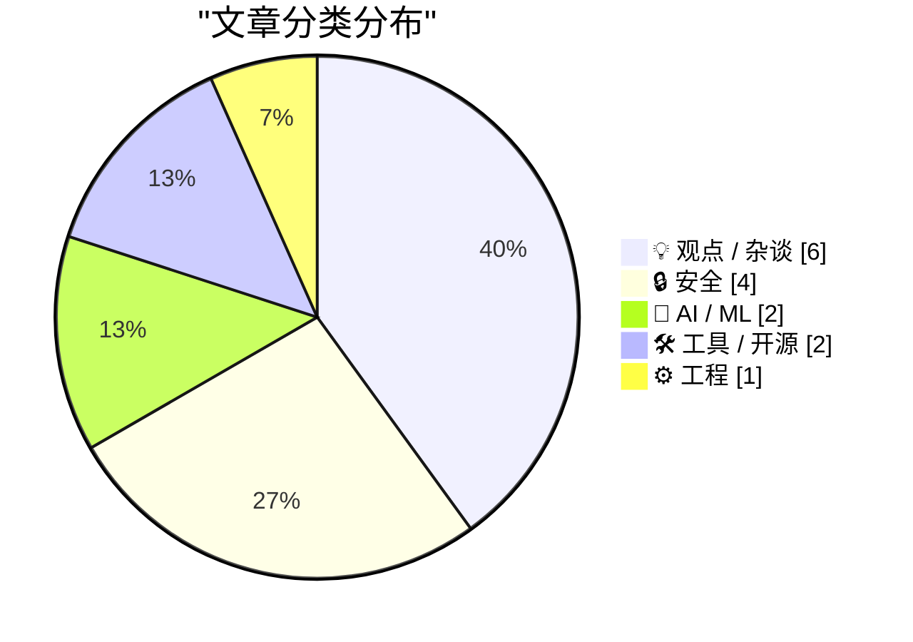
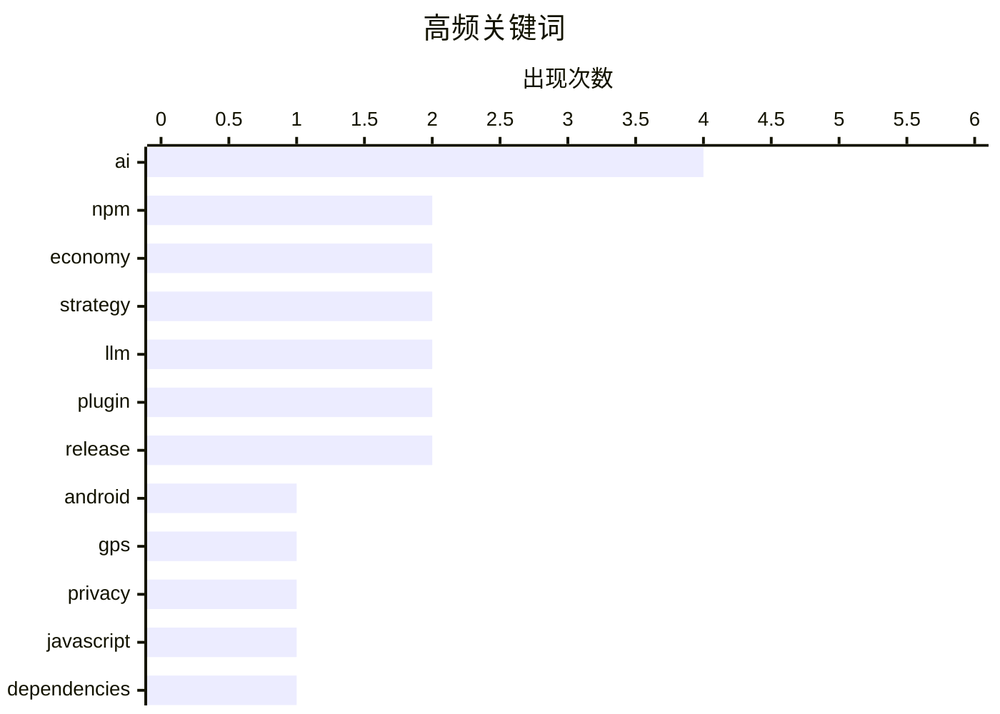

# 📰 AI 博客每日精选 — 2026-04-01

> 来自 Karpathy 推荐的 92 个顶级技术博客，AI 精选 Top 15

## 📝 今日看点

今日技术圈聚焦软件供应链安全与 AI 行业前景两大核心议题。npm 生态接连曝出配置隐患与供应链攻击，配合关键政府应用的安全分析，凸显软件依赖与合规风险迫在眉睫。与此同时，AI 领域面临“次贷危机”论调与关键人事变动，行业泡沫反思与应用落地成为焦点。开发者需警惕依赖风险，同时理性看待 AI 商业化进程。

---

## 🏆 今日必读

🥇 **Technical Analysis of the Android Version of the White House’s New App**

[Technical Analysis of the Android Version of the White House’s New App](https://blog.thereallo.dev/blog/decompiling-the-white-house-app) — daringfireball.net · 9 小时前 · 🔒 安全

> Technical Analysis of the Android Version of the White House’s New App

🏷️ Android, GPS, privacy

🥈 **npm’s Defaults Are Bad**

[npm’s Defaults Are Bad](https://nesbitt.io/2026/03/31/npms-defaults-are-bad.html) — nesbitt.io · 14 小时前 · 🔒 安全

> npm’s Defaults Are Bad

🏷️ npm, JavaScript, dependencies

🥉 **Weekly Update 497**

[Weekly Update 497](https://www.troyhunt.com/weekly-update-497/) — troyhunt.com · 23 小时前 · 🤖 AI / ML

> Weekly Update 497

🏷️ AI, agents, automation

---

## 📊 数据概览

| 扫描源 | 抓取文章 | 时间范围 | 精选 |
|:---:|:---:|:---:|:---:|
| 70/92 | 2217 篇 → 23 篇 | 24h | **15 篇** |

### 分类分布



### 高频关键词



<details>
<summary>📈 纯文本关键词图（终端友好）</summary>

```
ai       │ ████████████████████ 4
npm      │ ██████████░░░░░░░░░░ 2
economy  │ ██████████░░░░░░░░░░ 2
strategy │ ██████████░░░░░░░░░░ 2
llm      │ ██████████░░░░░░░░░░ 2
plugin   │ ██████████░░░░░░░░░░ 2
release  │ ██████████░░░░░░░░░░ 2
android  │ █████░░░░░░░░░░░░░░░ 1
gps      │ █████░░░░░░░░░░░░░░░ 1
privacy  │ █████░░░░░░░░░░░░░░░ 1
```

</details>

### 🏷️ 话题标签

**ai**(4) · **npm**(2) · **economy**(2) · strategy(2) · llm(2) · plugin(2) · release(2) · android(1) · gps(1) · privacy(1) · javascript(1) · dependencies(1) · agents(1) · automation(1) · supply-chain(1) · security(1) · axios(1) · debugging(1) · updates(1) · windows(1)

---

## 💡 观点 / 杂谈

### 1. Appointees to Trump’s Council of Advisors on Science and Technology

[Appointees to Trump’s Council of Advisors on Science and Technology](https://www.whitehouse.gov/releases/2026/03/president-trump-announces-appointments-to-presidents-council-of-advisors-on-science-and-technology/) — **daringfireball.net** · 8 小时前 · ⭐ 23/30

> Appointees to Trump’s Council of Advisors on Science and Technology

🏷️ policy, government, tech-leaders, council

---

### 2. Business Insider Profiles Fidji Simo, OpenAI’s ‘CEO of Applications’

[Business Insider Profiles Fidji Simo, OpenAI’s ‘CEO of Applications’](https://www.businessinsider.com/fidji-simo-openai-product-research-profitability-profile-2026-3) — **daringfireball.net** · 1 小时前 · ⭐ 20/30

> Business Insider Profiles Fidji Simo, OpenAI’s ‘CEO of Applications’

🏷️ OpenAI, management, strategy, ai

---

### 3. The Entire Internet Is a UGC Reaction Video Now

[The Entire Internet Is a UGC Reaction Video Now](https://www.joanwestenberg.com/the-entire-internet-is-a-ugc-reaction-video-now/) — **joanwestenberg.com** · 54 分钟前 · ⭐ 20/30

> The Entire Internet Is a UGC Reaction Video Now

🏷️ culture, internet, media

---

### 4. 黄仁勋闻不出任何异味

[Jensen Huang Doesn’t Smell Anything](https://bsky.app/profile/carnage4life.bsky.social/post/3mhnqozt7fs2n) — **daringfireball.net** · 8 小时前 · ⭐ 19/30

> 英伟达 CEO 黄仁勋在 Hill & Valley 论坛上被问及美国独特优势时，直言是特朗普总统。作为新任总统科学技术顾问委员会成员，这一言论引发了关于科技领袖政治站队的争议。作者讽刺黄仁勋似乎未察觉这种政治依附带来的潜在风险与舆论反感。科技巨头高管公开迎合特定政治人物可能损害其长期公信力与中立形象。这一事件反映了硅谷与华盛顿关系日益紧密背后的复杂性。

🏷️ Nvidia, CEO, AI, industry

---

### 5. 解决昨天的问题会杀死你

[Solving Yesterday’s Problems Will Kill You](https://steveblank.com/2026/03/31/solving-yesterdays-problems-will-kill-you/) — **steveblank.com** · 11 小时前 · ⭐ 19/30

> 初创企业与国防部门常陷入锁定需求后才验证问题正确性的陷阱。Steve Blank 强调在锁定需求前确保处理正确问题及其优先级的重要性。第七届红女王会议将于 4 月 22-23 日在硅谷举行，聚焦投资组合收购高管与 COCOMs 的创新目标概念。会议提供与同行讨论及原型设计的机会，以避免资源浪费在过时问题上。核心观点是创新 targeting 必须在需求固化前完成验证。

🏷️ innovation, strategy, defense

---

### 6. RAM 是新的不记名债券

[RAM Is the New Bearer Bond](https://www.theatlantic.com/technology/2026/03/laptop-electronics-ram-ai-tax/686628/) — **daringfireball.net** · 2 小时前 · ⭐ 18/30

> 大西洋月刊报道指出全球电子元件正面临代际性的内存芯片短缺。佛罗里达 Costco 被迫移除展示电脑中的内存条以防被盗，犯罪团伙甚至误导运输卡车以掠夺 RAM。这种盗窃潮源于 AI 热潮导致的硬件需求激增与供应紧张。内存条已成为类似不记名债券的高价值流通硬通货。结论表明硬件供应链安全已成为 AI 基础设施扩张下的新挑战。

🏷️ hardware, economy, memory, theft

---

## 🔒 安全

### 7. Technical Analysis of the Android Version of the White House’s New App

[Technical Analysis of the Android Version of the White House’s New App](https://blog.thereallo.dev/blog/decompiling-the-white-house-app) — **daringfireball.net** · 9 小时前 · ⭐ 25/30

> Technical Analysis of the Android Version of the White House’s New App

🏷️ Android, GPS, privacy

---

### 8. npm’s Defaults Are Bad

[npm’s Defaults Are Bad](https://nesbitt.io/2026/03/31/npms-defaults-are-bad.html) — **nesbitt.io** · 14 小时前 · ⭐ 25/30

> npm’s Defaults Are Bad

🏷️ npm, JavaScript, dependencies

---

### 9. Supply Chain Attack on Axios Pulls Malicious Dependency from npm

[Supply Chain Attack on Axios Pulls Malicious Dependency from npm](https://simonwillison.net/2026/Mar/31/supply-chain-attack-on-axios/#atom-everything) — **simonwillison.net** · 57 分钟前 · ⭐ 24/30

> Supply Chain Attack on Axios Pulls Malicious Dependency from npm

🏷️ npm, supply-chain, security, axios

---

### 10. Quantum Y2K

[Quantum Y2K](https://www.johndcook.com/blog/2026/03/31/quantum-y2k/) — **johndcook.com** · 9 小时前 · ⭐ 23/30

> Quantum Y2K

🏷️ quantum, cryptography, risk

---

## 🤖 AI / ML

### 11. Weekly Update 497

[Weekly Update 497](https://www.troyhunt.com/weekly-update-497/) — **troyhunt.com** · 23 小时前 · ⭐ 25/30

> Weekly Update 497

🏷️ AI, agents, automation

---

### 12. The Subprime AI Crisis Is Here

[The Subprime AI Crisis Is Here](https://www.wheresyoured.at/the-subprime-ai-crisis-is-here/) — **wheresyoured.at** · 8 小时前 · ⭐ 24/30

> The Subprime AI Crisis Is Here

🏷️ AI, economy, bubble

---

## 🛠 工具 / 开源

### 13. llm 0.30 版本发布

[llm 0.30](https://simonwillison.net/2026/Mar/31/llm/#atom-everything) — **simonwillison.net** · 3 小时前 · ⭐ 18/30

> `llm` 工具发布 0.30 版本，重点更新了插件钩子 `register_models()` 的功能。该钩子现在接受可选的 `model_aliases` 参数，列出其他插件已注册的所有模型、异步模型及别名。带有 `@hookimpl(trylast=True)` 的插件可利用此参数获取全局模型注册状态。这一改进增强了插件间的协作能力与模型管理灵活性。开发者现在可以更精确地控制模型注册顺序与冲突处理。

🏷️ llm, cli, plugin, release

---

### 14. datasette-llm 0.1a4 版本发布

[datasette-llm 0.1a4](https://simonwillison.net/2026/Mar/31/datasette-llm/#atom-everything) — **simonwillison.net** · 3 小时前 · ⭐ 17/30

> `datasette-llm` 发布 0.1a4 版本，新增基于用途配置不同 API 密钥的功能。用户可为特定任务设定专用密钥，例如让 enrichment 任务始终使用 `gpt-5.4-mini` 模型。此方案支持按模型目的隔离密钥管理，提升了安全性与成本控制的粒度。开发者能够更灵活地分配资源，避免单一密钥滥用风险。更新旨在优化多模型环境下的凭证管理策略。

🏷️ datasette, llm, plugin, release

---

## ⚙️ 工程

### 15. Before you check if an update caused your problem, check that it wasn’t a problem before the update

[Before you check if an update caused your problem, check that it wasn’t a problem before the update](https://devblogs.microsoft.com/oldnewthing/20260331-00/?p=112177) — **devblogs.microsoft.com/oldnewthing** · 10 小时前 · ⭐ 24/30

> Before you check if an update caused your problem, check that it wasn’t a problem before the update

🏷️ debugging, updates, Windows

---

*生成于 2026-04-01 00:26 | 扫描 70 源 → 获取 2217 篇 → 精选 15 篇*
*基于 [Hacker News Popularity Contest 2025](https://refactoringenglish.com/tools/hn-popularity/) RSS 源列表，由 [Andrej Karpathy](https://x.com/karpathy) 推荐*
*由「懂点儿AI」制作，欢迎关注同名微信公众号获取更多 AI 实用技巧 💡*
