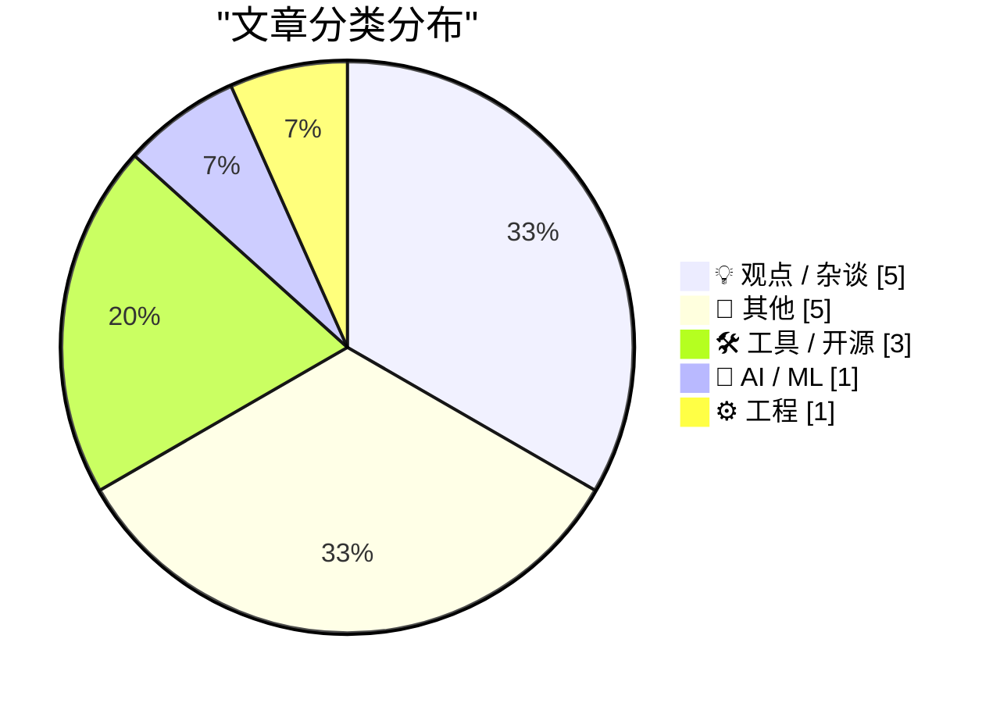
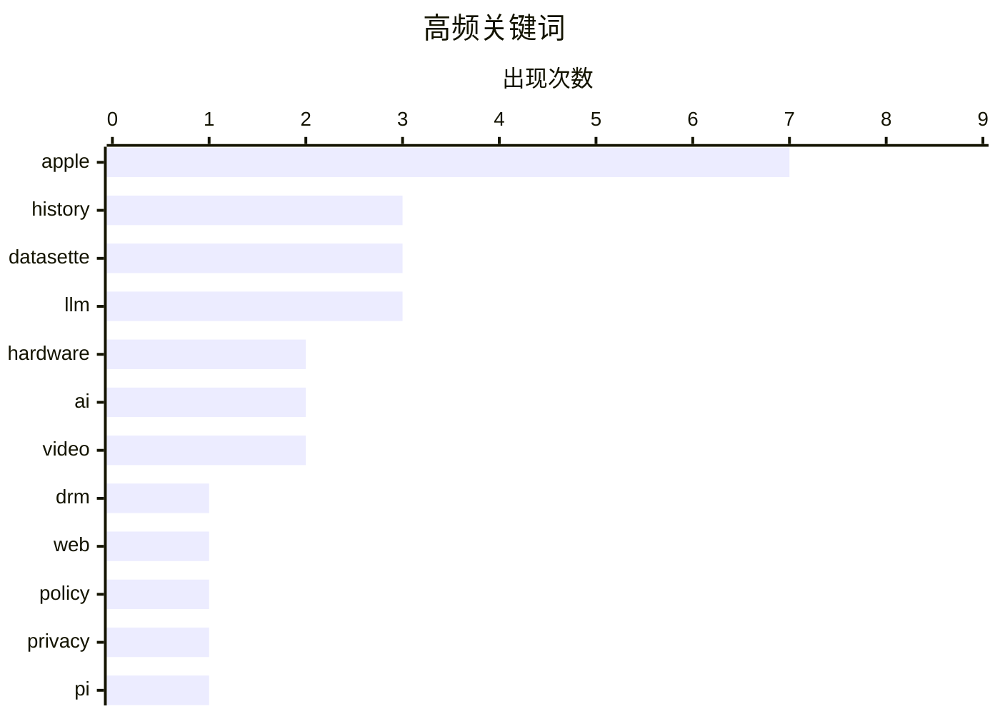

# 📰 AI 博客每日精选 — 2026-04-02

> 来自 Karpathy 推荐的 92 个顶级技术博客，AI 精选 Top 15

## 📝 今日看点

苹果五十周年庆典成为今日科技圈焦点，从库克回顾乔布斯时代到罕见原型档案公开，巨头历史时刻引发广泛共鸣。人工智能重塑开发流程的趋势愈发显著，开发者正从偏见转向全面拥抱 Copilot 等编程助手，代码质量与经济激励成为讨论核心。硬件市场中，内存定价波动正对爱好者单板电脑生态构成严峻挑战，成本压力再度凸显。

---

## 🏆 今日必读

🥇 **多元主义：特朗普主义 vs 小多边主义**

[Pluralistic: Trumpismo vs minilateralism (01 Apr 2026)](https://pluralistic.net/2026/04/01/minilateralism/) — pluralistic.net · 13 小时前 · 💡 观点 / 杂谈

> 特朗普主义与小多边主义之间的政治对立及其对全球格局的影响是讨论核心。核心论点在于敌人拥有投票权，意味着政治决策不能忽视反对力量的存在。文中还串联了网络未来、DRM 技术以及 Netflix 竞争等多个科技与文化议题。作者通过日常链接聚合，展现了技术政策与政治思潮的交织状态。结论暗示在复杂的政治环境中，技术自由主义面临新的挑战。

💡 **为什么值得读**: 适合关注科技政策与政治思潮交叉影响的读者，了解 Cory Doctorow 的最新观点。

🏷️ DRM, web, policy, privacy

🥈 **DRAM 定价正在扼杀爱好者 SBC 市场**

[DRAM pricing is killing the hobbyist SBC market](https://www.jeffgeerling.com/blog/2026/dram-pricing-is-killing-the-hobbyist-sbc-market/) — jeffgeerling.com · 3 小时前 · 📝 其他

> 树莓派宣布所有搭载 LPDDR4 内存的型号涨价，16GB 版本的 Pi 5 价格高达 299.99 美元。同时推出了一款 3GB 内存的 Pi 4 作为替代，售价为 83.75 美元。尽管发布日期是 4 月 1 日，但作者强调这并非玩笑，内存成本上升正在严重打击高端单板计算机市场。视频分析了当前 4/8/16 GB 型号的市场状态，指出价格门槛已将许多爱好者拒之门外。结论认为内存定价策略正在改变 hobbyist 社区的生态结构。

💡 **为什么值得读**: 揭示了硬件成本上涨对开源硬件社区的具体冲击，适合 SBC 爱好者关注。

🏷️ Pi, DRAM, pricing, hardware

🥉 **Ryan D'Agostino 为《Esquire》撰写苹果 50 周年 Tim Cook 专访**

[Ryan D’Agostino Profiles Tim Cook for Esquire on Apple’s 50th](https://www.esquire.com/news-politics/a70886045/apple-50th-anniversary/) — daringfireball.net · 4 小时前 · 💡 观点 / 杂谈

> Tim Cook 在 Steve Jobs 去世当天的经历被详细回顾，描述了他在通知员工和世界时的震惊感。Jobs 生前患病已久，曾拒绝药物治疗而尝试果汁疗法，但这并未减少 Cook 当时的冲击。这篇专访正值苹果 50 周年纪念，深入探讨了 Cook 接手后的领导风格与心理状态。通过细节描写，展现了两位领导人之间复杂的关系及传承时刻。结论侧重于 Cook 如何在 Jobs 阴影下建立自己的领导地位。

💡 **为什么值得读**: 提供了苹果高层领导层更替背后的鲜为人知的细节，适合苹果历史爱好者。

🏷️ Apple, Cook, leadership, history

---

## 📊 数据概览

| 扫描源 | 抓取文章 | 时间范围 | 精选 |
|:---:|:---:|:---:|:---:|
| 77/92 | 2317 篇 → 28 篇 | 24h | **15 篇** |

### 分类分布



### 高频关键词



<details>
<summary>📈 纯文本关键词图（终端友好）</summary>

```
apple     │ ████████████████████ 7
history   │ █████████░░░░░░░░░░░ 3
datasette │ █████████░░░░░░░░░░░ 3
llm       │ █████████░░░░░░░░░░░ 3
hardware  │ ██████░░░░░░░░░░░░░░ 2
ai        │ ██████░░░░░░░░░░░░░░ 2
video     │ ██████░░░░░░░░░░░░░░ 2
drm       │ ███░░░░░░░░░░░░░░░░░ 1
web       │ ███░░░░░░░░░░░░░░░░░ 1
policy    │ ███░░░░░░░░░░░░░░░░░ 1
```

</details>

### 🏷️ 话题标签

**apple**(7) · **history**(3) · **datasette**(3) · llm(3) · hardware(2) · ai(2) · video(2) · drm(1) · web(1) · policy(1) · privacy(1) · pi(1) · dram(1) · pricing(1) · cook(1) · leadership(1) · copilot(1) · productivity(1) · development(1) · coding(1)

---

## 💡 观点 / 杂谈

### 1. 多元主义：特朗普主义 vs 小多边主义

[Pluralistic: Trumpismo vs minilateralism (01 Apr 2026)](https://pluralistic.net/2026/04/01/minilateralism/) — **pluralistic.net** · 13 小时前 · ⭐ 25/30

> 特朗普主义与小多边主义之间的政治对立及其对全球格局的影响是讨论核心。核心论点在于敌人拥有投票权，意味着政治决策不能忽视反对力量的存在。文中还串联了网络未来、DRM 技术以及 Netflix 竞争等多个科技与文化议题。作者通过日常链接聚合，展现了技术政策与政治思潮的交织状态。结论暗示在复杂的政治环境中，技术自由主义面临新的挑战。

🏷️ DRM, web, policy, privacy

---

### 2. Ryan D'Agostino 为《Esquire》撰写苹果 50 周年 Tim Cook 专访

[Ryan D’Agostino Profiles Tim Cook for Esquire on Apple’s 50th](https://www.esquire.com/news-politics/a70886045/apple-50th-anniversary/) — **daringfireball.net** · 4 小时前 · ⭐ 24/30

> Tim Cook 在 Steve Jobs 去世当天的经历被详细回顾，描述了他在通知员工和世界时的震惊感。Jobs 生前患病已久，曾拒绝药物治疗而尝试果汁疗法，但这并未减少 Cook 当时的冲击。这篇专访正值苹果 50 周年纪念，深入探讨了 Cook 接手后的领导风格与心理状态。通过细节描写，展现了两位领导人之间复杂的关系及传承时刻。结论侧重于 Cook 如何在 Jobs 阴影下建立自己的领导地位。

🏷️ Apple, Cook, leadership, history

---

### 3. 引用 Soohoon Choi 关于 AI 代码质量的观点

[Quoting Soohoon Choi](https://simonwillison.net/2026/Apr/1/soohoon-choi/#atom-everything) — **simonwillison.net** · 22 小时前 · ⭐ 23/30

> Soohoon Choi 的观点认为经济激励将促使 AI 模型生成高质量代码。因为优质代码的生成和维护成本更低，且模型间竞争激烈，获胜者需帮助开发者最快交付可靠功能。这意味着简单、可维护的代码将成为市场选择的结果，而不仅仅是开发者的愿望。市场竞争力量将迫使 AI 走向生成更好代码的路径，而非产生更多垃圾代码。结论强调经济规律而非道德诉求将决定 AI 代码的未来质量。

🏷️ AI, coding, economics, future

---

### 4. 说出你想要的东西

[Say the Thing You Want](https://terriblesoftware.org/2026/04/01/say-the-thing-you-want/) — **terriblesoftware.org** · 8 小时前 · ⭐ 20/30

> 职场中许多机会流失源于员工保持沉默而非能力不足。明确表达需求是获取资源和支持的直接途径，沉默并不能保护个人利益。许多技术人员误以为埋头苦干就能获得回报，但实际上可见度至关重要。作者强调主动沟通比被动等待更能推动职业发展。核心观点是想要什么就必须大声说出来。

🏷️ career, communication, work

---

### 5. 苹果 8 号员工 Chris Espinosa 获纽约时报专访

[Chris Espinosa, Employee #8, Profiled in The New York Times](https://www.nytimes.com/2026/04/01/technology/apple-employee-50-years.html) — **daringfireball.net** · 14 分钟前 · ⭐ 18/30

> 纽约时报专访了苹果第 8 号员工 Chris Espinosa，揭示了早期员工在公司裁员中的特殊处境。Espinosa 透露管理层未裁掉他是因其工龄过长导致遣散费过高。他在没有大学学位且只服务于一家公司的情况下见证了苹果 50 年历史。这种留存并非完全基于绩效，而是涉及财务成本计算。这反映了老牌科技巨头在处理元老员工时的成本考量。

🏷️ Apple, layoffs, culture, employment

---

## 📝 其他

### 6. DRAM 定价正在扼杀爱好者 SBC 市场

[DRAM pricing is killing the hobbyist SBC market](https://www.jeffgeerling.com/blog/2026/dram-pricing-is-killing-the-hobbyist-sbc-market/) — **jeffgeerling.com** · 3 小时前 · ⭐ 24/30

> 树莓派宣布所有搭载 LPDDR4 内存的型号涨价，16GB 版本的 Pi 5 价格高达 299.99 美元。同时推出了一款 3GB 内存的 Pi 4 作为替代，售价为 83.75 美元。尽管发布日期是 4 月 1 日，但作者强调这并非玩笑，内存成本上升正在严重打击高端单板计算机市场。视频分析了当前 4/8/16 GB 型号的市场状态，指出价格门槛已将许多爱好者拒之门外。结论认为内存定价策略正在改变 hobbyist 社区的生态结构。

🏷️ Pi, DRAM, pricing, hardware

---

### 7. 韦恩的世界

[Wayne’s World](https://feed.tedium.co/link/15204/17311236/ronald-g-wayne-apple-interview) — **tedium.co** · 23 小时前 · ⭐ 23/30

> 正值苹果 50 周年纪念，文章采访了被遗忘的第三位创始人 Ronald G. Wayne。对于 Wayne 漫长的一生而言，苹果的经历仅仅是一个脚注。访谈揭示了他离开公司后的生活轨迹以及对当年决定的看法。内容对比了苹果如今的巨大成功与 Wayne 个人的平淡生活，展现了历史的偶然性。结论强调了在科技巨头叙事之外，个体命运的多样性与复杂性。

🏷️ Apple, history, founder

---

### 8. 华尔街日报 Ben Cohen 参观苹果原型硬件档案库

[Ben Cohen of the WSJ Tours Apple’s Archive of Prototype Hardware](https://www.youtube.com/watch?v=74qPQt_5DdM) — **daringfireball.net** · 4 小时前 · ⭐ 20/30

> 华尔街日报的 Ben Cohen 制作了一段 7 分钟视频，展示了苹果内部原型硬件档案库中的罕见设备。视频中包含了许多此前从未公开过的有趣原型产品，揭示了苹果产品开发过程中的探索路径。作者建议不要剧透，让观众直接观看视频以体验惊喜。这些原型机展示了苹果在最终产品定型前的多种设计尝试与技术验证。结论体现了苹果对设计历史的保密程度及其档案库的丰富性。

🏷️ Apple, hardware, prototype, history

---

### 9. 苹果庆祝 50 周年纪念

[Apple Marks 50th Anniversary](https://www.apple.com/) — **daringfireball.net** · 7 小时前 · ⭐ 20/30

> 苹果官网首页推出了展示公司最具标志性产品草图的动画视频。Tim Cook 在 Twitter/X 上发布了一段 VHS 风格的“倒带”视频，回顾了苹果产品历史，其中包含一个精致的音频故障效果。该视频随后也被发布到了苹果官网，增加了传播渠道。这些纪念活动旨在庆祝公司成立 50 周年，唤起用户对产品演进历程的情感共鸣。结论展示了苹果如何利用怀旧营销强化品牌历史底蕴。

🏷️ Apple, anniversary, marketing, video

---

### 10. 苹果"Rewind"视频更多细节揭秘

[More on Apple’s Fun ‘Rewind’ Video](https://hachyderm.io/@lexfri/116331181693278195) — **daringfireball.net** · 3 小时前 · ⭐ 18/30

> 社区发现苹果新版"Rewind"视频倒放时背景音乐是升调版的"Think Different"广告曲。设计师 Craig Hockenberry 还修正了视频中"REW"按钮的字体，将现代图标还原为位图 Chicago 12 字体。这些细节证实了苹果营销团队对怀旧元素的精心编排。视觉与听觉的双重彩蛋展示了极高的制作水准。此类彩蛋增强了品牌历史与当前产品的连接感。

🏷️ Apple, design, video, trivia

---

## 🛠 工具 / 开源

### 11. datasette-llm 0.1a6 版本发布

[datasette-llm 0.1a6](https://simonwillison.net/2026/Apr/1/datasette-llm-2/#atom-everything) — **simonwillison.net** · 1 小时前 · ⭐ 20/30

> datasette-llm 发布 0.1a6 版本，优化了模型配置流程，默认模型 ID 无需再在允许列表中重复设置。更新自动将默认模型添加到允许模型列表中，简化了用户的配置步骤。此外，项目文档得到了改进，方便开发者更好地理解和使用该工具。这一更新解决了 GitHub Issue #6 中提出的问题，提升了用户体验。结论表明该工具正在快速迭代以降低 LLM 集成的门槛。

🏷️ datasette, llm, plugin, release

---

### 12. datasette-enrichments-llm 0.2a1 发布

[datasette-enrichments-llm 0.2a1](https://simonwillison.net/2026/Apr/1/datasette-enrichments-llm-2/#atom-everything) — **simonwillison.net** · 2 小时前 · ⭐ 18/30

> 该版本更新了 Datasette 的 LLM enrichment 插件以增强上下文感知能力。核心改进是将触发 enrichment 的 `actor` 信息传递给 `llm.mode(... actor=actor)` 方法。这使得模型在处理数据增强时能识别操作者身份。系统现在能够根据用户身份动态调整处理逻辑。此次更新优化了权限和上下文管理的粒度。

🏷️ datasette, llm, enrichment, api

---

### 13. datasette-extract 0.3a0 发布

[datasette-extract 0.3a0](https://simonwillison.net/2026/Apr/1/datasette-extract/#atom-everything) — **simonwillison.net** · 20 小时前 · ⭐ 18/30

> 此版本重构了模型配置管理方式以提升灵活性。插件现在使用 `datasette-llm` 统一管理模型配置，允许通过 `extract` 目的控制可用模型。用户可依据 LLM model configuration 规范定制提取任务的后端模型。这种集成减少了重复配置的工作量。这解决了之前版本模型配置分散的问题。

🏷️ datasette, extract, llm, config

---

## 🤖 AI / ML

### 14. Copilot 到底是什么？

[What is Copilot exactly?](https://idiallo.com/blog/what-is-copilot-exactly?src=feed) — **idiallo.com** · 12 小时前 · ⭐ 24/30

> 作者原本无法忍受 Microsoft Copilot，但发现一位高效的 10x 工程师同事频繁使用且离不开它。这促使作者放下偏见，决定全面拥抱该工具以验证其实际价值。文章探讨了 AI 编程助手在不同工作流中的真实效用，以及为何高手也能从中受益。核心观点在于工具的价值取决于使用方式，而非工具本身固有的优劣。结论暗示即使是对 AI 持怀疑态度的开发者，也可能在特定场景下找到 Copilot 的必要性。

🏷️ Copilot, AI, productivity, development

---

## ⚙️ 工程

### 15. 揭秘苹果 AirPods Max 2 与 H2 芯片升级

[Inside Apple’s AirPods Max 2 and the H2 Chip Upgrade](https://www.techradar.com/audio/earbuds-airpods/only-limited-by-the-physics-inside-apples-airpods-max-2-and-the-h2-chip-upgrade) — **daringfireball.net** · 5 小时前 · ⭐ 23/30

> 苹果 AirPods Max 2 通过 H2 芯片升级，实现了主动降噪性能 1.5 倍的提升，且未改变任何物理组件。苹果平台架构副总裁 Tim Millet 和音频产品营销总监 Eric Treski 接受采访解析了技术细节。这一改进表明计算音频能力的提升可以显著增强硬件表现，无需重新设计外壳。文章探讨了五年后该产品线如何终于赶上其最初的雄心。结论凸显了芯片算力对音频设备性能迭代的关键作用。

🏷️ Apple, AirPods, chip, architecture

---

*生成于 2026-04-02 00:25 | 扫描 77 源 → 获取 2317 篇 → 精选 15 篇*
*基于 [Hacker News Popularity Contest 2025](https://refactoringenglish.com/tools/hn-popularity/) RSS 源列表，由 [Andrej Karpathy](https://x.com/karpathy) 推荐*
*由「懂点儿AI」制作，欢迎关注同名微信公众号获取更多 AI 实用技巧 💡*
