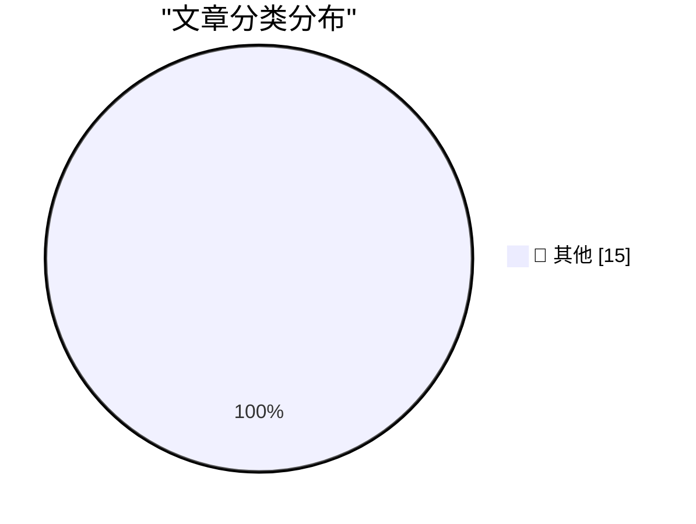

# 📰 AI 博客每日精选 — 2026-04-04

> 来自 Karpathy 推荐的 92 个顶级技术博客，AI 精选 Top 15

## 📝 今日看点

AI 正引发漏洞研究领域的阶跃式变革，安全报告从垃圾信息转变为高质量威胁，迫使内核维护者应对前所未有的验证压力。开源社区正面临双重挑战，既要处理 AI 生成的报告海啸，又要防范针对维护者的社会工程学攻击。近期供应链攻击案例表明，人为因素已成为安全防御的新短板。技术圈正见证 AI 代理重塑安全实践与经济模式的关键转折，传统研究格局已被彻底改变。

---

## 🏆 今日必读

🥇 **漏洞研究已彻底变天**

[Vulnerability Research Is Cooked](https://simonwillison.net/2026/Apr/3/vulnerability-research-is-cooked/#atom-everything) — simonwillison.net · 1 小时前 · 📝 其他

> 前沿模型正在对漏洞研究领域产生突然且巨大的影响，改变了原有的研究格局。编码代理将在未来几个月内彻底改变漏洞利用开发的实践与经济模式，模型改进并非缓慢燃烧而是阶跃式变化。这种技术突变意味着传统漏洞研究流程将面临根本性重构，安全团队需迅速适应新工具。作者引用 Thomas Ptacek 的观点强调了这一变化的紧迫性与破坏性。这一趋势预示着自动化漏洞挖掘将成为主流。

💡 **为什么值得读**: 了解 AI 如何颠覆网络安全底层研究范式及未来几个月的关键窗口期。

🥈 **编码代理的认知影响**

[The cognitive impact of coding agents](https://simonwillison.net/2026/Apr/3/cognitive-cost/#atom-everything) — simonwillison.net · 1 小时前 · 📝 其他

> 与 Lenny Rachitsky 合作的播客视频被剪辑成 TikTok 风格的短视频后在 Twitter 上获得超 110 万次观看。该内容主要探讨编码代理对人类认知成本的影响，展示了专业团队如何通过切片化传播扩大技术话题影响力。视频文件名为 cognitive-cost.mp4，表明核心议题集中在 AI 编码的心理负担上。这种传播方式证明了深度技术讨论在短视频平台同样具有巨大吸引力。创作者通过社交媒体切片成功实现了技术内容的病毒式传播。

💡 **为什么值得读**: 见证技术内容如何通过短视频形式突破圈层获得百万级传播。

🥉 **引用 Willy Tarreau 的评论**

[Quoting Willy Tarreau](https://simonwillison.net/2026/Apr/3/willy-tarreau/#atom-everything) — simonwillison.net · 3 小时前 · 📝 其他

> 内核安全列表的报告数量出现巨大增长，从两年前的每周 2-3 份增至年初以来的每天 5-10 份。早期主要是 AI 生成的低质报告，但现在大多数报告正确无误，迫使团队引入更多维护者处理。周五和周二似乎是报告高峰日，显示自动化提交具有特定时间规律。这一变化标志着 AI 生成的安全报告已从垃圾信息转变为真实威胁。维护团队不得不调整人力配置以应对激增的有效报告数量。

💡 **为什么值得读**: 通过内核维护者的一手数据看清 AI 生成安全报告的质量演变趋势。

---

## 📊 数据概览

| 扫描源 | 抓取文章 | 时间范围 | 精选 |
|:---:|:---:|:---:|:---:|
| 76/92 | 2304 篇 → 21 篇 | 24h | **15 篇** |

### 分类分布

---

## 📝 其他

### 1. 漏洞研究已彻底变天

[Vulnerability Research Is Cooked](https://simonwillison.net/2026/Apr/3/vulnerability-research-is-cooked/#atom-everything) — **simonwillison.net** · 1 小时前 · ⭐ 15/30

> 前沿模型正在对漏洞研究领域产生突然且巨大的影响，改变了原有的研究格局。编码代理将在未来几个月内彻底改变漏洞利用开发的实践与经济模式，模型改进并非缓慢燃烧而是阶跃式变化。这种技术突变意味着传统漏洞研究流程将面临根本性重构，安全团队需迅速适应新工具。作者引用 Thomas Ptacek 的观点强调了这一变化的紧迫性与破坏性。这一趋势预示着自动化漏洞挖掘将成为主流。

---

### 2. 编码代理的认知影响

[The cognitive impact of coding agents](https://simonwillison.net/2026/Apr/3/cognitive-cost/#atom-everything) — **simonwillison.net** · 1 小时前 · ⭐ 15/30

> 与 Lenny Rachitsky 合作的播客视频被剪辑成 TikTok 风格的短视频后在 Twitter 上获得超 110 万次观看。该内容主要探讨编码代理对人类认知成本的影响，展示了专业团队如何通过切片化传播扩大技术话题影响力。视频文件名为 cognitive-cost.mp4，表明核心议题集中在 AI 编码的心理负担上。这种传播方式证明了深度技术讨论在短视频平台同样具有巨大吸引力。创作者通过社交媒体切片成功实现了技术内容的病毒式传播。

---

### 3. 引用 Willy Tarreau 的评论

[Quoting Willy Tarreau](https://simonwillison.net/2026/Apr/3/willy-tarreau/#atom-everything) — **simonwillison.net** · 3 小时前 · ⭐ 15/30

> 内核安全列表的报告数量出现巨大增长，从两年前的每周 2-3 份增至年初以来的每天 5-10 份。早期主要是 AI 生成的低质报告，但现在大多数报告正确无误，迫使团队引入更多维护者处理。周五和周二似乎是报告高峰日，显示自动化提交具有特定时间规律。这一变化标志着 AI 生成的安全报告已从垃圾信息转变为真实威胁。维护团队不得不调整人力配置以应对激增的有效报告数量。

---

### 4. 引用 Daniel Stenberg 的评论

[Quoting Daniel Stenberg](https://simonwillison.net/2026/Apr/3/daniel-stenberg/#atom-everything) — **simonwillison.net** · 3 小时前 · ⭐ 15/30

> cURL 首席开发者指出 AI 在开源安全中的挑战已从 AI 垃圾信息海啸转变为普通安全报告海啸。虽然垃圾信息减少，但大量高质量报告涌现，导致每天需花费数小时处理。这种高强度工作量表明 AI 辅助挖掘漏洞的能力已达到实用化水平。维护者现在面对的是更少但更真实的攻击面，处理强度显著增加。这要求开源社区重新评估安全报告的处理流程与资源分配。

---

### 5. 引用 Greg Kroah-Hartman 的评论

[Quoting Greg Kroah-Hartman](https://simonwillison.net/2026/Apr/3/greg-kroah-hartman/#atom-everything) — **simonwillison.net** · 3 小时前 · ⭐ 15/30

> Linux 内核维护者表示一个月前情况发生突变，AI 生成的安全报告从明显的低质错误转变为真实有效。目前所有开源项目都收到了由 AI 制作的高质量真实报告，不再是可以忽视的垃圾信息。这一转折点对开源社区的安全维护流程提出了全新挑战，旧有的过滤机制已失效。世界似乎在一个月前开关切换，导致安全态势急剧变化。维护者必须正视 AI 成为真实攻击助手的现实。

---

### 6. JavaScript 能否绕过 iframe 内的 CSP Meta 标签？

[Can JavaScript Escape a CSP Meta Tag Inside an Iframe?](https://simonwillison.net/2026/Apr/3/test-csp-iframe-escape/#atom-everything) — **simonwillison.net** · 9 小时前 · ⭐ 15/30

> 在尝试构建类似 Claude Artifacts 的功能时，研究了如何在沙箱 iframe 中应用 CSP 头而无需使用独立域名托管文件。实验表明可以在 iframe 内容顶部注入 `<meta http-equiv="Content-Security-Policy">` 标签来实现策略控制。这为在单域环境下安全渲染用户生成内容提供了可行的技术方案，避免了跨域托管的复杂性。研究代码已开源在 GitHub 上，供开发者验证具体的绕过可能性。该方案平衡了安全性与部署便利性，适合类似 Artifacts 的产品架构。

---

### 7. Axios 供应链攻击使用了针对个人的社会工程学

[The Axios supply chain attack used individually targeted social engineering](https://simonwillison.net/2026/Apr/3/supply-chain-social-engineering/#atom-everything) — **simonwillison.net** · 11 小时前 · ⭐ 15/30

> Axios 团队发布了供应链攻击的完整事后分析，恶意依赖包曾通过正式发布版本分发。攻击涉及针对其中一名维护者的复杂社会工程学活动，而非单纯的技术漏洞利用。这一案例揭示了开源项目维护者个人安全已成为供应链防御的关键薄弱环节。Jason Saayman 详细描述了攻击者如何直接 targeting 维护者以获取权限。此次事件强调了身份验证与人员安全意识在供应链安全中的核心地位。

---

### 8. 用树莓派构建自己的拨号 ISP

[Build your own Dial-up ISP with a Raspberry Pi](https://www.jeffgeerling.com/blog/2026/build-your-own-dial-up-isp-with-a-raspberry-pi/) — **jeffgeerling.com** · 11 小时前 · ⭐ 15/30

> 项目利用树莓派构建了一个拨号 ISP，使原始的 Tangerine iBook G3 能够通过 WiFi 访问拨号互联网。该方案允许复古电脑浏览复古网页，实现了旧硬件与现代网络基础设施的桥接。这是一种独特的硬件怀旧实验，展示了树莓派在模拟旧式网络协议方面的灵活性。用户可以在保留旧设备体验的同时享受现代网络连接便利。整个构建过程涉及硬件改装与网络协议配置，具有较高技术趣味性。

---

### 9. 苹果为 iOS 26 观望者发布 iOS 18 安全更新

[Apple Releases iOS 18 Security Updates for iOS 26 Holdouts](https://sixcolors.com/post/2026/04/apple-releases-ios-18-security-updates-for-ios-26-holdouts/) — **daringfireball.net** · 6 小时前 · ⭐ 15/30

> 苹果此前被批评暂停提供 iOS 18 安全更新给能运行 iOS 26 的设备，现已改变策略。自 4 月 1 日起，iOS 18.7.7 更新推送给所有运行 iOS 18 的设备，包括兼容 iOS 26 的机型。此举解决了不愿升级最新系统的用户面临的安全风险问题，回应了之前的社区投诉。更新原本仅针对无法运行 iOS 26 的设备，现在扩展到了兼容设备。这一政策调整体现了苹果对旧版本系统用户安全需求的重视。

---

### 10. 苹果仍将 Jessica Chastain 的《The Savant》搁置，距首映已七个月

[Apple Still Has Jessica Chastain’s ‘The Savant’ on Ice, Seven Months After It Was Set to Debut](https://www.macstories.net/news/coming-soon-whats-next-on-apple-tv-and-apple-arcade-in-april-2026/) — **daringfireball.net** · 7 小时前 · ⭐ 15/30

> Apple TV+ 原定于 9 月首映的政治惊悚剧《The Savant》再次被推迟，官方称稍后日期。评论指出这种延期显得缺乏勇气，且稍后日期变得越来越像无限期搁置。这反映了苹果在内容发布策略上的不确定性及其对特定题材的谨慎态度。剧集已搁置七个月，主演 Jessica Chastain 的项目面临长期冻结风险。媒体将此比作政治承诺的无限期拖延，暗示项目可能已被取消。

---

### 11. 我的 Zip Bomb 策略不再像以前那样有效

[My Zip bomb strategy is not as effective as it used to be](https://idiallo.com/blog/zip-bombs-are-not-as-effective-as-they-used-to-be?src=feed) — **idiallo.com** · 13 小时前 · ⭐ 15/30

> 作者回顾了过去 10 年利用 Zip Bomb 防御恶意机器人攻击的服务器安全策略。该博客运行在基础的 DigitalOcean Droplet 上，原本能轻松应对常规流量峰值。近期攻击环境发生变化，导致原有的 Zip Bomb 防御机制效果显著下降。作者通常不愿透露服务器内部工作原理，但此次例外旨在分享防御失效的现状。这种策略曾帮助博客在低成本架构下生存多年，如今却面临失效风险。这表明针对 rogue bots 的防御手段需要随攻击演变而更新。

---

### 12. 书评：《超级智能：路径、危险、策略》

[Book Review: Superintelligence - Paths, Dangers, Strategies by Nick Bostrom ★★★★⯪](https://shkspr.mobi/blog/2026/04/book-review-superintelligence-paths-dangers-strategies-by-nick-bostrom/) — **shkspr.mobi** · 13 小时前 · ⭐ 15/30

> Nick Bostrom 于 2014 年出版的著作《超级智能》探讨了真正人工智能的风险。书中明确区分了当前的 LLM 技术与未来可能出现的真正人工智能及其潜在问题。作者强调在创造超级智能之前必须部署相应的安全措施和控制策略。书评特别提到了开篇的“麻雀未完成的寓言”，认为其核心观点极具警示意义。 reviewer 甚至表示若能时间旅行，会回到过去给每个人分发这本书。该书被视为理解 AI 长期存在风险及应对策略的经典必读材料。

---

### 13. 如何使用 ReadDirectoryChangesW 知晓何时有人从目录复制文件？

[How can I use Read­Directory­ChangesW to know when someone is copying a file out of the directory?](https://devblogs.microsoft.com/oldnewthing/20260403-00/?p=112202) — **devblogs.microsoft.com/oldnewthing** · 11 小时前 · ⭐ 15/30

> 开发者常尝试使用 Windows API 函数 ReadDirectoryChangesW 监控文件复制行为。微软官方技术博客明确指出文件复制并非文件系统层的基本操作。因此在文件系统层面根本无法直接检测到文件被复制出的动作。这一结论直接否定了通过该 API 实现文件外发监控的技术可行性。对于需要审计文件访问安全的应用，需寻找其他层面的监控方案。这揭示了 Windows 文件系统 API 在行为检测上的固有局限性。

---

### 14. 罗马月亮与希腊月亮

[Roman moon, Greek moon](https://www.johndcook.com/blog/2026/04/03/roman-moon-greek-moon/) — **johndcook.com** · 8 小时前 · ⭐ 15/30

> 文章探讨了 Artemis II 飞行路径中使用的近月点术语 perilune 的词源背景。当 Artemis 最接近月球时，因位于月球背地侧，其距离地球最远。Perilune 有时也被称为 periselene，两者分别源自拉丁语和希腊语词根。作者通过对比罗马与希腊命名习惯，解释了航天术语中的语言学差异。这种术语区分有助于精确描述航天器在地月系统中的轨道位置。文章展示了技术文档中词源学知识对准确表达轨道力学概念的重要性。

---

### 15. 纳皮尔记忆法的双曲版本

[Hyperbolic version of Napier’s mnemonic](https://www.johndcook.com/blog/2026/04/02/hyperbolic-napier-mnemonic/) — **johndcook.com** · 23 小时前 · ⭐ 15/30

> 作者在一本旧几何书中发现了球面三角学纳皮尔记忆法的双曲类比版本。虽然事后看来万物皆有双曲类比，但这一具体发现仍令人感到意外。球面版本之所以著名，是因为其在导航和天文学中的历史应用广泛。双曲版本的发现揭示了非欧几何中不同曲面三角学公式的内在联系。该文章通过数学类比展示了经典几何 mnemonic 在现代数学中的扩展性。这为研究双曲几何与球面三角学关系的学者提供了新的视角。

---

*生成于 2026-04-04 01:28 | 扫描 76 源 → 获取 2304 篇 → 精选 15 篇*
*基于 [Hacker News Popularity Contest 2025](https://refactoringenglish.com/tools/hn-popularity/) RSS 源列表，由 [Andrej Karpathy](https://x.com/karpathy) 推荐*
*由「懂点儿AI」制作，欢迎关注同名微信公众号获取更多 AI 实用技巧 💡*
