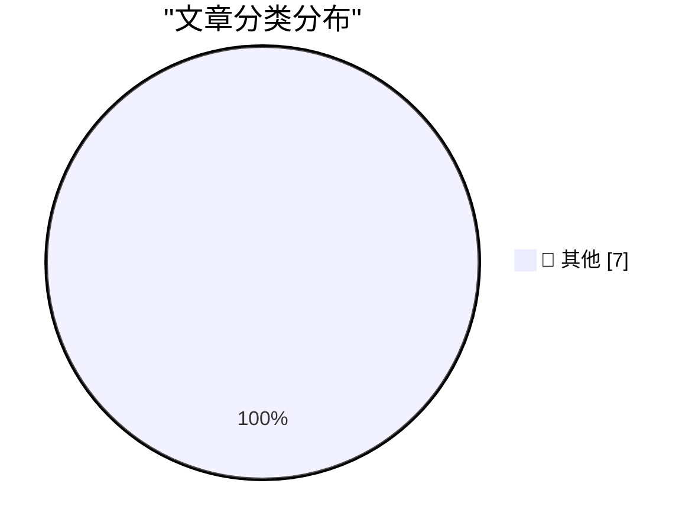

# 📰 AI 博客每日精选 — 2026-04-05

> 来自 Karpathy 推荐的 92 个顶级技术博客，AI 精选 Top 7

## 🏆 今日必读

🥇 **引用 Kyle Daigle 关于 GitHub 平台活动的数据**

[Quoting Kyle Daigle](https://simonwillison.net/2026/Apr/4/kyle-daigle/#atom-everything) — simonwillison.net · 1 天前 · 📝 其他

> GitHub 平台活动正在激增，2025 年提交量达到 10 亿次，目前每周 2.75 亿次。预计今年将达到 140 亿次，且增长并非线性。GitHub Actions 的使用量从 2023 年的每周 5 亿分钟增长到 2025 年的 10 亿分钟。本周已达到 21 亿分钟，显示自动化流程负载翻倍。数据表明软件开发自动化和协作规模正在前所未有的扩张。平台团队需要为这种指数级增长做好基础设施扩展准备。

💡 **为什么值得读**: 了解 GitHub 最新增长数据有助于把握软件开发基础设施的演进趋势。

🥈 **欧盟准备在科技政策上向特朗普妥协**

[Pluralistic: EU ready to cave to Trump on tech (04 Apr 2026)](https://pluralistic.net/2026/04/04/digital-subjugation/) — pluralistic.net · 18 小时前 · 📝 其他

> 欧盟正准备在科技监管政策上向特朗普政府让步，这可能改变跨大西洋数字主权格局。文章列举了数字臣服、关税问题以及僵尸经济等多个关键议题，暗示政治压力正在影响技术法规。作者批评这种妥协行为，将其比作“投降猴”，认为这会损害数字权利。文中还提及了 AI 治疗师信任危机和疫苗分发问题作为背景噪音。核心观点是政治干预正在削弱技术领域的独立性和原则性。欧盟的退让可能导致全球科技监管标准的倒退。

💡 **为什么值得读**: 深入分析地缘政治如何影响科技监管政策走向。

🥉 **欢迎来到 RSS 俱乐部**

[Welcome to RSS Club!](https://shkspr.mobi/blog/2026/04/welcome-to-rss-club/) — shkspr.mobi · 15 小时前 · 📝 其他

> RSS Club 是一个隐藏在公开网络之外的秘密社交网络，仅通过 RSS 或 Atom 订阅者可见。这篇文章本身就不会在网页上显示，也无法被搜索引擎抓取或分享到 Mastodon。这种机制旨在恢复早期互联网的私密性和订阅者专属感。作者通过技术手段实现了内容的定向分发，避开算法推荐和公开索引。这是一种对现代社交媒体公开性过剩的反叛实验。只有订阅者才能成为这个俱乐部的成员。

💡 **为什么值得读**: 探索 RSS 技术在隐私保护和内容分发上的新玩法。

---

## 📊 数据概览

| 扫描源 | 抓取文章 | 时间范围 | 精选 |
|:---:|:---:|:---:|:---:|
| 78/92 | 2338 篇 → 7 篇 | 24h | **7 篇** |

### 分类分布

---

## 📝 其他

### 1. 引用 Kyle Daigle 关于 GitHub 平台活动的数据

[Quoting Kyle Daigle](https://simonwillison.net/2026/Apr/4/kyle-daigle/#atom-everything) — **simonwillison.net** · 1 天前 · ⭐ 15/30

> GitHub 平台活动正在激增，2025 年提交量达到 10 亿次，目前每周 2.75 亿次。预计今年将达到 140 亿次，且增长并非线性。GitHub Actions 的使用量从 2023 年的每周 5 亿分钟增长到 2025 年的 10 亿分钟。本周已达到 21 亿分钟，显示自动化流程负载翻倍。数据表明软件开发自动化和协作规模正在前所未有的扩张。平台团队需要为这种指数级增长做好基础设施扩展准备。

---

### 2. 欧盟准备在科技政策上向特朗普妥协

[Pluralistic: EU ready to cave to Trump on tech (04 Apr 2026)](https://pluralistic.net/2026/04/04/digital-subjugation/) — **pluralistic.net** · 18 小时前 · ⭐ 15/30

> 欧盟正准备在科技监管政策上向特朗普政府让步，这可能改变跨大西洋数字主权格局。文章列举了数字臣服、关税问题以及僵尸经济等多个关键议题，暗示政治压力正在影响技术法规。作者批评这种妥协行为，将其比作“投降猴”，认为这会损害数字权利。文中还提及了 AI 治疗师信任危机和疫苗分发问题作为背景噪音。核心观点是政治干预正在削弱技术领域的独立性和原则性。欧盟的退让可能导致全球科技监管标准的倒退。

---

### 3. 欢迎来到 RSS 俱乐部

[Welcome to RSS Club!](https://shkspr.mobi/blog/2026/04/welcome-to-rss-club/) — **shkspr.mobi** · 15 小时前 · ⭐ 15/30

> RSS Club 是一个隐藏在公开网络之外的秘密社交网络，仅通过 RSS 或 Atom 订阅者可见。这篇文章本身就不会在网页上显示，也无法被搜索引擎抓取或分享到 Mastodon。这种机制旨在恢复早期互联网的私密性和订阅者专属感。作者通过技术手段实现了内容的定向分发，避开算法推荐和公开索引。这是一种对现代社交媒体公开性过剩的反叛实验。只有订阅者才能成为这个俱乐部的成员。

---

### 4. 卡尔曼滤波与贝叶斯平均成绩

[Kalman and Bayes average grades](https://www.johndcook.com/blog/2026/04/04/kalman-bayes/) — **johndcook.com** · 11 小时前 · ⭐ 15/30

> 更新平均成绩可作为贝叶斯统计和卡尔曼滤波的简单特例问题。假设在班级中记录平均成绩，已知 n 次测试后的平均值且权重相等，可以通过公式进行推导。这种方法展示了如何在不存储所有历史数据的情况下动态更新统计估计。卡尔曼滤波在此场景下提供了递归更新均值的数学框架。贝叶斯视角则解释了如何根据新证据调整先验信念。这是一个理解复杂滤波算法的直观入门案例。

---

### 5. 针对 AI 写作的猎巫行动毫无意义

[The AI writing witchhunt is pointless.](https://www.joanwestenberg.com/the-ai-writing-witchhunt-is-pointless/) — **joanwestenberg.com** · 14 小时前 · ⭐ 15/30

> 针对 AI 写作的道德批判类似于历史上的猎巫行动，实际上毫无意义。文章以 19 世纪巴黎的亚历山大·大仲马为例，他运营着一个内容生产工作室。核心合作者 Auguste Maquet 撰写了《三个火枪手》的大量初稿。大仲马负责重写和润色，这种协作模式与当今人类与 AI 的合作本质相似。历史证明内容创作的协作性一直存在，并非 AI 时代特有。作者认为应接受新的协作创作模式而非抵制。

---

### 6. 开源意味着什么？

[What does Open Source mean?](https://nesbitt.io/2026/04/04/what-does-open-source-mean.html) — **nesbitt.io** · 16 小时前 · ⭐ 15/30

> 开源定义当前面临着一堆相互冲突的期望堆叠。不同社区对开源许可证、商业化边界及贡献者权利有着截然不同的理解。这种期望的不兼容性导致了生态系统的碎片化和法律争议。文章指出开源概念正在被过度拉伸，失去了原本的统一共识。核心问题在于如何平衡自由软件理念与现代商业需求。需要重新审视开源定义以适应当前复杂的软件供应链环境。

---

### 7. 2026 年 4 月 4 日阅读清单

[Reading List 04/04/2026](https://www.construction-physics.com/p/reading-list-04042026) — **construction-physics.com** · 14 小时前 · ⭐ 15/30

> 本期阅读清单涵盖了铝材颠覆、电动汽车锈蚀带及变压器短缺等硬科技议题。SpaceX 的 IPO 动态也被列入关注范围，显示商业航天与基础设施的交叉影响。内容聚焦于物理世界供应链与新兴技术之间的摩擦点。变压器短缺暗示了能源基础设施升级面临的瓶颈。电动汽车锈蚀问题揭示了新材料在实际环境中的耐久性挑战。这些议题共同构成了当前工业物理学的关键观察窗口。

---

*生成于 2026-04-05 02:46 | 扫描 78 源 → 获取 2338 篇 → 精选 7 篇*
*基于 [Hacker News Popularity Contest 2025](https://refactoringenglish.com/tools/hn-popularity/) RSS 源列表，由 [Andrej Karpathy](https://x.com/karpathy) 推荐*
*由「懂点儿AI」制作，欢迎关注同名微信公众号获取更多 AI 实用技巧 💡*
