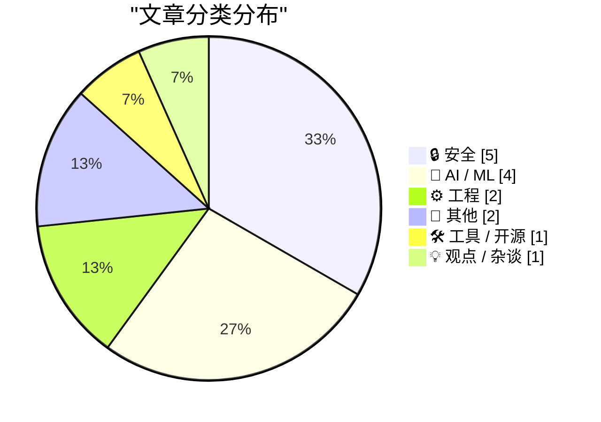
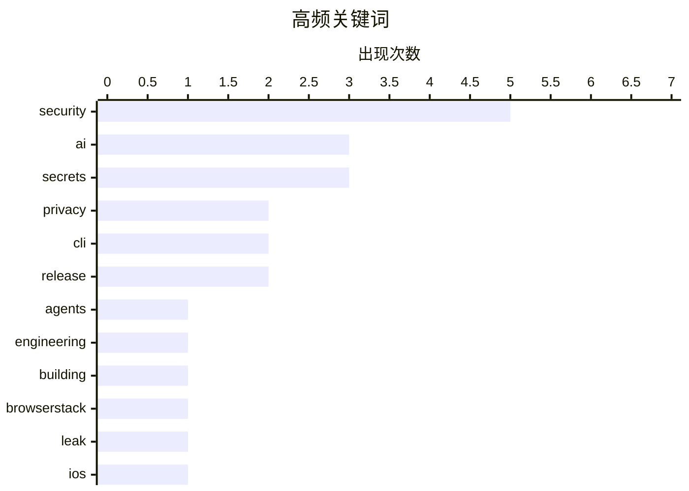

# 📰 AI 博客每日精选 — 2026-04-06

> 来自 Karpathy 推荐的 92 个顶级技术博客，AI 精选 Top 15

## 📝 今日看点

AI 代理工程正重塑开发效率，开发者借助大模型将数年构思压缩至数月落地，医疗合规与本地部署成为应用新焦点。安全与隐私信任危机同步升温，从平台数据泄露到 AI 隐身模式诉讼，凸显了合规与透明度的重要性。工程实践方面，软件版本透明化与系统性能优化仍是保障供应链可靠性的基石。技术圈在追求极速创新的同时，正重新审视安全边界与工程规范。

---

## 🏆 今日必读

🥇 **渴望八年，借助 AI 构建三个月**

[Eight years of wanting, three months of building with AI](https://simonwillison.net/2026/Apr/5/building-with-ai/#atom-everything) — simonwillison.net · 27 分钟前 · 🤖 AI / ML

> 文章探讨了代理式工程（agentic engineering）的实践历程与效率突破。Lalit Maganti 耗时八年构思，最终仅用三个月借助 AI 完成了 syntaqlite 项目的构建。该项目被定义为高保真开发工具（high-fidelity devtools），展示了 AI 辅助开发的巨大潜力。作者 Simon Willison 认为这是近年来关于代理式工程最优秀的长篇写作之一。核心观点在于 AI 能将长期的构想迅速转化为实际成果。

💡 **为什么值得读**: 适合关注 AI 辅助编程效率提升和代理式工程实践的开发人员阅读。

🏷️ AI, agents, engineering, building

🥈 **BrowserStack 有人正在泄露用户邮箱地址**

[Someone at BrowserStack is Leaking Users' Email Address](https://shkspr.mobi/blog/2026/04/someone-at-browserstack-is-leaking-users-email-address/) — shkspr.mobi · 12 小时前 · 🔒 安全

> 文章揭露了 BrowserStack 存在用户电子邮件地址泄露的安全事件。作者通过为每个服务生成唯一邮箱地址的技术手段，精准定位了泄露源。这种检测方法能有效识别服务是否被黑客攻击或内部泄露，防止凭证填充攻击。虽然具体泄露细节未完全展开，但标题直指内部人员或系统问题。核心观点在于唯一邮箱策略是追踪数据泄露的有效方法。

💡 **为什么值得读**: 提供了通过唯一邮箱追踪数据泄露源的实用安全技巧，同时警示了知名测试平台的风险。

🏷️ BrowserStack, leak, privacy, security

🥉 **iOS 26 感觉比 iOS 18 更快**

[iOS 26 Feels Faster Than iOS 18](https://daringfireball.net/linked/2026/04/03/ios-18-update-for-holdouts) — daringfireball.net · 23 小时前 · ⚙️ 工程

> 文章对比了 iOS 26 与 iOS 18 在系统流畅度上的显著差异。作者通过在 iPhone 16 Pro 上回退至 iOS 18.7.7 使用两天，发现 iOS 26 beta 周期后期加速了大量系统级动画。典型例子是从屏幕底部上滑返回主屏幕的动画速度有明显提升。尽管此前未获广泛关注，但实际对比体验差异巨大。核心观点是 iOS 26 在感知性能上优于 iOS 18。

💡 **为什么值得读**: 为关注 iOS 系统性能演变的用户提供了一线对比体验，揭示了苹果在动画流畅度上的隐性优化。

🏷️ iOS, performance, animations, Apple

---

## 📊 数据概览

| 扫描源 | 抓取文章 | 时间范围 | 精选 |
|:---:|:---:|:---:|:---:|
| 78/92 | 2338 篇 → 16 篇 | 24h | **15 篇** |

### 分类分布



### 高频关键词



<details>
<summary>📈 纯文本关键词图（终端友好）</summary>

```
security     │ ████████████████████ 5
ai           │ ████████████░░░░░░░░ 3
secrets      │ ████████████░░░░░░░░ 3
privacy      │ ████████░░░░░░░░░░░░ 2
cli          │ ████████░░░░░░░░░░░░ 2
release      │ ████████░░░░░░░░░░░░ 2
agents       │ ████░░░░░░░░░░░░░░░░ 1
engineering  │ ████░░░░░░░░░░░░░░░░ 1
building     │ ████░░░░░░░░░░░░░░░░ 1
browserstack │ ████░░░░░░░░░░░░░░░░ 1
```

</details>

### 🏷️ 话题标签

**security**(5) · **ai**(3) · **secrets**(3) · privacy(2) · cli(2) · release(2) · agents(1) · engineering(1) · building(1) · browserstack(1) · leak(1) · ios(1) · performance(1) · animations(1) · apple(1) · perplexity(1) · lawsuit(1) · hipaa(1) · compliance(1) · local(1)

---

## 🔒 安全

### 1. BrowserStack 有人正在泄露用户邮箱地址

[Someone at BrowserStack is Leaking Users' Email Address](https://shkspr.mobi/blog/2026/04/someone-at-browserstack-is-leaking-users-email-address/) — **shkspr.mobi** · 12 小时前 · ⭐ 25/30

> 文章揭露了 BrowserStack 存在用户电子邮件地址泄露的安全事件。作者通过为每个服务生成唯一邮箱地址的技术手段，精准定位了泄露源。这种检测方法能有效识别服务是否被黑客攻击或内部泄露，防止凭证填充攻击。虽然具体泄露细节未完全展开，但标题直指内部人员或系统问题。核心观点在于唯一邮箱策略是追踪数据泄露的有效方法。

🏷️ BrowserStack, leak, privacy, security

---

### 2. 集体诉讼称 Perplexity 的“隐身模式”是“骗局”

[Class Action Lawsuit Says Perplexity’s ‘Incognito Mode’ Is a ‘Sham’](https://arstechnica.com/tech-policy/2026/04/perplexitys-incognito-mode-is-a-sham-lawsuit-says/) — **daringfireball.net** · 23 小时前 · ⭐ 24/30

> 文章报道了一起针对 Perplexity 的集体诉讼，指控其“隐身模式”虚假宣传隐私保护。诉讼发现即使用户开启隐身模式，初始提示词和后续点击的问题仍会被共享。非订阅用户的隐私风险更高，初始提示词通过 URL 共享，可能被 Meta 和 Google 等第三方访问。开发者工具分析显示对话内容并未真正隔离。核心观点是 Perplexity 的隐私保护机制存在严重缺陷。

🏷️ Perplexity, privacy, lawsuit, AI

---

### 3. scan-for-secrets 0.2 发布

[scan-for-secrets 0.2](https://simonwillison.net/2026/Apr/5/scan-for-secrets/#atom-everything) — **simonwillison.net** · 20 小时前 · ⭐ 16/30

> 该版本更新了秘密扫描 CLI 工具的性能与功能。结果现在流式传输而非等待结束，优化了大目录扫描体验。支持多次使用 `-d/--directory` 选项扫描多个目录，并新增 `-f/--file` 选项指定单个文件。引入了新的底层目录迭代功能组件。这些改进提升了工具在处理大规模代码库时的效率和灵活性。

🏷️ secrets, CLI, security, scanning

---

### 4. scan-for-secrets 0.1 发布

[scan-for-secrets 0.1](https://simonwillison.net/2026/Apr/5/scan-for-secrets-3/#atom-everything) — **simonwillison.net** · 20 小时前 · ⭐ 16/30

> 作者发布了用于检测本地 Claude Code 会话转录稿中泄露秘密的 Python 工具。主要解决在发布详细日志文件时可能意外暴露 API 密钥等敏感信息的担忧。工具允许用户输入文件内容进行扫描以提供安全保障。这是该工具系列的初始版本，旨在辅助开发者安全地分享 AI 编程记录。核心观点是自动化扫描能有效缓解人为疏忽导致的安全风险。

🏷️ secrets, security, CLI, release

---

### 5. scan-for-secrets 0.1.1 发布

[scan-for-secrets 0.1.1](https://simonwillison.net/2026/Apr/5/scan-for-secrets-2/#atom-everything) — **simonwillison.net** · 20 小时前 · ⭐ 14/30

> 此补丁版本完善了扫描工具对转义方案的支持文档。移除了不必要的 `repr` 转义方案，因其功能已被 `json` 方案覆盖。更新确保了扫描逻辑的简洁性和准确性。文档现在清晰列出了所有被扫描的转义机制。这次迭代专注于优化检测逻辑而非新增功能。

🏷️ secrets, security, release, docs

---

## 🤖 AI / ML

### 6. 渴望八年，借助 AI 构建三个月

[Eight years of wanting, three months of building with AI](https://simonwillison.net/2026/Apr/5/building-with-ai/#atom-everything) — **simonwillison.net** · 27 分钟前 · ⭐ 25/30

> 文章探讨了代理式工程（agentic engineering）的实践历程与效率突破。Lalit Maganti 耗时八年构思，最终仅用三个月借助 AI 完成了 syntaqlite 项目的构建。该项目被定义为高保真开发工具（high-fidelity devtools），展示了 AI 辅助开发的巨大潜力。作者 Simon Willison 认为这是近年来关于代理式工程最优秀的长篇写作之一。核心观点在于 AI 能将长期的构想迅速转化为实际成果。

🏷️ AI, agents, engineering, building

---

### 7. 符合 HIPAA 标准的 AI

[HIPAA compliant AI](https://www.johndcook.com/blog/2026/04/05/hipaa-compliant-ai/) — **johndcook.com** · 1 小时前 · ⭐ 23/30

> 文章探讨了在医疗领域实现 AI 应用符合 HIPAA 合规性的最佳实践方案。作者指出最可靠的方法是在本地硬件上运行 AI，避免将受保护健康信息（PHI）传输到 ChatGPT 或 Claude 等云端服务。虽然存在符合 HIPAA 的云端选项，但通常限制多且成本高昂。即使是企业级选项也面临类似挑战。核心观点是本地部署是平衡 AI 能力与医疗数据合规性的首选。

🏷️ AI, HIPAA, compliance, local

---

### 8. research-llm-apis 2026-04-04

[research-llm-apis 2026-04-04](https://simonwillison.net/2026/Apr/5/research-llm-apis/#atom-everything) — **simonwillison.net** · 23 小时前 · ⭐ 20/30

> 文章宣布了 research-llm-apis 工具的最新版本发布及 LLM Python 库的重大更新计划。LLM 工具通过插件系统为数十家供应商的数百个不同大模型提供了抽象层。过去一年内各厂商新增的功能特性要求抽象层进行相应调整以保持一致性。此次更新旨在更好地适配不断演进的 LLM API 生态。核心观点是统一抽象层对于管理多样化大模型至关重要。

🏷️ LLM, APIs, Python, dataset

---

### 9. 引用 Chengpeng Mou 的观点

[Quoting Chengpeng Mou](https://simonwillison.net/2026/Apr/5/chengpeng-mou/#atom-everything) — **simonwillison.net** · 2 小时前 · ⭐ 18/30

> 文章引用了 Chengpeng Mou 基于匿名化美国 ChatGPT 数据的统计分析结果。数据显示每周约有 200 万条关于健康保险的对话消息，其中 60 万条来自“医疗荒漠”地区的用户。70% 的医疗相关咨询发生在诊所营业时间之外。这些数据揭示了用户利用 AI 填补医疗服务缺口的现状。核心观点是 AI 正在成为非工作时间及医疗资源匮乏地区的重要健康咨询渠道。

🏷️ ChatGPT, healthcare, data, usage

---

## ⚙️ 工程

### 10. iOS 26 感觉比 iOS 18 更快

[iOS 26 Feels Faster Than iOS 18](https://daringfireball.net/linked/2026/04/03/ios-18-update-for-holdouts) — **daringfireball.net** · 23 小时前 · ⭐ 24/30

> 文章对比了 iOS 26 与 iOS 18 在系统流畅度上的显著差异。作者通过在 iPhone 16 Pro 上回退至 iOS 18.7.7 使用两天，发现 iOS 26 beta 周期后期加速了大量系统级动画。典型例子是从屏幕底部上滑返回主屏幕的动画速度有明显提升。尽管此前未获广泛关注，但实际对比体验差异巨大。核心观点是 iOS 26 在感知性能上优于 iOS 18。

🏷️ iOS, performance, animations, Apple

---

### 11. 盖上戳！所有程序必须报告其版本

[Stamp It! All Programs Must Report Their Version](https://michael.stapelberg.ch/posts/2026-04-05-stamp-it-all-programs-must-report-their-version/) — **michael.stapelberg.ch** · 10 小时前 · ⭐ 22/30

> 文章主张所有软件程序都必须明确报告其版本号以便于追踪和管理。作者通过展示 nix derivation 的输出示例，强调了版本信息在系统构建中的重要性。这一要求旨在提高软件供应链的透明度和可维护性。当前许多程序缺乏明确的版本标识，给系统管理带来挑战。核心观点是版本报告应成为软件开发的强制性标准。

🏷️ versioning, software, reproducibility, nix

---

## 📝 其他

### 12. 特朗普关于伊朗的复活节早晨信息

[An Easter Morning Message of Hope From the Winner of the FIFA Peace Prize](https://truthsocial.com/@realDonaldTrump/posts/116351998782539414) — **daringfireball.net** · 8 小时前 · ⭐ 10/30

> 文章引用了美国总统唐纳德·特朗普在 Truth Social 上的帖子内容。特朗普威胁伊朗将在周二面临发电厂和桥梁被打击的后果，并要求开放海峡。日本伊朗大使馆回应称这种领导人的文明和智力水平令人遗憾。内容展示了紧张的地缘政治言论及其外交回应。这不是技术文章，而是政治新闻摘要。

🏷️ Trump, politics, Iran, news

---

### 13. Material Security 云办公安全赞助

[Material Security](https://material.security/lp-cloud-office-security?utm_source=third-party&amp;utm_medium=email&amp;utm_campaign=20260330-daringfireball) — **daringfireball.net** · 23 小时前 · ⭐ 9/30

> 该赞助内容介绍了 Material Security 统一的云工作空间安全解决方案。针对安全团队面临的噪音问题而非人才问题，提供邮件、文件和账户的检测与响应功能。工具旨在弥补 Google 和 Microsoft 原生安全功能的缺口，无需传统企业负担。通过自动化处理网络钓鱼修复和 OAuth 权限审计来减少人工工作量。核心观点是统一平台能显著提升云安全运营效率。

🏷️ security, sponsorship, cloud, phishing

---

## 🛠 工具 / 开源

### 14. Syntaqlite 游乐场

[Syntaqlite Playground](https://simonwillison.net/2026/Apr/5/syntaqlite/#atom-everything) — **simonwillison.net** · 4 小时前 · ⭐ 19/30

> 文章介绍了 Syntaqlite Playground 工具的上线及其在 Hacker News 上的热议情况。该工具源自 Lalit Maganti 的 syntaqlite 项目，此前因 AI 构建历程文章而受到关注。Simon Willison 受此启发重新审视并提供了在线游玩体验入口。这反映了社区对 AI 生成开发工具的高度兴趣。核心观点是交互式 playground 有助于推广新兴开发工具。

🏷️ Syntaqlite, SQL, playground, tool

---

## 💡 观点 / 杂谈

### 15. 没那么深奥

[It's not that deep](https://idiallo.com/blog/its-not-that-deep?src=feed) — **idiallo.com** · 16 小时前 · ⭐ 17/30

> 文章探讨了成年后家庭责任对个人创造力和冲动执行想法的影响。作者回忆过去因点子太多无法入睡并立即行动的日子，对比现在周日晚上独自思考生活的状态。虽然内心仍有创作的火花，但不再随意追随每一个念头。这种变化反映了人生阶段不同带来的优先级调整。核心观点是成熟意味着对创意冲动的选择性克制。

🏷️ career, motivation, reflection, life

---

*生成于 2026-04-06 00:21 | 扫描 78 源 → 获取 2338 篇 → 精选 15 篇*
*基于 [Hacker News Popularity Contest 2025](https://refactoringenglish.com/tools/hn-popularity/) RSS 源列表，由 [Andrej Karpathy](https://x.com/karpathy) 推荐*
*由「懂点儿AI」制作，欢迎关注同名微信公众号获取更多 AI 实用技巧 💡*
