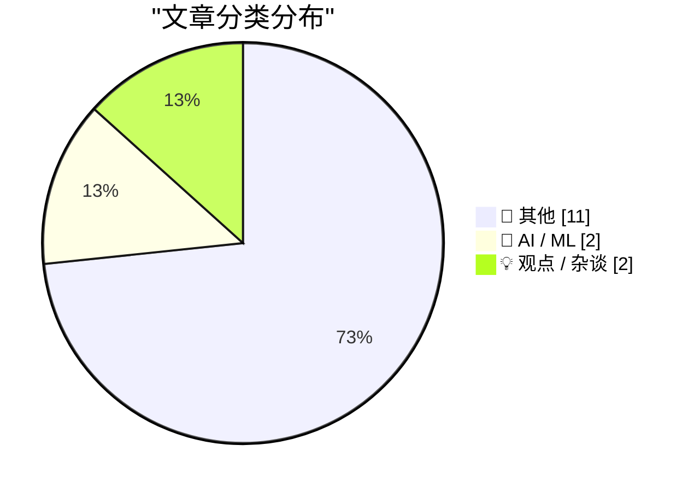
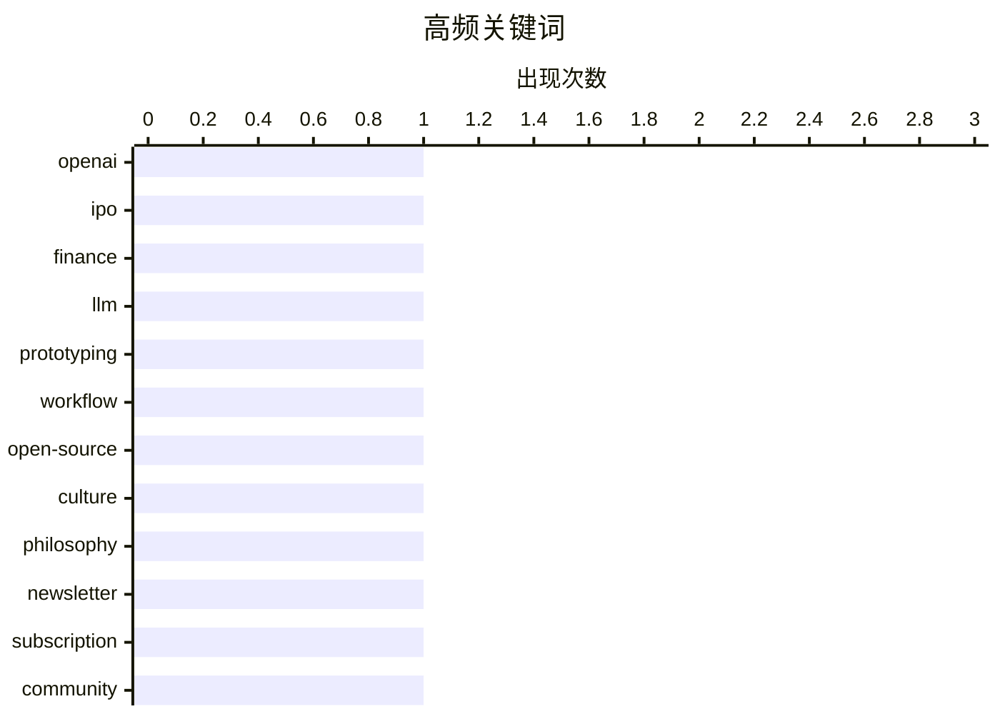

# 📰 AI 博客每日精选 — 2026-04-07

> 来自 Karpathy 推荐的 92 个顶级技术博客，AI 精选 Top 15

## 📝 今日看点

今日技术风向标指向 AI 商业理性回归与安全问责突破。OpenAI 暂缓 IPO 计划引发对 AI 营收可持续性的冷静审视，而 Google 推动端侧模型运行则标志着 AI 应用向实用化迈进。网络安全领域迎来重大进展，勒索软件团伙头目落网配合秘密扫描工具升级，彰显了追踪问责与防御能力的双重提升。开发者生态亦持续优化，从提示词清理到字体设计，工具链正变得更人性化且高效。

---

## 🏆 今日必读

🥇 **新闻：OpenAI CFO 认为公司尚未准备好 IPO，不确定收入能否支撑承诺**

[News: OpenAI CFO Doesn't Believe Company Ready For IPO, Unsure Revenue Will Support Commitments](https://www.wheresyoured.at/openai-cfo-news/) — wheresyoured.at · 10 小时前 · 🤖 AI / ML

> OpenAI 首席财务官 Sarah Friar 明确表示公司尚未准备好在 2026 年进行首次公开募股。主要顾虑在于巨大的支出承诺带来的风险，以及收入增长是否足以支撑这些投入。据 The Information 报道，管理层对财务可持续性持谨慎态度，认为需要更多时间验证商业模式。这一表态揭示了 AI 巨头在高速扩张背后的财务压力与不确定性。投资者需关注其营收增长能否匹配当前的烧钱速度。

💡 **为什么值得读**: 了解 OpenAI 高层对上市时间表和财务健康状况的真实内部评估。

🏷️ OpenAI, IPO, finance

🥈 **使用大语言模型进行原型设计**

[Prototyping with LLMs](https://blog.jim-nielsen.com/2026/prototyping-with-llm/) — blog.jim-nielsen.com · 6 小时前 · 🤖 AI / ML

> 文章借用《路加福音》中建造塔楼前先估算成本的比喻，探讨使用大语言模型进行原型开发的风险。作者强调在投入基础建设前，必须评估是否有足够资源完成项目，避免半途而废遭人嘲笑。这种思路适用于 LLM 应用开发，防止因低估复杂度而导致原型无法落地。核心观点是在利用 AI 加速开发时，仍需保持对项目可行性的清醒认知。开发者应优先验证成本与完成度，而非盲目开始编码。

💡 **为什么值得读**: 提供了一种结合人文隐喻的务实视角，帮助开发者规避 LLM 原型开发中的常见陷阱。

🏷️ LLM, prototyping, workflow

🥉 **大教堂与地下墓穴**

[The Cathedral and the Catacombs](https://nesbitt.io/2026/04/06/the-cathedral-and-the-catacombs.html) — nesbitt.io · 15 小时前 · 💡 观点 / 杂谈

> 文章通过延伸“大教堂与地下墓穴”的隐喻，探讨技术生态或社区结构的深层变化。作者试图将这一经典比喻深入到更基础的层面，分析表面架构与底层现实的关系。虽然具体技术细节未在摘要中展示，但核心在于反思现有系统的稳固性与隐蔽性。这种视角有助于理解开源社区或企业架构中的权力动态。文章可能涉及对中心化与去中心化结构的哲学思考。

💡 **为什么值得读**: 适合喜欢通过隐喻深度思考技术社会结构和文化演变的读者。

🏷️ open-source, culture, philosophy

---

## 📊 数据概览

| 扫描源 | 抓取文章 | 时间范围 | 精选 |
|:---:|:---:|:---:|:---:|
| 68/92 | 2138 篇 → 15 篇 | 24h | **15 篇** |

### 分类分布



### 高频关键词



<details>
<summary>📈 纯文本关键词图（终端友好）</summary>

```
openai      │ ████████████████████ 1
ipo         │ ████████████████████ 1
finance     │ ████████████████████ 1
llm         │ ████████████████████ 1
prototyping │ ████████████████████ 1
workflow    │ ████████████████████ 1
open-source │ ████████████████████ 1
culture     │ ████████████████████ 1
philosophy  │ ████████████████████ 1
newsletter  │ ████████████████████ 1
```

</details>

### 🏷️ 话题标签

**openai**(1) · **ipo**(1) · **finance**(1) · llm(1) · prototyping(1) · workflow(1) · open-source(1) · culture(1) · philosophy(1) · newsletter(1) · subscription(1) · community(1) · windows(1) · history(1) · os(1)

---

## 📝 其他

### 1. Google AI Edge Gallery 应用评测

[Google AI Edge Gallery](https://simonwillison.net/2026/Apr/6/google-ai-edge-gallery/#atom-everything) — **simonwillison.net** · 19 小时前 · ⭐ 15/30

> Google 推出了官方应用 AI Edge Gallery，支持在 iPhone 上直接运行 Gemma 4 模型（包括 E2B 和 E4B 版本及部分 Gemma 3 家族）。其中 E2B 模型下载大小为 2.54GB，运行速度快且具有实际实用性。该应用还提供图像问答和音频转录功能，展示了端侧 AI 的最新进展。体验表明本地运行大模型在移动设备上已具备可行性。这标志着 Google 在边缘 AI 部署上的重要一步。

---

### 2. datasette-ports 0.2 版本发布

[datasette-ports 0.2](https://simonwillison.net/2026/Apr/6/datasette-ports-2/#atom-everything) — **simonwillison.net** · 21 小时前 · ⭐ 15/30

> datasette-ports 工具发布了 0.2 版本，主要改进是不再强制依赖 Datasette 主程序。现在直接运行 `uvx datasette-ports` 命令即可使用，提升了独立使用的便利性。当然，作为 Datasette 插件安装仍保留 `datasette ports` 命令功能。这一变化降低了使用门槛，简化了端口管理流程。工具专注于简化本地开发环境的端口映射与访问。

---

### 3. scan-for-secrets 0.3 版本发布

[scan-for-secrets 0.3](https://simonwillison.net/2026/Apr/6/scan-for-secrets/#atom-everything) — **simonwillison.net** · 22 小时前 · ⭐ 15/30

> 安全扫描工具 scan-for-secrets 更新至 0.3 版本，新增了 `-r/--redact` 选项用于自动脱敏处理。该功能会显示匹配列表，请求确认后将所有匹配项替换为"REDACTED"，并考虑转义规则。同时新增了 Python 函数 `redact_file`，支持通过代码直接处理文件路径和秘密列表。这增强了工具在自动化工作流中的实用性和安全性。更新显著提升了敏感信息清理的效率。

---

### 4. 清理 Claude Code 粘贴内容的工具

[Cleanup Claude Code Paste](https://simonwillison.net/2026/Apr/6/cleanup-claude-code-paste/#atom-everything) — **simonwillison.net** · 22 小时前 · ⭐ 15/30

> 作者发布了一个小众工具，专门用于清理从 Claude Code 终端应用复制提示词时产生的多余空白字符。该工具能自动移除 ❯ 提示符，修复换行带来的空格问题，并将断行合并为完整代码。这解决了终端复制内容直接粘贴到编辑器时的格式混乱痛点。虽然功能单一，但显著提升了复制粘贴的工作流效率。工具通过网页形式提供，无需安装即可使用。

---

### 5. 德国揭露俄罗斯勒索软件团伙 REvil 和 GandCrab 头目"UNKN"身份

[Germany Doxes “UNKN,” Head of RU Ransomware Gangs REvil, GandCrab](https://krebsonsecurity.com/2026/04/germany-doxes-unkn-head-of-ru-ransomware-gangs-revil-gandcrab/) — **krebsonsecurity.com** · 23 小时前 · ⭐ 15/30

> 德国当局正式揭露了早期俄罗斯勒索软件团伙 GandCrab 和 REvil 的头目身份，其化名为"UNKN"。真实姓名为 31 岁的俄罗斯人 Daniil Maksimovich Shchukin，曾被指控在 2019 至 2021 年间实施至少 130 起计算机破坏和勒索行为。此次行动标志着对跨国网络犯罪团伙追责的重大进展。调查人员成功将匿名黑客与现实身份对应，打破了其隐匿状态。这一案例警示了网络犯罪头目最终面临法律制裁的风险。

---

### 6. [赞助] Zed 字体超级家族：为 21 世纪需求设计的无衬线字体

[[Sponsor] Zed, a Font Superfamily](https://www.typotheque.com/blog/zed-a-sans-for-the-needs-of-21century/?utm_source=df) — **daringfireball.net** · 5 小时前 · ⭐ 15/30

> Zed 是一款专为 21 世纪读者需求设计的字体系统，而非仅追求样本展示效果。在法国眼科医院的视觉障碍患者测试中，Zed Text 的阅读速度表现优于 Helvetica。该字体从头设计以执行不同功能，包含 Text 和 Display 两种光学版本及四个变量轴。数据证明其在可读性上的优势，特别是针对广泛读者群体。这代表了字体设计向功能性和包容性的重要转变。

---

### 7. Anthropic 意外泄露 Claude Code CLI 完整源代码

[Anthropic Accidentally Leaked the Entire Claude Code CLI Source Code](https://arstechnica.com/ai/2026/03/entire-claude-code-cli-source-code-leaks-thanks-to-exposed-map-file/) — **daringfireball.net** · 6 小时前 · ⭐ 15/30

> Anthropic 发布的 Claude Code npm 包 v2.1.88 版本因包含 source map 文件导致严重安全泄露。该漏洞暴露了几乎 2,000 个 TypeScript 文件及超过 512,000 行源代码，允许任何人还原完整工程结构。安全研究员 Chaofan Shou 首先在 X 平台公开了这一发现并分享了文件存档。包发布后很快被发现存在问题，显示出发布流程中的疏忽。此次事故揭示了构建流程中未剔除调试文件的风险，可能导致核心逻辑被逆向分析。

---

### 8. 小 Finder Guy 主演 TikTok 与 YouTube 九段新视频

[Little Finder Guy Stars in Nine New Videos on TikTok and YouTube](https://www.macrumors.com/2026/04/02/little-finder-guy-tiktok-youtube/) — **daringfireball.net** · 8 小时前 · ⭐ 15/30

> Apple 本周发布了九段以小 Finder Guy 为主角的宣传视频，分布在 TikTok 和 YouTube 平台。TikTok 主页上的视频缩略图拼接后可形成完整的小 Finder Guy 马赛克图案。这一营销活动旨在通过拟人化图标增强用户互动，甚至有望受邀参加 WWDC 期间的 The Talk Show 直播节目。视频内容结合了平台特性进行创意传播，吸引了大量用户关注。此类创意内容展示了 Apple 在社交媒体上尝试更轻松、趣味化的品牌传播策略。

---

### 9. AI 12 分钟生成代码，作者耗时 10 小时修复

[AI Did It in 12 Minutes. It Took Me 10 Hours to Fix It](https://idiallo.com/blog/it-took-me-10-hours-to-fix-ai-code?src=feed) — **idiallo.com** · 12 小时前 · ⭐ 15/30

> 作者对比了 AI 生成代码的效率与实际维护成本，发现 AI 仅需 12 分钟生成的代码却耗费了 10 小时修复。尽管自 2000 年代起就坚持理解每一行代码而非复制粘贴，但 AI 带来的快速产出诱发了新的技术债务。即使在 Stack Overflow 时代作者也反对直接复制代码，如今面对 AI 生成内容更需警惕。个人项目常因过度调整 AI 代码以符合特定需求而无法完工，凸显了理解代码所有权的重要性。这一经历表明，盲目信任 AI 生成内容可能大幅降低实际开发效率。

---

### 10. Pluralistic：老板欲利用监控数据削减工资 (2026 年 4 月 6 日)

[Pluralistic: Your boss wants to use surveillance data to cut your wages (06 Apr 2026)](https://pluralistic.net/2026/04/06/empiricism-washing/) — **pluralistic.net** · 16 小时前 · ⭐ 15/30

> 文章指出科技公司正试图利用员工监控数据作为降低工资的依据，强调技术权利即是劳动权利。这种实证主义清洗（empiricism washing）行为将监控数据转化为管理工具，威胁员工权益。文中关联了反垄断、消费者主义及新吉姆·克劳等社会议题，呼吁关注资本对数据的滥用。作者通过多个链接展示了数据滥用在不同领域的表现，包括巴拿马文件和中国反垄断案例。核心观点在于反对将端点资本主义阶段的监控数据用于剥削劳动者。

---

### 11. Windows 3.1 发布于 1992 年 4 月 6 日

[Windows 3.1 released April 6, 1992](https://dfarq.homeip.net/windows-3-1-released-april-6-1992/?utm_source=rss&#038;utm_medium=rss&#038;utm_campaign=windows-3-1-released-april-6-1992) — **dfarq.homeip.net** · 14 小时前 · ⭐ 12/30

> Windows 3.1 于 1992 年 4 月 6 日正式发布，作为 Windows 3.0 的继任者推动了图形用户界面的普及。虽然该系统本身并非完美，但它成功在廉价的普通 PC 上运行了 GUI 环境。这一里程碑事件标志着个人电脑操作体验的重大转变，为后续 Windows 版本奠定了基础。当时硬件成本较低，使得图形界面得以在普通 PC 上广泛部署。回顾这一历史节点有助于理解现代操作系统演进的关键转折点。

🏷️ Windows, history, OS

---

## 🤖 AI / ML

### 12. 新闻：OpenAI CFO 认为公司尚未准备好 IPO，不确定收入能否支撑承诺

[News: OpenAI CFO Doesn't Believe Company Ready For IPO, Unsure Revenue Will Support Commitments](https://www.wheresyoured.at/openai-cfo-news/) — **wheresyoured.at** · 10 小时前 · ⭐ 24/30

> OpenAI 首席财务官 Sarah Friar 明确表示公司尚未准备好在 2026 年进行首次公开募股。主要顾虑在于巨大的支出承诺带来的风险，以及收入增长是否足以支撑这些投入。据 The Information 报道，管理层对财务可持续性持谨慎态度，认为需要更多时间验证商业模式。这一表态揭示了 AI 巨头在高速扩张背后的财务压力与不确定性。投资者需关注其营收增长能否匹配当前的烧钱速度。

🏷️ OpenAI, IPO, finance

---

### 13. 使用大语言模型进行原型设计

[Prototyping with LLMs](https://blog.jim-nielsen.com/2026/prototyping-with-llm/) — **blog.jim-nielsen.com** · 6 小时前 · ⭐ 23/30

> 文章借用《路加福音》中建造塔楼前先估算成本的比喻，探讨使用大语言模型进行原型开发的风险。作者强调在投入基础建设前，必须评估是否有足够资源完成项目，避免半途而废遭人嘲笑。这种思路适用于 LLM 应用开发，防止因低估复杂度而导致原型无法落地。核心观点是在利用 AI 加速开发时，仍需保持对项目可行性的清醒认知。开发者应优先验证成本与完成度，而非盲目开始编码。

🏷️ LLM, prototyping, workflow

---

## 💡 观点 / 杂谈

### 14. 大教堂与地下墓穴

[The Cathedral and the Catacombs](https://nesbitt.io/2026/04/06/the-cathedral-and-the-catacombs.html) — **nesbitt.io** · 15 小时前 · ⭐ 20/30

> 文章通过延伸“大教堂与地下墓穴”的隐喻，探讨技术生态或社区结构的深层变化。作者试图将这一经典比喻深入到更基础的层面，分析表面架构与底层现实的关系。虽然具体技术细节未在摘要中展示，但核心在于反思现有系统的稳固性与隐蔽性。这种视角有助于理解开源社区或企业架构中的权力动态。文章可能涉及对中心化与去中心化结构的哲学思考。

🏷️ open-source, culture, philosophy

---

### 15. Hacker News 的陷阱

[The Hacker News tarpit](https://www.joanwestenberg.com/the-hacker-news-tarpit/) — **joanwestenberg.com** · 1 小时前 · ⭐ 16/30

> 作者探讨了独立新闻通讯在免费与付费订阅之间的平衡策略，提出了每月 2.50 美元的付费方案。付费用户可获得每月额外帖子、无赞助号召性用语、社区访问权及直接提问渠道。这种模式旨在维持内容免费可读的同时，为深度支持者提供增值体验。文章揭示了内容创作者在面对流量平台陷阱时的生存之道。核心观点是通过小额订阅建立可持续的直接读者关系。

🏷️ newsletter, subscription, community

---

*生成于 2026-04-07 01:11 | 扫描 68 源 → 获取 2138 篇 → 精选 15 篇*
*基于 [Hacker News Popularity Contest 2025](https://refactoringenglish.com/tools/hn-popularity/) RSS 源列表，由 [Andrej Karpathy](https://x.com/karpathy) 推荐*
*由「懂点儿AI」制作，欢迎关注同名微信公众号获取更多 AI 实用技巧 💡*
