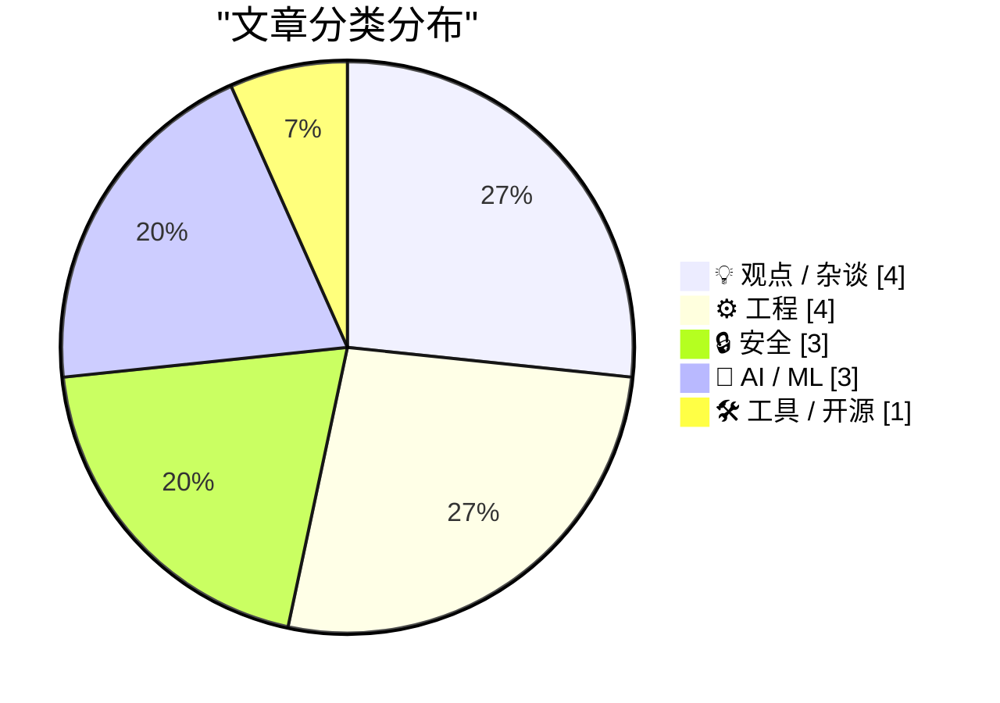
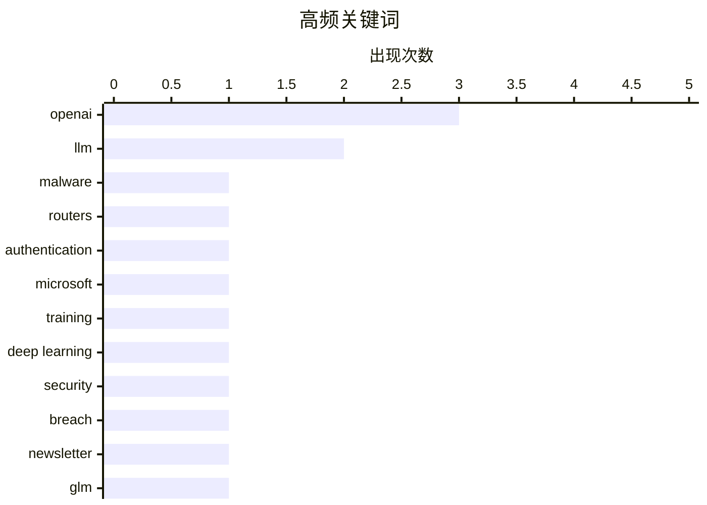

# 📰 AI 博客每日精选 — 2026-04-08

> 来自 Karpathy 推荐的 92 个顶级技术博客，AI 精选 Top 15

## 📝 今日看点

今日技术圈聚焦 AI 大模型的激进扩张与安全边界的激烈博弈。OpenAI 获巨额融资欲建超级应用，而 Anthropic 限制模型访问及学界对 AGI 影响的争议，凸显行业对安全落地的审慎态度。网络安全方面警报频传，俄罗斯黑客利用路由器漏洞窃取微软令牌及 WordPress 数据泄露事件，再次敲响基础设施与隐私保护的警钟。在巨头博弈与外部威胁并存之下，技术社区正重新审视发展的速度与底线。

---

## 🏆 今日必读

🥇 **俄罗斯黑客入侵路由器窃取 Microsoft Office 令牌**

[Russia Hacked Routers to Steal Microsoft Office Tokens](https://krebsonsecurity.com/2026/04/russia-hacked-routers-to-steal-microsoft-office-tokens/) — krebsonsecurity.com · 7 小时前 · 🔒 安全

> 俄罗斯军事情报单位利用旧款互联网路由器的已知漏洞，大规模窃取 Microsoft Office 用户的身份验证令牌。此次间谍活动无需部署任何恶意软件或代码，即可静默从超过 18,000 个网络中抽取令牌。安全专家警告称，这种无文件攻击手法隐蔽性极高，难以被传统防御手段察觉。攻击者主要通过利用路由器固件缺陷实现中间人攻击，从而截获认证流量。该事件凸显了基础设施固件更新滞后带来的严重安全隐患。

💡 **为什么值得读**: 揭示了针对基础设施而非终端的新型无文件攻击链路，对网络边界安全具有警示意义。

🏷️ malware, routers, authentication, Microsoft

🥈 **从头编写 LLM 第 32i 部分——干预：噪声中有什么？**

[Writing an LLM from scratch, part 32i -- Interventions: what is in the noise?](https://www.gilesthomas.com/2026/04/llm-from-scratch-32i-interventions-what-is-in-the-noise) — gilesthomas.com · 3 小时前 · 🤖 AI / ML

> 基于 Sebastian Raschka 的教材代码，作者在本地 RTX 3090 上从头训练了一个 1.63 亿参数的 GPT-2 风格模型。实验旨在探究模型训练过程中的干预措施及噪声对性能的具体影响。虽然最终模型表现尚可，但与原实现相比仍存在差距，引发了对训练细节的深入分析。文章通过具体代码实践揭示了从头构建大语言模型时的关键挑战与调优方向。系列文章持续记录了从零构建 LLM 的完整技术路径与心得。

💡 **为什么值得读**: 适合希望深入理解 LLM 底层训练机制及硬件实操细节的开发者参考。

🏷️ LLM, training, deep learning

🥉 **每周更新 498**

[Weekly Update 498](https://www.troyhunt.com/weekly-update-498/) — troyhunt.com · 22 小时前 · 🔒 安全

> 追讨逾期发票的实际困境与行业现状成为本周更新的核心议题。作者分享了一个客户案例，其发票逾期堆积超过 6 个月，尽管有明确的付款条款仍难以收回款项。内容揭示了自由职业者和技术顾问在商业运营中面临的现金流管理挑战。通过具体经历探讨了如何平衡客户关系与财务健康之间的矛盾。反思了技术服务提供商在非技术层面的运营痛点。

💡 **为什么值得读**: 提供了技术从业者常忽视的商业运营视角，对自由职业者处理财务纠纷具有现实参考价值。

🏷️ security, breach, newsletter

---

## 📊 数据概览

| 扫描源 | 抓取文章 | 时间范围 | 精选 |
|:---:|:---:|:---:|:---:|
| 69/92 | 2191 篇 → 18 篇 | 24h | **15 篇** |

### 分类分布



### 高频关键词



<details>
<summary>📈 纯文本关键词图（终端友好）</summary>

```
openai         │ ████████████████████ 3
llm            │ █████████████░░░░░░░ 2
malware        │ ███████░░░░░░░░░░░░░ 1
routers        │ ███████░░░░░░░░░░░░░ 1
authentication │ ███████░░░░░░░░░░░░░ 1
microsoft      │ ███████░░░░░░░░░░░░░ 1
training       │ ███████░░░░░░░░░░░░░ 1
deep learning  │ ███████░░░░░░░░░░░░░ 1
security       │ ███████░░░░░░░░░░░░░ 1
breach         │ ███████░░░░░░░░░░░░░ 1
```

</details>

### 🏷️ 话题标签

**openai**(3) · **llm**(2) · **malware**(1) · routers(1) · authentication(1) · microsoft(1) · training(1) · deep learning(1) · security(1) · breach(1) · newsletter(1) · glm(1) · open-source(1) · parameters(1) · anthropic(1) · claude(1) · ai safety(1) · access(1) · funding(1) · valuation(1)

---

## 💡 观点 / 杂谈

### 1. OpenAI 宣布额外 1220 亿美元“承诺资本”，并公布未来“超级应用”计划

[★ OpenAI Announces $122 Billion Additional ‘Committed Capital’, and Announces Their ‘Superapp’ Plan for the Future](https://daringfireball.net/2026/04/openai_future) — **daringfireball.net** · 2 小时前 · ⭐ 23/30

> OpenAI 宣布获得额外 1220 亿美元的承诺资本，并公布了构建未来“超级应用”的战略计划。作者质疑从当前状态到万亿估值之间的合理路径是否存在，认为缺乏清晰的商业落地逻辑。文章分析了巨额融资背后的市场预期与实际产品能力之间的潜在落差。尽管资本涌入显著，但如何实现可持续的盈利模式仍是未解之谜。内容提醒投资者关注 AI 巨头估值背后的实际业务支撑能力。

🏷️ OpenAI, funding, valuation, Superapp

---

### 2. Sam Altman 在 OpenAI 发布的视频中似乎认为 AGI 将像百年一遇的流行病一样冲击社会

[Sam Altman, in a Video Released by OpenAI, Apparently Thinks AGI Is Going to Hit Society Like a Once-a-Century Pandemic](https://x.com/OpenAINewsroom/status/2041618671236469200?s=20) — **daringfireball.net** · 1 小时前 · ⭐ 21/30

> Sam Altman 在 OpenAI 发布的视频中将 AGI 对社会的冲击比作百年一遇的流行病，引发了关于类比恰当性的争议。作者批评这种比较不仅未能安抚公众，反而增加了恐惧感，并质疑了 Altman 关于提前预测危机的说法。文章将该言论与政治人物事后宣称预测灾难的行为进行了对比，指出其缺乏说服力。核心观点在于质疑科技领袖在宣传 AGI 风险时的叙事策略与责任感。这种修辞手法可能削弱公众对 AI 安全讨论的信任基础。

🏷️ OpenAI, AGI, Sam Altman, pandemic

---

### 3. Pluralistic: Switzerland's Goldilocks fiber (07 Apr 2026)

[Pluralistic: Switzerland's Goldilocks fiber (07 Apr 2026)](https://pluralistic.net/2026/04/07/swisscom/) — **pluralistic.net** · 16 小时前 · ⭐ 21/30

> Today's links Switzerland's Goldilocks fiber: Public provision is a layered question. Hey look at this: Delights to delectate. Object permanence: EU appoints henhouse fox (copyright); Emacs x Tron: Le

🏷️ policy, infrastructure, copyright

---

### 4. Om Malik and Ben Thompson on OpenAI Buying TBPN

[Om Malik and Ben Thompson on OpenAI Buying TBPN](https://om.co/2026/04/02/openai-masters-of-agitprop-2-0/) — **daringfireball.net** · 7 小时前 · ⭐ 18/30

> Om Malik:


  
  “A newspaper is not only a collective propagandist and a
collective agitator, it is also a collective organiser.” — Vladimir Lenin


In 1902, Lenin argued that his revolution needed a

🏷️ OpenAI, acquisition, media, journalism

---

## ⚙️ 工程

### 5. 谁构建了这个？

[Who Built This?](https://nesbitt.io/2026/04/07/who-built-this.html) — **nesbitt.io** · 14 小时前 · ⭐ 23/30

> 该技术方法追踪软件依赖项回到其源代码提交记录，实现精准溯源。通过具体工具链分析，开发者可以精确定位特定功能或漏洞是由哪个提交引入的。这种溯源能力对于维护大型项目和理解代码演进历史至关重要。方案解决了在复杂依赖树中难以定位原始作者的问题。工具链支持自动化查询，大幅提升了代码审计的效率。

🏷️ dependencies, supply chain, debugging

---

### 6. 共享卷的 Docker 容器间 SQLite WAL 模式

[SQLite WAL Mode Across Docker Containers Sharing a Volume](https://simonwillison.net/2026/Apr/7/sqlite-wal-docker-containers/#atom-everything) — **simonwillison.net** · 8 小时前 · ⭐ 21/30

> 研究探讨了共享同一卷的两个独立 Docker 容器中的 SQLite 进程是否会因 WAL 共享内存而产生冲突。实验结论表明，在 Docker 容器环境下共享卷使用 SQLite WAL 模式一切正常，不会出现预期中的锁定问题。该发现澄清了 Hacker News 上关于此技术场景的疑虑，验证了容器化部署数据库的可行性。方案适用于需要在多容器间安全共享 SQLite 数据库的架构设计。测试结果消除了开发者对跨容器文件锁机制的顾虑。

🏷️ SQLite, Docker, WAL, database

---

### 7. Were there any Windows 3.1 programs that were so incompatible with Windows 95 that there was no point trying to patch them?

[Were there any Windows 3.1 programs that were so incompatible with Windows 95 that there was no point trying to patch them?](https://devblogs.microsoft.com/oldnewthing/20260407-00/?p=112213) — **devblogs.microsoft.com/oldnewthing** · 10 小时前 · ⭐ 20/30

> The permanently ineligible list.
The post Were there any Windows 3.1 programs that were so incompatible with Windows 95 that there was no point trying to patch them? appeared first on The Old New Thin

🏷️ Windows, compatibility, legacy

---

### 8. Toffoli gates are all you need

[Toffoli gates are all you need](https://www.johndcook.com/blog/2026/04/06/tofolli-gates/) — **johndcook.com** · 23 小时前 · ⭐ 18/30

> Landauer’s principle gives a lower bound on the amount of energy it takes to erase one bit of information: E ≥ log(2) kB T where kB is the Boltzmann constant and T is the ambient temperature in Kelvin

🏷️ physics, computing, theory

---

## 🔒 安全

### 9. 俄罗斯黑客入侵路由器窃取 Microsoft Office 令牌

[Russia Hacked Routers to Steal Microsoft Office Tokens](https://krebsonsecurity.com/2026/04/russia-hacked-routers-to-steal-microsoft-office-tokens/) — **krebsonsecurity.com** · 7 小时前 · ⭐ 27/30

> 俄罗斯军事情报单位利用旧款互联网路由器的已知漏洞，大规模窃取 Microsoft Office 用户的身份验证令牌。此次间谍活动无需部署任何恶意软件或代码，即可静默从超过 18,000 个网络中抽取令牌。安全专家警告称，这种无文件攻击手法隐蔽性极高，难以被传统防御手段察觉。攻击者主要通过利用路由器固件缺陷实现中间人攻击，从而截获认证流量。该事件凸显了基础设施固件更新滞后带来的严重安全隐患。

🏷️ malware, routers, authentication, Microsoft

---

### 10. 每周更新 498

[Weekly Update 498](https://www.troyhunt.com/weekly-update-498/) — **troyhunt.com** · 22 小时前 · ⭐ 26/30

> 追讨逾期发票的实际困境与行业现状成为本周更新的核心议题。作者分享了一个客户案例，其发票逾期堆积超过 6 个月，尽管有明确的付款条款仍难以收回款项。内容揭示了自由职业者和技术顾问在商业运营中面临的现金流管理挑战。通过具体经历探讨了如何平衡客户关系与财务健康之间的矛盾。反思了技术服务提供商在非技术层面的运营痛点。

🏷️ security, breach, newsletter

---

### 11. WordPress VIP 泄露了我的电话号码吗？

[Did WordPress VIP leak my phone number?](https://shkspr.mobi/blog/2026/04/did-wordpress-vip-leak-my-phone-number/) — **shkspr.mobi** · 12 小时前 · ⭐ 22/30

> 作者发现数据经纪商 Apollo.io 持有其个人电话号码，源头指向 Parsely, Inc (wpvip.com)。WordPress VIP 作为客户贡献网络的一部分，被指共享了包含作者电话在内的个人详细信息。文章质疑了数据共享协议中的隐私保护机制及合规性。调查揭示了内容平台与合作伙伴之间数据流转可能带来的隐私泄露风险。用户需警惕此类隐蔽的数据共享链条对个人隐私的侵蚀。

🏷️ privacy, WordPress, data leak

---

## 🤖 AI / ML

### 12. 从头编写 LLM 第 32i 部分——干预：噪声中有什么？

[Writing an LLM from scratch, part 32i -- Interventions: what is in the noise?](https://www.gilesthomas.com/2026/04/llm-from-scratch-32i-interventions-what-is-in-the-noise) — **gilesthomas.com** · 3 小时前 · ⭐ 26/30

> 基于 Sebastian Raschka 的教材代码，作者在本地 RTX 3090 上从头训练了一个 1.63 亿参数的 GPT-2 风格模型。实验旨在探究模型训练过程中的干预措施及噪声对性能的具体影响。虽然最终模型表现尚可，但与原实现相比仍存在差距，引发了对训练细节的深入分析。文章通过具体代码实践揭示了从头构建大语言模型时的关键挑战与调优方向。系列文章持续记录了从零构建 LLM 的完整技术路径与心得。

🏷️ LLM, training, deep learning

---

### 13. GLM-5.1：面向长周期任务

[GLM-5.1: Towards Long-Horizon Tasks](https://simonwillison.net/2026/Apr/7/glm-51/#atom-everything) — **simonwillison.net** · 2 小时前 · ⭐ 24/30

> 中国 AI 实验室 Z.ai 发布了最新模型 GLM-5.1，参数量高达 7540 亿，模型文件大小为 1.51TB。该模型采用 MIT 许可证开源，规模与此前发布的 GLM-5 保持一致，并共享同一篇技术论文。模型已通过 OpenRouter 提供服务，旨在优化长周期任务的处理能力。作者测试了该模型在绘图及复杂指令遵循方面的表现，验证了其大规模参数下的实际效能。这是目前开源社区中可获取的最大规模模型之一，显著降低了长任务研究的门槛。

🏷️ LLM, GLM, open-source, parameters

---

### 14. Anthropic 的 Glasswing 项目——将 Claude Mythos 限制给安全研究人员——我认为这很有必要

[Anthropic's Project Glasswing - restricting Claude Mythos to security researchers - sounds necessary to me](https://simonwillison.net/2026/Apr/7/project-glasswing/#atom-everything) — **simonwillison.net** · 3 小时前 · ⭐ 24/30

> Anthropic 未公开发布最新模型 Claude Mythos，而是通过新宣布的 Project Glasswing 仅提供给受限的预览合作伙伴。该模型定位为通用模型，性能类似 Claude Opus 4.6，但特别强化了网络安全研究能力。公司声称限制访问是为了防止模型被滥用于恶意攻击，仅允许受信任的安全研究人员使用。这种分级发布策略反映了 AI 厂商在能力开放与安全风险之间的权衡考量。此举可能成为未来高风险 AI 模型发布的标准合规流程。

🏷️ Anthropic, Claude, AI safety, access

---

## 🛠 工具 / 开源

### 15. The Data Drop: Every iPhone

[The Data Drop: Every iPhone](https://sheets.works/data-viz/every-iphone) — **daringfireball.net** · 7 小时前 · ⭐ 18/30

> Just lovely data visualization work from Sheets.works — a consulting firm that specializes in, I swear, Google Sheets.


 ★

🏷️ iPhone, data, visualization, Apple

---

*生成于 2026-04-08 00:13 | 扫描 69 源 → 获取 2191 篇 → 精选 15 篇*
*基于 [Hacker News Popularity Contest 2025](https://refactoringenglish.com/tools/hn-popularity/) RSS 源列表，由 [Andrej Karpathy](https://x.com/karpathy) 推荐*
*由「懂点儿AI」制作，欢迎关注同名微信公众号获取更多 AI 实用技巧 💡*
