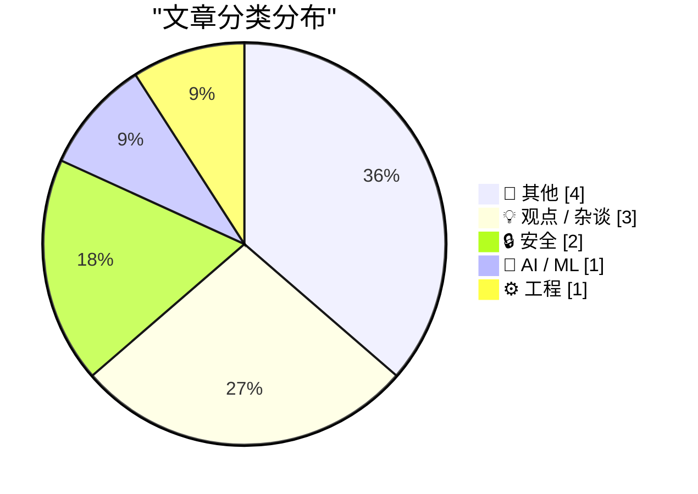
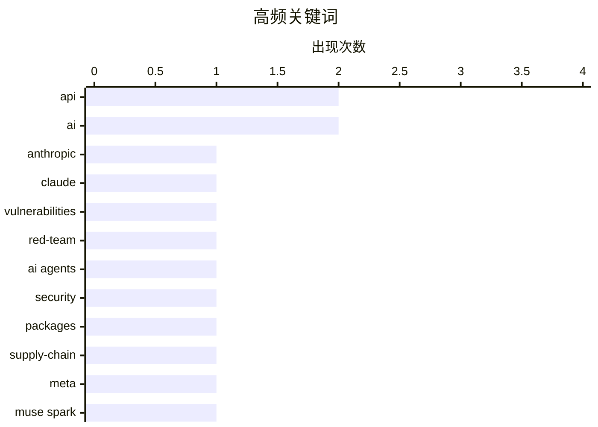

# 📰 AI 博客每日精选 — 2026-04-09

> 来自 Karpathy 推荐的 92 个顶级技术博客，AI 精选 Top 11

## 📝 今日看点

今日技术圈核心聚焦于 AI 安全与能力边界的激烈博弈，Anthropic 因模型漏洞挖掘能力过强而暂缓发布，同时 AI 智能体的供应链安全隐患引发深层警惕。大厂模型迭代仍在继续，Meta 推出新模型 Muse Spark，但业界同步反思 AI 发展的异常现象及其对职业边界的双重标准。与此同时，从底层系统编程难题到管理文化与社区趣闻，传统工程深度与多元生态依然是技术圈不可或缺的基石。

---

## 🏆 今日必读

🥇 **Anthropic 新款 Claude Mythos 漏洞挖掘能力过强，暂不向公众发布**

[Anthropic’s New Claude Mythos Is So Good at Finding and Exploiting Vulnerabilities That They’re Not Releasing It to the Public](https://red.anthropic.com/2026/mythos-preview/) — daringfireball.net · 8 小时前 · 🔒 安全

> Anthropic 发布了新模型 Claude Mythos Preview，其在通用任务表现强劲的同时，具备惊人的计算机安全漏洞挖掘与利用能力。鉴于该模型可能被恶意用于网络攻击，Anthropic 决定不向公众开放，转而启动 Project Glasswing 计划。该项目旨在利用 Mythos Preview 协助保护全球关键软件安全，并推动行业采用新的防御实践以应对未来网络攻击者。这种限制发布策略反映了厂商对高风险 AI 能力扩散的谨慎态度。作者强调这是为了在攻击者之前建立防御优势，而非单纯的技术展示。

💡 **为什么值得读**: 了解顶级 AI 模型在安全领域的双刃剑效应及厂商的应对策略。

🏷️ Anthropic, Claude, vulnerabilities, red-team

🥈 **AI 智能体的包依赖安全隐患**

[Package Security Problems for AI Agents](https://nesbitt.io/2026/04/08/package-security-problems-for-ai-agents.html) — nesbitt.io · 14 小时前 · 🔒 安全

> 文章探讨了 AI 智能体在广泛使用软件包构建时面临的深层安全隐患。随着智能体架构向上延伸，底层的包依赖链成为潜在的攻击面，可能导致供应链攻击。文中分析了当前包管理机制在 AI 代理环境中的不足，以及由此引发的信任边界问题。作者指出需要重新审视智能体执行环境中的包验证与隔离机制。结论强调在智能体普及前必须解决底层包安全否则风险将随自动化放大。

💡 **为什么值得读**: 揭示 AI 智能体自动化执行背后容易被忽视的供应链安全风险。

🏷️ AI agents, security, packages, supply-chain

🥉 **Meta 发布新模型 Muse Spark 及 meta.ai 聊天工具更新**

[Meta's new model is Muse Spark, and meta.ai chat has some interesting tools](https://simonwillison.net/2026/Apr/8/muse-spark/#atom-everything) — simonwillison.net · 1 小时前 · 🤖 AI / ML

> Meta 正式发布了新模型 Muse Spark，这是继 Llama 4 发布几乎整整一年后的首次模型更新。该模型采用托管模式而非开放权重，API 目前仅向精选用户开放私有预览，但可通过 meta.ai 网站体验。Meta 自报基准测试显示其性能具有竞争力，且 meta.ai 聊天界面集成了一些有趣的新工具。使用需 Facebook 或 Instagram 账号登录，标志着 Meta 在闭源托管模型服务上的进一步布局。作者认为这是 Meta 在开放与闭源策略间的新平衡尝试。

💡 **为什么值得读**: 获取 Meta 最新模型策略及闭源托管服务的一手体验信息。

🏷️ Meta, Muse Spark, LLM, API

---

## 📊 数据概览

| 扫描源 | 抓取文章 | 时间范围 | 精选 |
|:---:|:---:|:---:|:---:|
| 76/92 | 2171 篇 → 11 篇 | 24h | **11 篇** |

### 分类分布



### 高频关键词



<details>
<summary>📈 纯文本关键词图（终端友好）</summary>

```
api             │ ████████████████████ 2
ai              │ ████████████████████ 2
anthropic       │ ██████████░░░░░░░░░░ 1
claude          │ ██████████░░░░░░░░░░ 1
vulnerabilities │ ██████████░░░░░░░░░░ 1
red-team        │ ██████████░░░░░░░░░░ 1
ai agents       │ ██████████░░░░░░░░░░ 1
security        │ ██████████░░░░░░░░░░ 1
packages        │ ██████████░░░░░░░░░░ 1
supply-chain    │ ██████████░░░░░░░░░░ 1
```

</details>

### 🏷️ 话题标签

**api**(2) · **ai**(2) · **anthropic**(1) · claude(1) · vulnerabilities(1) · red-team(1) · ai agents(1) · security(1) · packages(1) · supply-chain(1) · meta(1) · muse spark(1) · llm(1) · industry(1) · analysis(1) · commentary(1) · windows(1) · programming(1) · debugging(1) · cory doctorow(1)

---

## 📝 其他

### 1. 三体与四体问题：Artemis I 与 II 的轨道差异

[A Three- and a Four- Body Problem](https://www.johndcook.com/blog/2026/04/08/artemis-1-apollo-12/) — **johndcook.com** · 39 分钟前 · ⭐ 19/30

> 文章对比了 Artemis I 与 Artemis II 任务的轨道设计差异，前者无人耗时 25 天，后者载人仅 10 天。Artemis I 采用了非常规路径，花费更多时间在轨道上以测试系统，涉及复杂的三体与四体引力问题。作者分析了无人任务如何利用时间优势进行更深入的轨道力学验证。文中解释了多体问题在深空探测轨道计算中的具体挑战。结论指出 Artemis I 的复杂轨道为后续载人任务奠定了安全基础。

🏷️ Artemis, orbit, physics, mathematics

---

### 2. 猪肉与木偶：虚假 GIMP 预告片背后的故事

[Pork & Puppetry](https://feed.tedium.co/link/15204/17315642/pork-johnson-gimp-parody-interview) — **tedium.co** · 20 小时前 · ⭐ 17/30

> 文章采访了近期在 FOSS 圈子半病毒式传播的虚假 GIMP 预告片背后的创作者。幕后操纵者 Pork Johnson 解释了创作灵感来源及木偶戏制作过程。文中探讨了开源社区对幽默内容的反应以及虚假宣传在技术社区的传播机制。作者揭示了这一恶搞项目如何引发社区对软件更新预期的讨论。结论认为这种创意表达增强了社区活力而非造成误导。

🏷️ GIMP, FOSS, viral, community

---

### 3. Atari ST 于 1985 年 4 月 8 日发布

[Atari ST introduced April 8, 1985](https://dfarq.homeip.net/atari-st-introduced-april-8-1985/?utm_source=rss&#038;utm_medium=rss&#038;utm_campaign=atari-st-introduced-april-8-1985) — **dfarq.homeip.net** · 13 小时前 · ⭐ 14/30

> 文章回顾了 Atari ST 计算机于 1985 年 4 月 8 日发布的历史节点，该机型迅速售出 50,000 台。作者虽曾是早期 90 年代的 Amiga 忠实粉丝，难以完全客观，但仍承认其市场表现。文中描述了当时个人计算机市场竞争格局及 Atari ST 的技术定位。作者分析了该机型在音乐制作与图形处理领域的早期影响力。结论指出 Atari ST 是个人计算历史中不可忽视的重要里程碑。

🏷️ Atari, history, hardware, retro

---

### 4. Theatre Review: Avenue Q ★★★★★

[Theatre Review: Avenue Q ★★★★★](https://shkspr.mobi/blog/2026/04/theatre-review-avenue-q/) — **shkspr.mobi** · 12 小时前 · ⭐ 11/30

> I'll admit, I was a little sceptical about returning to Avenue Q. I saw it on its original West End run back in… OH MY GOD I AM SO OLD! FUCK! Where did the time go?  It's always hard to know how much 

🏷️ theatre, review, entertainment, culture

---

## 💡 观点 / 杂谈

### 5. AI 真的很奇怪

[AI Is Really Weird](https://www.wheresyoured.at/ai-is-really-weird/) — **wheresyoured.at** · 8 小时前 · ⭐ 23/30

> 文章以独立报道视角深入分析了当前 AI 技术发展中的异常现象与矛盾点。作者通过具体案例揭示了模型行为、商业宣传与实际能力之间的巨大落差。文中强调了订阅付费通讯以获得每周 5,000 至 18,000 字的深度分析内容。作者指出独立视角对于理解 AI 真实现状至关重要，避免被主流叙事误导。结论呼吁读者支持独立报道以获取更客观的行业洞察。

🏷️ AI, industry, analysis, commentary

---

### 6. Pluralistic：过程知识与老板 (2026 年 4 月 8 日)

[Pluralistic: Process knowledge (08 Apr 2026)](https://pluralistic.net/2026/04/08/process-knowledge-vs-bosses/) — **pluralistic.net** · 10 小时前 · ⭐ 21/30

> 文章探讨了过程知识（Process Knowledge）与管理层权力之间的张力，强调一线操作者对系统实际运行的理解价值。作者联系了广告技术的算法残酷性及对象永久性等概念，批判了脱离实际的管理决策。文中列举了多个近期与即将到来的演讲地点，包括多伦多、伦敦及柏林等。作者坚持独立写作与出版，反对知识垄断与官僚化管理。结论认为尊重过程知识是构建健康技术生态的关键。

🏷️ Cory Doctorow, ad-tech, policy, privacy

---

### 7. 引用 Giles Turnbull：AI 与职业边界

[Quoting Giles Turnbull](https://simonwillison.net/2026/Apr/8/giles-turnbull/#atom-everything) — **simonwillison.net** · 8 小时前 · ⭐ 18/30

> 文章引用了 Giles Turnbull 关于 AI 工具与职业边界的核心观点，揭示了人们对 AI 介入工作的双重标准。人们热衷于使用 AI 尝试他人的职业工作，却反感他人用 AI 替代自己的专业岗位。这一现象反映了 AI 伦理中关于劳动价值与专业壁垒的深层矛盾。作者通过标签强调这属于 AI 伦理讨论范畴，而非单纯的技术效率问题。结论指出这种心理偏差将影响 AI 在各行业的落地阻力与社会接受度。

🏷️ AI, society, profession, ethics

---

## 🔒 安全

### 8. Anthropic 新款 Claude Mythos 漏洞挖掘能力过强，暂不向公众发布

[Anthropic’s New Claude Mythos Is So Good at Finding and Exploiting Vulnerabilities That They’re Not Releasing It to the Public](https://red.anthropic.com/2026/mythos-preview/) — **daringfireball.net** · 8 小时前 · ⭐ 25/30

> Anthropic 发布了新模型 Claude Mythos Preview，其在通用任务表现强劲的同时，具备惊人的计算机安全漏洞挖掘与利用能力。鉴于该模型可能被恶意用于网络攻击，Anthropic 决定不向公众开放，转而启动 Project Glasswing 计划。该项目旨在利用 Mythos Preview 协助保护全球关键软件安全，并推动行业采用新的防御实践以应对未来网络攻击者。这种限制发布策略反映了厂商对高风险 AI 能力扩散的谨慎态度。作者强调这是为了在攻击者之前建立防御优势，而非单纯的技术展示。

🏷️ Anthropic, Claude, vulnerabilities, red-team

---

### 9. AI 智能体的包依赖安全隐患

[Package Security Problems for AI Agents](https://nesbitt.io/2026/04/08/package-security-problems-for-ai-agents.html) — **nesbitt.io** · 14 小时前 · ⭐ 25/30

> 文章探讨了 AI 智能体在广泛使用软件包构建时面临的深层安全隐患。随着智能体架构向上延伸，底层的包依赖链成为潜在的攻击面，可能导致供应链攻击。文中分析了当前包管理机制在 AI 代理环境中的不足，以及由此引发的信任边界问题。作者指出需要重新审视智能体执行环境中的包验证与隔离机制。结论强调在智能体普及前必须解决底层包安全否则风险将随自动化放大。

🏷️ AI agents, security, packages, supply-chain

---

## 🤖 AI / ML

### 10. Meta 发布新模型 Muse Spark 及 meta.ai 聊天工具更新

[Meta's new model is Muse Spark, and meta.ai chat has some interesting tools](https://simonwillison.net/2026/Apr/8/muse-spark/#atom-everything) — **simonwillison.net** · 1 小时前 · ⭐ 24/30

> Meta 正式发布了新模型 Muse Spark，这是继 Llama 4 发布几乎整整一年后的首次模型更新。该模型采用托管模式而非开放权重，API 目前仅向精选用户开放私有预览，但可通过 meta.ai 网站体验。Meta 自报基准测试显示其性能具有竞争力，且 meta.ai 聊天界面集成了一些有趣的新工具。使用需 Facebook 或 Instagram 账号登录，标志着 Meta 在闭源托管模型服务上的进一步布局。作者认为这是 Meta 在开放与闭源策略间的新平衡尝试。

🏷️ Meta, Muse Spark, LLM, API

---

## ⚙️ 工程

### 11. 如何在活跃的 MsgWaitForMultipleObjects 中添加或移除句柄

[How do you add or remove a handle from an active Msg­Wait­For­Multiple­Objects?](https://devblogs.microsoft.com/oldnewthing/20260408-00/?p=112218) — **devblogs.microsoft.com/oldnewthing** · 10 小时前 · ⭐ 22/30

> 文章解答了如何在活跃的 MsgWaitForMultipleObjects 等待过程中动态修改监听句柄的技术难题。核心结论是无法直接修改，但可以通过安排等待者自身触发回调来完成句柄的增删操作。文中提供了具体的 Windows API 实现模式，避免了直接操作导致的未定义行为。作者解释了这种设计背后的系统内核限制及消息循环机制。最终方案确保了多线程环境下的句柄管理安全且符合系统规范。

🏷️ Windows, API, programming, debugging

---

*生成于 2026-04-09 00:09 | 扫描 76 源 → 获取 2171 篇 → 精选 11 篇*
*基于 [Hacker News Popularity Contest 2025](https://refactoringenglish.com/tools/hn-popularity/) RSS 源列表，由 [Andrej Karpathy](https://x.com/karpathy) 推荐*
*由「懂点儿AI」制作，欢迎关注同名微信公众号获取更多 AI 实用技巧 💡*
