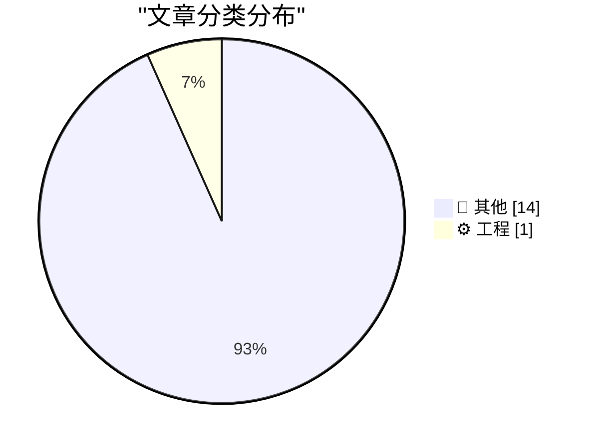
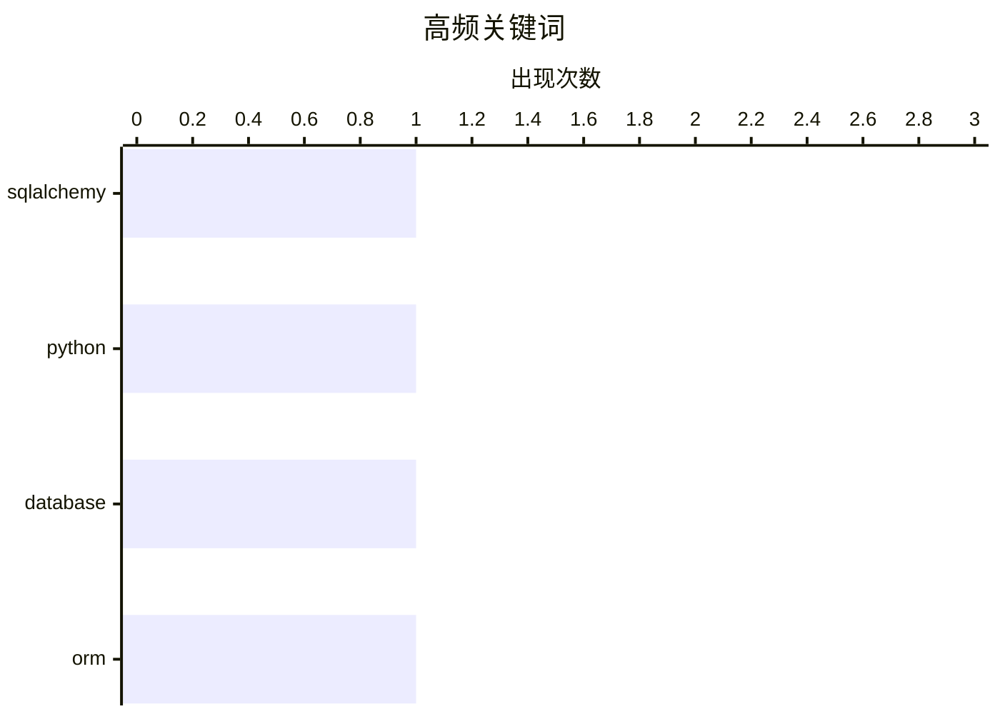

# 📰 AI 博客每日精选 — 2026-04-10

> 来自 Karpathy 推荐的 92 个顶级技术博客，AI 精选 Top 15

## 📝 今日看点

今日技术圈三大热点直指系统稳定性、隐私伦理与开发效能。从 MacOS 内核溢出崩溃到 Windows 句柄限制，底层基础设施的稳定性挑战再次浮现。Adobe 篡改 hosts 文件等行为，则让软件厂商的隐私边界争议再度升温。与此同时，后端开发工具链与框架的持续演进，也反映了开发者对效能优化的不懈追求。

---

## 🏆 今日必读

🥇 **SQLAlchemy 2 实战 - 第 4 章 - 多对多关系**

[SQLAlchemy 2 In Practice - Chapter 4 - Many-To-Many Relationships](https://blog.miguelgrinberg.com/post/sqlalchemy-2-in-practice---chapter-4---many-to-many-relationships) — miguelgrinberg.com · 9 小时前 · ⚙️ 工程

> 本章聚焦 SQLAlchemy 2 中的多对多关系类型及其实现方式。作为《SQLAlchemy 2 实战》书籍的第四章，内容深入探讨了关联表配置与关系加载策略。作者提供了具体的代码示例来展示如何定义和维护多对多映射。读者将通过本章掌握处理复杂数据模型关联的核心技能。建议购买书籍以支持作者并获得完整内容。

💡 **为什么值得读**: 适合正在学习 SQLAlchemy 2 ORM 映射机制的开发者深入理解多对多关系配置。

🏷️ SQLAlchemy, Python, Database, ORM

🥈 **GitHub 仓库大小查询工具**

[GitHub Repo Size](https://simonwillison.net/2026/Apr/9/github-repo-size/#atom-everything) — simonwillison.net · 2 小时前 · 📝 其他

> GitHub 用户界面不直接显示仓库大小，但可通过 CORS 友好的 API 获取。Simon Willison 开发了一个工具，只需粘贴仓库地址即可查看具体大小，例如 simonw/datasette 显示为 8.1MB。该工具利用公开 API 数据解决了 UI 信息缺失的问题。开发者可借此快速评估克隆或下载仓库所需的空间成本。这是一个基于 Web 的轻量级查询解决方案。

💡 **为什么值得读**: 提供了一个简单实用的工具来弥补 GitHub UI 缺失的关键仓库元数据。

🥉 **asgi-gzip 0.3 版本发布**

[asgi-gzip 0.3](https://simonwillison.net/2026/Apr/9/asgi-gzip/#atom-everything) — simonwillison.net · 20 小时前 · 📝 其他

> 作者在部署使用 SSE（Server-sent events）的新功能到 Datasette 生产实例时遇到了问题。问题根源在于 datasette-gzip 依赖的 asgi-gzip 库错误地压缩了流式响应。asgi-gzip 0.3 版本修复了这一导致生产环境故障的压缩逻辑错误。此次更新确保了 ASGI 应用在启用 gzip 中间件时的兼容性。修复前错误的压缩会导致流式传输中断。

💡 **为什么值得读**: 对于使用 Datasette 或 ASGI 中间件处理流式响应的开发者具有重要的避坑参考价值。

---

## 📊 数据概览

| 扫描源 | 抓取文章 | 时间范围 | 精选 |
|:---:|:---:|:---:|:---:|
| 78/92 | 2341 篇 → 21 篇 | 24h | **15 篇** |

### 分类分布



### 高频关键词



<details>
<summary>📈 纯文本关键词图（终端友好）</summary>

```
sqlalchemy │ ████████████████████ 1
python     │ ████████████████████ 1
database   │ ████████████████████ 1
orm        │ ████████████████████ 1
```

</details>

### 🏷️ 话题标签

**sqlalchemy**(1) · **python**(1) · **database**(1) · orm(1)

---

## 📝 其他

### 1. GitHub 仓库大小查询工具

[GitHub Repo Size](https://simonwillison.net/2026/Apr/9/github-repo-size/#atom-everything) — **simonwillison.net** · 2 小时前 · ⭐ 15/30

> GitHub 用户界面不直接显示仓库大小，但可通过 CORS 友好的 API 获取。Simon Willison 开发了一个工具，只需粘贴仓库地址即可查看具体大小，例如 simonw/datasette 显示为 8.1MB。该工具利用公开 API 数据解决了 UI 信息缺失的问题。开发者可借此快速评估克隆或下载仓库所需的空间成本。这是一个基于 Web 的轻量级查询解决方案。

---

### 2. asgi-gzip 0.3 版本发布

[asgi-gzip 0.3](https://simonwillison.net/2026/Apr/9/asgi-gzip/#atom-everything) — **simonwillison.net** · 20 小时前 · ⭐ 15/30

> 作者在部署使用 SSE（Server-sent events）的新功能到 Datasette 生产实例时遇到了问题。问题根源在于 datasette-gzip 依赖的 asgi-gzip 库错误地压缩了流式响应。asgi-gzip 0.3 版本修复了这一导致生产环境故障的压缩逻辑错误。此次更新确保了 ASGI 应用在启用 gzip 中间件时的兼容性。修复前错误的压缩会导致流式传输中断。

---

### 3. MacOS 似乎在运行 49 天后崩溃——或许是 Tahoe 独有的“特性”

[MacOS Seemingly Crashes After 49 Days of Uptime — a ‘Feature’ Perhaps Exclusive to Tahoe](https://sixcolors.com/link/2026/04/macs-crash-after-49-days-of-uptime/) — **daringfireball.net** · 1 小时前 · ⭐ 15/30

> 开发者 Photon 发现 Mac 在连续运行 49 天 17 小时 2 分 47 秒后会出现系统冻结。原因是 Apple XNU 内核中的 32 位无符号整数溢出导致内部 TCP 时间戳时钟停止。此时 ICMP（ping）仍正常工作，但其他所有网络功能失效，唯一修复方法是重启。这是一个隐藏的系统 expiration date bug，影响所有 Mac 设备。该问题似乎在 MacOS Tahoe 版本上表现尤为明显。

---

### 4. Adobe 篡改你的 /etc/hosts 文件

[Adobe Diddles With Your /etc/hosts File](https://old.reddit.com/r/webdev/comments/1sb6hzk/adobe_wrote_to_my_hosts_file_ive_never_had_an_app/oe1ap9h/) — **daringfireball.net** · 3 小时前 · ⭐ 15/30

> Adobe 通过 JavaScript 加载特定图片来检测用户是否安装了 Creative Cloud。如果用户 hosts 文件中存在特定 DNS 条目，浏览器会连接服务器，否则加载失败，以此判断安装状态。检测请求指向 detect-ccd.creativecloud.adobe.com/cc.png 这一特定资源。这种机制曾被用于简单的本地检测，现在被用于网站访客分析。该行为引发了关于应用程序未经同意修改系统配置文件的隐私争议。

---

### 5. 本周谄媚者：Todd Blanche

[Lickspittle of the Week: Todd Blanche](https://politicalwire.com/2026/04/09/extra-bonus-quote-of-the-day-1022/) — **daringfireball.net** · 6 小时前 · ⭐ 15/30

> 代理司法部长 Todd Blanche 公开表达了对美国总统特朗普的极度忠诚。他表示为特朗普工作是此生最大荣誉，即便被提名其他职位也会表达爱意。评论者讽刺这种措辞类似于“谢谢先生，再来一次”。这段言论展示了当前政治环境下官员对总统的非正常效忠态度。内容源自 Political Wire 引用的每日额外 bonus quote。

---

### 6. 你到底想说什么？

[What Are You Trying to Say?](https://idiallo.com/blog/what-are-you-trying-to-say?src=feed) — **idiallo.com** · 12 小时前 · ⭐ 15/30

> 演讲者常遇到准备充分但观众仍困惑的情况，直到观众直接问“你到底想说什么”。这个问题迫使演讲者放弃显得聪明有趣的企图，转而直接传达核心信息。去除修饰和行话后，剩下的原始信息反而更容易被理解。沟通的关键在于直面核心意图而非堆砌复杂表达。这种反馈机制能瞬间消除对话中的模糊地带。

---

### 7. Pluralistic: Cindy Cohn 的“隐私捍卫者”

[Pluralistic: Cindy Cohn's "Privacy's Defender" (09 Apr 2026)](https://pluralistic.net/2026/04/09/bernstein-2/) — **pluralistic.net** · 13 小时前 · ⭐ 15/30

> Cory Doctorow 的博客更新了关于数字权利历史的链接，涵盖从起源到当下的内容。重点链接包括 Cindy Cohn 关于隐私捍卫者的历史回顾。文章涉及关税与垄断、纸夹十二面体、阶级战争漫画等多个杂项主题。作者列出了在蒙特利尔、多伦多、旧金山等地的即将出现的活动行程。这是一个聚合了隐私权、政治评论和个人动态的每周链接汇总。

---

### 8. 书评：Ia Genberg 的《Small Comfort》★★☆☆☆

[Book Review: Small Comfort by Ia Genberg ★★☆☆☆](https://shkspr.mobi/blog/2026/04/book-review-small-comfort-by-ia-genberg/) — **shkspr.mobi** · 12 小时前 · ⭐ 15/30

> reviewer 对这本书持怀疑态度，尽管喜欢其相互关联的故事和不同风格叙述的概念。书籍类似电影《罗拉快跑》，涉及装满现金的公文包、道德模糊的角色及关于经济救赎的哲学讨论。作者将天真与愤世嫉俗结合在一起，但未能完全说服读者。最终评分为 2 星，表明概念虽好但执行未达预期。该书评发布在 shkspr.mobi 博客上。

---

### 9. 如何在活动的 WaitForMultipleObjects 中添加或移除句柄？

[How do you add or remove a handle from an active Wait­For­Multiple­Objects?](https://devblogs.microsoft.com/oldnewthing/20260409-00/?p=112220) — **devblogs.microsoft.com/oldnewthing** · 10 小时前 · ⭐ 15/30

> 在 Windows 开发中，无法直接向正在活动的 WaitForMultipleObjects 调用中添加或移除句柄。开发者必须通过与另一个线程协作来实现这一目标。这是 Microsoft "The Old New Thing" 博客关于 Windows API 限制的技术解答。理解这一限制有助于避免多线程同步中的死锁或逻辑错误。官方文档并未提供直接修改活动等待列表的方法。

---

### 10. 吉萨大金字塔与光速

[The Great Pyramid of Giza and the Speed of Light](https://www.johndcook.com/blog/2026/04/09/pyramid-speed-of-light/) — **johndcook.com** · 6 小时前 · ⭐ 15/30

> 吉萨大金字塔的纬度数值与真空光速数值存在巧合性关联。分析显示金字塔纬度约为 29.9792458° N，而光速为 299,792,458 m/s，两者在数字序列上完全一致。这种匹配源于米制单位的定义历史而非古代文明知晓光速，属于数值巧合。结论表明这并非神秘学证据，而是单位制定义导致的有趣现象。

---

### 11. 随机六边形分形

[Random hexagon fractal](https://www.johndcook.com/blog/2026/04/09/random-hexagon-fractal/) — **johndcook.com** · 6 小时前 · ⭐ 15/30

> 通过迭代过程可在六边形内生成随机分形图案。具体方案是先在六边形内随机选取点 c，随后每一步随机选择一条边并与 c 构成三角形，再将 c 更新为新三角形的中心。该算法通过简单的几何迭代规则产生了复杂的分形结构。这是一种基于混沌游戏（Chaos Game）变体的图形生成技术。

---

### 12. 根素数间隙（Andrica 猜想）

[Root prime gap](https://www.johndcook.com/blog/2026/04/08/andrica/) — **johndcook.com** · 23 小时前 · ⭐ 15/30

> 数论中的 Andrica 猜想提出连续素数的平方根之差始终小于 1。该猜想用符号表示为√pn+1 − √pn < 1，目前已在高达 2 × 10^19 的素数范围内通过经验验证。尽管尚未被严格证明，但现有数据强烈支持该不等式成立。这一猜想揭示了素数分布密度随数值增大而变化的规律。

---

### 13. 从零编写 LLM 第 32j 部分：干预措施——尝试在云端训练更好的模型

[Writing an LLM from scratch, part 32j -- Interventions: trying to train a better model in the cloud](https://www.gilesthomas.com/2026/04/llm-from-scratch-32j-interventions-trying-to-train-a-better-model-in-the-cloud) — **gilesthomas.com** · 4 小时前 · ⭐ 15/30

> 实验针对从头训练的 1.63 亿参数 GPT-2 风格模型进行干预优化。作者基于 Sebastian Raschka 的教材代码，在本地 RTX 3090 上训练基座模型后，自 2 月初起尝试多种云端训练干预措施。初始模型在特定数据集上的损失值达到了 3.944，后续重点在于如何通过干预降低该损失。文章记录了从本地训练扩展到云端优化的具体工程路径。

---

### 14. AI 代理的包安全防御措施

[Package Security Defenses for AI Agents](https://nesbitt.io/2026/04/09/package-security-defenses-for-ai-agents.html) — **nesbitt.io** · 14 小时前 · ⭐ 15/30

> 针对具备自主能力的 AI 代理，构建软件包安装的安全防御体系至关重要。主要技术方案包括使用锁文件（Lockfiles）固定依赖版本、利用沙箱（Sandboxes）隔离执行环境以及设置冷却计时器（Cooldown timers）限制操作频率。这些措施旨在防止 AI 代理在安装包时引入恶意代码或造成系统破坏。结论强调多层防御机制对于保障 AI 自主操作安全至关重要。

---

## ⚙️ 工程

### 15. SQLAlchemy 2 实战 - 第 4 章 - 多对多关系

[SQLAlchemy 2 In Practice - Chapter 4 - Many-To-Many Relationships](https://blog.miguelgrinberg.com/post/sqlalchemy-2-in-practice---chapter-4---many-to-many-relationships) — **miguelgrinberg.com** · 9 小时前 · ⭐ 20/30

> 本章聚焦 SQLAlchemy 2 中的多对多关系类型及其实现方式。作为《SQLAlchemy 2 实战》书籍的第四章，内容深入探讨了关联表配置与关系加载策略。作者提供了具体的代码示例来展示如何定义和维护多对多映射。读者将通过本章掌握处理复杂数据模型关联的核心技能。建议购买书籍以支持作者并获得完整内容。

🏷️ SQLAlchemy, Python, Database, ORM

---

*生成于 2026-04-10 00:10 | 扫描 78 源 → 获取 2341 篇 → 精选 15 篇*
*基于 [Hacker News Popularity Contest 2025](https://refactoringenglish.com/tools/hn-popularity/) RSS 源列表，由 [Andrej Karpathy](https://x.com/karpathy) 推荐*
*由「懂点儿AI」制作，欢迎关注同名微信公众号获取更多 AI 实用技巧 💡*
