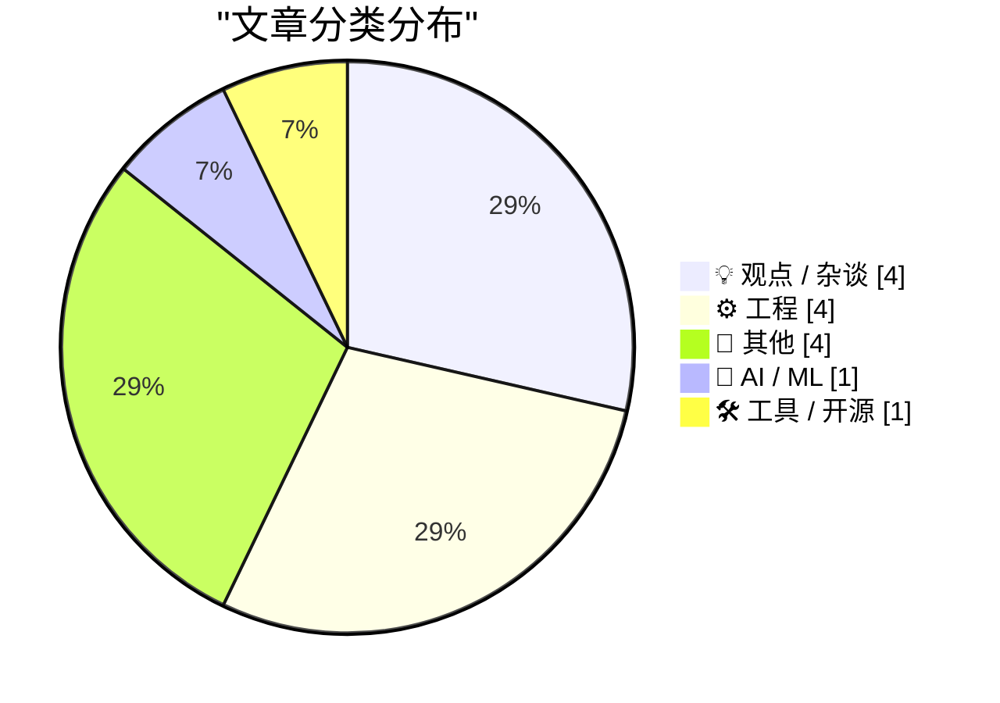
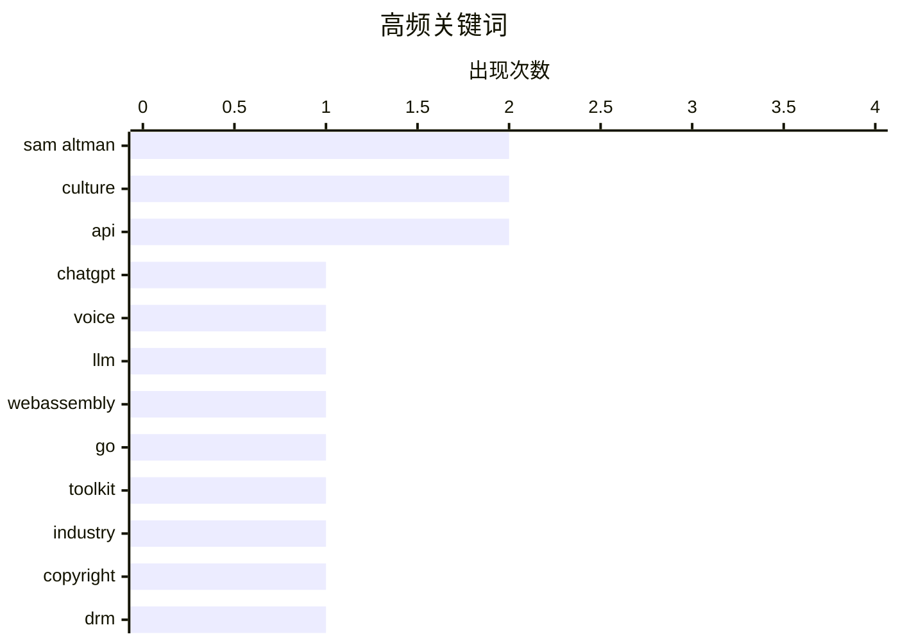

# 📰 AI 博客每日精选 — 2026-04-11

> 来自 Karpathy 推荐的 92 个顶级技术博客，AI 精选 Top 14

## 📝 今日看点

今日技术舆论场掀起对 AI 巨头的冷静反思，从模型能力局限到版权伦理争议，批判性声音逐渐增多。工程领域依旧务实，开发者持续关注工具链演进，WebAssembly 与底层系统编程细节成为技术攻坚焦点。与此同时，科技人文关怀回归，关于职场内卷与数字时代人际关系的探讨引发行业深层共鸣。技术圈在追求性能突破的同时，正重新审视技术进步与人类价值的边界。

---

## 🏆 今日必读

🥇 **ChatGPT voice mode is a weaker model**

[ChatGPT voice mode is a weaker model](https://simonwillison.net/2026/Apr/10/voice-mode-is-weaker/#atom-everything) — simonwillison.net · 8 小时前 · 🤖 AI / ML

> ChatGPT voice mode is a weaker model

🏷️ ChatGPT, voice, LLM

🥈 **watgo - a WebAssembly Toolkit for Go**

[watgo - a WebAssembly Toolkit for Go](https://eli.thegreenplace.net/2026/watgo-a-webassembly-toolkit-for-go/) — eli.thegreenplace.net · 21 小时前 · 🛠 工具 / 开源

> watgo - a WebAssembly Toolkit for Go

🏷️ WebAssembly, Go, toolkit

🥉 **★ Let Us Learn to Show Our Friendship for a Man When He Is Alive and Not After He Is Dead**

[★ Let Us Learn to Show Our Friendship for a Man When He Is Alive and Not After He Is Dead](https://daringfireball.net/2026/04/when_he_is_alive_and_not_after_he_is_dead) — daringfireball.net · 2 小时前 · 💡 观点 / 杂谈

> ★ Let Us Learn to Show Our Friendship for a Man When He Is Alive and Not After He Is Dead

🏷️ Sam Altman, industry, culture

---

## 📊 数据概览

| 扫描源 | 抓取文章 | 时间范围 | 精选 |
|:---:|:---:|:---:|:---:|
| 78/92 | 2342 篇 → 14 篇 | 24h | **14 篇** |

### 分类分布



### 高频关键词



<details>
<summary>📈 纯文本关键词图（终端友好）</summary>

```
sam altman  │ ████████████████████ 2
culture     │ ████████████████████ 2
api         │ ████████████████████ 2
chatgpt     │ ██████████░░░░░░░░░░ 1
voice       │ ██████████░░░░░░░░░░ 1
llm         │ ██████████░░░░░░░░░░ 1
webassembly │ ██████████░░░░░░░░░░ 1
go          │ ██████████░░░░░░░░░░ 1
toolkit     │ ██████████░░░░░░░░░░ 1
industry    │ ██████████░░░░░░░░░░ 1
```

</details>

### 🏷️ 话题标签

**sam altman**(2) · **culture**(2) · **api**(2) · chatgpt(1) · voice(1) · llm(1) · webassembly(1) · go(1) · toolkit(1) · industry(1) · copyright(1) · drm(1) · policy(1) · openai(1) · ai(1) · windows(1) · concurrency(1) · registry(1) · pagination(1) · career(1)

---

## 💡 观点 / 杂谈

### 1. ★ Let Us Learn to Show Our Friendship for a Man When He Is Alive and Not After He Is Dead

[★ Let Us Learn to Show Our Friendship for a Man When He Is Alive and Not After He Is Dead](https://daringfireball.net/2026/04/when_he_is_alive_and_not_after_he_is_dead) — **daringfireball.net** · 2 小时前 · ⭐ 22/30

> ★ Let Us Learn to Show Our Friendship for a Man When He Is Alive and Not After He Is Dead

🏷️ Sam Altman, industry, culture

---

### 2. Pluralistic: Canny Valley and Creative Commons (10 Apr 2026)

[Pluralistic: Canny Valley and Creative Commons (10 Apr 2026)](https://pluralistic.net/2026/04/10/canny-valley/) — **pluralistic.net** · 14 小时前 · ⭐ 22/30

> Pluralistic: Canny Valley and Creative Commons (10 Apr 2026)

🏷️ copyright, DRM, policy

---

### 3. Premium: The Hater's Guide to OpenAI

[Premium: The Hater's Guide to OpenAI](https://www.wheresyoured.at/hatersguide-openai/) — **wheresyoured.at** · 7 小时前 · ⭐ 22/30

> Premium: The Hater's Guide to OpenAI

🏷️ OpenAI, Sam Altman, AI

---

### 4. Why I quit "The Strive"

[Why I quit "The Strive"](https://www.joanwestenberg.com/why-i-quit-the-strive/) — **joanwestenberg.com** · 22 小时前 · ⭐ 19/30

> Why I quit "The Strive"

🏷️ career, burnout, culture

---

## ⚙️ 工程

### 5. How do you add or remove a handle from an active Wait­For­Multiple­Objects?, part 2

[How do you add or remove a handle from an active Wait­For­Multiple­Objects?, part 2](https://devblogs.microsoft.com/oldnewthing/20260410-00/?p=112223) — **devblogs.microsoft.com/oldnewthing** · 10 小时前 · ⭐ 20/30

> How do you add or remove a handle from an active Wait­For­Multiple­Objects?, part 2

🏷️ Windows, API, concurrency

---

### 6. Package Registries and Pagination

[Package Registries and Pagination](https://nesbitt.io/2026/04/10/package-registries-and-pagination.html) — **nesbitt.io** · 14 小时前 · ⭐ 20/30

> Package Registries and Pagination

🏷️ registry, API, pagination

---

### 7. [RSS Club] Why do you use RSS rather than Atom?

[[RSS Club] Why do you use RSS rather than Atom?](https://shkspr.mobi/blog/2026/04/rss-club-why-do-you-use-rss-rather-than-atom/) — **shkspr.mobi** · 12 小时前 · ⭐ 17/30

> [RSS Club] Why do you use RSS rather than Atom?

🏷️ RSS, Atom, feeds

---

### 8. Intel 486 处理器于 1989 年 4 月 10 日发布

[Intel 486 CPU announced April 10, 1989](https://dfarq.homeip.net/intel-486-cpu-announced-april-10-1989/?utm_source=rss&#038;utm_medium=rss&#038;utm_campaign=intel-486-cpu-announced-april-10-1989) — **dfarq.homeip.net** · 13 小时前 · ⭐ 13/30

> Intel 于 1989 年 4 月 10 日在 Comdex 大会上正式宣布了 486 CPU 的诞生。这款芯片当时价格昂贵，千颗批量采购单价高达 950 美元。文章回顾了当时杂志对这一重大硬件发布的报道与反应。通过历史视角分析了 486 处理器在计算机发展史上的里程碑地位。这种回顾有助于理解早期高性能计算硬件的市场定位与技术价值。

🏷️ Intel, 486, CPU

---

## 📝 其他

### 9. Ed Bindels’s Apple Museum in Utrecht, Netherlands

[Ed Bindels’s Apple Museum in Utrecht, Netherlands](https://applemuseum.nl/) — **daringfireball.net** · 7 小时前 · ⭐ 16/30

> Ed Bindels’s Apple Museum in Utrecht, Netherlands

🏷️ Apple, museum, hardware

---

### 10. 分数中数字的分布

[Distribution of digits in fractions](https://www.johndcook.com/blog/2026/04/10/fraction-digits/) — **johndcook.com** · 9 小时前 · ⭐ 16/30

> 分数的小数形式中隐藏着许多未被广泛认知的数学规律。研究聚焦于质数 p > 5 时倒数小数展开式中数字分布的特殊性质。通过数学推导展示了循环节长度与数字出现模式之间的潜在关联。这种基础数学领域的深层细节往往容易被职业生涯中的数学家忽略。理解这些分布特性有助于加深对数论基础结构的认识。

🏷️ math, algorithms, numbers

---

### 11. 纸牌接龙洗牌

[The Solitaire Shuffle](https://feed.tedium.co/link/15204/17316812/solitaire-card-game-types-history) — **tedium.co** · 20 小时前 · ⭐ 15/30

> 纸牌接龙游戏拥有远超 Windows 3.1 内置版本的无尽变体和历史渊源。文章回顾了 Solitaire 游戏类型的演变历程及其背后的文化意义。探讨了不同洗牌机制和游戏规则如何影响游戏体验的多样性。这种对经典游戏的深度冥想揭示了休闲软件背后的复杂生态。作者旨在唤起人们对熟悉事物背后历史的重新关注。

🏷️ Solitaire, games, history

---

### 12. 鸮鹦鹉

[Kākāpō parrots](https://simonwillison.net/2026/Apr/10/kakapo/#atom-everything) — **simonwillison.net** · 5 小时前 · ⭐ 13/30

> 这段内容分享了关于鸮鹦鹉（kākāpō）的播客片段及相关视频资料。素材源自 Simon Willison 与 Lenny 长达 1 小时 40 分钟的播客录音剪辑。视频提供了这种珍稀鸟类的具体形态或行为特征的多媒体展示。该内容作为播客系列的补充材料，提供了多种形式的信息获取路径。通过社交媒体链接分享了具体的状态更新和资源访问方式。

🏷️ podcast, nature, parrots

---

## 🤖 AI / ML

### 13. ChatGPT voice mode is a weaker model

[ChatGPT voice mode is a weaker model](https://simonwillison.net/2026/Apr/10/voice-mode-is-weaker/#atom-everything) — **simonwillison.net** · 8 小时前 · ⭐ 24/30

> ChatGPT voice mode is a weaker model

🏷️ ChatGPT, voice, LLM

---

## 🛠 工具 / 开源

### 14. watgo - a WebAssembly Toolkit for Go

[watgo - a WebAssembly Toolkit for Go](https://eli.thegreenplace.net/2026/watgo-a-webassembly-toolkit-for-go/) — **eli.thegreenplace.net** · 21 小时前 · ⭐ 24/30

> watgo - a WebAssembly Toolkit for Go

🏷️ WebAssembly, Go, toolkit

---

*生成于 2026-04-11 00:14 | 扫描 78 源 → 获取 2342 篇 → 精选 14 篇*
*基于 [Hacker News Popularity Contest 2025](https://refactoringenglish.com/tools/hn-popularity/) RSS 源列表，由 [Andrej Karpathy](https://x.com/karpathy) 推荐*
*由「懂点儿AI」制作，欢迎关注同名微信公众号获取更多 AI 实用技巧 💡*
