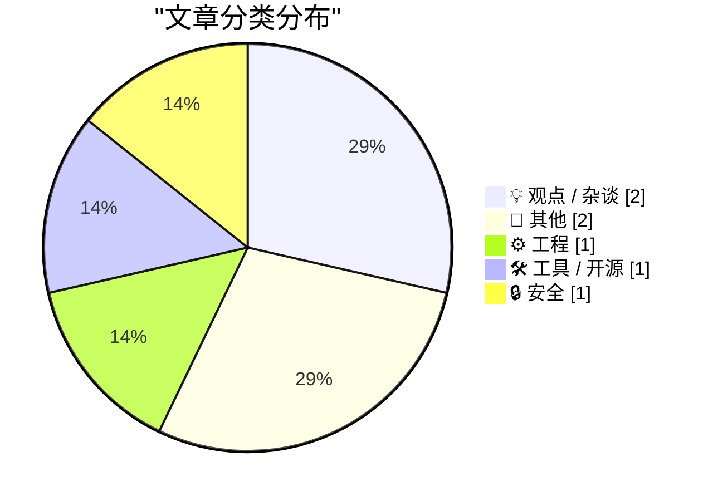
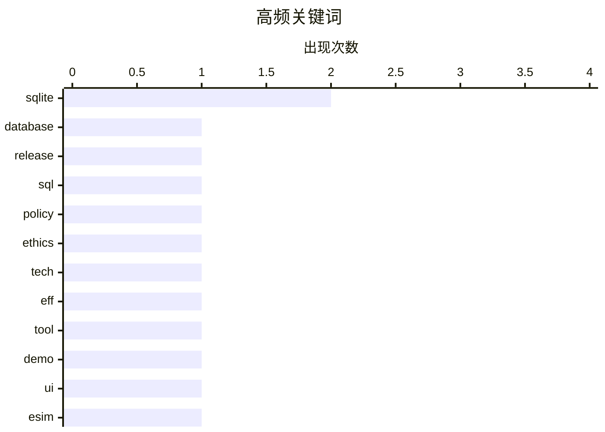

# 📰 AI 博客每日精选 — 2026-04-12

> 来自 Karpathy 推荐的 92 个顶级技术博客，AI 精选 Top 7

## 📝 今日看点

今日技术风向聚焦于基础设施升级与科技伦理安全的深度博弈。SQLite 发布重大版本更新并完善 WebAssembly 工具链，彰显轻量级数据库生态的持续进化。与此同时，从 eSIM 安全实践到科技政策对抗，再到地缘政治与工程的交叉讨论，凸显技术正日益深入复杂的社会安全与宏观政策领域。硬核技术进展与外部环境影响的交织，成为定义当前行业发展的关键变量。

---

## 🏆 今日必读

🥇 **SQLite 3.53.0 发布**

[SQLite 3.53.0](https://simonwillison.net/2026/Apr/11/sqlite/#atom-everything) — simonwillison.net · 4 小时前 · ⚙️ 工程

> SQLite 3.53.0 版本正式发布，取代了被撤回的 3.52.0 版本，带来了大量用户可见及内部改进。核心更新在于 `ALTER TABLE` 语句现在支持直接添加或移除 `NOT NULL` 和 `CHECK` 约束，无需再通过重建表等复杂变通方案。这一改动解决了长期以来修改表结构约束的痛点，简化了数据库模式迁移流程。对于依赖 sqlite-utils 等工具进行约束管理的开发者，原生支持将显著降低维护成本。

💡 **为什么值得读**: 数据库开发者必阅，了解原生支持约束修改如何简化迁移工作流。

🏷️ SQLite, database, release, SQL

🥈 **Pluralistic: 勿作恶 (2026 年 4 月 11 日)**

[Pluralistic: Don't Be Evil (11 Apr 2026)](https://pluralistic.net/2026/04/11/obvious-terrible-ideas/) — pluralistic.net · 10 小时前 · 💡 观点 / 杂谈

> 本期通讯探讨了“邪恶天才只是缺乏羞耻感”的观点，并汇集了多个跨领域链接。内容涵盖 FBI 与托洛茨基的历史关联、Jakob Nielsen 的标题理论以及 EFF 与 DOGE 的法律对抗等话题。作者还更新了在全球多地（多伦多、旧金山、伦敦等）的即将出席活动安排。虽然缺乏单一技术主题，但提供了对科技伦理与当前事件的独特视角。

💡 **为什么值得读**: 适合关注科技伦理与跨界文化的读者，获取独特的观点聚合。

🏷️ policy, ethics, tech, EFF

🥉 **SQLite 查询结果格式化器演示**

[SQLite Query Result Formatter Demo](https://simonwillison.net/2026/Apr/11/sqlite-qrf/#atom-everything) — simonwillison.net · 4 小时前 · 🛠 工具 / 开源

> 该工具提供了一个基于 WebAssembly 编译的 SQLite 查询结果格式化库的在线交互界面。用户可以直接在 Playground 中尝试新库提供的多种 SQL 结果表渲染选项，无需本地环境配置。这是配合 SQLite 3.53.0 新特性推出的辅助工具，旨在展示如何灵活定制查询输出样式。通过可视化操作，开发者能快速评估不同格式化方案在前端展示中的效果。

💡 **为什么值得读**: 前端与数据库开发者可利用此工具快速原型化 SQL 结果展示方案。

🏷️ SQLite, tool, demo, UI

---

## 📊 数据概览

| 扫描源 | 抓取文章 | 时间范围 | 精选 |
|:---:|:---:|:---:|:---:|
| 78/92 | 2342 篇 → 7 篇 | 24h | **7 篇** |

### 分类分布



### 高频关键词



<details>
<summary>📈 纯文本关键词图（终端友好）</summary>

```
sqlite   │ ████████████████████ 2
database │ ██████████░░░░░░░░░░ 1
release  │ ██████████░░░░░░░░░░ 1
sql      │ ██████████░░░░░░░░░░ 1
policy   │ ██████████░░░░░░░░░░ 1
ethics   │ ██████████░░░░░░░░░░ 1
tech     │ ██████████░░░░░░░░░░ 1
eff      │ ██████████░░░░░░░░░░ 1
tool     │ ██████████░░░░░░░░░░ 1
demo     │ ██████████░░░░░░░░░░ 1
```

</details>

### 🏷️ 话题标签

**sqlite**(2) · **database**(1) · **release**(1) · sql(1) · policy(1) · ethics(1) · tech(1) · eff(1) · tool(1) · demo(1) · ui(1) · esim(1) · 2fa(1) · mobile(1) · privacy(1) · career(1) · collaboration(1) · ideas(1) · javascript(1) · construction(1)

---

## 💡 观点 / 杂谈

### 1. Pluralistic: 勿作恶 (2026 年 4 月 11 日)

[Pluralistic: Don't Be Evil (11 Apr 2026)](https://pluralistic.net/2026/04/11/obvious-terrible-ideas/) — **pluralistic.net** · 10 小时前 · ⭐ 23/30

> 本期通讯探讨了“邪恶天才只是缺乏羞耻感”的观点，并汇集了多个跨领域链接。内容涵盖 FBI 与托洛茨基的历史关联、Jakob Nielsen 的标题理论以及 EFF 与 DOGE 的法律对抗等话题。作者还更新了在全球多地（多伦多、旧金山、伦敦等）的即将出席活动安排。虽然缺乏单一技术主题，但提供了对科技伦理与当前事件的独特视角。

🏷️ policy, ethics, tech, EFF

---

### 2. 你的朋友们正在向你隐瞒他们最好的想法

[Your friends are hiding their best ideas from you](https://idiallo.com/blog/your-friends-are-hiding-their-ideas?src=feed) — **idiallo.com** · 23 小时前 · ⭐ 16/30

> 大学 JavaScript 课程的一次小组项目经历揭示了技能组合的价值。团队当时为一家名为“珊瑚礁”的餐厅构建了网站，并结合了 Photoshop 技能。作者将 Logo 合成到虚假餐厅图片中，引发了同学对跨技能协作的强烈共鸣。这一经历反思了创意共享与个人技能组合在团队合作中的隐性价值。

🏷️ career, collaboration, ideas, JavaScript

---

## 📝 其他

### 3. 阅读清单 2026 年 4 月 11 日

[Reading List 04/11/2026](https://www.construction-physics.com/p/reading-list-04112026) — **construction-physics.com** · 12 小时前 · ⭐ 16/30

> 本期清单涵盖了霍尔木兹海峡通航状态、建筑规范成本效益分析及英特尔加入 Terafab 等多个硬核话题。内容还涉及海绵城市构建等基础设施前沿技术讨论。虽然仅为链接集合，但精选了当前工程与地缘政治交叉领域的重要动态。适合希望快速扫描行业宏观趋势与技术政策影响的读者。

🏷️ construction, Intel, industry, news

---

### 4. 泛美航空行李标签设计

[Pan American Luggage Labels](https://ellafreire.com/collections/pan-american-luggage-labels) — **daringfireball.net** · 7 小时前 · ⭐ 14/30

> 由 Ella Freire 创作的一系列重现复古泛美航空行李标签的平面设计作品近日发布。这些作品在色彩、字体和形状上高度还原了 vintage 风格，被视为极具美感的艺术重现。虽然不涉及硬核技术，但体现了数字设计对历史视觉资产的修复与再创造能力。对于关注品牌历史与视觉设计的开发者而言，提供了美学灵感。

🏷️ design, art, vintage, graphics

---

## ⚙️ 工程

### 5. SQLite 3.53.0 发布

[SQLite 3.53.0](https://simonwillison.net/2026/Apr/11/sqlite/#atom-everything) — **simonwillison.net** · 4 小时前 · ⭐ 25/30

> SQLite 3.53.0 版本正式发布，取代了被撤回的 3.52.0 版本，带来了大量用户可见及内部改进。核心更新在于 `ALTER TABLE` 语句现在支持直接添加或移除 `NOT NULL` 和 `CHECK` 约束，无需再通过重建表等复杂变通方案。这一改动解决了长期以来修改表结构约束的痛点，简化了数据库模式迁移流程。对于依赖 sqlite-utils 等工具进行约束管理的开发者，原生支持将显著降低维护成本。

🏷️ SQLite, database, release, SQL

---

## 🛠 工具 / 开源

### 6. SQLite 查询结果格式化器演示

[SQLite Query Result Formatter Demo](https://simonwillison.net/2026/Apr/11/sqlite-qrf/#atom-everything) — **simonwillison.net** · 4 小时前 · ⭐ 21/30

> 该工具提供了一个基于 WebAssembly 编译的 SQLite 查询结果格式化库的在线交互界面。用户可以直接在 Playground 中尝试新库提供的多种 SQL 结果表渲染选项，无需本地环境配置。这是配合 SQLite 3.53.0 新特性推出的辅助工具，旨在展示如何灵活定制查询输出样式。通过可视化操作，开发者能快速评估不同格式化方案在前端展示中的效果。

🏷️ SQLite, tool, demo, UI

---

## 🔒 安全

### 7. 使用 eSIM 保留英国手机号的最便宜方案

[Cheapest way to keep a UK mobile number using an eSIM](https://shkspr.mobi/blog/2026/04/cheapest-way-to-keep-a-uk-mobile-number-using-an-esim/) — **shkspr.mobi** · 12 小时前 · ⭐ 20/30

> 在不使用物理 SIM 卡的前提下，长期保留英国手机号码用于 SMS 2FA 验证存在低成本方案。通过对比多家运营商提供的 eSIM 服务，可找到维持号码活跃状态的最经济路径。方案重点在于避免繁琐的物理卡管理，同时确保能接收关键的登录验证短信。这对于拥有旧号码资产且需要跨国维持账户安全的用户具有实际参考价值。

🏷️ eSIM, 2FA, mobile, privacy

---

*生成于 2026-04-12 00:09 | 扫描 78 源 → 获取 2342 篇 → 精选 7 篇*
*基于 [Hacker News Popularity Contest 2025](https://refactoringenglish.com/tools/hn-popularity/) RSS 源列表，由 [Andrej Karpathy](https://x.com/karpathy) 推荐*
*由「懂点儿AI」制作，欢迎关注同名微信公众号获取更多 AI 实用技巧 💡*
