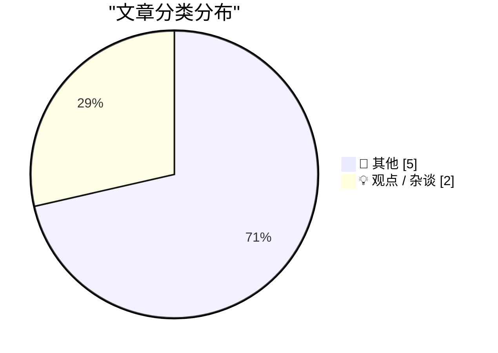
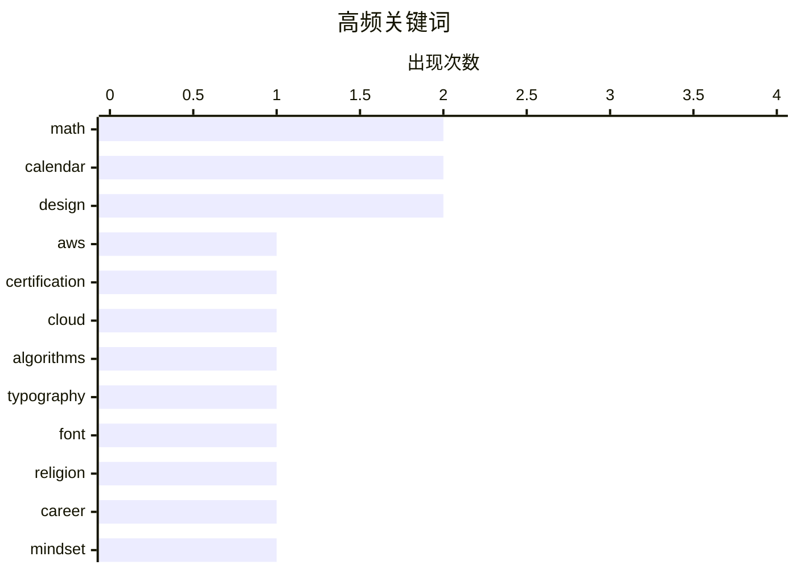

# 📰 AI 博客每日精选 — 2026-04-13

> 来自 Karpathy 推荐的 92 个顶级技术博客，AI 精选 Top 7

## 📝 今日看点

今日技术圈聚焦云平台体验与设计功能性的回归。开发者热议 AWS 认证与实际控制台操作间的落差，揭示云服务复杂度的现状。设计领域不再单纯追求美观，新字体家族以提升阅读速度为核心，复古平面设计的品牌一致性亦受推崇。此外，历法计算背后的算法逻辑成为极客们探索的趣味话题。

---

## 🏆 今日必读

🥇 **你的 AWS 证书让你成为了 AWS 推销员**

[Your AWS Certificate Makes You an AWS Salesman](https://idiallo.com/byte-size/we-are-aws-salesmen?src=feed) — idiallo.com · 6 小时前 · 💡 观点 / 杂谈

> AWS 控制台界面复杂，即使持有证书的开发者也常对 DynamoDB 以外的服务感到困惑。作者在寻找静态网站托管方案时，通过搜索才发现需要使用 Elastic Cloud Compute (EC2) 实例。这反映了 AWS 认证体系与实际日常开发需求之间存在脱节现象。持有证书往往意味着被迫熟悉并推广 AWS 庞大的生态体系，而不仅仅是使用工具。核心观点在于认证并不能完全解决实际架构选型中的迷茫。

💡 **为什么值得读**: 适合正在考取 AWS 证书或苦恼于 AWS 服务选型的开发者反思认证的实际价值。

🏷️ AWS, certification, cloud

🥈 **月球周期近似计算**

[Lunar period approximations](https://www.johndcook.com/blog/2026/04/12/lunations/) — johndcook.com · 24 分钟前 · 📝 其他

> 复活节日期的计算逻辑基于春分后第一个满月后的第一个星期日规则。该规则涉及罗马儒略历与犹太阴阳历之间的转换与协调。文中分析了如何通过近似计算来确定月球周期以匹配宗教节日的定义。这种计算方式体现了古代历法系统对天文现象的依赖与修正。核心在于理解不同历法系统间日期确定的数学与天文基础。

💡 **为什么值得读**: 适合对历法算法、天文计算或宗教节日历史背景感兴趣的技术读者。

🏷️ math, calendar, algorithms

🥉 **Zed —— 一个字体超家族**

[Zed — A Font Superfamily](https://www.typotheque.com/blog/zed-a-sans-for-the-needs-of-21century/?utm_source=df) — daringfireball.net · 2 小时前 · 📝 其他

> Typotheque 推出了名为 Zed 的新字体超家族，设计初衷是满足读者的实际需求而非仅追求样本美观。在法国眼科医院的测试中，Zed Text 在所有患者群体中的阅读速度均优于 Helvetica。该字体系统针对 21 世纪阅读需求进行了优化，特别关注视力障碍群体的可读性表现。设计团队通过实际用户测试验证了其在不同场景下的有效性。结论表明功能性设计比传统美学标准更能提升阅读体验。

💡 **为什么值得读**: 设计师和前端开发者可从中了解如何通过实证测试提升字体的可读性与无障碍体验。

🏷️ typography, font, design

---

## 📊 数据概览

| 扫描源 | 抓取文章 | 时间范围 | 精选 |
|:---:|:---:|:---:|:---:|
| 78/92 | 2342 篇 → 7 篇 | 24h | **7 篇** |

### 分类分布



### 高频关键词



<details>
<summary>📈 纯文本关键词图（终端友好）</summary>

```
math          │ ████████████████████ 2
calendar      │ ████████████████████ 2
design        │ ████████████████████ 2
aws           │ ██████████░░░░░░░░░░ 1
certification │ ██████████░░░░░░░░░░ 1
cloud         │ ██████████░░░░░░░░░░ 1
algorithms    │ ██████████░░░░░░░░░░ 1
typography    │ ██████████░░░░░░░░░░ 1
font          │ ██████████░░░░░░░░░░ 1
religion      │ ██████████░░░░░░░░░░ 1
```

</details>

### 🏷️ 话题标签

**math**(2) · **calendar**(2) · **design**(2) · aws(1) · certification(1) · cloud(1) · algorithms(1) · typography(1) · font(1) · religion(1) · career(1) · mindset(1) · mental-health(1) · politics(1) · election(1) · hungary(1) · history(1) · vintage(1)

---

## 📝 其他

### 1. 月球周期近似计算

[Lunar period approximations](https://www.johndcook.com/blog/2026/04/12/lunations/) — **johndcook.com** · 24 分钟前 · ⭐ 17/30

> 复活节日期的计算逻辑基于春分后第一个满月后的第一个星期日规则。该规则涉及罗马儒略历与犹太阴阳历之间的转换与协调。文中分析了如何通过近似计算来确定月球周期以匹配宗教节日的定义。这种计算方式体现了古代历法系统对天文现象的依赖与修正。核心在于理解不同历法系统间日期确定的数学与天文基础。

🏷️ math, calendar, algorithms

---

### 2. Zed —— 一个字体超家族

[Zed — A Font Superfamily](https://www.typotheque.com/blog/zed-a-sans-for-the-needs-of-21century/?utm_source=df) — **daringfireball.net** · 2 小时前 · ⭐ 16/30

> Typotheque 推出了名为 Zed 的新字体超家族，设计初衷是满足读者的实际需求而非仅追求样本美观。在法国眼科医院的测试中，Zed Text 在所有患者群体中的阅读速度均优于 Helvetica。该字体系统针对 21 世纪阅读需求进行了优化，特别关注视力障碍群体的可读性表现。设计团队通过实际用户测试验证了其在不同场景下的有效性。结论表明功能性设计比传统美学标准更能提升阅读体验。

🏷️ typography, font, design

---

### 3. 东西方复活节日期的差距

[The gap between Eastern and Western Easter](https://www.johndcook.com/blog/2026/04/12/orthodox-western-easter/) — **johndcook.com** · 11 小时前 · ⭐ 16/30

> 东正教复活节与西方教会复活节日期存在差异源于历法计算标准的不同。两者均基于春分后第一个满月的规则，但具体执行方式导致结果分歧。文中探讨了两个日期之间可能存在的最大时间差距以及是否东方日期总是晚于西方。通过具体分析历法规则，揭示了宗教节日背后的天文计算逻辑。核心观点在于历法体系的选择直接决定了节日的具体落点。

🏷️ calendar, math, religion

---

### 4. 维克多·欧尔班在匈牙利选举中落败，承认失败并祝贺反对派获胜

[Viktor Orban Loses Election in Hungary, Concedes Defeat, Congratulates Opposition Winners](https://www.nytimes.com/2026/04/12/world/europe/hungary-election-orban-magyar.html) — **daringfireball.net** · 2 小时前 · ⭐ 14/30

> 匈牙利总理维克多·欧尔班在选举中意外落败，并在布达佩斯发表了早期且优雅的让步演讲。他承认治理责任未授予己方，但誓言永不放弃政治斗争。反对派领导人彼得·马加尔预计将在新议会召开后接任总理职位。这一结果标志着匈牙利政治格局的重大转变，结束了欧尔班的长期执政。纽约时报和政治线路的报道确认了这一政治事件。

🏷️ politics, election, Hungary

---

### 5. 金票

[Golden Tickets](https://www.presentandcorrect.com/blogs/blog/golden-tickets) — **daringfireball.net** · 6 小时前 · ⭐ 12/30

> 一套 1940 年代末至 1950 年代初的密尔沃基巴士票收藏体现了复古平面设计的魅力。尽管每周设计一张票券，但这些票证在色彩和排版上保持了高度的品牌一致性。设计者在如此琐碎的日常用品上投入了巨大的心思与热情，使其成为充满活力的表达载体。这证明了即使是普通的通行证也能成为优秀设计的展示平台。核心观点在于日常物品设计中蕴含的艺术价值与工匠精神。

🏷️ design, history, vintage

---

## 💡 观点 / 杂谈

### 6. 你的 AWS 证书让你成为了 AWS 推销员

[Your AWS Certificate Makes You an AWS Salesman](https://idiallo.com/byte-size/we-are-aws-salesmen?src=feed) — **idiallo.com** · 6 小时前 · ⭐ 21/30

> AWS 控制台界面复杂，即使持有证书的开发者也常对 DynamoDB 以外的服务感到困惑。作者在寻找静态网站托管方案时，通过搜索才发现需要使用 Elastic Cloud Compute (EC2) 实例。这反映了 AWS 认证体系与实际日常开发需求之间存在脱节现象。持有证书往往意味着被迫熟悉并推广 AWS 庞大的生态体系，而不仅仅是使用工具。核心观点在于认证并不能完全解决实际架构选型中的迷茫。

🏷️ AWS, certification, cloud

---

### 7. 乐观不是性格缺陷

[Optimism is not a personality flaw](https://www.joanwestenberg.com/optimism-is-not-a-personality-flaw/) — **joanwestenberg.com** · 22 小时前 · ⭐ 16/30

> 乐观主义不应被视为一种性格缺陷，而是一种积极的心理状态。作者通过通讯订阅模式提供额外内容，包括每月额外帖子及社区访问权限，定价为每月 2.50 美元。内容旨在探讨心态对个人成长的影响，反对将积极态度病理化的观点。核心观点在于重新定义乐观在现代社会中的价值与作用。这是一篇关于心理健康与个人发展的观点文章。

🏷️ career, mindset, mental-health

---

*生成于 2026-04-13 00:06 | 扫描 78 源 → 获取 2342 篇 → 精选 7 篇*
*基于 [Hacker News Popularity Contest 2025](https://refactoringenglish.com/tools/hn-popularity/) RSS 源列表，由 [Andrej Karpathy](https://x.com/karpathy) 推荐*
*由「懂点儿AI」制作，欢迎关注同名微信公众号获取更多 AI 实用技巧 💡*
