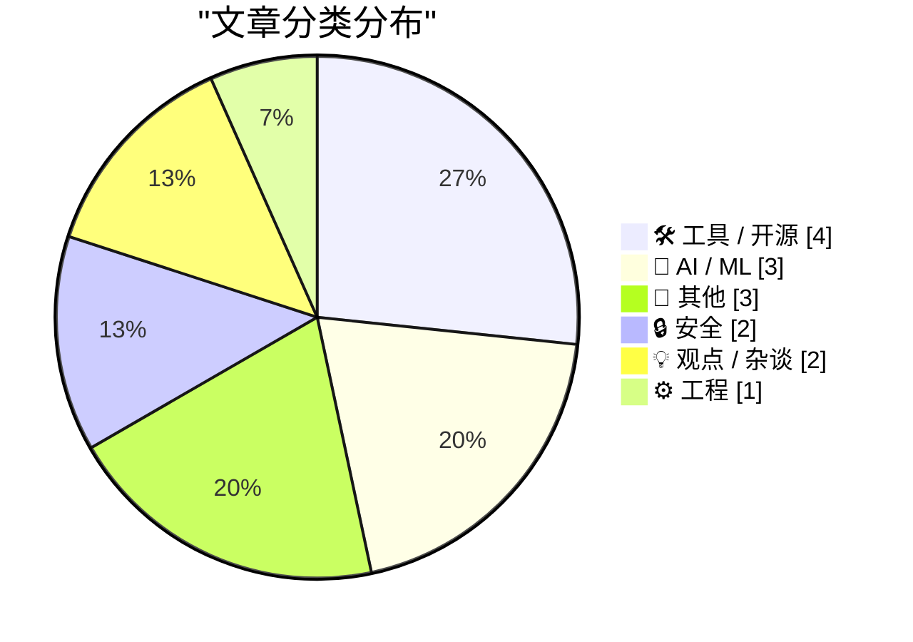
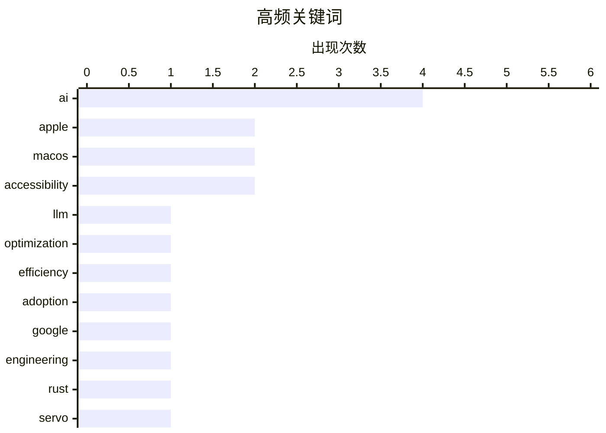

# 📰 AI 博客每日精选 — 2026-04-14

> 来自 Karpathy 推荐的 92 个顶级技术博客，AI 精选 Top 15

## 📝 今日看点

AI 发展进入理性审视阶段，行业焦点从模型能力转向代码质量风险与代理授权安全，内部数据揭示了真实的采用现状与瓶颈。隐私保护升级为系统默认策略，Android 停止嵌入位置元数据，标志着用户数据主权边界的进一步收紧。底层基础设施持续演进，但浏览器引擎发布与包规范争议表明，技术标准的统一仍面临现实落差。这些动态共同折射出技术领域在追求高效与安全背后的复杂博弈。

---

## 🏆 今日必读

🥇 **引用 Bryan Cantrill：LLM 缺乏懒惰的美德**

[Quoting Bryan Cantrill](https://simonwillison.net/2026/Apr/13/bryan-cantrill/#atom-everything) — simonwillison.net · 21 小时前 · 🤖 AI / ML

> LLM 天生缺乏懒惰这一美德，导致工作成本对其而言几乎为零。模型不会优化自身或他人的未来时间，倾向于堆积更多垃圾代码而非优化系统。这种 unchecked 的增长会使系统变得更大而非更好，仅迎合虚荣指标。最终代价是牺牲所有真正重要的系统质量与效率。

💡 **为什么值得读**: 揭示了 AI 生成代码可能导致系统熵增的深层风险，值得架构师警惕。

🏷️ LLM, optimization, efficiency, AI

🥈 **引用 Steve Yegge：Google 与行业的 AI 采用现状**

[Quoting Steve Yegge](https://simonwillison.net/2026/Apr/13/steve-yegge/#atom-everything) — simonwillison.net · 3 小时前 · 🤖 AI / ML

> Google 工程的 AI 采用足迹与 John Deere 等传统产业相似，内部曲线分为 20% 代理权力用户、20% 拒绝者和 60% 使用 Cursor 等聊天工具的用户。行业经历了 18 个月以上的招聘冻结，期间人员流动停滞。大多数团队仍停留在辅助工具阶段，而非真正的代理工作流。这反映了 AI 在实际工程生产力中的渗透瓶颈。

💡 **为什么值得读**: 提供了大厂内部 AI 落地真实比例数据，打破了对 AI 全面接管工程的幻想。

🏷️ AI, adoption, Google, engineering

🥉 **探索新的 `servo` crate**

[Exploring the new `servo` crate](https://simonwillison.net/2026/Apr/13/servo-crate-exploration/#atom-everything) — simonwillison.net · 9 小时前 · 🛠 工具 / 开源

> Servo 团队宣布在 crates.io 上发布 `servo` crate 初始版本，将浏览器引擎打包为可嵌入库。该发布标志着 Servo 0.1.0 正式可用，允许开发者将其集成到 Rust 项目中。Simon Willison 使用 Claude Code 对该库进行了初步探索和测试。这为需要在应用中嵌入渲染能力的开发者提供了新选项。

💡 **为什么值得读**: 关注 Rust 生态中浏览器引擎嵌入化的最新进展，适合需要自定义渲染场景的开发者。

🏷️ Rust, Servo, browser, library

---

## 📊 数据概览

| 扫描源 | 抓取文章 | 时间范围 | 精选 |
|:---:|:---:|:---:|:---:|
| 77/92 | 2334 篇 → 19 篇 | 24h | **15 篇** |

### 分类分布



### 高频关键词



<details>
<summary>📈 纯文本关键词图（终端友好）</summary>

```
ai            │ ████████████████████ 4
apple         │ ██████████░░░░░░░░░░ 2
macos         │ ██████████░░░░░░░░░░ 2
accessibility │ ██████████░░░░░░░░░░ 2
llm           │ █████░░░░░░░░░░░░░░░ 1
optimization  │ █████░░░░░░░░░░░░░░░ 1
efficiency    │ █████░░░░░░░░░░░░░░░ 1
adoption      │ █████░░░░░░░░░░░░░░░ 1
google        │ █████░░░░░░░░░░░░░░░ 1
engineering   │ █████░░░░░░░░░░░░░░░ 1
```

</details>

### 🏷️ 话题标签

**ai**(4) · **apple**(2) · **macos**(2) · accessibility(2) · llm(1) · optimization(1) · efficiency(1) · adoption(1) · google(1) · engineering(1) · rust(1) · servo(1) · browser(1) · library(1) · authorization(1) · security(1) · agents(1) · meta(1) · avatar(1) · zuckerberg(1)

---

## 🛠 工具 / 开源

### 1. 探索新的 `servo` crate

[Exploring the new `servo` crate](https://simonwillison.net/2026/Apr/13/servo-crate-exploration/#atom-everything) — **simonwillison.net** · 9 小时前 · ⭐ 24/30

> Servo 团队宣布在 crates.io 上发布 `servo` crate 初始版本，将浏览器引擎打包为可嵌入库。该发布标志着 Servo 0.1.0 正式可用，允许开发者将其集成到 Rust 项目中。Simon Willison 使用 Claude Code 对该库进行了初步探索和测试。这为需要在应用中嵌入渲染能力的开发者提供了新选项。

🏷️ Rust, Servo, browser, library

---

### 2. 通用包规范

[Common Package Specification](https://nesbitt.io/2026/04/13/common-package-specification.html) — **nesbitt.io** · 14 小时前 · ⭐ 18/30

> 该规范名称暗示跨生态系统格式，但实际并非如此。文章指出了技术规范命名与实际兼容性之间的潜在落差。这种误导可能影响开发者对包管理标准化的预期。内容虽短但揭示了软件供应链中统一格式尝试的现实困难。读者需注意区分规范名称与其实际覆盖范围。

🏷️ packages, specification, dependencies, software

---

### 3. Apple Frames 4

[Apple Frames 4](https://www.macstories.net/stories/introducing-apple-frames-4-a-revamped-shortcut-support-for-frame-colors-proportional-scaling-and-the-apple-frames-cli-for-developers/) — **daringfireball.net** · 11 分钟前 · ⭐ 17/30

> Apple Frames 4

🏷️ Apple, Shortcut, screenshots, iOS

---

### 4. MacOS Tip: Enable the Zoom ‘Peek’ Gesture

[MacOS Tip: Enable the Zoom ‘Peek’ Gesture](https://unsung.aresluna.org/testing-tip-enable-the-zoom-peek-gesture/) — **daringfireball.net** · 6 小时前 · ⭐ 15/30

> MacOS Tip: Enable the Zoom ‘Peek’ Gesture

🏷️ macOS, accessibility, gesture, tip

---

## 🤖 AI / ML

### 5. 引用 Bryan Cantrill：LLM 缺乏懒惰的美德

[Quoting Bryan Cantrill](https://simonwillison.net/2026/Apr/13/bryan-cantrill/#atom-everything) — **simonwillison.net** · 21 小时前 · ⭐ 25/30

> LLM 天生缺乏懒惰这一美德，导致工作成本对其而言几乎为零。模型不会优化自身或他人的未来时间，倾向于堆积更多垃圾代码而非优化系统。这种 unchecked 的增长会使系统变得更大而非更好，仅迎合虚荣指标。最终代价是牺牲所有真正重要的系统质量与效率。

🏷️ LLM, optimization, efficiency, AI

---

### 6. 引用 Steve Yegge：Google 与行业的 AI 采用现状

[Quoting Steve Yegge](https://simonwillison.net/2026/Apr/13/steve-yegge/#atom-everything) — **simonwillison.net** · 3 小时前 · ⭐ 24/30

> Google 工程的 AI 采用足迹与 John Deere 等传统产业相似，内部曲线分为 20% 代理权力用户、20% 拒绝者和 60% 使用 Cursor 等聊天工具的用户。行业经历了 18 个月以上的招聘冻结，期间人员流动停滞。大多数团队仍停留在辅助工具阶段，而非真正的代理工作流。这反映了 AI 在实际工程生产力中的渗透瓶颈。

🏷️ AI, adoption, Google, engineering

---

### 7. FT：Meta 构建 AI 版扎克伯格与员工互动

[FT: ‘Meta Builds AI Version of Mark Zuckerberg to Interact With Staff’](https://www.ft.com/content/02107c23-6c7a-4c19-b8e2-b45f4bb9ce5f) — **daringfireball.net** · 7 小时前 · ⭐ 24/30

> Meta 近期优先开发了一个扎克伯格的 AI 角色，用于与员工互动并提供反馈。该角色基于亿万富翁的举止、语调及公开声明进行训练，CEO 本人亲自参与测试。旨在通过数字化身内部化公司文化或提供指导。这标志着企业内部 AI 助手向名人领导人格化发展的趋势。

🏷️ Meta, AI, avatar, Zuckerberg

---

## 📝 其他

### 8. 数学极简主义

[Mathematical minimalism](https://www.johndcook.com/blog/2026/04/13/the-smallest-math-library/) — **johndcook.com** · 9 小时前 · ⭐ 18/30

> Andrzej Odrzywolek 在 arXiv 发表论文，证明仅通过 `elm` 函数和常数 1 即可获得所有初等函数。论文补充材料展示了如何自举加法、减法、乘法和除法运算。这种数学极简主义探索了函数依赖的最小集合。为数学库的基础实现提供了理论上的极简路径。

🏷️ mathematics, functions, theory, arithmetic

---

### 9. John Martellaro, RIP

[John Martellaro, RIP](https://geektells.com/john-martellaro-remembrance/) — **daringfireball.net** · 4 小时前 · ⭐ 17/30

> John Martellaro, RIP

🏷️ obituary, community, Apple, NASA

---

### 10. Marcin Wichary Visits the Large Scale Systems Museum

[Marcin Wichary Visits the Large Scale Systems Museum](https://flickr.com/photos/mwichary/albums/72177720332956990/) — **daringfireball.net** · 4 小时前 · ⭐ 15/30

> Marcin Wichary Visits the Large Scale Systems Museum

🏷️ history, museum, keyboards, computing

---

## 🔒 安全

### 11. [赞助] WorkOS FGA：AI 代理的授权层

[[Sponsor] WorkOS FGA: The Authorization Layer for AI Agents](https://workos.com/blog/agents-need-authorization-not-just-authentication?utm_source=daringfireball&amp;utm_medium=newsletter&amp;utm_campaign=q22026) — **daringfireball.net** · 2 小时前 · ⭐ 24/30

> 企业部署 AI 代理的主要障碍并非模型质量或延迟，而是授权（Authorization）问题。认证仅证明身份，而授权定义了代理的操作爆炸半径（blast radius）。WorkOS FGA 通过资源级权限控制来 scope 这种风险。赢得企业市场的将是那些能被安全信任的 AI 方案。

🏷️ AI, authorization, security, agents

---

### 12. Android 现已阻止你在照片中分享位置

[Android now stops you sharing your location in photos](https://shkspr.mobi/blog/2026/04/android-now-stops-you-sharing-your-location-in-photos/) — **shkspr.mobi** · 12 小时前 · ⭐ 24/30

> Google Android 系统更新后默认停止在照片元数据中嵌入地理位置信息。这一变更破坏了依赖 EXIF 数据映射照片位置的网站（如 OpenBenches）的功能。Web 端使用的 `<input type="file">` 拾取器不再自动传递位置数据。用户隐私保护增强导致了特定垂直应用的功能失效。

🏷️ Android, privacy, geolocation, metadata

---

## 💡 观点 / 杂谈

### 13. Pluralistic：紧缩政策制造法西斯主义

[Pluralistic: Austerity creates fascism (13 Apr 2026)](https://pluralistic.net/2026/04/12/always-great/) — **pluralistic.net** · 18 小时前 · ⭐ 20/30

> 文章主张紧缩政策会催生法西斯主义，强调我们无法承受负担不起美好事物的代价。内容涵盖服务器安全、选举数据泄露及密码哈希等多个社会技术议题。作者通过系列链接探讨了技术政策与社会结构的关联。核心观点是公共投入的减少会导致极端主义滋生。

🏷️ politics, austerity, data breach, society

---

### 14. Tahoe Nitpick of the Day: ‘Reduce Transparency’ Makes Layers Harder to See, Not Easier

[Tahoe Nitpick of the Day: ‘Reduce Transparency’ Makes Layers Harder to See, Not Easier](https://mastodon.social/@tuomas_h/116397694769738857) — **daringfireball.net** · 3 小时前 · ⭐ 16/30

> Tahoe Nitpick of the Day: ‘Reduce Transparency’ Makes Layers Harder to See, Not Easier

🏷️ macOS, accessibility, UX, design

---

## ⚙️ 工程

### 15. 在 N 个整数数组中寻找重复项（范围 1 到 N-1）

[Finding a duplicated item in an array of N integers in the range 1 to N − 1](https://devblogs.microsoft.com/oldnewthing/20260413-00/?p=112227) — **devblogs.microsoft.com/oldnewthing** · 10 小时前 · ⭐ 23/30

> 针对包含 N 个整数且范围在 1 到 N-1 之间的数组，利用数组的特殊特性寻找重复项。该算法避免了常规哈希表或排序开销，专注于数学特性优化。这是 The Old New Thing 专栏经典的算法技巧分享。适用于内存受限环境下的重复数据检测。

🏷️ algorithm, array, debugging, C++

---

*生成于 2026-04-14 00:07 | 扫描 77 源 → 获取 2334 篇 → 精选 15 篇*
*基于 [Hacker News Popularity Contest 2025](https://refactoringenglish.com/tools/hn-popularity/) RSS 源列表，由 [Andrej Karpathy](https://x.com/karpathy) 推荐*
*由「懂点儿AI」制作，欢迎关注同名微信公众号获取更多 AI 实用技巧 💡*
