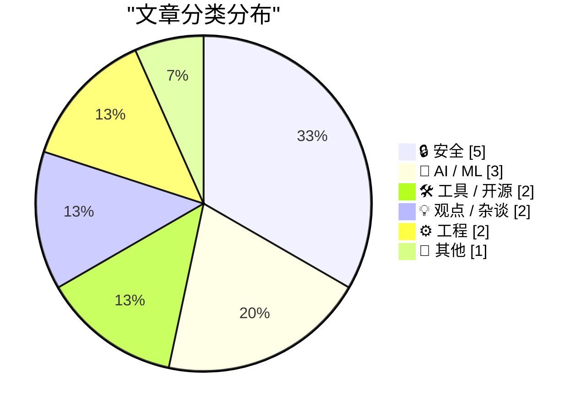
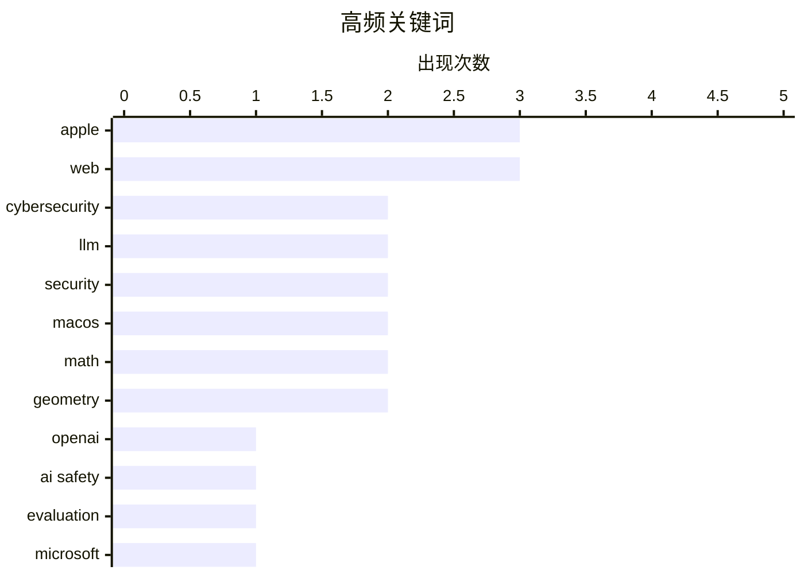

# 📰 AI 博客每日精选 — 2026-04-15

> 来自 Karpathy 推荐的 92 个顶级技术博客，AI 精选 Top 15

## 📝 今日看点

今日技术圈聚焦于网络安全防御范式的革新，新型信任机制与工作证明模型正成为下一代防御核心。平台治理亦显著收紧，谷歌与苹果生态相继出手严厉打击网页劫持与应用欺诈行为。大厂基础设施布局迎来重磅进展，亚马逊收购全球星并联手苹果巩固卫星通信服务生态。与此同时，人工智能领域保持高频迭代，与开发工具链的优化共同推动技术社群持续向前。

---

## 🏆 今日必读

🥇 **Trusted access for the next era of cyber defense**

[Trusted access for the next era of cyber defense](https://simonwillison.net/2026/Apr/14/trusted-access-openai/#atom-everything) — simonwillison.net · 2 小时前 · 🤖 AI / ML

> Trusted access for the next era of cyber defense

🏷️ OpenAI, Cybersecurity, LLM

🥈 **Cybersecurity Looks Like Proof of Work Now**

[Cybersecurity Looks Like Proof of Work Now](https://simonwillison.net/2026/Apr/14/cybersecurity-proof-of-work/#atom-everything) — simonwillison.net · 4 小时前 · 🔒 安全

> Cybersecurity Looks Like Proof of Work Now

🏷️ AI Safety, Cybersecurity, Evaluation

🥉 **Patch Tuesday, April 2026 Edition**

[Patch Tuesday, April 2026 Edition](https://krebsonsecurity.com/2026/04/patch-tuesday-april-2026-edition/) — krebsonsecurity.com · 2 小时前 · 🔒 安全

> Patch Tuesday, April 2026 Edition

🏷️ Microsoft, Vulnerabilities, Patch

---

## 📊 数据概览

| 扫描源 | 抓取文章 | 时间范围 | 精选 |
|:---:|:---:|:---:|:---:|
| 78/92 | 2344 篇 → 23 篇 | 24h | **15 篇** |

### 分类分布



### 高频关键词



<details>
<summary>📈 纯文本关键词图（终端友好）</summary>

```
apple         │ ████████████████████ 3
web           │ ████████████████████ 3
cybersecurity │ █████████████░░░░░░░ 2
llm           │ █████████████░░░░░░░ 2
security      │ █████████████░░░░░░░ 2
macos         │ █████████████░░░░░░░ 2
math          │ █████████████░░░░░░░ 2
geometry      │ █████████████░░░░░░░ 2
openai        │ ███████░░░░░░░░░░░░░ 1
ai safety     │ ███████░░░░░░░░░░░░░ 1
```

</details>

### 🏷️ 话题标签

**apple**(3) · **web**(3) · **cybersecurity**(2) · llm(2) · security(2) · macos(2) · math(2) · geometry(2) · openai(1) · ai safety(1) · evaluation(1) · microsoft(1) · vulnerabilities(1) · patch(1) · ai(1) · automation(1) · support(1) · assistant(1) · cryptocurrency(1) · fraud(1)

---

## 🔒 安全

### 1. Cybersecurity Looks Like Proof of Work Now

[Cybersecurity Looks Like Proof of Work Now](https://simonwillison.net/2026/Apr/14/cybersecurity-proof-of-work/#atom-everything) — **simonwillison.net** · 4 小时前 · ⭐ 26/30

> Cybersecurity Looks Like Proof of Work Now

🏷️ AI Safety, Cybersecurity, Evaluation

---

### 2. Patch Tuesday, April 2026 Edition

[Patch Tuesday, April 2026 Edition](https://krebsonsecurity.com/2026/04/patch-tuesday-april-2026-edition/) — **krebsonsecurity.com** · 2 小时前 · ⭐ 26/30

> Patch Tuesday, April 2026 Edition

🏷️ Microsoft, Vulnerabilities, Patch

---

### 3. Fraudulent Cryptocurrency App in Mac App Store Stole $9.5 Million From 50-Some Users

[Fraudulent Cryptocurrency App in Mac App Store Stole $9.5 Million From 50-Some Users](https://www.web3isgoinggreat.com/?id=fake-ledger-app) — **daringfireball.net** · 2 小时前 · ⭐ 23/30

> Fraudulent Cryptocurrency App in Mac App Store Stole $9.5 Million From 50-Some Users

🏷️ Apple, Cryptocurrency, Fraud

---

### 4. Google Will Finally Begin Punishing Sites for Back-Button Hijacking in June

[Google Will Finally Begin Punishing Sites for Back-Button Hijacking in June](https://developers.google.com/search/blog/2026/04/back-button-hijacking) — **daringfireball.net** · 3 小时前 · ⭐ 23/30

> Google Will Finally Begin Punishing Sites for Back-Button Hijacking in June

🏷️ Google, Security, Web

---

### 5. Back button hijacking is going away

[Back button hijacking is going away](https://idiallo.com/blog/back-button-hijacking-is-going-away-seo?src=feed) — **idiallo.com** · 12 小时前 · ⭐ 23/30

> Back button hijacking is going away

🏷️ web, security, UX, browser

---

## 🤖 AI / ML

### 6. Trusted access for the next era of cyber defense

[Trusted access for the next era of cyber defense](https://simonwillison.net/2026/Apr/14/trusted-access-openai/#atom-everything) — **simonwillison.net** · 2 小时前 · ⭐ 26/30

> Trusted access for the next era of cyber defense

🏷️ OpenAI, Cybersecurity, LLM

---

### 7. Weekly Update 499

[Weekly Update 499](https://www.troyhunt.com/weekly-update-499/) — **troyhunt.com** · 17 小时前 · ⭐ 25/30

> Weekly Update 499

🏷️ AI, automation, support, assistant

---

### 8. Glider Is Back in the Mac App Store

[Glider Is Back in the Mac App Store](https://bsky.app/profile/engineersneedart.com/post/3mjf3ldjbp22k) — **daringfireball.net** · 10 小时前 · ⭐ 19/30

> Glider Is Back in the Mac App Store

🏷️ MacOS, Claude, legacy, LLM

---

## 🛠 工具 / 开源

### 9. Standing on the shoulders of Homebrew

[Standing on the shoulders of Homebrew](https://nesbitt.io/2026/04/14/standing-on-the-shoulders-of-homebrew.html) — **nesbitt.io** · 14 小时前 · ⭐ 22/30

> Standing on the shoulders of Homebrew

🏷️ Homebrew, package-manager, MacOS, open-source

---

### 10. Apple Has Hidden the Pre-Creator-Studio Versions of Keynote, Numbers, and Pages in the Mac App Store

[Apple Has Hidden the Pre-Creator-Studio Versions of Keynote, Numbers, and Pages in the Mac App Store](https://9to5mac.com/2026/04/13/apple-removes-old-pages-keynote-numbers-apps-for-macos/) — **daringfireball.net** · 3 小时前 · ⭐ 18/30

> Apple Has Hidden the Pre-Creator-Studio Versions of Keynote, Numbers, and Pages in the Mac App Store

🏷️ Apple, Mac, Software

---

## 💡 观点 / 杂谈

### 11. Pluralistic: In praise of (some) compartmentalization (14 Apr 2026)

[Pluralistic: In praise of (some) compartmentalization (14 Apr 2026)](https://pluralistic.net/2026/04/14/compartment/) — **pluralistic.net** · 15 小时前 · ⭐ 21/30

> Pluralistic: In praise of (some) compartmentalization (14 Apr 2026)

🏷️ privacy, policy, tech, society

---

### 12. I Will Never Respect A Website

[I Will Never Respect A Website](https://www.wheresyoured.at/i-will-never-respect-a-website/) — **wheresyoured.at** · 7 小时前 · ⭐ 19/30

> I Will Never Respect A Website

🏷️ web, monetization, newsletter, industry

---

## ⚙️ 工程

### 13. Intersecting spheres and GPS

[Intersecting spheres and GPS](https://www.johndcook.com/blog/2026/04/14/intersecting-spheres-and-gps/) — **johndcook.com** · 10 小时前 · ⭐ 20/30

> Intersecting spheres and GPS

🏷️ GPS, math, geometry, navigation

---

### 14. Finding a parabola through two points with given slopes

[Finding a parabola through two points with given slopes](https://www.johndcook.com/blog/2026/04/14/artz-parabola/) — **johndcook.com** · 11 小时前 · ⭐ 17/30

> Finding a parabola through two points with given slopes

🏷️ math, geometry, parabola, algorithm

---

## 📝 其他

### 15. Amazon to Acquire Globalstar, Announces Agreement With Apple to Continue Service for iPhone and Apple Watch

[Amazon to Acquire Globalstar, Announces Agreement With Apple to Continue Service for iPhone and Apple Watch](https://www.aboutamazon.com/news/company-news/amazon-globalstar-apple) — **daringfireball.net** · 4 小时前 · ⭐ 22/30

> Amazon to Acquire Globalstar, Announces Agreement With Apple to Continue Service for iPhone and Apple Watch

🏷️ Amazon, Apple, Satellite

---

*生成于 2026-04-15 00:11 | 扫描 78 源 → 获取 2344 篇 → 精选 15 篇*
*基于 [Hacker News Popularity Contest 2025](https://refactoringenglish.com/tools/hn-popularity/) RSS 源列表，由 [Andrej Karpathy](https://x.com/karpathy) 推荐*
*由「懂点儿AI」制作，欢迎关注同名微信公众号获取更多 AI 实用技巧 💡*
