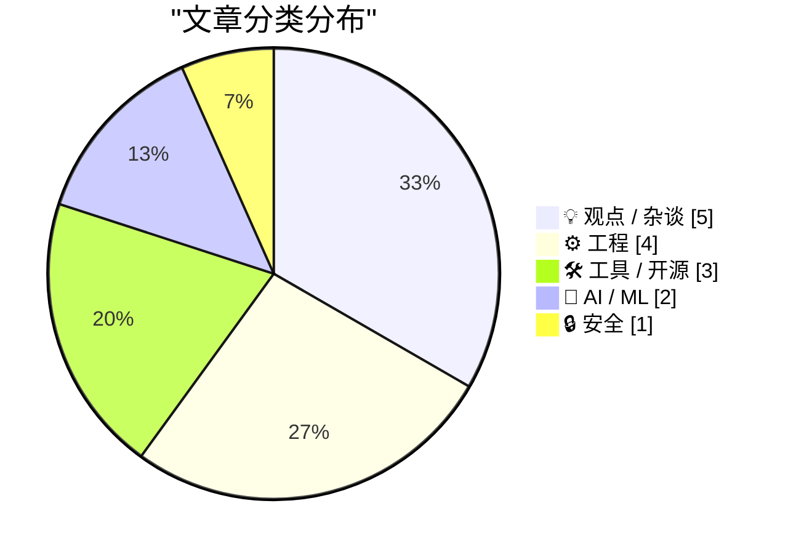
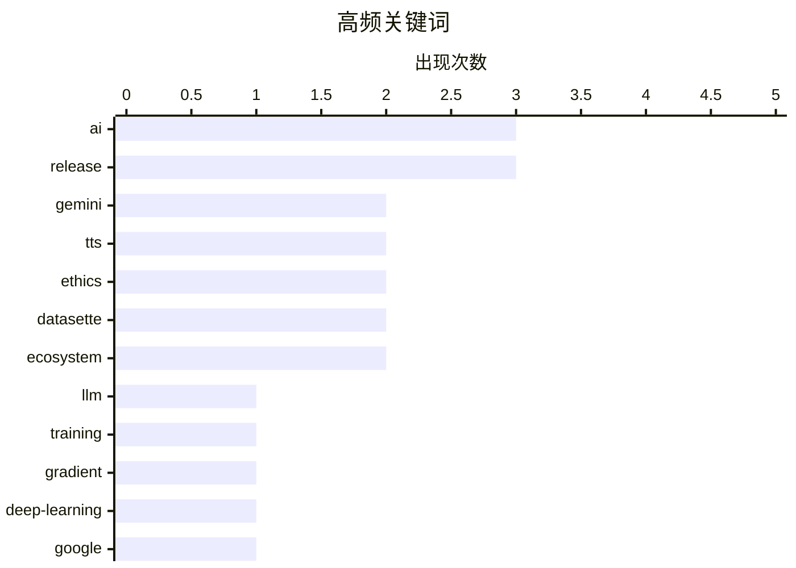

# 📰 AI 博客每日精选 — 2026-04-16

> 来自 Karpathy 推荐的 92 个顶级技术博客，AI 精选 Top 15

## 📝 今日看点

今日技术焦点集中于人工智能的双重演进，新语音模型与本地训练优化展示能力边界拓展，而算法问责与机器人权利讨论则警示技术社会影响。系统工程领域同样活跃，编程语言更新与内核级调试分析彰显底层基础设施的持续精进。此外，行业重申规格说明无法替代代码实现，强调工程师在逻辑填补中的核心价值。技术创新与人文审视正在同步深化，定义着软件开发的未来形态。

---

## 🏆 今日必读

🥇 **从零编写 LLM 第 32k 部分——干预措施：利用梯度累积在本地训练更好的模型**

[Writing an LLM from scratch, part 32k -- Interventions: training a better model locally with gradient accumulation](https://www.gilesthomas.com/2026/04/llm-from-scratch-32k-interventions-training-our-best-model-locally-gradient-accumulation) — gilesthomas.com · 4 小时前 · 🤖 AI / ML

> 基于 Sebastian Raschka 的教材构建 GPT-2-small 风格 LLM 时，面临如何在本地高效训练出更优模型的问题。通过在云端测试多种干预措施后，采用梯度累积技术在本地进行训练优化。该方案解决了显存限制下的批量训练难题，显著提升了模型收敛效果。实验对比了不同干预手段对模型性能的具体影响，确定了最优配置。最终验证了特定干预组合配合梯度累积能在本地资源上复现云端训练的最佳性能。

💡 **为什么值得读**: 适合想在不依赖昂贵云资源的情况下，深入理解 LLM 训练优化技巧的开发者。

🏷️ LLM, training, gradient, deep-learning

🥈 **Gemini 3.1 Flash TTS**

[Gemini 3.1 Flash TTS](https://simonwillison.net/2026/Apr/15/gemini-31-flash-tts/#atom-everything) — simonwillison.net · 7 小时前 · 🤖 AI / ML

> Google 发布了新的文本转语音模型 Gemini 3.1 Flash TTS，支持通过提示词直接控制语音生成。该模型通过标准 Gemini API 调用，模型 ID 为 `gemini-3.1-flash-tts-preview`，但仅支持输出音频文件。系统引入了 transcript tags 等技术细节以增强可控性。这标志着生成式 AI 在多模态输出能力上的进一步扩展。开发者可以直接集成该 API 实现高质量的语音合成应用。

💡 **为什么值得读**: 想要快速集成最新多模态语音生成功能的开发者需要关注此 API 更新。

🏷️ Google, Gemini, TTS, AI

🥉 **引用 Kyle Kingsbury 的观点**

[Quoting Kyle Kingsbury](https://simonwillison.net/2026/Apr/15/kyle-kingsbury/#atom-everything) — simonwillison.net · 8 小时前 · 💡 观点 / 杂谈

> 随着 ML 系统的普及，未来将出现专门作为“肉盾”受雇的人类角色来为算法决策承担责任。这种问责机制可能表现为内部审查，如 Meta 雇佣人员审核自动 moderation 系统的决定。也可能涉及外部法律责任，例如律师因向法庭提交 LLM 生成的虚假信息而受罚。这揭示了自动化系统无法完全摆脱人类监督的现实困境。最终表明技术问责制将成为 AI 部署中不可或缺的一环。

💡 **为什么值得读**: 提供了关于 AI 伦理与法律责任未来走向的深刻洞察，适合关注 AI 治理的读者。

🏷️ AI, ethics, accountability, ML

---

## 📊 数据概览

| 扫描源 | 抓取文章 | 时间范围 | 精选 |
|:---:|:---:|:---:|:---:|
| 78/92 | 2344 篇 → 21 篇 | 24h | **15 篇** |

### 分类分布



### 高频关键词



<details>
<summary>📈 纯文本关键词图（终端友好）</summary>

```
ai        │ ████████████████████ 3
release   │ ████████████████████ 3
gemini    │ █████████████░░░░░░░ 2
tts       │ █████████████░░░░░░░ 2
ethics    │ █████████████░░░░░░░ 2
datasette │ █████████████░░░░░░░ 2
ecosystem │ █████████████░░░░░░░ 2
llm       │ ███████░░░░░░░░░░░░░ 1
training  │ ███████░░░░░░░░░░░░░ 1
gradient  │ ███████░░░░░░░░░░░░░ 1
```

</details>

### 🏷️ 话题标签

**ai**(3) · **release**(3) · **gemini**(2) · tts(2) · ethics(2) · datasette(2) · ecosystem(2) · llm(1) · training(1) · gradient(1) · deep-learning(1) · google(1) · accountability(1) · ml(1) · zig(1) · language(1) · documentation(1) · rights(1) · policy(1) · specification(1)

---

## 💡 观点 / 杂谈

### 1. 引用 Kyle Kingsbury 的观点

[Quoting Kyle Kingsbury](https://simonwillison.net/2026/Apr/15/kyle-kingsbury/#atom-everything) — **simonwillison.net** · 8 小时前 · ⭐ 25/30

> 随着 ML 系统的普及，未来将出现专门作为“肉盾”受雇的人类角色来为算法决策承担责任。这种问责机制可能表现为内部审查，如 Meta 雇佣人员审核自动 moderation 系统的决定。也可能涉及外部法律责任，例如律师因向法庭提交 LLM 生成的虚假信息而受罚。这揭示了自动化系统无法完全摆脱人类监督的现实困境。最终表明技术问责制将成为 AI 部署中不可或缺的一环。

🏷️ AI, ethics, accountability, ML

---

### 2. Pluralistic: 机器人的权利 (2026 年 4 月 15 日)

[Pluralistic: Rights for robots (15 Apr 2026)](https://pluralistic.net/2026/04/15/artificial-lifeforms/) — **pluralistic.net** · 17 小时前 · ⭐ 24/30

> 本期链接集探讨了机器人权利、DMCA 法案影响及企业游说预算等多个社会技术议题。核心观点认为并非所有事物都应享有道德考量，包括人工智能体。文章还涉及新奥尔良市长候选人、AOL 邮件交付问题及微软基金会突袭等热点事件。通过串联不同领域的新闻，揭示了技术政策与 corporate power 之间的复杂关系。这是一份涵盖广泛科技与社会交叉领域的周报式摘要。

🏷️ AI, ethics, rights, policy

---

### 3. 引用 John Gruber 的观点

[Quoting John Gruber](https://simonwillison.net/2026/Apr/15/john-gruber/#atom-everything) — **simonwillison.net** · 7 小时前 · ⭐ 22/30

> John Gruber 指出 Apple 真正的金矿在于其平台拥有最佳应用，从而吸引用户购买 iPhone 和 Mac。然而这一优势正在减弱，并非因为其他平台软件变好，而是 iOS 第三方软件质量正在回归平庸。造成这种现象的部分原因是开发者生态的变化及创新动力不足。这警示了平台护城河可能因软件质量下降而失效。维持应用生态的高质量是 Apple 保持竞争力的关键。

🏷️ Apple, AppStore, ecosystem, strategy

---

### 4. David Pierce 试用多款安卓手机后再次购买了 iPhone

[★ David Pierce Tried a Bunch of Android Phones and Then Bought an iPhone Again](https://daringfireball.net/2026/04/piece_android_iphone_apps) — **daringfireball.net** · 8 小时前 · ⭐ 21/30

> 用户从安卓阵营回归 iPhone 生态背后的核心驱动力并非硬件参数，而是软件生态质量。苹果真正的护城河在于平台拥有质量最佳的应用程序，而非 App Store 交易抽成。优质应用生态吸引了用户，进而将他们锁定在 iPhone、Mac 和 iPad 组成的硬件闭环中。这种“最佳应用吸引用户”的逻辑解释了为何即便安卓硬件参数领先，用户仍倾向于选择 iPhone。软件生态质量才是平台留存用户的根本原因，决定了跨平台迁移的成本与意愿。

🏷️ iPhone, Android, ecosystem, apps

---

### 5. 速度不利于智慧的产生

[Speed is Not Conducive to Wisdom](https://blog.jim-nielsen.com/2026/speed-not-conducive-to-wisdom/) — **blog.jim-nielsen.com** · 5 小时前 · ⭐ 19/30

> 现代世界将“速度”视为首要美德的技术文化往往牺牲了通过经验获得智慧的机会。“快速行动并打破事物”的理念阻碍了允许自己被现实拆解观点的深度反思过程。真正的智慧需要经历被真实世界撕裂产物或被短视想法摧毁的缓慢且不适的体验。高速迭代的文化阻止了这种被经验“瓦解”的过程，导致表面效率提升但认知深度不足。在追求效率的同时，必须为缓慢的认知修正过程保留空间以孕育真正的智慧。

🏷️ culture, wisdom, speed, philosophy

---

## ⚙️ 工程

### 6. Zig 0.16.0 发布说明："Juicy Main"

[Zig 0.16.0 release notes: "Juicy Main"](https://simonwillison.net/2026/Apr/15/juicy-main/#atom-everything) — **simonwillison.net** · 22 小时前 · ⭐ 24/30

> Zig 编程语言发布了 0.16.0 版本，其中引入了被称为"Juicy Main"的新特性。该功能允许在程序的 `main()` 函数中通过接受 `process.Init` 参数来实现依赖注入。这种设计简化了启动逻辑的测试与配置管理，无需全局状态即可访问进程资源。发布笔记提供了详尽的使用示例和新功能说明。这体现了 Zig 在系统编程易用性上的持续改进。

🏷️ Zig, language, release, documentation

---

### 7. 足够全面的规格说明并不（一定）是代码

[A sufficiently comprehensive spec is not (necessarily) code](https://buttondown.com/hillelwayne/archive/a-sufficiently-comprehensive-spec-is-not/) — **buttondown.com/hillelwayne** · 8 小时前 · ⭐ 24/30

> 针对业务人员认为详细规格说明可以替代程序员编码的误解进行了反驳。文章引用漫画指出，即使规格说明再精确，也无法直接等同于可执行代码。强调了规格说明与实现代码之间存在本质鸿沟，需要人工翻译与逻辑填补。这种认知偏差往往导致项目延期或交付质量下降。明确规格说明只是蓝图，而非最终建筑本身。

🏷️ specification, engineering, formal-methods, code

---

### 8. 为什么线程退出与 WaitForSingleObject 返回之间存在长延迟？

[Why is there a long delay between a thread exiting and the Wait­For­Single­Object returning?](https://devblogs.microsoft.com/oldnewthing/20260415-00/?p=112235) — **devblogs.microsoft.com/oldnewthing** · 10 小时前 · ⭐ 23/30

> 解释了 Windows 编程中线程退出后 `WaitForSingleObject` 调用返回出现长时间延迟的现象。核心原因在于线程可能并未真正完全退出，系统内部状态同步需要时间。文章深入分析了内核对象信号状态与线程清理过程之间的时序问题。这是 The Old New Thing 博客针对底层系统行为的经典技术答疑。理解此机制有助于避免多线程程序中的死锁或性能陷阱。

🏷️ Windows, threading, API, systems

---

### 9. Framework 笔记本电脑的 Arm 主板

[An Arm Mainboard for the Framework Laptop](https://www.jeffgeerling.com/blog/2026/arm-mainboard-for-framework-laptop/) — **jeffgeerling.com** · 9 小时前 · ⭐ 22/30

> 基于 Framework Laptop 13 机箱测试了不同架构主板方案，继 Ryzen AI 5 340（x86）和 DC-ROMA II（RISC-V）之后，本次重点评估了 MetaComputing AI PC 主板。该主板搭载 12 核 Arm SoC，支持最高 32 GB 内存，旨在对比不同指令集架构在可维修笔记本电脑上的性能与兼容性。兼容性测试涵盖了主流操作系统及外设接口，确保模块化更换后的功能完整性。测试结果为关注模块化电脑硬件选型的开发者提供了 Arm 平台的实际参考数据。整个评估过程揭示了 Arm 架构在通用笔记本场景下的潜力与局限。

🏷️ Framework, ARM, RISC-V, hardware

---

## 🛠 工具 / 开源

### 10. Gemini 3.1 Flash TTS

[Gemini 3.1 Flash TTS](https://simonwillison.net/2026/Apr/15/gemini-flash-tts/#atom-everything) — **simonwillison.net** · 7 小时前 · ⭐ 23/30

> 提供了 Google 新发布的 Gemini 3.1 Flash TTS 文本转语音模型的直接工具链接。该页面指向 Simon Willison 制作的辅助工具，方便开发者测试该模型功能。配合相关笔记文档，用户可以快速体验提示词控制语音生成的效果。标签分类涵盖了 gemini 和 google 相关技术栈。这是一个快速访问入口，而非深度的技术分析报告。

🏷️ Gemini, TTS, tool, demo

---

### 11. datasette 1.0a27

[datasette 1.0a27](https://simonwillison.net/2026/Apr/15/datasette/#atom-everything) — **simonwillison.net** · 1 小时前 · ⭐ 22/30

> Datasette 发布了 1.0a27 alpha 版本，带来了两项重大变更。首先不再使用 Django 风格的 CSRF 表单令牌，转而采用 Filippo Valsorda 描述的现代浏览器头部机制。这一改动提升了安全性并简化了前端集成流程。第二个主要变更涉及核心架构优化，进一步逼近 1.0 正式版的稳定性。这是数据探索工具向生产级可靠性迈进的重要一步。

🏷️ Datasette, alpha, release, web

---

### 12. datasette-export-database 0.3a1 版本发布

[datasette-export-database 0.3a1](https://simonwillison.net/2026/Apr/15/datasette-export-database/#atom-everything) — **simonwillison.net** · 32 分钟前 · ⭐ 20/30

> 本次更新解决了 datasette-export-database 插件与 Datasette 1.0a27 版本的兼容性问题。旧版本依赖 `ds_csrftoken` cookie 进行自定义签名 URL 验证，而新核心版本不再设置该 cookie。升级至 0.3a1 版本后，插件适配了新的 CSRF 保护机制以确保功能正常。此次修复保证了数据库导出功能在最新 Datasette 环境下的安全性与稳定性。开发者需及时更新插件以避免因 Cookie 机制变更导致的功能失效。

🏷️ Datasette, plugin, CSRF, release

---

## 🤖 AI / ML

### 13. 从零编写 LLM 第 32k 部分——干预措施：利用梯度累积在本地训练更好的模型

[Writing an LLM from scratch, part 32k -- Interventions: training a better model locally with gradient accumulation](https://www.gilesthomas.com/2026/04/llm-from-scratch-32k-interventions-training-our-best-model-locally-gradient-accumulation) — **gilesthomas.com** · 4 小时前 · ⭐ 26/30

> 基于 Sebastian Raschka 的教材构建 GPT-2-small 风格 LLM 时，面临如何在本地高效训练出更优模型的问题。通过在云端测试多种干预措施后，采用梯度累积技术在本地进行训练优化。该方案解决了显存限制下的批量训练难题，显著提升了模型收敛效果。实验对比了不同干预手段对模型性能的具体影响，确定了最优配置。最终验证了特定干预组合配合梯度累积能在本地资源上复现云端训练的最佳性能。

🏷️ LLM, training, gradient, deep-learning

---

### 14. Gemini 3.1 Flash TTS

[Gemini 3.1 Flash TTS](https://simonwillison.net/2026/Apr/15/gemini-31-flash-tts/#atom-everything) — **simonwillison.net** · 7 小时前 · ⭐ 25/30

> Google 发布了新的文本转语音模型 Gemini 3.1 Flash TTS，支持通过提示词直接控制语音生成。该模型通过标准 Gemini API 调用，模型 ID 为 `gemini-3.1-flash-tts-preview`，但仅支持输出音频文件。系统引入了 transcript tags 等技术细节以增强可控性。这标志着生成式 AI 在多模态输出能力上的进一步扩展。开发者可以直接集成该 API 实现高质量的语音合成应用。

🏷️ Google, Gemini, TTS, AI

---

## 🔒 安全

### 15. 为何被动追踪朋友位置如此困难？

[Why is it so hard to passively stalk my friends' locations?](https://shkspr.mobi/blog/2026/04/why-is-it-so-hard-to-passively-stalk-my-friends-locations/) — **shkspr.mobi** · 12 小时前 · ⭐ 19/30

> 在保护隐私前提下实现朋友间被动位置共享面临技术与伦理的双重困境。作者希望通过类似 FOSDEM 大会般的偶然相遇机制，避免错过同城好友的遗憾。然而现有技术方案要么侵犯隐私，要么需要主动操作，难以实现理想的“被动通知”。核心问题在于如何平衡位置数据的实时性与用户的隐私控制权。构建一种既能促进社交偶然性又不引发监控担忧的新型位置共享协议成为关键需求。

🏷️ privacy, location, tracking, social

---

*生成于 2026-04-16 00:24 | 扫描 78 源 → 获取 2344 篇 → 精选 15 篇*
*基于 [Hacker News Popularity Contest 2025](https://refactoringenglish.com/tools/hn-popularity/) RSS 源列表，由 [Andrej Karpathy](https://x.com/karpathy) 推荐*
*由「懂点儿AI」制作，欢迎关注同名微信公众号获取更多 AI 实用技巧 💡*
