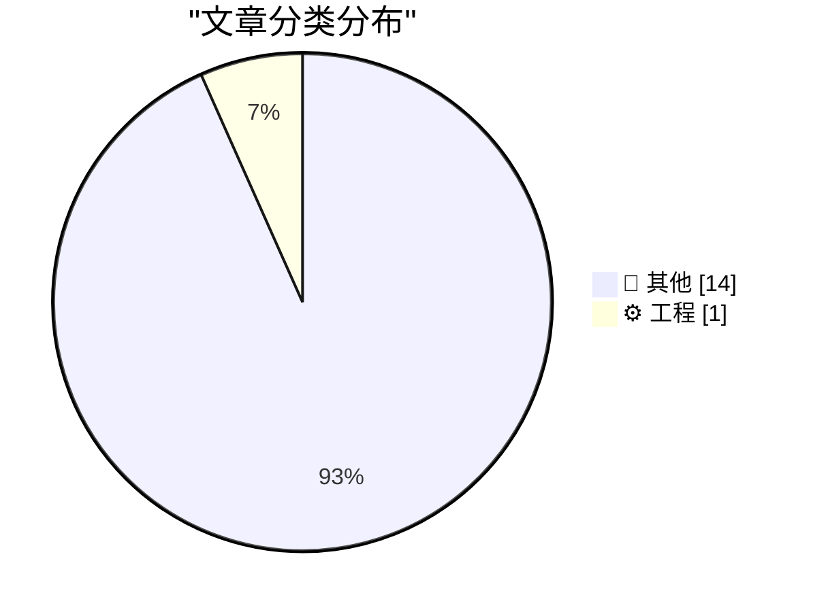
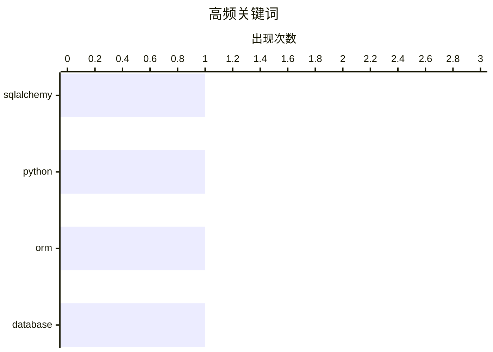

# 📰 AI 博客每日精选 — 2026-04-17

> 来自 Karpathy 推荐的 92 个顶级技术博客，AI 精选 Top 15

## 📝 今日看点

今日技术圈聚焦于 AI 模型端侧落地与消费电子体验争议。本地运行的大模型表现抢眼，开源方案正逐步缩小与云端闭源巨头的差距。苹果生态同时面临安全漏洞与用户体验下滑的双重审视，引发行业对平台治理的反思。此外，数据库工程实践与无障碍设计仍是开发者夯实基础的关键议题。

---

## 🏆 今日必读

🥇 **SQLAlchemy 2 In Practice - Chapter 5 - Advanced Many-To-Many Relationships**

[SQLAlchemy 2 In Practice - Chapter 5 - Advanced Many-To-Many Relationships](https://blog.miguelgrinberg.com/post/sqlalchemy-2-in-practice---chapter-5---advanced-many-to-many-relationships) — miguelgrinberg.com · 12 小时前 · ⚙️ 工程

> SQLAlchemy 2 In Practice - Chapter 5 - Advanced Many-To-Many Relationships

🏷️ SQLAlchemy, Python, ORM, database

🥈 **llm-anthropic 0.25**

[llm-anthropic 0.25](https://simonwillison.net/2026/Apr/16/llm-anthropic/#atom-everything) — simonwillison.net · 3 小时前 · 📝 其他

> llm-anthropic 0.25

🥉 **Qwen3.6-35B-A3B on my laptop drew me a better pelican than Claude Opus 4.7**

[Qwen3.6-35B-A3B on my laptop drew me a better pelican than Claude Opus 4.7](https://simonwillison.net/2026/Apr/16/qwen-beats-opus/#atom-everything) — simonwillison.net · 6 小时前 · 📝 其他

> Qwen3.6-35B-A3B on my laptop drew me a better pelican than Claude Opus 4.7

---

## 📊 数据概览

| 扫描源 | 抓取文章 | 时间范围 | 精选 |
|:---:|:---:|:---:|:---:|
| 78/92 | 2345 篇 → 21 篇 | 24h | **15 篇** |

### 分类分布



### 高频关键词



<details>
<summary>📈 纯文本关键词图（终端友好）</summary>

```
sqlalchemy │ ████████████████████ 1
python     │ ████████████████████ 1
orm        │ ████████████████████ 1
database   │ ████████████████████ 1
```

</details>

### 🏷️ 话题标签

**sqlalchemy**(1) · **python**(1) · **orm**(1) · database(1)

---

## 📝 其他

### 1. llm-anthropic 0.25

[llm-anthropic 0.25](https://simonwillison.net/2026/Apr/16/llm-anthropic/#atom-everything) — **simonwillison.net** · 3 小时前 · ⭐ 15/30

> llm-anthropic 0.25

---

### 2. Qwen3.6-35B-A3B on my laptop drew me a better pelican than Claude Opus 4.7

[Qwen3.6-35B-A3B on my laptop drew me a better pelican than Claude Opus 4.7](https://simonwillison.net/2026/Apr/16/qwen-beats-opus/#atom-everything) — **simonwillison.net** · 6 小时前 · ⭐ 15/30

> Qwen3.6-35B-A3B on my laptop drew me a better pelican than Claude Opus 4.7

---

### 3. datasette.io news preview

[datasette.io news preview](https://simonwillison.net/2026/Apr/16/datasette-io-preview/#atom-everything) — **simonwillison.net** · 23 小时前 · ⭐ 15/30

> datasette.io news preview

---

### 4. Colliding With Reality, Indeed

[Colliding With Reality, Indeed](https://www.nytimes.com/2026/04/15/us/politics/trump-iran-war.html?unlocked_article_code=1.bVA.EB30.mygpleorcQhg&amp;smid=url-share) — **daringfireball.net** · 3 小时前 · ⭐ 15/30

> Colliding With Reality, Indeed

---

### 5. How to Format 10-Digit Phone Numbers

[How to Format 10-Digit Phone Numbers](https://www.threads.com/@apstylebook/post/DXKtXVXEh7T) — **daringfireball.net** · 4 小时前 · ⭐ 15/30

> How to Format 10-Digit Phone Numbers

---

### 6. Chance Miller: ‘Netflix Ruined Its Apple TV App by Switching to a Custom Video Player’

[Chance Miller: ‘Netflix Ruined Its Apple TV App by Switching to a Custom Video Player’](https://9to5mac.com/2026/04/15/netflix-ruined-its-apple-tv-app-by-switching-to-a-custom-video-player/) — **daringfireball.net** · 4 小时前 · ⭐ 15/30

> Chance Miller: ‘Netflix Ruined Its Apple TV App by Switching to a Custom Video Player’

---

### 7. Apple Pay Express Transit Mode, When Used With a Visa Card, Is Vulnerable to Scam Tap-to-Pay Readers

[Apple Pay Express Transit Mode, When Used With a Visa Card, Is Vulnerable to Scam Tap-to-Pay Readers](https://www.macrumors.com/2026/04/15/apple-pay-visa-transit-exploit/) — **daringfireball.net** · 5 小时前 · ⭐ 15/30

> Apple Pay Express Transit Mode, When Used With a Visa Card, Is Vulnerable to Scam Tap-to-Pay Readers

---

### 8. Bonus Thought Regarding the Name ‘iPhone Ultra’

[Bonus Thought Regarding the Name ‘iPhone Ultra’](https://daringfireball.net/linked/2026/04/14/name-of-foldable-iphone) — **daringfireball.net** · 8 小时前 · ⭐ 15/30

> Bonus Thought Regarding the Name ‘iPhone Ultra’

---

### 9. Rory Goss’s Accessibility Story

[Rory Goss’s Accessibility Story](https://www.apple.com/education/college-students/success-stories/goss/) — **daringfireball.net** · 9 小时前 · ⭐ 15/30

> Rory Goss’s Accessibility Story

---

### 10. 如此接近正轨

[So Close to Getting It](https://www.theverge.com/tech/906873/sofa-app-track-tv-movies-installer) — **daringfireball.net** · 23 小时前 · ⭐ 15/30

> The Verge 的 Installer 专栏高度评价了 Sofa 5.0 更新，认为其已从单纯的影视追踪工具转变为个人生活管理中心。新版本支持管理观看、阅读、游戏甚至线下活动，被比喻为个人生活的 Notion。虽然仅限 Apple 设备使用，但其进度环和主页推荐功能显著提升了追踪效率。作者认为这次更新解决了用户难以记住进度和下一步做什么的核心痛点。Sofa 5.0 通过一键复选框和可视化进度展示了强大的生活组织能力。

---

### 11. Sofa 5.0

[Sofa 5.0](https://www.sofahq.com/5) — **daringfireball.net** · 23 小时前 · ⭐ 15/30

> Sofa 5.0 旨在解决用户在多种媒体内容中难以记住进度和下一步行动的问题。应用通过封面进度环让用户一目了然地查看状态，主页则提供一键复选框以推动进度。提供了五种不同的追踪模式，用户可根据需求选择从零设置到详细管理的不同层级。核心设计理念是降低记录负担，让找回中断内容变得容易。更新强调了可视化反馈和简化操作来提升用户留存率。

---

### 12. AI 网络安全并非工作量证明

[AI cybersecurity is not proof of work](http://antirez.com/news/163) — **antirez.com** · 13 小时前 · ⭐ 15/30

> 将 AI 网络安全比作工作量证明的观点存在本质错误，因为两者在资源不对称性上完全不同。寻找哈希碰撞只要算力足够终将成功，但代码中的 Bug 搜索受限于代码可能状态的分支饱和。不同大语言模型执行会走不同分支，但针对特定代码采样 Bug 并非单纯的算力堆砌问题。漏洞挖掘的逻辑复杂性不同于哈希计算的线性难度增长。这一观点对评估 AI 在安全领域的实际效能提出了关键质疑。

---

### 13. 多元主义：给 AI 末日论者的帕斯卡赌注 (2026 年 4 月 16 日)

[Pluralistic: A Pascal's Wager for AI Doomers (16 Apr 2026)](https://pluralistic.net/2026/04/16/pascals-wager/) — **pluralistic.net** · 13 小时前 · ⭐ 15/30

> “人工智能末日论者的帕斯卡赌注”这一主题探讨了当前技术生态中潜在的生存风险。文章串联了数字版权管理、加密技术、版权争议及地缘政治等多个看似独立实则关联的议题。内容涵盖电子书海盗、开源 DRM 及加密现状，暗示技术控制权正在悄然转移。核心观点在于我们可能已经在不知不觉中成为了技术垄断的牺牲品，如同被变成回形针。整体旨在引发对技术伦理和权力结构的深层思考。

---

### 14. WordPress 的 RSS 俱乐部

[RSS Club for WordPress](https://shkspr.mobi/blog/2026/04/rss-club-for-wordpress/) — **shkspr.mobi** · 12 小时前 · ⭐ 15/30

> 基于 WordPress 的隐藏社交网络方案名为 RSS Club，允许博主发布仅在 RSS 或 Atom 订阅源中可见的内容。网站前端不渲染任何 HTML 页面，确保帖子不在公共网页上索引。这种机制创建了一个仅对订阅者开放的私密交流空间，实现了“隐形”的内容分发。实施需要特定配置以确保内容隐蔽性。这为希望回归去中心化社交且保护隐私的内容创作者提供了新思路。

---

## ⚙️ 工程

### 15. SQLAlchemy 2 In Practice - Chapter 5 - Advanced Many-To-Many Relationships

[SQLAlchemy 2 In Practice - Chapter 5 - Advanced Many-To-Many Relationships](https://blog.miguelgrinberg.com/post/sqlalchemy-2-in-practice---chapter-5---advanced-many-to-many-relationships) — **miguelgrinberg.com** · 12 小时前 · ⭐ 20/30

> SQLAlchemy 2 In Practice - Chapter 5 - Advanced Many-To-Many Relationships

🏷️ SQLAlchemy, Python, ORM, database

---

*生成于 2026-04-17 00:12 | 扫描 78 源 → 获取 2345 篇 → 精选 15 篇*
*基于 [Hacker News Popularity Contest 2025](https://refactoringenglish.com/tools/hn-popularity/) RSS 源列表，由 [Andrej Karpathy](https://x.com/karpathy) 推荐*
*由「懂点儿AI」制作，欢迎关注同名微信公众号获取更多 AI 实用技巧 💡*
