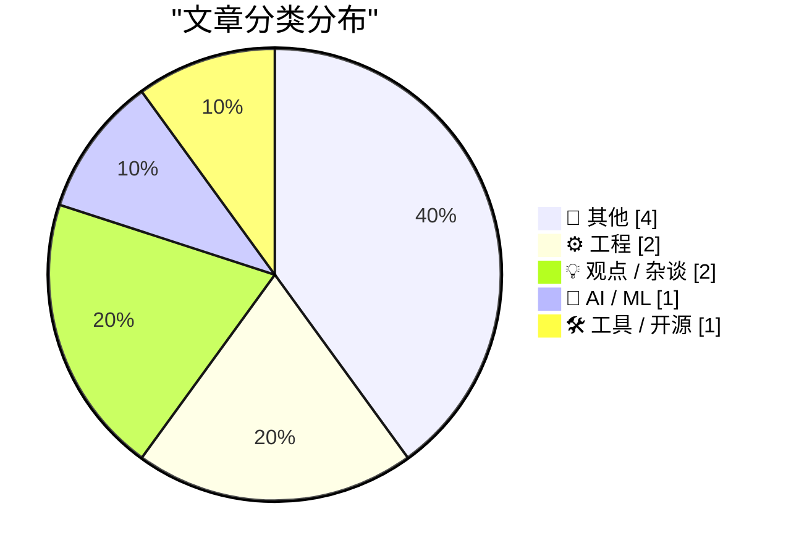
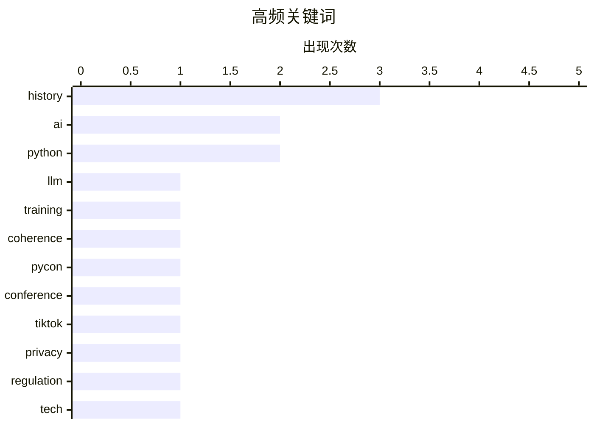

# 📰 AI 博客每日精选 — 2026-04-18

> 来自 Karpathy 推荐的 92 个顶级技术博客，AI 精选 Top 10

## 📝 今日看点

人工智能工程化进程显著加速，大模型训练连贯性取得理论突破，主流技术社区亦通过增设专项赛道全面回应智能化浪潮。平台生态与社会影响引发深度反思，应用商店评价机制缺陷与短视频文化现象成为业界批判性讨论的核心。技术历史回顾亦成今日亮点，MP3 专利终结与遗留代码探秘勾勒出行业发展的纵深脉络。整体而言，技术圈在追逐前沿创新的同时，正更加注重生态健康与历史沉淀。

---

## 🏆 今日必读

🥇 **How an LLM becomes more coherent as we train it**

[How an LLM becomes more coherent as we train it](https://www.gilesthomas.com/2026/04/how-an-llm-becomes-more-coherent-over-training) — gilesthomas.com · 59 分钟前 · 🤖 AI / ML

> How an LLM becomes more coherent as we train it

🏷️ LLM, training, coherence, AI

🥈 **Join us at PyCon US 2026 in Long Beach - we have new AI and security tracks this year**

[Join us at PyCon US 2026 in Long Beach - we have new AI and security tracks this year](https://simonwillison.net/2026/Apr/17/pycon-us-2026/#atom-everything) — simonwillison.net · 30 分钟前 · ⚙️ 工程

> Join us at PyCon US 2026 in Long Beach - we have new AI and security tracks this year

🏷️ PyCon, Python, conference, AI

🥉 **Pluralistic: Tiktokification shall set us free (17 Apr 2026)**

[Pluralistic: Tiktokification shall set us free (17 Apr 2026)](https://pluralistic.net/2026/04/17/for-youze/) — pluralistic.net · 13 小时前 · 💡 观点 / 杂谈

> Pluralistic: Tiktokification shall set us free (17 Apr 2026)

🏷️ TikTok, privacy, regulation, tech

---

## 📊 数据概览

| 扫描源 | 抓取文章 | 时间范围 | 精选 |
|:---:|:---:|:---:|:---:|
| 78/92 | 2345 篇 → 10 篇 | 24h | **10 篇** |

### 分类分布



### 高频关键词



<details>
<summary>📈 纯文本关键词图（终端友好）</summary>

```
history    │ ████████████████████ 3
ai         │ █████████████░░░░░░░ 2
python     │ █████████████░░░░░░░ 2
llm        │ ███████░░░░░░░░░░░░░ 1
training   │ ███████░░░░░░░░░░░░░ 1
coherence  │ ███████░░░░░░░░░░░░░ 1
pycon      │ ███████░░░░░░░░░░░░░ 1
conference │ ███████░░░░░░░░░░░░░ 1
tiktok     │ ███████░░░░░░░░░░░░░ 1
privacy    │ ███████░░░░░░░░░░░░░ 1
```

</details>

### 🏷️ 话题标签

**history**(3) · **ai**(2) · **python**(2) · llm(1) · training(1) · coherence(1) · pycon(1) · conference(1) · tiktok(1) · privacy(1) · regulation(1) · tech(1) · datasette(1) · release(1) · data(1) · app store(1) · reviews(1) · ios(1) · policy(1) · windows(1)

---

## 📝 其他

### 1. The Mystery of Rennes-le-Château, Part 4: Non-Fiction Meets Fiction

[The Mystery of Rennes-le-Château, Part 4: Non-Fiction Meets Fiction](https://www.filfre.net/2026/04/the-mystery-of-rennes-le-chateau-part-4-non-fiction-meets-fiction/) — **filfre.net** · 8 小时前 · ⭐ 16/30

> The Mystery of Rennes-le-Château, Part 4: Non-Fiction Meets Fiction

🏷️ gaming, history, narrative, design

---

### 2. The last MP3 patent

[The last MP3 patent](https://dfarq.homeip.net/mp3-is-dead-long-live-mp3-oh-wait-its-just-the-patent/?utm_source=rss&#038;utm_medium=rss&#038;utm_campaign=mp3-is-dead-long-live-mp3-oh-wait-its-just-the-patent) — **dfarq.homeip.net** · 13 小时前 · ⭐ 16/30

> The last MP3 patent

🏷️ MP3, patent, licensing, history

---

### 3. Premium: The Hater's Guide to Private Credit

[Premium: The Hater's Guide to Private Credit](https://www.wheresyoured.at/hatersguide-privatecredit/) — **wheresyoured.at** · 7 小时前 · ⭐ 15/30

> Premium: The Hater's Guide to Private Credit

🏷️ finance, credit, spam, consumer

---

### 4. Book Review: How To Kill A Witch - A Guide For The Patriarchy by Claire Mitchell and Zoe Venditozzi ★★★⯪☆

[Book Review: How To Kill A Witch - A Guide For The Patriarchy by Claire Mitchell and Zoe Venditozzi ★★★⯪☆](https://shkspr.mobi/blog/2026/04/book-review-how-to-kill-a-witch-a-guide-for-the-patriarchy-by-claire-mitchell-and-zoe-venditozzi/) — **shkspr.mobi** · 12 小时前 · ⭐ 14/30

> Book Review: How To Kill A Witch - A Guide For The Patriarchy by Claire Mitchell and Zoe Venditozzi ★★★⯪☆

🏷️ book, history, society, review

---

## ⚙️ 工程

### 5. Join us at PyCon US 2026 in Long Beach - we have new AI and security tracks this year

[Join us at PyCon US 2026 in Long Beach - we have new AI and security tracks this year](https://simonwillison.net/2026/Apr/17/pycon-us-2026/#atom-everything) — **simonwillison.net** · 30 分钟前 · ⭐ 23/30

> Join us at PyCon US 2026 in Long Beach - we have new AI and security tracks this year

🏷️ PyCon, Python, conference, AI

---

### 6. Forgotten message from the past: LB_INIT­STORAGE

[Forgotten message from the past: LB_INIT­STORAGE](https://devblogs.microsoft.com/oldnewthing/20260417-00/?p=112243) — **devblogs.microsoft.com/oldnewthing** · 10 小时前 · ⭐ 21/30

> Forgotten message from the past: LB_INIT­STORAGE

🏷️ Windows, API, memory, legacy

---

## 💡 观点 / 杂谈

### 7. Pluralistic: Tiktokification shall set us free (17 Apr 2026)

[Pluralistic: Tiktokification shall set us free (17 Apr 2026)](https://pluralistic.net/2026/04/17/for-youze/) — **pluralistic.net** · 13 小时前 · ⭐ 23/30

> Pluralistic: Tiktokification shall set us free (17 Apr 2026)

🏷️ TikTok, privacy, regulation, tech

---

### 8. App Store Reviews Are Busted

[App Store Reviews Are Busted](https://blog.terrygodier.com/2026/04/13/app-store-reviews-are-busted.html) — **daringfireball.net** · 23 小时前 · ⭐ 21/30

> App Store Reviews Are Busted

🏷️ App Store, reviews, iOS, policy

---

## 🤖 AI / ML

### 9. How an LLM becomes more coherent as we train it

[How an LLM becomes more coherent as we train it](https://www.gilesthomas.com/2026/04/how-an-llm-becomes-more-coherent-over-training) — **gilesthomas.com** · 59 分钟前 · ⭐ 25/30

> How an LLM becomes more coherent as we train it

🏷️ LLM, training, coherence, AI

---

## 🛠 工具 / 开源

### 10. datasette 1.0a28

[datasette 1.0a28](https://simonwillison.net/2026/Apr/17/datasette/#atom-everything) — **simonwillison.net** · 20 小时前 · ⭐ 21/30

> datasette 1.0a28

🏷️ Datasette, release, Python, data

---

*生成于 2026-04-18 00:29 | 扫描 78 源 → 获取 2345 篇 → 精选 10 篇*
*基于 [Hacker News Popularity Contest 2025](https://refactoringenglish.com/tools/hn-popularity/) RSS 源列表，由 [Andrej Karpathy](https://x.com/karpathy) 推荐*
*由「懂点儿AI」制作，欢迎关注同名微信公众号获取更多 AI 实用技巧 💡*
