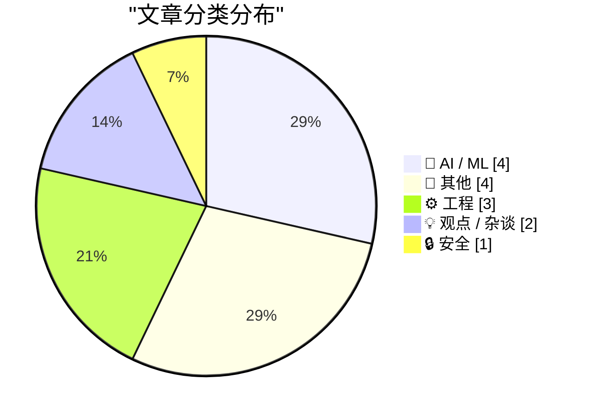
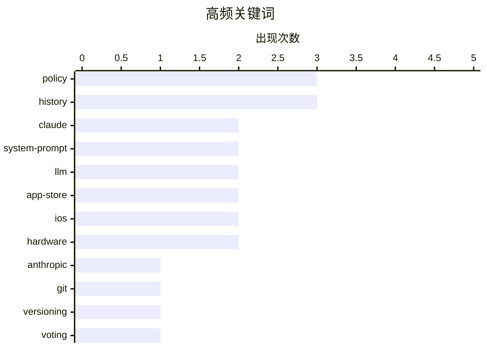

# 📰 AI 博客每日精选 — 2026-04-19

> 来自 Karpathy 推荐的 92 个顶级技术博客，AI 精选 Top 14

## 📝 今日看点

今日技术焦点集中于 AI 基础设施的透明化与极致优化，Anthropic 公开系统提示词版本管理引发行业对模型可解释性的新思考，而 FP4 等低精度量化技术正成为突破显存瓶颈的关键方案。平台生态方面，苹果面临政策与供应链的双重考验，App Store 评论机制被指失衡，高端 Mac 设备亦出现供应短缺。这些动态共同勾勒出当前技术界在追求算法演进的同时，仍需应对平台治理与硬件落地的现实挑战。

---

## 🏆 今日必读

🥇 **Claude Opus 4.6 与 4.7 之间系统提示词的变化**

[Changes in the system prompt between Claude Opus 4.6 and 4.7](https://simonwillison.net/2026/Apr/18/opus-system-prompt/#atom-everything) — simonwillison.net · 19 分钟前 · 🤖 AI / ML

> Anthropic 是唯一发布用户面向聊天系统系统提示词的主要 AI 实验室，其档案可追溯至 2024 年 7 月的 Claude 3。Opus 4.7 于 2026 年 4 月 16 日发布，伴随 Claude.ai 系统提示词的更新。对比 Opus 4.6 与 4.7 的提示词差异，可以观察模型迭代背后的指令优化策略。这种透明度为研究大模型对齐和安全策略提供了罕见的一手数据。

💡 **为什么值得读**: 了解顶级模型如何通过系统提示词微调行为，对提示词工程师极具参考价值。

🏷️ Claude, system-prompt, LLM, Anthropic

🥈 **将 Claude 系统提示词构建为 Git 时间线**

[Claude system prompts as a git timeline](https://simonwillison.net/2026/Apr/18/extract-system-prompts/#atom-everything) — simonwillison.net · 11 小时前 · 🤖 AI / ML

> Anthropic 公开了 Claude 聊天的系统提示词并提供 Markdown 版本，便于自动化处理。作者利用 Claude Code 将这些页面转换为每个模型独立的文件，建立了版本控制的 Git 时间线。这种方法使得追踪系统提示词随模型版本演变的细节变得更加直观和可查询。项目代码已开源在 GitHub 上，供研究者直接分析提示词历史差异。

💡 **为什么值得读**: 提供了现成的工具链来可视化分析提示词演变，节省手动整理数据的时间。

🏷️ Claude, system-prompt, git, versioning

🥉 **Pluralistic：佐治亚州的投票技术失误（2026 年 4 月 18 日）**

[Pluralistic: Georgia's voting technology blunder (18 Apr 2026)](https://pluralistic.net/2026/04/18/dominion-sucks-actually/) — pluralistic.net · 11 小时前 · 🔒 安全

> 佐治亚州投票技术存在实际问题，Dominion 投票机确实存在缺陷，但并非 Tucker Carlson 所声称的那种方式。作者通过区分事实与误导性的政治叙事，揭示了技术故障与阴谋论之间的界限。文中还串联了关于技术封建债务、非法 iPod 等多个科技文化议题的链接。核心在于批判性地分析技术在社会政治场景中的实际表现与舆论扭曲。

💡 **为什么值得读**: 透过喧嚣的政治言论看清投票技术的真实缺陷，适合关注科技与社会治理的读者。

🏷️ voting, security, technology, policy

---

## 📊 数据概览

| 扫描源 | 抓取文章 | 时间范围 | 精选 |
|:---:|:---:|:---:|:---:|
| 78/92 | 2345 篇 → 14 篇 | 24h | **14 篇** |

### 分类分布



### 高频关键词



<details>
<summary>📈 纯文本关键词图（终端友好）</summary>

```
policy        │ ████████████████████ 3
history       │ ████████████████████ 3
claude        │ █████████████░░░░░░░ 2
system-prompt │ █████████████░░░░░░░ 2
llm           │ █████████████░░░░░░░ 2
app-store     │ █████████████░░░░░░░ 2
ios           │ █████████████░░░░░░░ 2
hardware      │ █████████████░░░░░░░ 2
anthropic     │ ███████░░░░░░░░░░░░░ 1
git           │ ███████░░░░░░░░░░░░░ 1
```

</details>

### 🏷️ 话题标签

**policy**(3) · **history**(3) · **claude**(2) · system-prompt(2) · llm(2) · app-store(2) · ios(2) · hardware(2) · anthropic(1) · git(1) · versioning(1) · voting(1) · security(1) · technology(1) · quantization(1) · nf4(1) · weights(1) · agents(1) · automation(1) · prompt(1)

---

## 🤖 AI / ML

### 1. Claude Opus 4.6 与 4.7 之间系统提示词的变化

[Changes in the system prompt between Claude Opus 4.6 and 4.7](https://simonwillison.net/2026/Apr/18/opus-system-prompt/#atom-everything) — **simonwillison.net** · 19 分钟前 · ⭐ 25/30

> Anthropic 是唯一发布用户面向聊天系统系统提示词的主要 AI 实验室，其档案可追溯至 2024 年 7 月的 Claude 3。Opus 4.7 于 2026 年 4 月 16 日发布，伴随 Claude.ai 系统提示词的更新。对比 Opus 4.6 与 4.7 的提示词差异，可以观察模型迭代背后的指令优化策略。这种透明度为研究大模型对齐和安全策略提供了罕见的一手数据。

🏷️ Claude, system-prompt, LLM, Anthropic

---

### 2. 将 Claude 系统提示词构建为 Git 时间线

[Claude system prompts as a git timeline](https://simonwillison.net/2026/Apr/18/extract-system-prompts/#atom-everything) — **simonwillison.net** · 11 小时前 · ⭐ 25/30

> Anthropic 公开了 Claude 聊天的系统提示词并提供 Markdown 版本，便于自动化处理。作者利用 Claude Code 将这些页面转换为每个模型独立的文件，建立了版本控制的 Git 时间线。这种方法使得追踪系统提示词随模型版本演变的细节变得更加直观和可查询。项目代码已开源在 GitHub 上，供研究者直接分析提示词历史差异。

🏷️ Claude, system-prompt, git, versioning

---

### 3. 大语言模型的高斯分布权重

[Gaussian distributed weights for LLMs](https://www.johndcook.com/blog/2026/04/18/qlora/) — **johndcook.com** · 9 小时前 · ⭐ 23/30

> 继 FP4 4 位浮点格式讨论后，内容深入分析了另一种常见的 4 位格式 NF4 及其更高精度类比。NF4 和 FP4 是 bitsandbytes 库中常用的 4 位数据类型，常用于 Hugging Face 上下载的量化大模型权重。解释了为何大模型权重通常符合高斯分布，以及 NF4 如何针对这种分布优化量化精度。理解这些底层数据格式有助于开发者选择合适的量化方案以平衡性能与显存占用。

🏷️ LLM, quantization, NF4, weights

---

### 4. 为我的博客转通讯工具添加新内容类型

[Adding a new content type to my blog-to-newsletter tool](https://simonwillison.net/guides/agentic-engineering-patterns/adding-a-new-content-type/#atom-everything) — **simonwillison.net** · 21 小时前 · ⭐ 22/30

> 作者展示了如何使用一个看似简短的提示词，在单次操作中完成为博客转通讯工具添加新内容类型的复杂工作。该工具用于将博客内容自动复制粘贴到每周一次的免费 Substack 通讯中。通过 Agentic Engineering Patterns 实践，证明了精心设计的提示词能大幅减少手动维护订阅源的成本。这一案例体现了代理工程模式在实际工作流自动化中的高效性。

🏷️ agents, automation, prompt, tooling

---

## 📝 其他

### 5. Mac Mini 和 Mac Studio 供应短缺

[Mac Mini and Mac Studio Supply Shortages](https://www.wsj.com/tech/personal-tech/apple-mac-mini-supply-3e7a7509?st=fKpr4Q) — **daringfireball.net** · 7 小时前 · ⭐ 19/30

> 配备大容量 RAM 芯片的 Mac Mini 目前处于缺货状态，包括起价 999 美元的 32GB M4 模型和起价 1999 美元的 64GB M4 Pro 模型。其他型号的预期发货等待时间约为一个月，部分情况长达 12 周，这种短缺也延伸到了其他零售商。更强大的 Mac Studio 供应情况甚至更为紧张。这一现象反映了苹果在高端内存芯片供应链上面临的挑战及市场需求的热度。

🏷️ Apple, Mac, hardware, supply-chain

---

### 6. 阅读清单 2026 年 4 月 18 日

[Reading List 04/18/2026](https://www.construction-physics.com/p/reading-list-04182026) — **construction-physics.com** · 12 小时前 · ⭐ 18/30

> 本期阅读清单涵盖了四足焊接机器人、中国冲击 2.0 以及变压器初创企业等多个前沿领域。内容还包括对中国神秘移动卫星的观察分析以及其他行业动态。这些主题反映了当前制造业、地缘经济与航天技术的交叉趋势。读者可以通过此清单快速捕捉 2026 年 4 月中旬的关键技术动向。作者旨在提供跨领域的深度资讯聚合。

🏷️ robotics, startups, satellites, policy

---

### 7. 一场令人头疼的税务讨论

[A Taxing Discussion](https://feed.tedium.co/link/15204/17321557/tax-forms-history-irs) — **tedium.co** · 5 小时前 · ⭐ 14/30

> 税务表格的复杂性并非现代产物，早在最初引入时就已经令人困惑。文章聚焦于 1040 表格的历史演变，揭示其设计背后的逻辑与混乱根源。通过回顾税务系统的早期形态，说明繁琐流程是长期存在的系统性问题。这种历史视角有助于理解当前 IRS 申报流程为何如此难以简化。作者核心观点是税务的混乱具有深厚的历史惯性。

🏷️ taxes, history, 1040, forms

---

### 8. ★“车轮上的阅览室、情人巷，以及晚上 11 点后的廉价旅馆”

[★ ‘A Reading Room on Wheels, a Lover’s Lane, and, After 11 PM, a Flophouse’](https://daringfireball.net/2026/04/kubrick_new_york_subway) — **daringfireball.net** · 6 小时前 · ⭐ 13/30

> 著名导演斯坦利·库布里克在青少年时期曾拍摄过一组 1940 年代纽约地铁的照片。这些影像记录了当时地铁作为流动阅览室、情人巷以及深夜廉价旅馆的多重面貌。作品展现了库布里克早期对光影与社会场景的敏锐捕捉能力。这批历史照片为研究库布里克的艺术成长路径提供了珍贵素材。作者通过分享这些照片回顾了大师的早期创作历程。

🏷️ photography, history, Kubrick, art

---

## ⚙️ 工程

### 9. B-52 轰炸机星体跟踪器内的机电角度计算机

[The electromechanical angle computer inside the B-52 bomber's star tracker](http://www.righto.com/feeds/8382904110431912671/comments/default) — **righto.com** · 7 小时前 · ⭐ 22/30

> 在 GPS 出现之前，飞机导航依赖天文导航，但手动操作困难且耗时。20 世纪 60 年代初，B-52 轰炸机开发了一套自动跟踪星体并计算导航信息的系统，当时数字计算机尚不适用。该系统核心是一个机电角度计算机，通过模拟电路和机械结构解决复杂的导航计算问题。内容详细拆解了这一历史硬件的工作原理，展示了早期航空电子技术的精妙设计。

🏷️ hardware, navigation, computer, history

---

### 10. 4 位浮点数 FP4

[4-bit floating point FP4](https://www.johndcook.com/blog/2026/04/17/fp4/) — **johndcook.com** · 23 小时前 · ⭐ 21/30

> 浮点数存储从早期的 32 位 float 发展到标准的 64 位 double，而现代 AI 硬件开始探索更低的精度。内容介绍了 4 位浮点格式 FP4，这是为了适应大模型推理对显存带宽和容量的极致需求。文章对比了 C 语言和 Python 中传统浮点类型与现代低精度格式的差异。理解 FP4 有助于把握硬件加速和模型量化背后的数值表示基础。

🏷️ float, FP4, precision, C

---

### 11. 苹果关于评分和评论提示的开发者指南

[Apple’s Developer Guidelines for Ratings and Review Prompts](https://developer.apple.com/design/human-interface-guidelines/ratings-and-reviews#Best-practices) — **daringfireball.net** · 23 小时前 · ⭐ 20/30

> 苹果人机界面指南明确建议开发者避免频繁骚扰用户，建议在请求评分之间至少间隔一到两周。指南强调应在用户表现出额外参与度后再进行提示，并优先使用系统提供的标准提示框。这种非侵入式的方式旨在保持一致的用户体验，防止因过度请求导致用户对应用产生负面看法。遵循这些最佳实践有助于在合规的前提下优化应用的评分收集策略。

🏷️ iOS, App-Store, guidelines, development

---

## 💡 观点 / 杂谈

### 12. 关于 App Store 评论系统确实已损坏的后续

[Follow-Up Regarding App Store Reviews, Which Are Definitely Busted](https://daringfireball.net/linked/2026/04/16/app-store-reviews-are-busted) — **daringfireball.net** · 23 小时前 · ⭐ 22/30

> App Store 的评论系统存在严重问题，像 Current 这样不主动索取评论的优质应用反而受到惩罚。开发者 Steven Troughton-Smith 指出，实施评论提示 API 能带来数千条正面评价，而不仅是寥寥几条。苹果编辑团队倾向于挑选拥有大量评论基础的应用进行推荐，导致不请求评论的应用面临"编辑自杀"的风险。这揭示了平台机制如何迫使开发者采取侵扰性策略以获取可见性。

🏷️ App-Store, reviews, iOS, policy

---

### 13. 我们都在工作中参与政治

[We Are All Playing Politics at Work](https://idiallo.com/blog/we-are-playing-politics?src=feed) — **idiallo.com** · 21 小时前 · ⭐ 18/30

> 职场中普遍存在一种错觉，认为只要呈现事实就能做出正确决策。实际上，任何真理无法主导行动方向的讨论都属于政治范畴，人类本质上是试图在不完美世界中周旋的政治动物。纯粹主义者试图将政治与工作分离往往是不切实际的幻想，因为员工并非处理数据的机器。承认职场政治的存在是理解组织行为的关键前提。作者核心观点是我们都在工作中参与政治，而非超脱其外。

🏷️ career, workplace, politics, culture

---

## 🔒 安全

### 14. Pluralistic：佐治亚州的投票技术失误（2026 年 4 月 18 日）

[Pluralistic: Georgia's voting technology blunder (18 Apr 2026)](https://pluralistic.net/2026/04/18/dominion-sucks-actually/) — **pluralistic.net** · 11 小时前 · ⭐ 23/30

> 佐治亚州投票技术存在实际问题，Dominion 投票机确实存在缺陷，但并非 Tucker Carlson 所声称的那种方式。作者通过区分事实与误导性的政治叙事，揭示了技术故障与阴谋论之间的界限。文中还串联了关于技术封建债务、非法 iPod 等多个科技文化议题的链接。核心在于批判性地分析技术在社会政治场景中的实际表现与舆论扭曲。

🏷️ voting, security, technology, policy

---

*生成于 2026-04-19 00:19 | 扫描 78 源 → 获取 2345 篇 → 精选 14 篇*
*基于 [Hacker News Popularity Contest 2025](https://refactoringenglish.com/tools/hn-popularity/) RSS 源列表，由 [Andrej Karpathy](https://x.com/karpathy) 推荐*
*由「懂点儿AI」制作，欢迎关注同名微信公众号获取更多 AI 实用技巧 💡*
