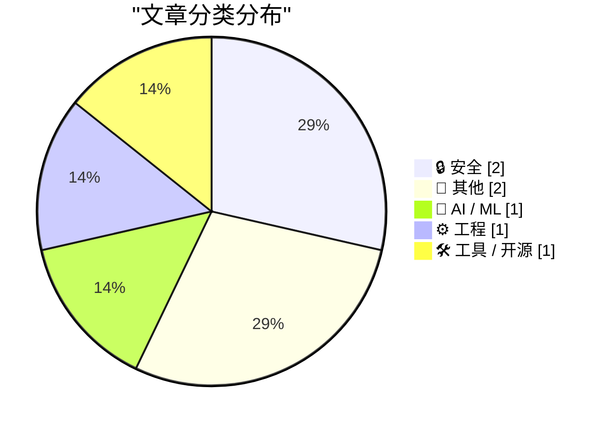
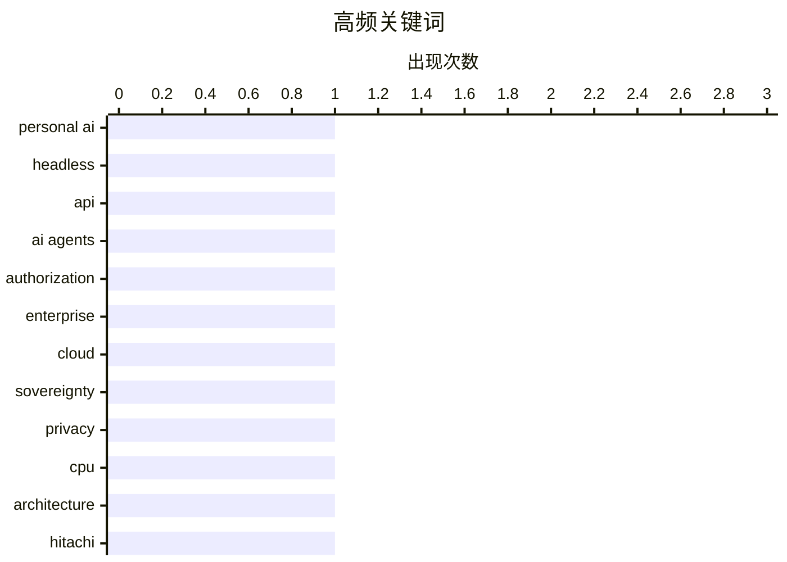

# 📰 AI 博客每日精选 — 2026-04-20

> 来自 Karpathy 推荐的 92 个顶级技术博客，AI 精选 Top 7

## 📝 今日看点

今日技术圈聚焦 AI 代理的基础设施演进与数据主权安全。个人 AI 交互正从 GUI 模拟转向高效的无头 API 模式，以解决效率与稳定性问题。企业级落地的核心瓶颈也被确认为授权管控，资源级权限成为限定代理操作半径的关键。与此同时，依赖美国云服务的法律与持续性风险再次凸显，警示行业需重新审视基础设施的独立性。

---

## 🏆 今日必读

🥇 **个人 AI 的“无头化”一切**

[Headless everything for personal AI](https://simonwillison.net/2026/Apr/19/headless-everything/#atom-everything) — simonwillison.net · 2 小时前 · 🤖 AI / ML

> 个人 AI 代理直接操作服务界面效率低下且不稳定。Matt Webb 提出无头（headless）服务将成为个人 AI 的主流交互方式。相比控制鼠标点击 GUI，无头 API 对 AI 而言速度更快且更可靠。这种架构转变能显著提升用户使用个人 AI 的体验。未来服务提供方将更多提供无头接口以适配 AI 代理。无头化是解决 AI 自动化瓶颈的关键路径。

💡 **为什么值得读**: 揭示了 AI Agent 落地过程中被忽视的基础设施演进方向。

🏷️ personal AI, headless, API

🥈 **WorkOS FGA：AI 代理的授权层**

[WorkOS FGA: The Authorization Layer for AI Agents](https://workos.com/blog/agents-need-authorization-not-just-authentication?utm_source=daringfireball&amp;utm_medium=newsletter&amp;utm_campaign=q22026) — daringfireball.net · 6 小时前 · 🔒 安全

> 企业级 AI 部署的核心瓶颈在于授权而非模型质量。大多数 AI 代理演示在企业落地时因授权问题受阻。认证仅证明身份，授权才定义代理的操作爆炸半径。WorkOS FGA 通过资源级权限控制来限定这一半径。获胜的企业 AI 将是那些能被安全信任的方案。

💡 **为什么值得读**: 指出了企业级 AI 代理落地中最关键的安全短板及解决方案。

🏷️ AI agents, authorization, enterprise

🥉 **堆叠文件无法让大型科技云更安全**

[Big tech clouds worden niet veiliger met stapels papier](https://berthub.eu/articles/posts/big-tech-clouds-niet-veiliger-met-papier/) — berthub.eu · 5 小时前 · 🔒 安全

> 依赖美国服务器存在主权和数据访问风险。将社会和政府数据交由美国服务器托管面临两大根本问题。服务持续性取决于美国政府的意愿，白宫一纸通知即可中断服务。即便微软服务器位于欧洲，美国法律工具仍允许其访问数据。纸质协议无法消除美国云服务的实际安全风险。

💡 **为什么值得读**: 揭示了欧洲视角下依赖美国云服务的深层主权与数据安全隐患。

🏷️ cloud, sovereignty, privacy

---

## 📊 数据概览

| 扫描源 | 抓取文章 | 时间范围 | 精选 |
|:---:|:---:|:---:|:---:|
| 78/92 | 2347 篇 → 7 篇 | 24h | **7 篇** |

### 分类分布



### 高频关键词



<details>
<summary>📈 纯文本关键词图（终端友好）</summary>

```
personal ai   │ ████████████████████ 1
headless      │ ████████████████████ 1
api           │ ████████████████████ 1
ai agents     │ ████████████████████ 1
authorization │ ████████████████████ 1
enterprise    │ ████████████████████ 1
cloud         │ ████████████████████ 1
sovereignty   │ ████████████████████ 1
privacy       │ ████████████████████ 1
cpu           │ ████████████████████ 1
```

</details>

### 🏷️ 话题标签

**personal ai**(1) · **headless**(1) · **api**(1) · ai agents(1) · authorization(1) · enterprise(1) · cloud(1) · sovereignty(1) · privacy(1) · cpu(1) · architecture(1) · hitachi(1) · ffmpeg(1) · video(1) · 360 camera(1) · apple tv(1) · streaming(1) · media(1) · memoir(1) · story(1)

---

## 🔒 安全

### 1. WorkOS FGA：AI 代理的授权层

[WorkOS FGA: The Authorization Layer for AI Agents](https://workos.com/blog/agents-need-authorization-not-just-authentication?utm_source=daringfireball&amp;utm_medium=newsletter&amp;utm_campaign=q22026) — **daringfireball.net** · 6 小时前 · ⭐ 24/30

> 企业级 AI 部署的核心瓶颈在于授权而非模型质量。大多数 AI 代理演示在企业落地时因授权问题受阻。认证仅证明身份，授权才定义代理的操作爆炸半径。WorkOS FGA 通过资源级权限控制来限定这一半径。获胜的企业 AI 将是那些能被安全信任的方案。

🏷️ AI agents, authorization, enterprise

---

### 2. 堆叠文件无法让大型科技云更安全

[Big tech clouds worden niet veiliger met stapels papier](https://berthub.eu/articles/posts/big-tech-clouds-niet-veiliger-met-papier/) — **berthub.eu** · 5 小时前 · ⭐ 23/30

> 依赖美国服务器存在主权和数据访问风险。将社会和政府数据交由美国服务器托管面临两大根本问题。服务持续性取决于美国政府的意愿，白宫一纸通知即可中断服务。即便微软服务器位于欧洲，美国法律工具仍允许其访问数据。纸质协议无法消除美国云服务的实际安全风险。

🏷️ cloud, sovereignty, privacy

---

## 📝 其他

### 3. 杰西卡·查斯坦称 Apple TV 终将发布《智者》

[Jessica Chastain Says Apple TV Will Finally Release ‘The Savant’](https://variety.com/2026/tv/columns/jessica-chastain-apple-tv-finally-release-the-savant-after-postponement-charlie-kirk-assassination-1236725384/) — **daringfireball.net** · 5 小时前 · ⭐ 13/30

> Apple TV 确认将发布此前搁置的政治惊悚剧《智者》。主演杰西卡·查斯坦在突破奖典礼上确认剧集即将上线。该剧此前因种种原因陷入发布日期的停滞状态。消息源指出 Apple 计划于 7 月正式推出该系列。观众将在今年 7 月看到这部备受关注的政治惊悚剧。

🏷️ Apple TV, streaming, media

---

### 4. 把它连接到机器上

[Hook It Up to the Machine](https://blog.jim-nielsen.com/2026/hook-it-up-to-the-machine/) — **blog.jim-nielsen.com** · 5 小时前 · ⭐ 12/30

> 文章讲述了 2000 年代初全家前往冰川国家公园的公路旅行。使用的绿色道奇 Caravan 面包车随后被证实存在质量缺陷。车辆在高速上运行正常，但时速低于 40 英里时温度表会升至危险区域。这段经历成为了作者对机械故障的深刻记忆。通过具体案例反映了旧式机械设备的可靠性问题。

🏷️ memoir, story, travel

---

## 🤖 AI / ML

### 5. 个人 AI 的“无头化”一切

[Headless everything for personal AI](https://simonwillison.net/2026/Apr/19/headless-everything/#atom-everything) — **simonwillison.net** · 2 小时前 · ⭐ 25/30

> 个人 AI 代理直接操作服务界面效率低下且不稳定。Matt Webb 提出无头（headless）服务将成为个人 AI 的主流交互方式。相比控制鼠标点击 GUI，无头 API 对 AI 而言速度更快且更可靠。这种架构转变能显著提升用户使用个人 AI 的体验。未来服务提供方将更多提供无头接口以适配 AI 代理。无头化是解决 AI 自动化瓶颈的关键路径。

🏷️ personal AI, headless, API

---

## ⚙️ 工程

### 6. 日立公司，第二部分

[Hitachi Ltd, Part II](https://www.abortretry.fail/p/hitachi-ltd-part-ii) — **abortretry.fail** · 3 小时前 · ⭐ 17/30

> 本文继续探讨日立公司历史上的处理器架构设计。重点分析了 H8、PA-RISC 和 SuperH 这三种特定指令集架构。这些技术代表了日立在嵌入式和计算领域的过往布局。文章回顾了这些架构的技术细节与市场命运。这是关于日立技术遗产系列回顾的第二部分。对于理解硬件演进具有参考价值。

🏷️ CPU, architecture, Hitachi

---

## 🛠 工具 / 开源

### 7. 将双鱼眼视频重投影为等距矩形（LG 360）

[Reprojecting Dual Fisheye Videos to Equirectangular (LG 360)](https://shkspr.mobi/blog/2026/04/reprojecting-dual-fisheye-videos-to-equirectangular-lg-360/) — **shkspr.mobi** · 12 小时前 · ⭐ 16/30

> LG 360 相机拍摄的 MP4 视频默认为双鱼眼格式，无法直接在 VLC 或 YouTube 球面模式下播放。需要通过重投影转换为等距矩形格式。作者提供了基于 ffmpeg 的具体转换命令方案。参数包括 input=dfisheye 和 output=equirect 以及 fov 设置。这是一种低成本复用旧硬件的有效方法。利用 ffmpeg 即可实现旧款全景视频格式的现代化兼容。

🏷️ ffmpeg, video, 360 camera

---

*生成于 2026-04-20 00:16 | 扫描 78 源 → 获取 2347 篇 → 精选 7 篇*
*基于 [Hacker News Popularity Contest 2025](https://refactoringenglish.com/tools/hn-popularity/) RSS 源列表，由 [Andrej Karpathy](https://x.com/karpathy) 推荐*
*由「懂点儿AI」制作，欢迎关注同名微信公众号获取更多 AI 实用技巧 💡*
