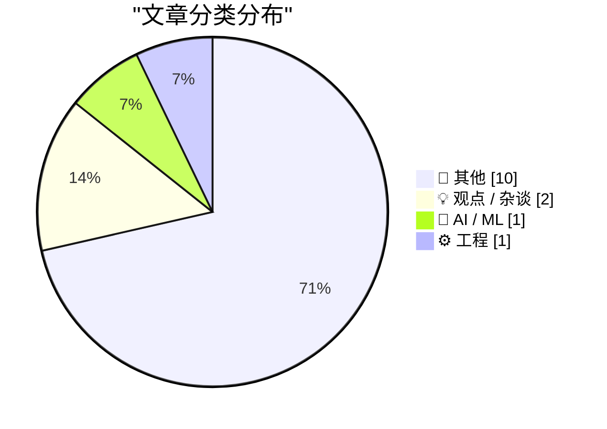
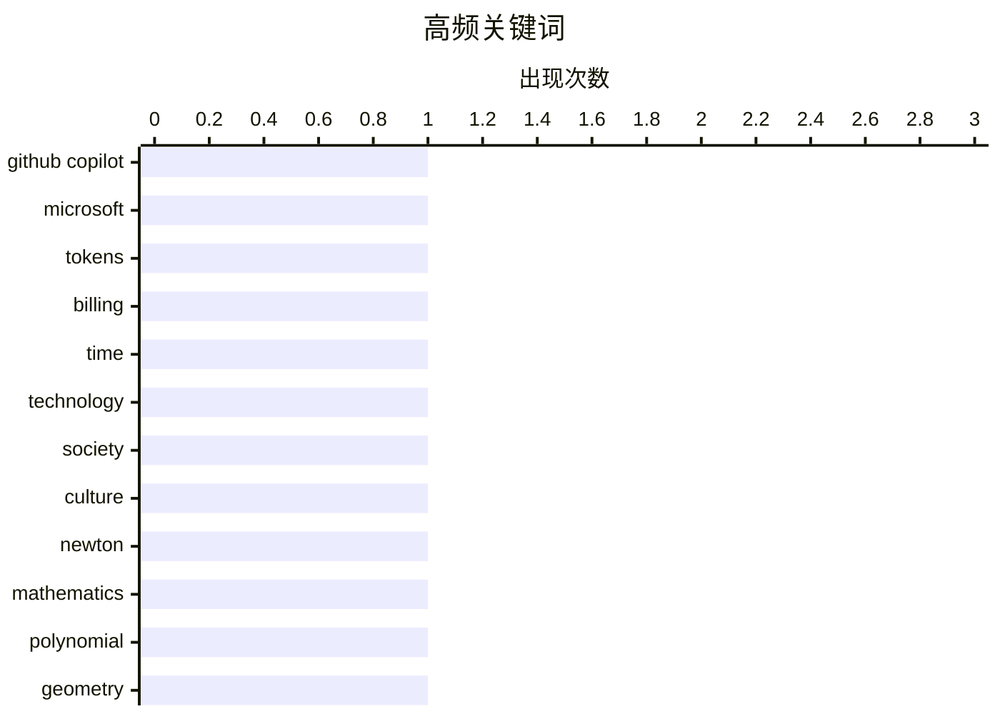

# 📰 AI 博客每日精选 — 2026-04-21

> 来自 Karpathy 推荐的 92 个顶级技术博客，AI 精选 Top 14

## 📝 今日看点

今日技术视野由 AI 计费模式变革与巨头高层调整主导。微软拟将 GitHub Copilot 转为 Token 计费，预示 AI 工具商业化迈入成本敏感新阶段。苹果同步披露高层人事调整与环境进展，展现科技巨头在战略迭代与社会责任上的双重布局。社区对摩尔定律及当下生活的哲学反思，则为技术狂飙增添了人文审视维度。

---

## 🏆 今日必读

🥇 **Exclusive: Microsoft To Shift GitHub Copilot Users To Token-Based Billing, Tighten Rate Limits**

[Exclusive: Microsoft To Shift GitHub Copilot Users To Token-Based Billing, Tighten Rate Limits](https://www.wheresyoured.at/news-microsoft-to-shift-github-copilot-users-to-token-based-billing-reduce-rate-limits-2/) — wheresyoured.at · 7 小时前 · 🤖 AI / ML

> Exclusive: Microsoft To Shift GitHub Copilot Users To Token-Based Billing, Tighten Rate Limits

🏷️ GitHub Copilot, Microsoft, tokens, billing

🥈 **How we lost the living Now**

[How we lost the living Now](https://www.joanwestenberg.com/how-we-lost-the-living-now/) — joanwestenberg.com · 23 小时前 · 💡 观点 / 杂谈

> How we lost the living Now

🏷️ time, technology, society, culture

🥉 **More on Newton’s diameter theorem**

[More on Newton’s diameter theorem](https://www.johndcook.com/blog/2026/04/20/newton-diameter-quintic/) — johndcook.com · 10 小时前 · ⚙️ 工程

> More on Newton’s diameter theorem

🏷️ Newton, mathematics, polynomial, geometry

---

## 📊 数据概览

| 扫描源 | 抓取文章 | 时间范围 | 精选 |
|:---:|:---:|:---:|:---:|
| 78/92 | 2347 篇 → 14 篇 | 24h | **14 篇** |

### 分类分布



### 高频关键词



<details>
<summary>📈 纯文本关键词图（终端友好）</summary>

```
github copilot │ ████████████████████ 1
microsoft      │ ████████████████████ 1
tokens         │ ████████████████████ 1
billing        │ ████████████████████ 1
time           │ ████████████████████ 1
technology     │ ████████████████████ 1
society        │ ████████████████████ 1
culture        │ ████████████████████ 1
newton         │ ████████████████████ 1
mathematics    │ ████████████████████ 1
```

</details>

### 🏷️ 话题标签

**github copilot**(1) · **microsoft**(1) · **tokens**(1) · billing(1) · time(1) · technology(1) · society(1) · culture(1) · newton(1) · mathematics(1) · polynomial(1) · geometry(1) · gordon moore(1) · intel(1) · moore's law(1) · history(1)

---

## 📝 其他

### 1. SQL functions in Google Sheets to fetch data from Datasette

[SQL functions in Google Sheets to fetch data from Datasette](https://simonwillison.net/2026/Apr/20/datasette-sql/#atom-everything) — **simonwillison.net** · 21 小时前 · ⭐ 15/30

> SQL functions in Google Sheets to fetch data from Datasette

---

### 2. Claude Token Counter, now with model comparisons

[Claude Token Counter, now with model comparisons](https://simonwillison.net/2026/Apr/20/claude-token-counts/#atom-everything) — **simonwillison.net** · 23 小时前 · ⭐ 15/30

> Claude Token Counter, now with model comparisons

---

### 3. DF Paraphernalia: T-Shirts and Hoodies Are Back

[DF Paraphernalia: T-Shirts and Hoodies Are Back](https://store.daringfireball.net/) — **daringfireball.net** · 2 小时前 · ⭐ 15/30

> DF Paraphernalia: T-Shirts and Hoodies Are Back

---

### 4. ‘Community Letter From Tim’

[‘Community Letter From Tim’](https://www.apple.com/community-letter-from-tim/) — **daringfireball.net** · 2 小时前 · ⭐ 15/30

> ‘Community Letter From Tim’

---

### 5. Apple: ‘Tim Cook to Become Apple Executive Chairman; John Ternus to Become Apple CEO’

[Apple: ‘Tim Cook to Become Apple Executive Chairman; John Ternus to Become Apple CEO’](https://www.apple.com/newsroom/2026/04/tim-cook-to-become-apple-executive-chairman-john-ternus-to-become-apple-ceo/) — **daringfireball.net** · 3 小时前 · ⭐ 15/30

> Apple: ‘Tim Cook to Become Apple Executive Chairman; John Ternus to Become Apple CEO’

---

### 6. Apple’s Annual Environmental Progress Report

[Apple’s Annual Environmental Progress Report](https://www.apple.com/newsroom/2026/04/apple-accelerates-progress-with-highest-ever-recycled-material-in-its-products/) — **daringfireball.net** · 7 小时前 · ⭐ 15/30

> Apple’s Annual Environmental Progress Report

---

### 7. 百万富翁的建议

[Advice from a millionaire](https://idiallo.com/blog/advice-from-a-millionaire?src=feed) — **idiallo.com** · 12 小时前 · ⭐ 15/30

> 咖啡馆中一位穿着黑色西装的男士与带孩子的妇女互动的场景，引出了关于财富与人生建议的深层讨论。通过观察孩子的行为和成年人的反应，铺垫了后续关于成功或价值观的观点。这种 storytelling 手法常用于传达非技术性的软技能或人生哲学。虽然具体内容未完全展示，但核心在于通过日常互动揭示百万富翁的思维模式。读者可以从中期待获得关于社会阶层或个人成长的独特见解。

---

### 8. Pluralistic：特朗普同志（2026 年 4 月 20 日）

[Pluralistic: Comrade Trump (20 Apr 2026)](https://pluralistic.net/2026/04/20/praxis/) — **pluralistic.net** · 7 小时前 · ⭐ 15/30

> 以“特朗普同志”为题，探讨了燃烧美国帝国以拯救它的政治隐喻与社会现状。内容包含多个链接，涉及 MPAA 的威胁式教育、AT&T 与互联网的对抗、英国避税天堂以及新自由主义的定义等议题。系列链接分析了当前科技政策、税收漏洞及媒体所有权对公共利益的侵蚀。这是一篇典型的链接博客（linkblog），汇集了作者对科技政策和社会正义的多维度思考。读者可以通过这些 curated 链接快速把握作者对 2026 年政治科技格局的批判性观点。

---

### 9. 书评：《Up——我们上方魔法的科学家指南》作者 Dr Lucy Rogers ★★★★★

[Book Review: Up - A scientist's guide to the magic above us by Dr Lucy Rogers ★★★★★](https://shkspr.mobi/blog/2026/04/book-review-up-a-scientists-guide-to-the-magic-above-us-by-dr-lucy-rogers/) — **shkspr.mobi** · 12 小时前 · ⭐ 15/30

> Dr Lucy Rogers 的新作《Up》探索了头顶上方发生的各种科学现象。该书并非冷漠的学术手稿，而是充满个人色彩、科学轶事和发现快感的喜悦作品。书中采用了轻松随意的语调，旨在鼓励家庭科学实验，极具可读性。评论者给予了五星好评，认为其在科学普及与个人叙事之间取得了良好平衡。对于想要了解大气科学或寻找科普读物的读者，这是一个值得关注的推荐。

---

### 10. 使用银行切换内存的视频卡时，代码如何处理每像素 24 位格式？

[How did code handle 24-bit-per-pixel formats when using video cards with bank-switched memory?](https://devblogs.microsoft.com/oldnewthing/20260420-00/?p=112245) — **devblogs.microsoft.com/oldnewthing** · 10 小时前 · ⭐ 15/30

> 显存采用银行切换（bank-switched）架构的早期硬件上，处理 24 位每像素图形格式面临显著的技术挑战。核心问题在于像素数据可能未对齐，但内存访问仍需满足对齐要求以避免性能损失或硬件错误。当时的代码通过特定的内存操作策略来绕过这些限制，确保图形渲染的正确性。这种历史技术细节揭示了底层硬件约束对软件设计的深远影响。理解这些机制有助于开发者认识现代图形 API 背后的演进逻辑。

---

## 💡 观点 / 杂谈

### 11. How we lost the living Now

[How we lost the living Now](https://www.joanwestenberg.com/how-we-lost-the-living-now/) — **joanwestenberg.com** · 23 小时前 · ⭐ 18/30

> How we lost the living Now

🏷️ time, technology, society, culture

---

### 12. Gordon Moore and Moore’s Law

[Gordon Moore and Moore’s Law](https://dfarq.homeip.net/gordon-moore-and-moores-law/?utm_source=rss&#038;utm_medium=rss&#038;utm_campaign=gordon-moore-and-moores-law) — **dfarq.homeip.net** · 13 小时前 · ⭐ 16/30

> Gordon Moore and Moore’s Law

🏷️ Gordon Moore, Intel, Moore's Law, history

---

## 🤖 AI / ML

### 13. Exclusive: Microsoft To Shift GitHub Copilot Users To Token-Based Billing, Tighten Rate Limits

[Exclusive: Microsoft To Shift GitHub Copilot Users To Token-Based Billing, Tighten Rate Limits](https://www.wheresyoured.at/news-microsoft-to-shift-github-copilot-users-to-token-based-billing-reduce-rate-limits-2/) — **wheresyoured.at** · 7 小时前 · ⭐ 26/30

> Exclusive: Microsoft To Shift GitHub Copilot Users To Token-Based Billing, Tighten Rate Limits

🏷️ GitHub Copilot, Microsoft, tokens, billing

---

## ⚙️ 工程

### 14. More on Newton’s diameter theorem

[More on Newton’s diameter theorem](https://www.johndcook.com/blog/2026/04/20/newton-diameter-quintic/) — **johndcook.com** · 10 小时前 · ⭐ 17/30

> More on Newton’s diameter theorem

🏷️ Newton, mathematics, polynomial, geometry

---

*生成于 2026-04-21 00:15 | 扫描 78 源 → 获取 2347 篇 → 精选 14 篇*
*基于 [Hacker News Popularity Contest 2025](https://refactoringenglish.com/tools/hn-popularity/) RSS 源列表，由 [Andrej Karpathy](https://x.com/karpathy) 推荐*
*由「懂点儿AI」制作，欢迎关注同名微信公众号获取更多 AI 实用技巧 💡*
