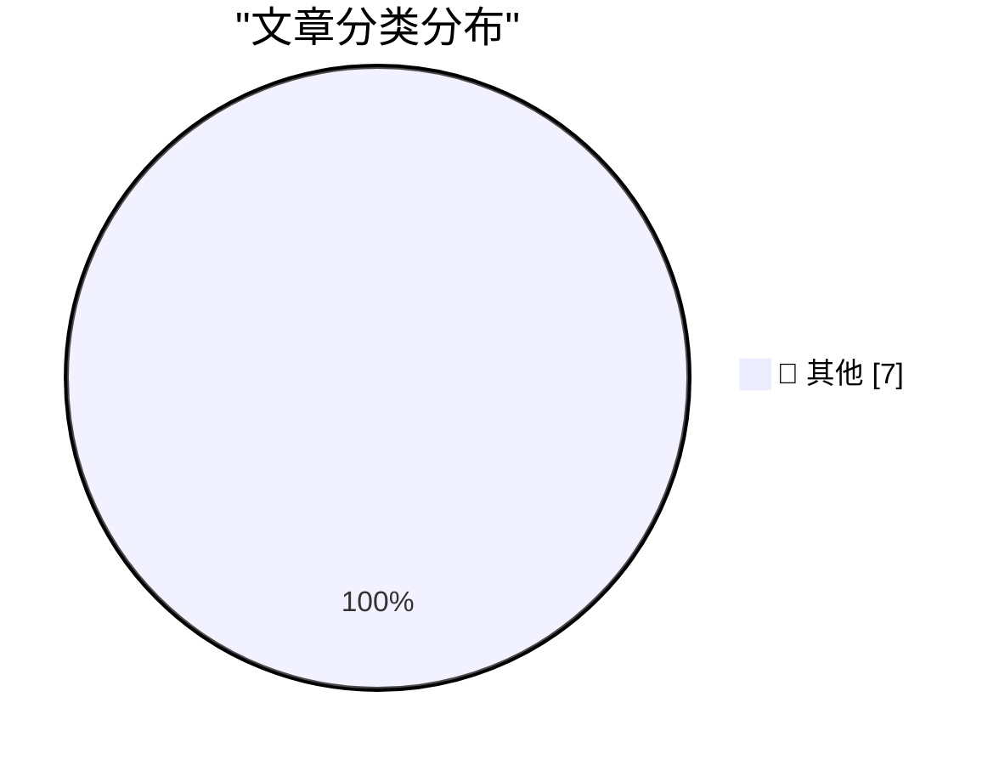

# 📰 AI 博客每日精选 — 2026-04-22

> 来自 Karpathy 推荐的 92 个顶级技术博客，AI 精选 Top 7

## 🏆 今日必读

🥇 **Where's the raccoon with the ham radio? (ChatGPT Images 2.0)**

[Where's the raccoon with the ham radio? (ChatGPT Images 2.0)](https://simonwillison.net/2026/Apr/21/gpt-image-2/#atom-everything) — simonwillison.net · 3 小时前 · 📝 其他

> Where's the raccoon with the ham radio? (ChatGPT Images 2.0)

🥈 **Quoting Andreas Påhlsson-Notini**

[Quoting Andreas Påhlsson-Notini](https://simonwillison.net/2026/Apr/21/andreas-pahlsson-notini/#atom-everything) — simonwillison.net · 7 小时前 · 📝 其他

> Quoting Andreas Påhlsson-Notini

🥉 **scosman/pelicans_riding_bicycles**

[scosman/pelicans_riding_bicycles](https://simonwillison.net/2026/Apr/21/scosman/#atom-everything) — simonwillison.net · 8 小时前 · 📝 其他

> scosman/pelicans_riding_bicycles

---

## 📊 数据概览

| 扫描源 | 抓取文章 | 时间范围 | 精选 |
|:---:|:---:|:---:|:---:|
| 10/92 | 326 篇 → 7 篇 | 24h | **7 篇** |

### 分类分布

---

## 📝 其他

### 1. Where's the raccoon with the ham radio? (ChatGPT Images 2.0)

[Where's the raccoon with the ham radio? (ChatGPT Images 2.0)](https://simonwillison.net/2026/Apr/21/gpt-image-2/#atom-everything) — **simonwillison.net** · 3 小时前 · ⭐ 15/30

> Where's the raccoon with the ham radio? (ChatGPT Images 2.0)

---

### 2. Quoting Andreas Påhlsson-Notini

[Quoting Andreas Påhlsson-Notini](https://simonwillison.net/2026/Apr/21/andreas-pahlsson-notini/#atom-everything) — **simonwillison.net** · 7 小时前 · ⭐ 15/30

> Quoting Andreas Påhlsson-Notini

---

### 3. scosman/pelicans_riding_bicycles

[scosman/pelicans_riding_bicycles](https://simonwillison.net/2026/Apr/21/scosman/#atom-everything) — **simonwillison.net** · 8 小时前 · ⭐ 15/30

> scosman/pelicans_riding_bicycles

---

### 4. ‘Scattered Spider’ Member ‘Tylerb’ Pleads Guilty

[‘Scattered Spider’ Member ‘Tylerb’ Pleads Guilty](https://krebsonsecurity.com/2026/04/scattered-spider-member-tylerb-pleads-guilty/) — **krebsonsecurity.com** · 9 小时前 · ⭐ 15/30

> ‘Scattered Spider’ Member ‘Tylerb’ Pleads Guilty

---

### 5. Trump on Tim Apple

[Trump on Tim Apple](https://truthsocial.com/@realDonaldTrump/posts/116442276577696798) — **daringfireball.net** · 4 小时前 · ⭐ 15/30

> Trump on Tim Apple

---

### 6. ★ Another Day Has Come

[★ Another Day Has Come](https://daringfireball.net/2026/04/another_day_has_come) — **daringfireball.net** · 20 小时前 · ⭐ 15/30

> ★ Another Day Has Come

---

### 7. Pluralistic: Quinn Slobodian and Ben Tarnoff's "Muskism: A Guide for the Perplexed" (21 Apr 2026)

[Pluralistic: Quinn Slobodian and Ben Tarnoff's "Muskism: A Guide for the Perplexed" (21 Apr 2026)](https://pluralistic.net/2026/04/21/torment-nexusism/) — **pluralistic.net** · 10 小时前 · ⭐ 15/30

> Pluralistic: Quinn Slobodian and Ben Tarnoff's "Muskism: A Guide for the Perplexed" (21 Apr 2026)

---

*生成于 2026-04-22 00:01 | 扫描 10 源 → 获取 326 篇 → 精选 7 篇*
*基于 [Hacker News Popularity Contest 2025](https://refactoringenglish.com/tools/hn-popularity/) RSS 源列表，由 [Andrej Karpathy](https://x.com/karpathy) 推荐*
*由「懂点儿AI」制作，欢迎关注同名微信公众号获取更多 AI 实用技巧 💡*
