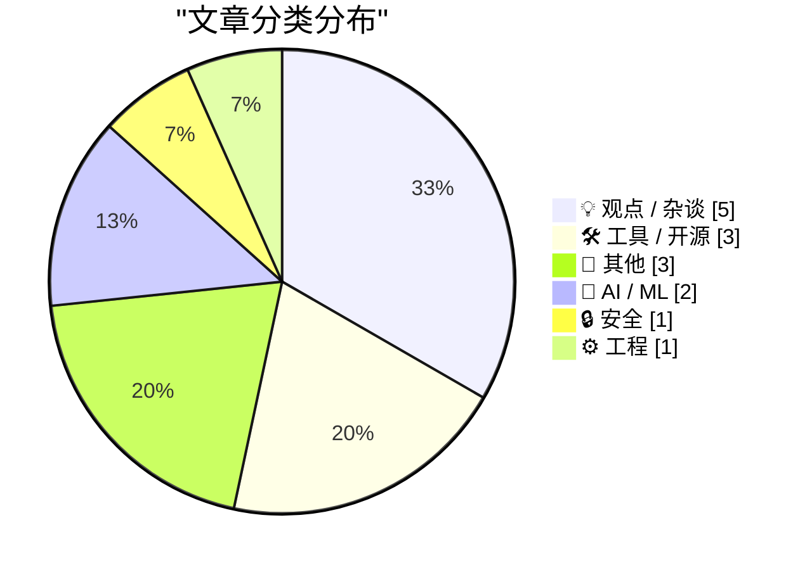
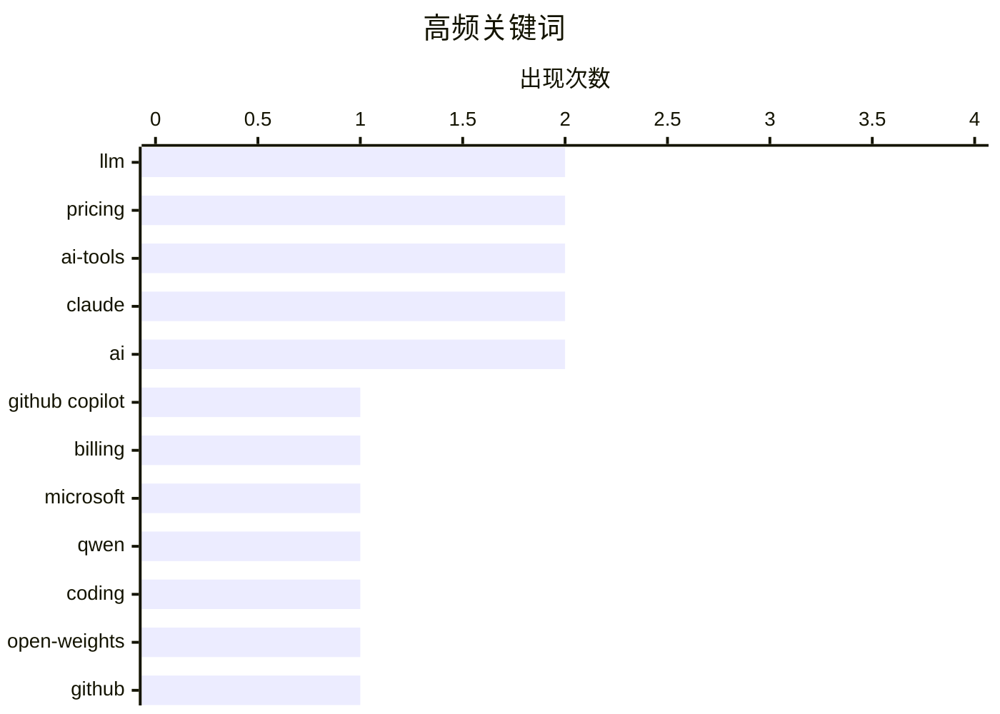

# 📰 AI 博客每日精选 — 2026-04-23

> 来自 Karpathy 推荐的 92 个顶级技术博客，AI 精选 Top 15

## 📝 今日看点

今日技术圈聚焦AI编程工具的商业化重构与开源模型的能力跃升。微软与Anthropic相继调整计费策略，标志着AI助手正从固定订阅向按量计费转型，以平衡高昂算力成本与市场付费预期。与此同时，通义千问发布旗舰级编程模型，叠加LLM从零构建的工程实践，显示开源生态正加速降低大模型训练与复现门槛。AI技术已跨越概念期，深度嵌入代码审计与底层系统优化等核心场景，产业落地正式迈入精细化运营阶段。

---

## 🏆 今日必读

🥇 **独家：微软将于6月将所有GitHub Copilot订阅用户转为按Token计费**

[Exclusive: Microsoft Moving All GitHub Copilot Subscribers To Token-Based Billing In June](https://www.wheresyoured.at/exclusive-microsoft-moving-all-github-copilot-subscribers-to-token-based-billing-in-june/) — wheresyoured.at · 6 小时前 · 🛠 工具 / 开源

> 微软计划于6月全面将GitHub Copilot的计费模式从固定订阅制转向基于Token的用量计费。Copilot Business用户每月支付19美元，可获得30美元的池化AI额度；Copilot Enterprise用户每月支付39美元，可获得70美元的池化AI额度。这一调整标志着微软将AI编程助手的商业化策略从“包月无限使用”转向“基础订阅+超额按量付费”的混合模式。企业需重新评估内部AI工具的成本结构，而开发者则需关注Token消耗对实际开发成本的影响。

💡 **为什么值得读**: 揭示了AI编程工具商业化路径的重大转折，为团队评估AI工具采购成本与制定内部用量管控策略提供了关键决策依据。

🏷️ GitHub Copilot, billing, Microsoft

🥈 **Qwen3.6-27B：在27B稠密模型中实现旗舰级编程能力**

[Qwen3.6-27B: Flagship-Level Coding in a 27B Dense Model](https://simonwillison.net/2026/Apr/22/qwen36-27b/#atom-everything) — simonwillison.net · 7 小时前 · 🤖 AI / ML

> 通义千问发布Qwen3.6-27B稠密模型，宣称其在智能体编程（Agentic Coding）任务上达到旗舰级性能。该模型在所有主流编程基准测试中均超越了上一代开源旗舰Qwen3.5-397B-A17B（总参数量397B/激活17B的MoE架构）。这一突破证明通过架构优化与训练策略改进，中小参数稠密模型完全可以在特定垂直领域匹敌甚至超越超大参数混合专家模型。对于算力受限的团队而言，该模型提供了高性价比的本地化部署与代码生成替代方案。

💡 **为什么值得读**: 打破了“大参数MoE模型在编程任务上绝对领先”的行业认知，为资源有限的开发者提供了可落地的旗舰级代码AI选型参考。

🏷️ Qwen, LLM, coding, open-weights

🥉 **GitHub Copilot个人版套餐调整**

[Changes to GitHub Copilot Individual plans](https://simonwillison.net/2026/Apr/22/changes-to-github-copilot/#atom-everything) — simonwillison.net · 20 小时前 · 🛠 工具 / 开源

> GitHub官方宣布对Copilot个人版订阅计划进行策略调整，同步回应了近期AI编程工具定价市场的波动。此次变更主要涉及个人用户额度分配与功能权限的重新划分，旨在优化免费与付费层级之间的体验差异。微软通过细化个人版权益，试图在保持用户增长的同时提升付费转化率。个人开发者需及时核对新套餐的Token配额与高级模型访问权限，以避免工作流中断。

💡 **为什么值得读**: 紧跟AI编程工具定价策略的最新变动，帮助个人开发者快速适应平台规则变化并优化个人开发成本。

🏷️ GitHub, Copilot, pricing, AI-tools

---

## 📊 数据概览

| 扫描源 | 抓取文章 | 时间范围 | 精选 |
|:---:|:---:|:---:|:---:|
| 77/92 | 2335 篇 → 18 篇 | 24h | **15 篇** |

### 分类分布



### 高频关键词



<details>
<summary>📈 纯文本关键词图（终端友好）</summary>

```
llm            │ ████████████████████ 2
pricing        │ ████████████████████ 2
ai-tools       │ ████████████████████ 2
claude         │ ████████████████████ 2
ai             │ ████████████████████ 2
github copilot │ ██████████░░░░░░░░░░ 1
billing        │ ██████████░░░░░░░░░░ 1
microsoft      │ ██████████░░░░░░░░░░ 1
qwen           │ ██████████░░░░░░░░░░ 1
coding         │ ██████████░░░░░░░░░░ 1
```

</details>

### 🏷️ 话题标签

**llm**(2) · **pricing**(2) · **ai-tools**(2) · claude(2) · ai(2) · github copilot(1) · billing(1) · microsoft(1) · qwen(1) · coding(1) · open-weights(1) · github(1) · copilot(1) · from scratch(1) · machine learning(1) · anthropic(1) · firefox(1) · security(1) · zero-day(1) · apple(1)

---

## 💡 观点 / 杂谈

### 1. Ben Thompson评蒂姆·库克的遗产

[Ben Thompson on Tim Cook’s Legacy](https://stratechery.com/2026/tim-cooks-impeccable-timing/) — **daringfireball.net** · 7 小时前 · ⭐ 21/30

> Stratechery作者Ben Thompson深入剖析了蒂姆·库克作为运营天才对苹果公司的历史性贡献。库克自1998年加入苹果后，果断关闭自有工厂与仓库，将制造基地全面转移至中国，并构建了高效的准时制（JIT）供应链体系。这一战略转型不仅彻底扭转了苹果早期的运营拖累，更为iPhone的规模化量产与全球市场扩张奠定了底层基础。库克的遗产证明，卓越的产品创新必须依赖极致的供应链管理与运营效率作为支撑。

🏷️ Apple, TimCook, strategy, operations

---

### 2. Pluralistic：用App对护士做的事就不算犯罪（2026年4月22日）

[Pluralistic: It's not a crime if we do it (to nurses) with an app (22 Apr 2026)](https://pluralistic.net/2026/04/22/uber-for-nurses/) — **pluralistic.net** · 8 小时前 · ⭐ 21/30

> 本期Pluralistic专栏聚焦科技伦理与平台经济对传统职业群体的冲击，以“护士派单应用”为例探讨算法管理下的劳动权益边界。文章串联了AI生成内容的版权争议、快餐品牌与黑客的攻防博弈等多维度科技社会议题。作者通过跨领域案例指出，技术工具的普及往往伴随监管滞后与道德风险的重构。读者可借此洞察科技浪潮下劳工权益、知识产权与公共安全之间的复杂张力。

🏷️ tech-policy, apps, culture, CoryDoctorow

---

### 3. 替罪羊

[The Scapegoat](https://feed.tedium.co/link/15204/17323348/mcclatchy-journalism-ai-scapegoat) — **tedium.co** · 20 小时前 · ⭐ 21/30

> 文章指出尽管AI正在重塑企业运作模式，但推动实际变革的核心驱动力仍是人类决策与组织行为。以 McClatchy 媒体集团为例，企业引入AI的真正目的往往是为了优化人力结构或转移管理责任，而非单纯的技术升级。这一现象揭示了AI在企业落地过程中常被用作战略转型的“替罪羊”或成本削减的掩护。管理者需清醒认识到，技术工具无法替代清晰的业务战略与组织变革决心。

🏷️ AI, corporate culture, automation

---

### 4. AI与教学：美丽新世界

[AI and Teaching – The Brave New World](https://steveblank.com/2026/04/22/ai-and-teaching-the-brave-new-world/) — **steveblank.com** · 8 小时前 · ⭐ 20/30

> 斯坦福精益创业课程在运行16年后，首次在课堂上全面见证AI对传统教学模式的颠覆性重塑。AI工具已深度融入学生团队的项目迭代与决策流程，使教学重心从知识传授转向实时反馈与个性化指导。这种转变不仅改变了师生互动方式，更标志着教育正式迈入人机协同的新纪元。作者认为，AI并非替代教师，而是迫使教育者重新定义“教”与“学”的核心价值。

🏷️ AI, education, teaching

---

### 5. 如何产生绝佳的创意

[How to Come Up With Great Ideas](https://idiallo.com/blog/how-to-come-up-with-great-ideas?src=feed) — **idiallo.com** · 12 小时前 · ⭐ 18/30

> 创意生成并非依赖完美的前期规划，而是源于高频次的实践与迭代。文章通过陶艺课实验对比指出，追求单一完美作品的团队往往陷入过度设计与内耗，而专注于大量产出的团队虽初期作品粗糙，却能通过快速试错积累经验并自然涌现优质创意。这种“以量促质”的方法论打破了“深思熟虑才能出精品”的传统认知。作者主张，克服创意瓶颈的关键在于立即动手并容忍早期失败，让迭代过程本身驱动想法的进化。

🏷️ creativity, iteration, productivity, mindset

---

## 🛠 工具 / 开源

### 6. 独家：微软将于6月将所有GitHub Copilot订阅用户转为按Token计费

[Exclusive: Microsoft Moving All GitHub Copilot Subscribers To Token-Based Billing In June](https://www.wheresyoured.at/exclusive-microsoft-moving-all-github-copilot-subscribers-to-token-based-billing-in-june/) — **wheresyoured.at** · 6 小时前 · ⭐ 27/30

> 微软计划于6月全面将GitHub Copilot的计费模式从固定订阅制转向基于Token的用量计费。Copilot Business用户每月支付19美元，可获得30美元的池化AI额度；Copilot Enterprise用户每月支付39美元，可获得70美元的池化AI额度。这一调整标志着微软将AI编程助手的商业化策略从“包月无限使用”转向“基础订阅+超额按量付费”的混合模式。企业需重新评估内部AI工具的成本结构，而开发者则需关注Token消耗对实际开发成本的影响。

🏷️ GitHub Copilot, billing, Microsoft

---

### 7. GitHub Copilot个人版套餐调整

[Changes to GitHub Copilot Individual plans](https://simonwillison.net/2026/Apr/22/changes-to-github-copilot/#atom-everything) — **simonwillison.net** · 20 小时前 · ⭐ 24/30

> GitHub官方宣布对Copilot个人版订阅计划进行策略调整，同步回应了近期AI编程工具定价市场的波动。此次变更主要涉及个人用户额度分配与功能权限的重新划分，旨在优化免费与付费层级之间的体验差异。微软通过细化个人版权益，试图在保持用户增长的同时提升付费转化率。个人开发者需及时核对新套餐的Token配额与高级模型访问权限，以避免工作流中断。

🏷️ GitHub, Copilot, pricing, AI-tools

---

### 8. Claude Code要涨到每月100美元？大概率不会——定价策略令人困惑

[Is Claude Code going to cost $100/month? Probably not - it's all very confusing](https://simonwillison.net/2026/Apr/22/claude-code-confusion/#atom-everything) — **simonwillison.net** · 22 小时前 · ⭐ 23/30

> Anthropic在定价页面短暂上线了Claude Code每月100美元的订阅选项，随后迅速撤回并引发市场广泛猜测。此次价格页面的临时变动暴露了AI编程助手在商业化初期对高算力成本与用户付费意愿之间的定价博弈。Anthropic最终维持原价的策略表明，当前阶段保持用户规模与生态活跃度优先于短期利润最大化。开发者无需为短期定价波动调整预算，但需持续关注主流AI编程工具的计费模式演进。

🏷️ Claude, pricing, Anthropic, AI-tools

---

## 📝 其他

### 9. [RSS俱乐部] 如何长期保存RSS订阅源？

[[RSS Club] How do you preserve an RSS feed?](https://shkspr.mobi/blog/2026/04/rss-club-how-do-you-preserve-an-rss-feed/) — **shkspr.mobi** · 12 小时前 · ⭐ 16/30

> 个人博客与RSS订阅源的长期数字存档面临技术维护与内容生命周期管理的双重挑战。文章引用Martin Paul Eve的观点指出，若希望作品超越作者寿命得以留存，创作者必须主动承担数据迁移、格式标准化与平台依赖剥离的“必要阵痛”。尽管完全去中心化的存档成本高昂，但建立本地备份、采用开放格式及定期验证链接完整性仍是当前最可行的方案。作者强调，数字遗产的保存不应依赖商业平台的稳定性，而应成为创作者的基础设施习惯。

🏷️ RSS, digital preservation, blogging

---

### 10. [赞助] Rec League：你的兴趣收藏与发现平台

[[Sponsor] Rec League](https://recleague.com/?lyr_campaign=df) — **daringfireball.net** · 21 小时前 · ⭐ 14/30

> Rec League是一款主打“兴趣策展与信任推荐”的新型社交应用，旨在替代算法驱动的碎片化信息流。用户可将罗马旅行指南、浏览器标签页或书架等内容整理为结构化合集，并关注品味相投的创作者以获取高质量情报。该应用已获App Store“最佳新应用”推荐，其去中心化、无信息茧房的设计让用户反馈“使用后情绪更积极”。作者认为，回归人工策展与信任网络的社交模式，正成为对抗算法疲劳的有效解法。

🏷️ app, recommendations, social, discovery

---

### 11. DF文化衫与连帽衫：限量发售，售完即止

[DF T-Shirts and Hoodies: Get Them While the Getting Is Good](https://store.daringfireball.net/) — **daringfireball.net** · 4 小时前 · ⭐ 13/30

> Daring Fireball官方周边限时回归，本周末启动印刷并于下周发货。新款连帽衫由Bella Canvas代工，面料配比从旧款的50%聚酯纤维、37.5%棉与12.5%人造丝，全面升级为85%棉与15%聚酯纤维的深“花灰黑”色。此次迭代显著提升了面料的透气性与垂坠感，同时淘汰了易起球的旧版混纺材质。作者提示该批次为限量生产，错过此次窗口期将不再补货。

🏷️ merch, DaringFireball, e-commerce

---

## 🤖 AI / ML

### 12. Qwen3.6-27B：在27B稠密模型中实现旗舰级编程能力

[Qwen3.6-27B: Flagship-Level Coding in a 27B Dense Model](https://simonwillison.net/2026/Apr/22/qwen36-27b/#atom-everything) — **simonwillison.net** · 7 小时前 · ⭐ 24/30

> 通义千问发布Qwen3.6-27B稠密模型，宣称其在智能体编程（Agentic Coding）任务上达到旗舰级性能。该模型在所有主流编程基准测试中均超越了上一代开源旗舰Qwen3.5-397B-A17B（总参数量397B/激活17B的MoE架构）。这一突破证明通过架构优化与训练策略改进，中小参数稠密模型完全可以在特定垂直领域匹敌甚至超越超大参数混合专家模型。对于算力受限的团队而言，该模型提供了高性价比的本地化部署与代码生成替代方案。

🏷️ Qwen, LLM, coding, open-weights

---

### 13. 从零编写LLM系列第33篇：补全附录后我学到了什么

[Writing an LLM from scratch, part 33 -- what I learned from finally getting round to the appendices](https://www.gilesthomas.com/2026/04/llm-from-scratch-33-what-i-learned-from-the-appendices) — **gilesthomas.com** · 6 小时前 · ⭐ 24/30

> 作者在完成《从零构建大语言模型》主线内容后，通过亲自训练GPT-2-small风格基座模型验证了附录中的进阶技术。实践表明，掌握基础架构后复现完整预训练流程的门槛显著降低，但数据清洗与分布式训练调度仍是工程落地的核心瓶颈。该系列通过逐步拆解模型训练链路，揭示了从理论公式到可运行代码的完整映射关系。读者可借此避开常见框架黑盒，真正理解Transformer架构的底层运行机制。

🏷️ LLM, from scratch, machine learning

---

## 🔒 安全

### 14. 引用Bobby Holley的观点

[Quoting Bobby Holley](https://simonwillison.net/2026/Apr/22/bobby-holley/#atom-everything) — **simonwillison.net** · 18 小时前 · ⭐ 21/30

> Mozilla与Anthropic合作，将早期版本的Claude Mythos Preview应用于Firefox浏览器安全评估，成功识别并修复了271个漏洞。此次实践验证了AI辅助代码审计在发现零日漏洞与复杂安全缺陷方面的显著优势。Mozilla认为该模式为安全团队提供了可规模化的漏洞挖掘新范式，有望大幅缩短传统人工审计的周期。浏览器厂商与安全团队可借鉴此路径，将大模型深度集成至CI/CD安全扫描流水线中。

🏷️ Firefox, security, zero-day, Claude

---

## ⚙️ 工程

### 15. 通过页表将页表映射到内存中

[Mapping the page tables into memory via the page tables](https://devblogs.microsoft.com/oldnewthing/20260422-00/?p=112255) — **devblogs.microsoft.com/oldnewthing** · 10 小时前 · ⭐ 20/30

> 微软工程师在《The Old New Thing》博客中详细解析了“分形页映射”（Fractal Page Mapping）的底层内存管理机制。该技术利用页表自身结构将页表目录递归映射至用户空间，从而实现对虚拟内存布局的零开销实时追踪。这一设计避免了传统调试工具依赖内核态切换的性能损耗，为操作系统级内存分析提供了高效的原生方案。系统开发者可借此深入理解Windows内存管理器的架构演进与底层调试原理。

🏷️ page tables, memory management, OS

---

*生成于 2026-04-23 00:11 | 扫描 77 源 → 获取 2335 篇 → 精选 15 篇*
*基于 [Hacker News Popularity Contest 2025](https://refactoringenglish.com/tools/hn-popularity/) RSS 源列表，由 [Andrej Karpathy](https://x.com/karpathy) 推荐*
*由「懂点儿AI」制作，欢迎关注同名微信公众号获取更多 AI 实用技巧 💡*
