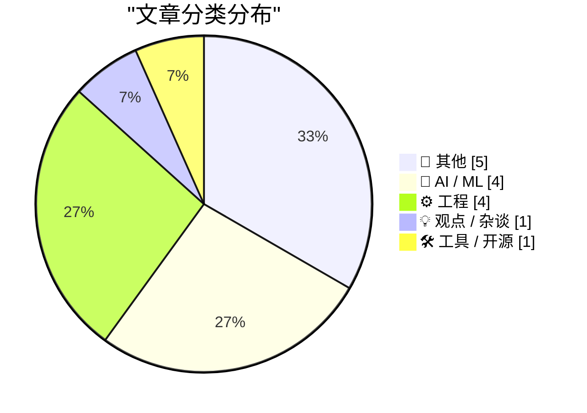
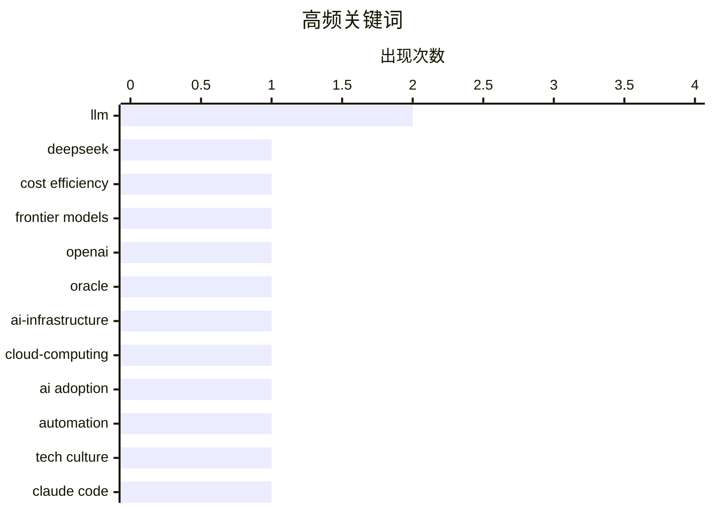

# 📰 AI 博客每日精选 — 2026-04-25

> 来自 Karpathy 推荐的 92 个顶级技术博客，AI 精选 Top 15

## 📝 今日看点

今日技术圈呈现三大核心趋势。AI开发工具链正加速向精细化演进，从大模型调试提效到技术文化存档，生态建设日趋成熟。去中心化社交架构迎来突破，开放协议赋能开发者自定义信息流算法，彻底打破传统平台的推荐黑盒。与此同时，底层系统与基础设施持续深耕，C++异常安全、轻量级数据库消息通知及新型万兆网卡相继落地，为高性能计算与网络传输注入新动力。技术演进正从应用层创新向底层基建与开放生态双向深化。

---

## 🏆 今日必读

🥇 **毫秒转换器**

[DeepSeek V4 - almost on the frontier, a fraction of the price](https://simonwillison.net/2026/Apr/24/deepseek-v4/#atom-everything) — simonwillison.net · 18 小时前 · 🤖 AI / ML

> 开发者在使用大语言模型（LLM）调试时，常需手动将毫秒级的提示词耗时转换为秒或分钟，过程繁琐且易出错。该工具提供一键换算功能，直接适配 LLM 的耗时数据输出格式，省去心算或查表步骤。通过简化时间单位转换流程，显著提升开发者监控模型响应速度与优化 Prompt 的效率。结论是此类微型工具虽功能单一，但能精准解决日常开发中的高频痛点，值得直接集成到工程工作流中。

💡 **为什么值得读**: 专为 LLM 开发者设计的轻量级效率工具，能直接消除耗时换算的重复劳动，适合需要频繁监控模型响应时间的工程师。

🏷️ DeepSeek, LLM, cost efficiency, frontier models

🥈 **XOXO 探索**

[Premium: How OpenAI Kills Oracle](https://www.wheresyoured.at/how-openai-kills-oracle/) — wheresyoured.at · 7 小时前 · 🤖 AI / ML

> 项目正式推出“XOXO Explore”网站，旨在系统记录已停办近两年的 XOXO 独立音乐节与科技艺术节长达 12 年的历史。该网站首次增设 About 页面，详细梳理了活动从创立、发展到最终停办的完整脉络，并澄清了早期仅作为 GitHub 仓库占位符的命名由来。通过数字化归档，团队将原本分散的社区记忆转化为可公开检索的线上文化遗产。结论是独立文化活动的历史留存不应随线下停办而消失，结构化归档是延续社区影响力的关键路径。

💡 **为什么值得读**: 为独立创作者与社区运营者提供了文化活动数字化归档的实操范本，展示了如何将线下盛会的遗产转化为可持续访问的线上资产。

🏷️ OpenAI, Oracle, AI-infrastructure, cloud-computing

🥉 **英国将通过仅针对未成年人的终身禁烟法案**

[The people do not yearn for automation](https://simonwillison.net/2026/Apr/24/the-people-do-not-yearn-for-automation/#atom-everything) — simonwillison.net · 1 小时前 · 💡 观点 / 杂谈

> 英国议会已批准一项开创性法案，永久禁止向 2009 年及以后出生的人群销售或供应烟草，旨在培育“无烟一代”。该政策覆盖当前 17 岁及以下人群，通过逐年提高合法购烟年龄，确保特定世代终生无法合法接触烟草。法案预计将在查尔斯三世国王完成御准程序后正式生效。结论是这种“代际禁令”通过切断年轻群体的初始接触途径，从源头阻断尼古丁成瘾的代际传递。

💡 **为什么值得读**: 深入剖析了全球首个“代际禁烟”立法的政策逻辑与实施路径，为公共卫生政策制定者及关注代际公平议题的读者提供了极具参考价值的案例。

🏷️ AI adoption, automation, tech culture

---

## 📊 数据概览

| 扫描源 | 抓取文章 | 时间范围 | 精选 |
|:---:|:---:|:---:|:---:|
| 66/92 | 2146 篇 → 16 篇 | 24h | **15 篇** |

### 分类分布



### 高频关键词



<details>
<summary>📈 纯文本关键词图（终端友好）</summary>

```
llm               │ ████████████████████ 2
deepseek          │ ██████████░░░░░░░░░░ 1
cost efficiency   │ ██████████░░░░░░░░░░ 1
frontier models   │ ██████████░░░░░░░░░░ 1
openai            │ ██████████░░░░░░░░░░ 1
oracle            │ ██████████░░░░░░░░░░ 1
ai-infrastructure │ ██████████░░░░░░░░░░ 1
cloud-computing   │ ██████████░░░░░░░░░░ 1
ai adoption       │ ██████████░░░░░░░░░░ 1
automation        │ ██████████░░░░░░░░░░ 1
```

</details>

### 🏷️ 话题标签

**llm**(2) · **deepseek**(1) · **cost efficiency**(1) · frontier models(1) · openai(1) · oracle(1) · ai-infrastructure(1) · cloud-computing(1) · ai adoption(1) · automation(1) · tech culture(1) · claude code(1) · ai coding(1) · postmortem(1) · quality assurance(1) · gpt-5.5(1) · qwen(1) · ai models(1) · newsletter(1) · bluesky(1)

---

## 📝 其他

### 1. 本周《模拟古董商》：巴德终于登场

[This Week on The Analog Antiquarian](https://www.filfre.net/2026/04/this-week-on-the-analog-antiquarian/) — **filfre.net** · 7 小时前 · ⭐ 18/30

> 本期《模拟古董商》专栏聚焦复古计算与经典游戏考古，重点回顾了《巴德之塔》（The Bard's Tale）系列的历史地位与技术演进。作者通过挖掘原始开发档案与早期玩家社区记录，还原了该作在CRPG类型确立过程中的关键贡献。文章不仅梳理了游戏机制的迭代脉络，还探讨了早期硬件限制如何反向塑造了独特的设计哲学。对复古软件考古的深入挖掘，为理解现代游戏架构的起源提供了不可替代的历史视角。

🏷️ game-preservation, retro-computing, software-history

---

### 2. XOXO Explore

[XOXO Explore](https://xoxofest.com/blog/2026-launching-xoxo-explore/) — **daringfireball.net** · 10 小时前 · ⭐ 14/30

> Andy McMillan and Andy Baio:


  Today, over 10 years later, and almost two full years after we
retired the festival for good, we’re finally launching that
website. Named after what we thought would b

🏷️ XOXO, festival-archive, web-launch

---

### 3. United Kingdom to Enact Smoking Ban Only for Those Who Are Not Yet Legal Adults

[United Kingdom to Enact Smoking Ban Only for Those Who Are Not Yet Legal Adults](https://www.nytimes.com/2026/04/21/world/europe/uk-smoking-ban-2009.html?unlocked_article_code=1.dVA.f9yJ.YMVg9N8QOlio) — **daringfireball.net** · 22 小时前 · ⭐ 13/30

> Ephrat Livni, reporting for The New York Times (gift link):


  Britain aims to raise a “smoke-free generation” by permanently
banning the sale or supply of tobacco to anyone born in 2009 or
after, wi

🏷️ UK-policy, smoking-ban, legislation

---

### 4. ★ Norwegian Boating Licenses and Generational Law

[★ Norwegian Boating Licenses and Generational Law](https://daringfireball.net/2026/04/norwegian_boating_licenses_and_generational_law) — **daringfireball.net** · 7 小时前 · ⭐ 12/30

> My spitball idea for a generational law to keep more young people from ever starting a tobacco habit — and thus, nicotine addiction — would be through scaled taxation.

🏷️ policy, generational law, taxation, social commentary

---

### 5. New Zealand Passed a Generational Smoking Ban in 2022, But Repealed It Before It Went Into Effect

[New Zealand Passed a Generational Smoking Ban in 2022, But Repealed It Before It Went Into Effect](https://www.theguardian.com/world/2023/nov/27/new-zealand-scraps-world-first-smoking-generation-ban-to-fund-tax-cuts) — **daringfireball.net** · 10 小时前 · ⭐ 11/30

> Eva Corlett, reporting for The Guardian in 2023:


  New Zealand’s new government will scrap the country’s
world-leading law to ban smoking for future generations to help
pay for tax cuts — a move tha

🏷️ public-policy, health-legislation, New-Zealand

---

## 🤖 AI / ML

### 6. 毫秒转换器

[DeepSeek V4 - almost on the frontier, a fraction of the price](https://simonwillison.net/2026/Apr/24/deepseek-v4/#atom-everything) — **simonwillison.net** · 18 小时前 · ⭐ 26/30

> 开发者在使用大语言模型（LLM）调试时，常需手动将毫秒级的提示词耗时转换为秒或分钟，过程繁琐且易出错。该工具提供一键换算功能，直接适配 LLM 的耗时数据输出格式，省去心算或查表步骤。通过简化时间单位转换流程，显著提升开发者监控模型响应速度与优化 Prompt 的效率。结论是此类微型工具虽功能单一，但能精准解决日常开发中的高频痛点，值得直接集成到工程工作流中。

🏷️ DeepSeek, LLM, cost efficiency, frontier models

---

### 7. XOXO 探索

[Premium: How OpenAI Kills Oracle](https://www.wheresyoured.at/how-openai-kills-oracle/) — **wheresyoured.at** · 7 小时前 · ⭐ 25/30

> 项目正式推出“XOXO Explore”网站，旨在系统记录已停办近两年的 XOXO 独立音乐节与科技艺术节长达 12 年的历史。该网站首次增设 About 页面，详细梳理了活动从创立、发展到最终停办的完整脉络，并澄清了早期仅作为 GitHub 仓库占位符的命名由来。通过数字化归档，团队将原本分散的社区记忆转化为可公开检索的线上文化遗产。结论是独立文化活动的历史留存不应随线下停办而消失，结构化归档是延续社区影响力的关键路径。

🏷️ OpenAI, Oracle, AI-infrastructure, cloud-computing

---

### 8. ★ 挪威船舶执照与代际立法

[An update on recent Claude Code quality reports](https://simonwillison.net/2026/Apr/24/recent-claude-code-quality-reports/#atom-everything) — **simonwillison.net** · 22 小时前 · ⭐ 24/30

> 文章针对英国拟推行的代际禁烟法案，提出了一种基于“分级税收”的替代性立法思路。作者借鉴挪威船舶执照的管理经验，主张通过随年龄或世代动态调整的烟草税制，而非直接禁止销售，来抑制年轻人尝试吸烟的意愿。该方案试图在保障个人选择权与实现公共卫生目标之间寻找平衡，利用经济杠杆替代行政禁令。结论是代际立法不应局限于“一刀切”的禁令，灵活的税收调节机制可能更具可行性与社会接受度。

🏷️ Claude Code, AI coding, postmortem, quality assurance

---

### 9. 新西兰曾于 2022 年通过代际禁烟法案，但在生效前被废除

[It's a big one](https://simonwillison.net/2026/Apr/24/weekly/#atom-everything) — **simonwillison.net** · 19 小时前 · ⭐ 22/30

> 新西兰新政府为筹措减税资金，正式废除了 2022 年通过的全球首创代际禁烟法案。该法案原规定通过逐年提高合法购烟年龄，彻底禁止 2009 年 1 月后出生者购买香烟，但被公共卫生专家警告将导致数千人过早死亡，并对毛利社区造成灾难性影响。政策反复凸显了长期公共卫生目标与短期财政诉求之间的激烈冲突。结论是代际健康立法虽具前瞻性，但若缺乏跨党派共识与财政配套，极易因政府更迭而夭折。

🏷️ GPT-5.5, Qwen, AI models, newsletter

---

## ⚙️ 工程

### 10. 构建“为你推荐”信息流：Bluesky的自定义Feed架构

[Serving the For You feed](https://simonwillison.net/2026/Apr/24/serving-the-for-you-feed/#atom-everything) — **simonwillison.net** · 22 小时前 · ⭐ 22/30

> 文章解析了Bluesky去中心化社交网络中“为你推荐”（For You）信息流的底层实现机制。平台允许任何开发者独立部署自定义Feed算法，并通过开放协议将其分发给全网用户，彻底打破了传统社交平台的推荐黑盒。该设计将内容分发权从中心化服务器下放至社区，使个性化推荐算法的迭代与竞争完全透明化。Bluesky通过架构创新证明了去中心化社交在内容分发领域的可行性，为下一代开放网络树立了新范式。

🏷️ Bluesky, AT Protocol, feed architecture, decentralized social

---

### 11. 在scope_exit RAII类型中防御异常抛出

[Defending against exceptions in a scope_exit RAII type](https://devblogs.microsoft.com/oldnewthing/20260424-00/?p=112266) — **devblogs.microsoft.com/oldnewthing** · 10 小时前 · ⭐ 22/30

> 文章深入探讨了C++中scope_exit RAII机制在异常处理场景下的安全性边界与实现陷阱。作者详细分析了在析构函数或退出作用域时捕获与防御异常的技术方案，并评估了引入额外异常检查逻辑的性能开销与代码复杂度。经过权衡，过度防御异常可能导致RAII机制失去原有的简洁性与高效性，实际工程中往往得不偿失。在C++资源管理中，应优先依赖异常安全设计而非在RAII清理阶段强行拦截异常。

🏷️ C++, RAII, exception-safety, scope_exit

---

### 12. Honker：为SQLite带来PostgreSQL的NOTIFY/LISTEN语义

[russellromney/honker](https://simonwillison.net/2026/Apr/24/honker/#atom-everything) — **simonwillison.net** · 22 小时前 · ⭐ 21/30

> 文章介绍了一款名为Honker的Rust扩展，旨在为SQLite数据库引入PostgreSQL原生的NOTIFY/LISTEN消息通知机制。该方案通过底层C/Rust绑定与多语言API封装，使轻量级SQLite能够直接支持异步队列与事件驱动架构。开发者可使用Python等语言编写简洁的队列处理逻辑，无需额外部署Redis或RabbitMQ等中间件。Honker填补了SQLite在实时通信场景下的能力空白，为边缘计算与轻量级应用提供了高内聚的架构选择。

🏷️ SQLite, Rust, database, NOTIFY/LISTEN

---

### 13. 新一代10GbE USB网卡：更冷、更小、更便宜

[New 10 GbE USB adapters are cooler, smaller, cheaper](https://www.jeffgeerling.com/blog/2026/new-10-gbe-usb-adapters-cooler-smaller-cheaper/) — **jeffgeerling.com** · 10 小时前 · ⭐ 21/30

> 文章对比了传统雷电（Thunderbolt）10GbE网卡与基于RTL8159芯片的新型USB 3.2 10G网卡在体积、发热与成本上的差异。过去笔记本接入万兆网络必须依赖昂贵且笨重的雷电转接器，而新方案凭借USB 3.2接口与优化散热设计，实现了体积大幅缩减与功耗显著降低。实测表明新型USB网卡在保持稳定万兆吞吐的同时，价格仅为传统方案的零头。RTL8159芯片的普及将彻底改变移动设备的高速网络接入方式，使万兆桌面化成为现实。

🏷️ 10GbE, USB adapter, networking, hardware

---

## 💡 观点 / 杂谈

### 14. 英国将通过仅针对未成年人的终身禁烟法案

[The people do not yearn for automation](https://simonwillison.net/2026/Apr/24/the-people-do-not-yearn-for-automation/#atom-everything) — **simonwillison.net** · 1 小时前 · ⭐ 24/30

> 英国议会已批准一项开创性法案，永久禁止向 2009 年及以后出生的人群销售或供应烟草，旨在培育“无烟一代”。该政策覆盖当前 17 岁及以下人群，通过逐年提高合法购烟年龄，确保特定世代终生无法合法接触烟草。法案预计将在查尔斯三世国王完成御准程序后正式生效。结论是这种“代际禁令”通过切断年轻群体的初始接触途径，从源头阻断尼古丁成瘾的代际传递。

🏷️ AI adoption, automation, tech culture

---

## 🛠 工具 / 开源

### 15. Millisecond Converter

[Millisecond Converter](https://simonwillison.net/2026/Apr/24/milliseconds/#atom-everything) — **simonwillison.net** · 19 小时前 · ⭐ 15/30

> <p><strong>Tool:</strong> <a href="https://tools.simonwillison.net/milliseconds">Millisecond Converter</a></p>
    <p><a href="https://llm.datasette.io/">LLM</a> reports prompt durations in millisecon

🏷️ developer tools, milliseconds, utility, LLM

---

*生成于 2026-04-25 00:07 | 扫描 66 源 → 获取 2146 篇 → 精选 15 篇*
*基于 [Hacker News Popularity Contest 2025](https://refactoringenglish.com/tools/hn-popularity/) RSS 源列表，由 [Andrej Karpathy](https://x.com/karpathy) 推荐*
*由「懂点儿AI」制作，欢迎关注同名微信公众号获取更多 AI 实用技巧 💡*
