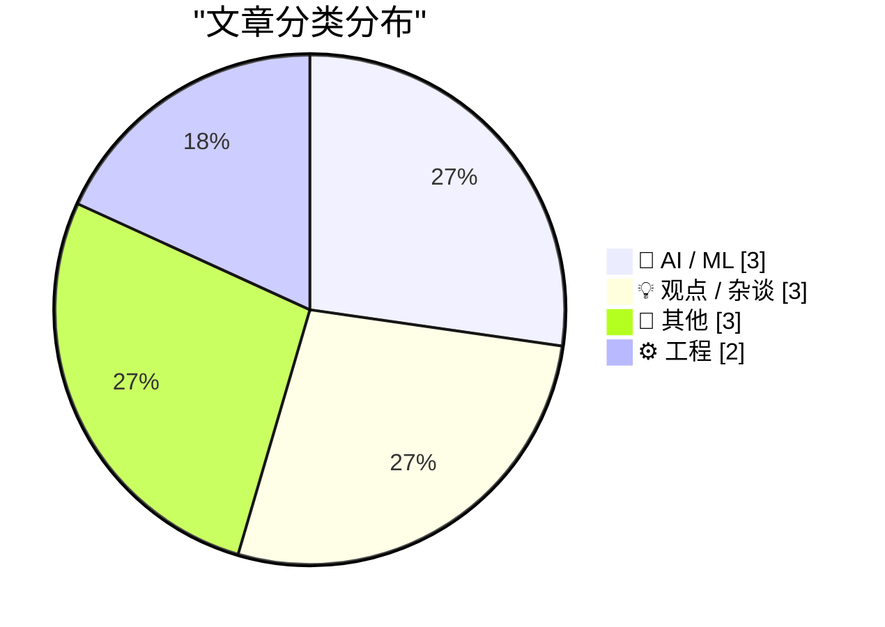
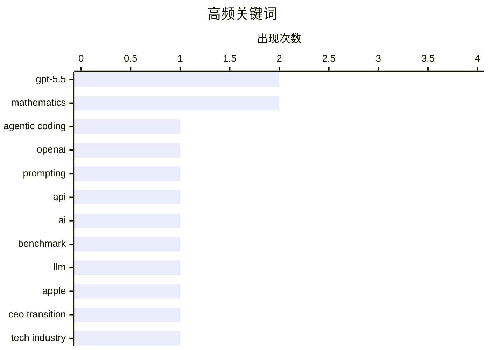

# 📰 AI 博客每日精选 — 2026-04-26

> 来自 Karpathy 推荐的 92 个顶级技术博客，AI 精选 Top 11

## 📝 今日看点

今日技术圈聚焦 AI 模型架构的深度整合与交互范式升级，OpenAI 将编程能力并入主模型并优化长推理提示词，AI 正加速降低商业构思门槛，但多模态复杂指令解析仍面临物理逻辑瓶颈。与此同时，科技巨头高管交接传闻折射出行业权力更迭的暗流，而底层开发规范警示与技术服务定价困境则凸显了工程落地中的务实挑战。在算法狂飙与现实约束的交织下，技术演进正从单纯的能力堆叠转向系统优化与价值重构。

---

## 🏆 今日必读

🥇 **确认 OpenAI 不再发布独立的 GPT-5.5-Codex 模型**

[Quoting Romain Huet](https://simonwillison.net/2026/Apr/25/romain-huet/#atom-everything) — simonwillison.net · 12 小时前 · 🤖 AI / ML

> OpenAI 自 GPT-5.4 起已将 Codex 编程模型与主模型合并为统一系统，彻底取消独立的编程模型分支。GPT-5.5 在此基础上进一步强化了智能体编程（Agentic Coding）、计算机操作（Computer Use）及各类桌面任务的执行能力。该架构调整意味着开发者无需再为代码生成单独调用专用模型，统一基座即可覆盖编程与通用交互场景。OpenAI 官方确认未来不会推出独立的 GPT-5.5-Codex 版本，模型能力将全面收敛至单一架构。

💡 **为什么值得读**: 揭示了大模型架构从“专用分支”向“统一基座”演进的关键趋势，帮助开发者及时调整 API 调用策略与产品架构设计。

🏷️ GPT-5.5, agentic coding, OpenAI

🥈 **GPT-5.5 官方提示词指南**

[GPT-5.5 prompting guide](https://simonwillison.net/2026/Apr/25/gpt-5-5-prompting-guide/#atom-everything) — simonwillison.net · 19 小时前 · 🤖 AI / ML

> OpenAI 针对已上线 API 的 GPT-5.5 模型发布了官方提示词编写指南，重点优化了长思考链路的交互体验。指南建议为需要较长时间推理的应用程序引入流式输出与中间状态提示机制，以降低用户等待焦虑。通过合理设计系统提示词与响应格式，可显著提升模型在复杂任务中的稳定性与输出可控性。掌握这些技巧能帮助开发者更高效地调用 GPT-5.5 的 API 并优化终端用户体验。

💡 **为什么值得读**: 提供了官方验证的最佳实践，能直接减少调试成本并提升生成式应用的响应流畅度与用户留存。

🏷️ prompting, GPT-5.5, API

🥉 **为什么 AI 图像生成会这样？**

[WHY ARE YOU LIKE THIS](https://simonwillison.net/2026/Apr/25/why-are-you-like-this/#atom-everything) — simonwillison.net · 7 小时前 · 🤖 AI / ML

> 文章围绕 AI 图像生成基准测试中的典型失败案例展开，以“鹈鹕骑自行车”等复杂提示词生成的荒诞结果为例，揭示了当前多模态模型在理解复合指令时的局限性。随着提示词复杂度叠加，模型容易出现元素错位、物理常识冲突或风格崩坏等问题。通过堆叠测试用例（Stacking tests）可以系统性暴露模型在空间关系、语义对齐上的短板。建立更严格的基准测试体系是推动多模态模型走向生产可用的必要步骤。

💡 **为什么值得读**: 以直观的失败案例呈现多模态模型的当前瓶颈，为 AI 图像生成评测与提示词工程提供实用的避坑指南。

🏷️ AI, benchmark, LLM

---

## 📊 数据概览

| 扫描源 | 抓取文章 | 时间范围 | 精选 |
|:---:|:---:|:---:|:---:|
| 77/92 | 2335 篇 → 11 篇 | 24h | **11 篇** |

### 分类分布



### 高频关键词



<details>
<summary>📈 纯文本关键词图（终端友好）</summary>

```
gpt-5.5        │ ████████████████████ 2
mathematics    │ ████████████████████ 2
agentic coding │ ██████████░░░░░░░░░░ 1
openai         │ ██████████░░░░░░░░░░ 1
prompting      │ ██████████░░░░░░░░░░ 1
api            │ ██████████░░░░░░░░░░ 1
ai             │ ██████████░░░░░░░░░░ 1
benchmark      │ ██████████░░░░░░░░░░ 1
llm            │ ██████████░░░░░░░░░░ 1
apple          │ ██████████░░░░░░░░░░ 1
```

</details>

### 🏷️ 话题标签

**gpt-5.5**(2) · **mathematics**(2) · **agentic coding**(1) · openai(1) · prompting(1) · api(1) · ai(1) · benchmark(1) · llm(1) · apple(1) · ceo transition(1) · tech industry(1) · tech news(1) · copyright(1) · infosec(1) · culture(1) · php(1) · .env(1) · parsing(1) · configuration(1)

---

## 🤖 AI / ML

### 1. 确认 OpenAI 不再发布独立的 GPT-5.5-Codex 模型

[Quoting Romain Huet](https://simonwillison.net/2026/Apr/25/romain-huet/#atom-everything) — **simonwillison.net** · 12 小时前 · ⭐ 25/30

> OpenAI 自 GPT-5.4 起已将 Codex 编程模型与主模型合并为统一系统，彻底取消独立的编程模型分支。GPT-5.5 在此基础上进一步强化了智能体编程（Agentic Coding）、计算机操作（Computer Use）及各类桌面任务的执行能力。该架构调整意味着开发者无需再为代码生成单独调用专用模型，统一基座即可覆盖编程与通用交互场景。OpenAI 官方确认未来不会推出独立的 GPT-5.5-Codex 版本，模型能力将全面收敛至单一架构。

🏷️ GPT-5.5, agentic coding, OpenAI

---

### 2. GPT-5.5 官方提示词指南

[GPT-5.5 prompting guide](https://simonwillison.net/2026/Apr/25/gpt-5-5-prompting-guide/#atom-everything) — **simonwillison.net** · 19 小时前 · ⭐ 25/30

> OpenAI 针对已上线 API 的 GPT-5.5 模型发布了官方提示词编写指南，重点优化了长思考链路的交互体验。指南建议为需要较长时间推理的应用程序引入流式输出与中间状态提示机制，以降低用户等待焦虑。通过合理设计系统提示词与响应格式，可显著提升模型在复杂任务中的稳定性与输出可控性。掌握这些技巧能帮助开发者更高效地调用 GPT-5.5 的 API 并优化终端用户体验。

🏷️ prompting, GPT-5.5, API

---

### 3. 为什么 AI 图像生成会这样？

[WHY ARE YOU LIKE THIS](https://simonwillison.net/2026/Apr/25/why-are-you-like-this/#atom-everything) — **simonwillison.net** · 7 小时前 · ⭐ 21/30

> 文章围绕 AI 图像生成基准测试中的典型失败案例展开，以“鹈鹕骑自行车”等复杂提示词生成的荒诞结果为例，揭示了当前多模态模型在理解复合指令时的局限性。随着提示词复杂度叠加，模型容易出现元素错位、物理常识冲突或风格崩坏等问题。通过堆叠测试用例（Stacking tests）可以系统性暴露模型在空间关系、语义对齐上的短板。建立更严格的基准测试体系是推动多模态模型走向生产可用的必要步骤。

🏷️ AI, benchmark, LLM

---

## 💡 观点 / 杂谈

### 4. 库克与特努斯 CEO 交接传闻的媒体博弈与事实核查

[★ Time to Serve Some Delicious Claim Chowder Regarding the Cook-Ternus CEO Transition](https://daringfireball.net/2026/04/delicious_claim_chowder_regarding_the_cook-ternus_ceo_transition) — **daringfireball.net** · 23 小时前 · ⭐ 21/30

> 文章针对苹果 CEO 交接传闻的媒体博弈进行复盘，指出《金融时报》2025年11月关于 Tim Cook 将交接给 Jeff Williams 或 John Ternus 的报道被知名爆料人 Mark Gurman 斥为“完全虚假”。然而后续事实发展证实，该报道的每一个细节均准确无误。这一事件凸显了科技媒体在核心高管变动信息上的信源差异与报道严谨性对比。在科技行业高管更迭的敏感期，交叉验证多方信源比依赖单一爆料人更具可靠性。

🏷️ Apple, CEO transition, tech industry

---

### 5. 分享 ChatGPT 商业计划带来的满足感

[The Satisfaction of a ChatGPT Plan](https://idiallo.com/byte-size/the-satisfaction-of-a-chatgpt-plan?src=feed) — **idiallo.com** · 6 小时前 · ⭐ 17/30

> 文章指出当前创意分享模式正从“提出想法”转向“展示 AI 生成的商业计划”，人们从中获得的满足感更多源于讲述而非实际构建。这种“ChatGPT 计划”现象反映了生成式 AI 降低了商业构思的门槛，使策划过程本身成为社交货币。作者认为，过度依赖 AI 输出可能导致行动力衰减，使创意停留在纸面阶段。真正的价值实现仍需跨越从 AI 生成方案到产品落地的执行鸿沟。

🏷️ ChatGPT, productivity, developer culture

---

### 6. 你究竟该为什么收费？

[What Do You Charge For?](https://idiallo.com/blog/what-do-you-charge-for?src=feed) — **idiallo.com** · 19 小时前 · ⭐ 16/30

> 文章聚焦自由职业者与技术服务提供者的定价困境，核心探讨收费依据应是“产品交付成本”还是“维持生计的合理利润”。作者指出，无论是网站开发、机械维修还是私人服务，单纯按工时或物料报价往往无法覆盖隐性成本与专业溢价。合理的定价策略需综合考量市场定位、客户价值感知与长期运营可持续性。明确收费逻辑不仅能提升服务报价的透明度，也有助于建立健康的商业循环。

🏷️ freelancing, pricing, web development

---

## 📝 其他

### 7. Pluralistic 专栏：Ada Palmer 的《发明文艺复兴》（2026年4月25日）

[Pluralistic: Ada Palmer's "Inventing the Renaissance" (25 Apr 2026)](https://pluralistic.net/2026/04/25/machiavellian/) — **pluralistic.net** · 12 小时前 · ⭐ 20/30

> 本期 Pluralistic 专栏重点推荐 Ada Palmer 的历史学著作《发明文艺复兴》，将其誉为结构宏大且极具洞察力的学术杰作。文章同步梳理了 RIAA 起诉无电脑家庭、John Deere 与网络安全社区的博弈、富士康在威斯康星州的争议，以及版权滥用与“Careless People”事件。作者通过跨领域资讯聚合，呈现了技术垄断、知识产权扩张与数字权利之间的持续张力。保持对科技政策与历史叙事的交叉关注，有助于理解当下数字生态的演变逻辑。

🏷️ tech news, copyright, infosec, culture

---

### 8. 非线性摆方程的闭式解

[Closed-form solution to the nonlinear pendulum equation](https://www.johndcook.com/blog/2026/04/25/exact-solution-nonlinear-pendulum/) — **johndcook.com** · 7 小时前 · ⭐ 17/30

> 文章深入探讨了非线性单摆运动方程的精确求解方法，对比了小角度近似（将 sin θ 替换为 θ）与完整非线性模型的差异。当初始摆角较大时，线性化近似会显著偏离真实物理轨迹，而通过椭圆积分可推导出高精度的闭式解析解。该数学推导过程展示了如何处理强非线性微分方程，并量化了近似模型在不同振幅下的误差边界。掌握闭式解法有助于在物理仿真与工程控制中提升动态系统的建模精度。

🏷️ mathematics, pendulum, simulation, physics

---

### 9. 商的 n 阶导数

[nth derivative of a quotient](https://www.johndcook.com/blog/2026/04/25/nth-derivative-of-a-quotient/) — **johndcook.com** · 10 小时前 · ⭐ 16/30

> 文章推导了函数商的 n 阶导数通用公式，指出其虽不如乘积法则（类似二项式定理）广为人知，但在高阶微分计算中具有重要价值。作者通过重构商法则的表达形式，并连续应用两次推导规则，逐步展开复杂分式函数的导数展开式。该公式有效解决了传统逐次求导带来的计算冗余问题，为符号计算与数学建模提供了紧凑的解析工具。掌握商的 n 阶导数规律可显著提升高等数学运算与算法微分模块的开发效率。

🏷️ calculus, mathematics, derivatives, formulas

---

## ⚙️ 工程

### 10. 用 PHP 将 .env 文件当作 .ini 解析是可行的，但存在隐患

[You can parse an .env file as an .ini with PHP - but there's a catch](https://shkspr.mobi/blog/2026/04/you-can-parse-an-env-file-as-an-ini-with-php-but-theres-a-catch/) — **shkspr.mobi** · 12 小时前 · ⭐ 18/30

> 文章探讨了在 PHP 环境中使用内置 parse_ini_file() 函数直接解析 .env 配置文件的可行性与潜在风险。虽然该函数能基本读取键值对，但 .env 与 .ini 在变量引用、注释处理、引号转义及多行字符串支持上存在细微差异。直接复用可能导致配置覆盖错误、敏感信息泄露或运行时解析异常。开发者应优先选用专用的 .env 解析库（如 vlucas/phpdotenv），以确保配置加载的兼容性与安全性。

🏷️ PHP, .env, parsing, configuration

---

### 11. Reading List 04/25/26

[Reading List 04/25/26](https://www.construction-physics.com/p/reading-list-042526) — **construction-physics.com** · 9 小时前 · ⭐ 16/30

> Transformer steel manufacturing, textile engineering, bringing power plants online quickly, infrasound, and more.

🏷️ manufacturing, power-plants, infrasound, industrial-engineering

---

*生成于 2026-04-26 00:08 | 扫描 77 源 → 获取 2335 篇 → 精选 11 篇*
*基于 [Hacker News Popularity Contest 2025](https://refactoringenglish.com/tools/hn-popularity/) RSS 源列表，由 [Andrej Karpathy](https://x.com/karpathy) 推荐*
*由「懂点儿AI」制作，欢迎关注同名微信公众号获取更多 AI 实用技巧 💡*
