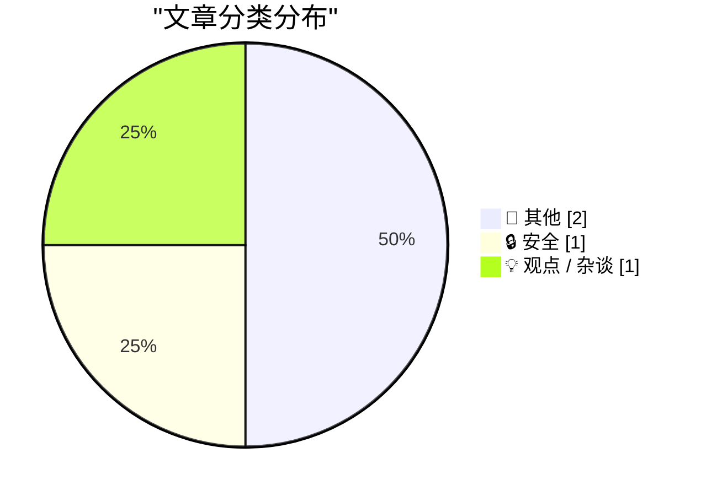
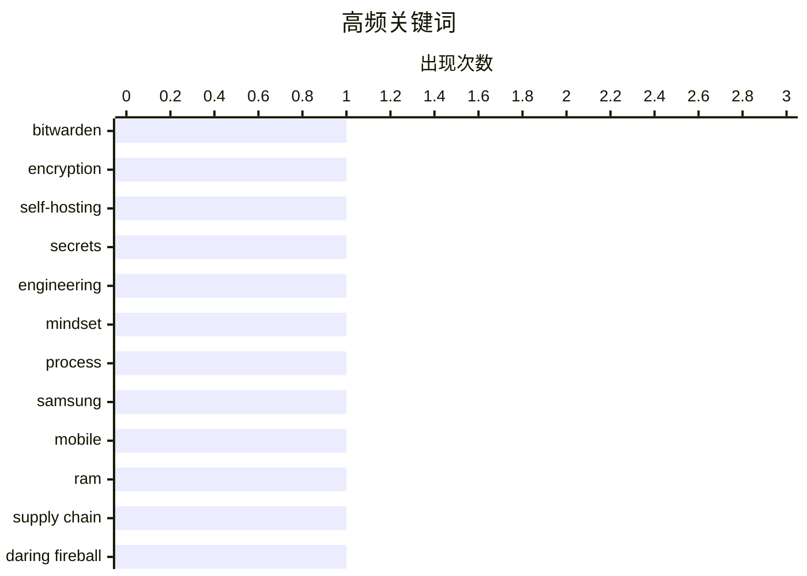

# 📰 AI 博客每日精选 — 2026-04-27

> 来自 Karpathy 推荐的 92 个顶级技术博客，AI 精选 Top 4

## 📝 今日看点

今日技术圈聚焦三大主线：自托管与开源安全架构正加速重塑数据隐私防线，开发者愈发重视底层加密机制的自主可控。与此同时，硬件供应链的周期性阵痛与软硬开发哲学的本质差异引发深度讨论，行业在追求快速迭代与坚守工程严谨性之间寻找新平衡。此外，独立技术创作者以长期主义对抗流量焦虑，印证了深度内容在技术生态中的不可替代性。整体而言，技术演进正从底层架构安全、产业理性回归到创作者文化，呈现出更加务实与多元的发展态势。

---

## 🏆 今日必读

🥇 **Bitwarden 如何加密与解密密钥**

[How Bitwarden Encrypts and Decrypts Secrets](https://blog.miguelgrinberg.com/post/how-bitwarden-encrypts-and-decrypts-secrets) — miguelgrinberg.com · 9 小时前 · 🔒 安全

> 文章聚焦自托管密码管理器 Vaultwarden 的数据存储与加密机制。该方案作为 Bitwarden 云服务的开源替代品，将所有敏感凭证直接存储在标准 SQLite 数据库中。通过复用 Bitwarden 客户端的端到端加密逻辑，系统利用密钥派生函数对数据进行加解密，确保服务端仅持有密文。这种架构在维持高安全标准的同时，允许用户直接备份 SQLite 文件，大幅简化了数据迁移与灾难恢复流程。

💡 **为什么值得读**: 深入解析开源密码管理器的底层加密逻辑与 SQLite 存储方案，为追求数据主权和自托管部署的开发者提供可落地的安全架构参考。

🏷️ Bitwarden, encryption, self-hosting, secrets

🥈 **★ 纽约时报上周日印错了填字游戏网格，而这个时机让我觉得十分巧合**

[★ The New York Times Printed the Wrong Crossword Grid Last Sunday, and I Find That Timing Serendipitous](https://daringfireball.net/2026/04/nyt_wrong_crossword_grid) — daringfireball.net · 4 小时前 · 💡 观点 / 杂谈

> 文章借《纽约时报》印错填字游戏网格的事件，探讨软件思维与硬件思维在容错率与开发节奏上的本质差异。软件思维强调快速迭代与增量修正，认为“唯一无法挽回的错误是速度太慢”；硬件思维则要求极度谨慎与追求完美，因为物理制造一旦出错便无法更改。这种对比揭示了数字产品与实体产品在生命周期管理上的根本分歧。在软硬件融合日益紧密的今天，理解并平衡这两种思维模式对技术决策至关重要。

💡 **为什么值得读**: 以生动案例对比软硬件工程的底层哲学差异，帮助技术人跳出单一开发范式，重新审视产品迭代节奏与质量控制的平衡点。

🏷️ engineering, mindset, process

🥉 **报道称三星移动部门今年或首次出现亏损，归咎于内存危机**

[Report Claims Samsung Might Post Its First-Ever Mobile Division Loss This Year, Blaming RAM Crisis](https://9to5google.com/2026/04/22/samsung-is-increasingly-worried-about-first-ever-mobile-division-loss-in-ram-crisis-report/) — daringfireball.net · 6 小时前 · 📝 其他

> 文章聚焦三星移动（MX）部门面临首次运营亏损的风险及其背后的供应链成因。内部评估显示，受内存（RAM）供应危机与成本飙升影响，该部门已启动多项削减措施，亏损几乎已成定局。部门主管 TM Roh 明确指出原材料价格波动是核心拖累因素。作为历史上持续盈利的核心业务，三星的财务预警凸显了硬件厂商对上游存储周期的脆弱依赖。

💡 **为什么值得读**: 揭示内存周期波动对终端巨头财务模型的直接冲击，为关注消费电子供应链与硬件商业逻辑的从业者提供一线市场预警。

🏷️ Samsung, mobile, RAM, supply chain

---

## 📊 数据概览

| 扫描源 | 抓取文章 | 时间范围 | 精选 |
|:---:|:---:|:---:|:---:|
| 77/92 | 2335 篇 → 4 篇 | 24h | **4 篇** |

### 分类分布



### 高频关键词



<details>
<summary>📈 纯文本关键词图（终端友好）</summary>

```
bitwarden    │ ████████████████████ 1
encryption   │ ████████████████████ 1
self-hosting │ ████████████████████ 1
secrets      │ ████████████████████ 1
engineering  │ ████████████████████ 1
mindset      │ ████████████████████ 1
process      │ ████████████████████ 1
samsung      │ ████████████████████ 1
mobile       │ ████████████████████ 1
ram          │ ████████████████████ 1
```

</details>

### 🏷️ 话题标签

**bitwarden**(1) · **encryption**(1) · **self-hosting**(1) · secrets(1) · engineering(1) · mindset(1) · process(1) · samsung(1) · mobile(1) · ram(1) · supply chain(1) · daring fireball(1) · blog(1) · merch(1)

---

## 📝 其他

### 1. 报道称三星移动部门今年或首次出现亏损，归咎于内存危机

[Report Claims Samsung Might Post Its First-Ever Mobile Division Loss This Year, Blaming RAM Crisis](https://9to5google.com/2026/04/22/samsung-is-increasingly-worried-about-first-ever-mobile-division-loss-in-ram-crisis-report/) — **daringfireball.net** · 6 小时前 · ⭐ 18/30

> 文章聚焦三星移动（MX）部门面临首次运营亏损的风险及其背后的供应链成因。内部评估显示，受内存（RAM）供应危机与成本飙升影响，该部门已启动多项削减措施，亏损几乎已成定局。部门主管 TM Roh 明确指出原材料价格波动是核心拖累因素。作为历史上持续盈利的核心业务，三星的财务预警凸显了硬件厂商对上游存储周期的脆弱依赖。

🏷️ Samsung, mobile, RAM, supply chain

---

### 2. DF 周边：本轮 T 恤与卫衣的最后购买机会

[DF Paraphernalia: Last Call for This Round of T-Shirts and Hoodies](https://store.daringfireball.net/) — **daringfireball.net** · 4 小时前 · ⭐ 8/30

> 文章以 Daring Fireball 博客 20 周年周边商品促销为切入点，回顾作者从兼职写作转向全职独立博客的历程。作者重提 20 年前的宣言“Daring Fireball 是我热爱之事”，强调在算法推荐与商业化平台主导的当下，坚持个人化深度写作的独特价值。本轮周边清仓不仅是商业活动，更是对独立内容创作者长期主义精神的致敬。独立技术媒体通过深耕垂直领域与读者社区，依然能够维持稳定的影响力与可持续的运营模式。

🏷️ Daring Fireball, blog, merch

---

## 🔒 安全

### 3. Bitwarden 如何加密与解密密钥

[How Bitwarden Encrypts and Decrypts Secrets](https://blog.miguelgrinberg.com/post/how-bitwarden-encrypts-and-decrypts-secrets) — **miguelgrinberg.com** · 9 小时前 · ⭐ 23/30

> 文章聚焦自托管密码管理器 Vaultwarden 的数据存储与加密机制。该方案作为 Bitwarden 云服务的开源替代品，将所有敏感凭证直接存储在标准 SQLite 数据库中。通过复用 Bitwarden 客户端的端到端加密逻辑，系统利用密钥派生函数对数据进行加解密，确保服务端仅持有密文。这种架构在维持高安全标准的同时，允许用户直接备份 SQLite 文件，大幅简化了数据迁移与灾难恢复流程。

🏷️ Bitwarden, encryption, self-hosting, secrets

---

## 💡 观点 / 杂谈

### 4. ★ 纽约时报上周日印错了填字游戏网格，而这个时机让我觉得十分巧合

[★ The New York Times Printed the Wrong Crossword Grid Last Sunday, and I Find That Timing Serendipitous](https://daringfireball.net/2026/04/nyt_wrong_crossword_grid) — **daringfireball.net** · 4 小时前 · ⭐ 19/30

> 文章借《纽约时报》印错填字游戏网格的事件，探讨软件思维与硬件思维在容错率与开发节奏上的本质差异。软件思维强调快速迭代与增量修正，认为“唯一无法挽回的错误是速度太慢”；硬件思维则要求极度谨慎与追求完美，因为物理制造一旦出错便无法更改。这种对比揭示了数字产品与实体产品在生命周期管理上的根本分歧。在软硬件融合日益紧密的今天，理解并平衡这两种思维模式对技术决策至关重要。

🏷️ engineering, mindset, process

---

*生成于 2026-04-27 00:04 | 扫描 77 源 → 获取 2335 篇 → 精选 4 篇*
*基于 [Hacker News Popularity Contest 2025](https://refactoringenglish.com/tools/hn-popularity/) RSS 源列表，由 [Andrej Karpathy](https://x.com/karpathy) 推荐*
*由「懂点儿AI」制作，欢迎关注同名微信公众号获取更多 AI 实用技巧 💡*
