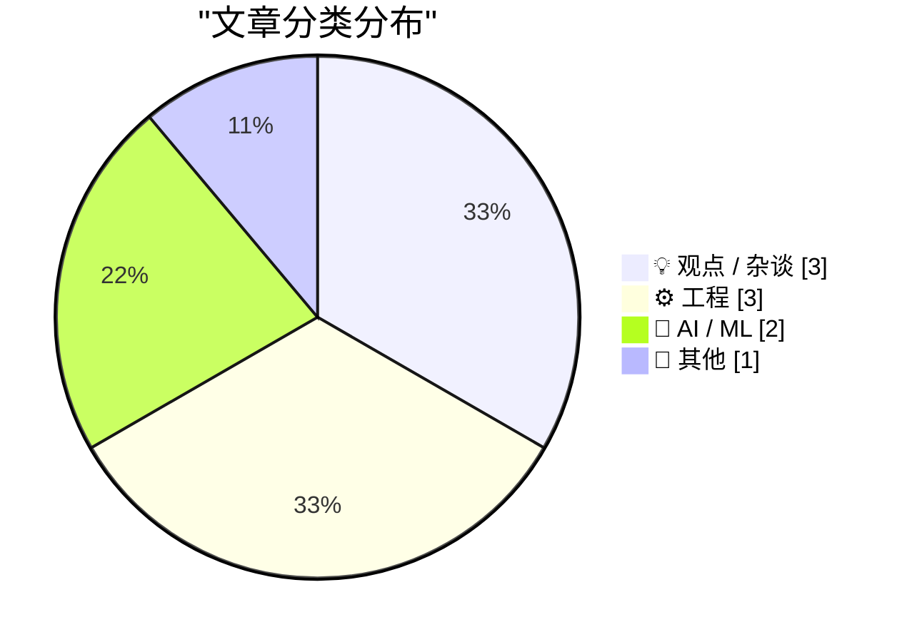
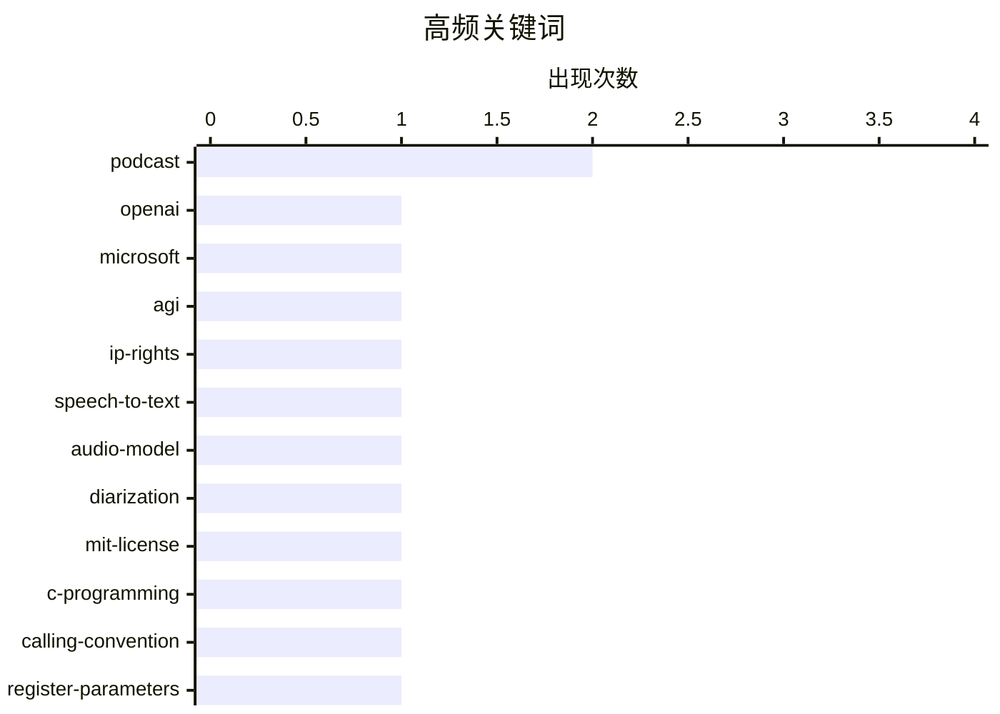

# 📰 AI 博客每日精选 — 2026-04-28

> 来自 Karpathy 推荐的 92 个顶级技术博客，AI 精选 Top 9

## 📝 今日看点

今日技术圈聚焦三大主线：AI技术加速落地与商业规则重构同步推进，开源语音模型、实时翻译应用与AGI产权条款的演变，折射出技术突破与商业博弈的深度交织。工程实践领域正经历体验升级，从底层架构调用规范到本地开发环境优化，开发者致力于构建更贴近生产、更顺畅高效的工作流。与此同时，科技界掀起对创新与商业化落差的深度反思，施乐错失GUI的历史教训与库克时代苹果的转型遗产，再次印证技术领先绝非市场胜出的唯一筹码。整体而言，今日内容在前沿探索、工程精进与历史镜鉴中，清晰勾勒出技术演进与商业逻辑相互塑造的行业图景。

---

## 🏆 今日必读

🥇 **追踪已失效的 OpenAI-Microsoft AGI 条款历史**

[Tracking the history of the now-deceased OpenAI Microsoft AGI clause](https://simonwillison.net/2026/Apr/27/now-deceased-agi-clause/#atom-everything) — simonwillison.net · 5 小时前 · 💡 观点 / 杂谈

> 文章梳理了微软与 OpenAI 合作协议中一项特殊条款的演变过程，该条款规定一旦实现通用人工智能（AGI），微软对 OpenAI 技术的商业知识产权将自动失效。作者通过检索 OpenAI 官网历史页面，还原了该条款从设立到最终被移除的时间线。这一条款的终止标志着双方在 AGI 商业化路径上的法律约束发生重大转变。作者认为，该条款的“死亡”反映了 AI 行业竞争格局与商业合作模式的快速迭代。

💡 **为什么值得读**: 深入了解科技巨头在 AGI 商业化进程中的法律博弈与知识产权布局演变。

🏷️ OpenAI, Microsoft, AGI, IP-rights

🥈 **微软开源语音识别模型 VibeVoice**

[microsoft/VibeVoice](https://simonwillison.net/2026/Apr/27/vibevoice/#atom-everything) — simonwillison.net · 25 分钟前 · 🤖 AI / ML

> 微软发布了基于 Whisper 架构的开源语音转文本模型 VibeVoice，采用 MIT 许可证并原生集成说话人分离（Speaker Diarization）功能。该模型于 2026 年 1 月 21 日发布，提供 5.71GB 的权重文件，开发者可通过 uv 与 mlx-audio 在 Mac 上一键部署运行。内置的说话人分离能力使其在多人对话场景下的转录准确率显著提升。该项目的开源为本地化语音处理提供了高性能且免授权费的新选择。

💡 **为什么值得读**: 提供开箱即用的本地化语音转写方案，特别适合需要处理多人会议录音且关注数据隐私的开发者。

🏷️ speech-to-text, audio-model, diarization, MIT-license

🥉 **探究向 C 函数传递过少寄存器参数在不同架构下的后果**

[Looking at consequences of passing too few register parameters to a C function on various architectures](https://devblogs.microsoft.com/oldnewthing/20260427-00/?p=112271) — devblogs.microsoft.com/oldnewthing · 10 小时前 · ⚙️ 工程

> 文章深入分析了在 x86、ARM 等不同 CPU 架构下，向 C 函数传递少于预期数量的寄存器参数时引发的底层行为差异。作者通过对比各架构的调用约定（Calling Convention），揭示了参数缺失如何导致寄存器状态污染、栈帧错位或不可预测的崩溃。其中 Itanium 架构因特殊的寄存器窗口机制，在此类错误下表现出更严重的稳定性问题。该分析为跨平台 C 语言开发提供了关键的底层调试参考。

💡 **为什么值得读**: 揭示跨平台 C 语言开发中极易被忽视的 ABI 兼容陷阱，帮助开发者避免底层调用约定错误导致的隐蔽 Bug。

🏷️ C-programming, calling-convention, register-parameters, architecture

---

## 📊 数据概览

| 扫描源 | 抓取文章 | 时间范围 | 精选 |
|:---:|:---:|:---:|:---:|
| 70/92 | 2210 篇 → 9 篇 | 24h | **9 篇** |

### 分类分布



### 高频关键词



<details>
<summary>📈 纯文本关键词图（终端友好）</summary>

```
podcast        │ ████████████████████ 2
openai         │ ██████████░░░░░░░░░░ 1
microsoft      │ ██████████░░░░░░░░░░ 1
agi            │ ██████████░░░░░░░░░░ 1
ip-rights      │ ██████████░░░░░░░░░░ 1
speech-to-text │ ██████████░░░░░░░░░░ 1
audio-model    │ ██████████░░░░░░░░░░ 1
diarization    │ ██████████░░░░░░░░░░ 1
mit-license    │ ██████████░░░░░░░░░░ 1
c-programming  │ ██████████░░░░░░░░░░ 1
```

</details>

### 🏷️ 话题标签

**podcast**(2) · **openai**(1) · **microsoft**(1) · agi(1) · ip-rights(1) · speech-to-text(1) · audio-model(1) · diarization(1) · mit-license(1) · c-programming(1) · calling-convention(1) · register-parameters(1) · architecture(1) · localhost(1) · custom-domain(1) · web-development(1) · dev-environment(1) · google-meet(1) · speech-translation(1) · mobile(1)

---

## 💡 观点 / 杂谈

### 1. 追踪已失效的 OpenAI-Microsoft AGI 条款历史

[Tracking the history of the now-deceased OpenAI Microsoft AGI clause](https://simonwillison.net/2026/Apr/27/now-deceased-agi-clause/#atom-everything) — **simonwillison.net** · 5 小时前 · ⭐ 25/30

> 文章梳理了微软与 OpenAI 合作协议中一项特殊条款的演变过程，该条款规定一旦实现通用人工智能（AGI），微软对 OpenAI 技术的商业知识产权将自动失效。作者通过检索 OpenAI 官网历史页面，还原了该条款从设立到最终被移除的时间线。这一条款的终止标志着双方在 AGI 商业化路径上的法律约束发生重大转变。作者认为，该条款的“死亡”反映了 AI 行业竞争格局与商业合作模式的快速迭代。

🏷️ OpenAI, Microsoft, AGI, IP-rights

---

### 2. 施乐如何发明图形用户界面（GUI）却又将其拱手让人

[How Xerox invented the GUI and lost it](https://dfarq.homeip.net/how-xerox-invented-the-gui-and-lost-it/?utm_source=rss&#038;utm_medium=rss&#038;utm_campaign=how-xerox-invented-the-gui-and-lost-it) — **dfarq.homeip.net** · 13 小时前 · ⭐ 19/30

> 文章回顾了施乐（Xerox）在 20 世纪 60 至 70 年代率先研发图形用户界面（GUI）与鼠标交互技术，却因商业战略失误未能将其转化为市场优势的历史。作者指出，施乐 PARC 实验室虽在技术上遥遥领先，但管理层缺乏将创新成果产品化的远见，最终导致苹果等竞争对手通过借鉴与优化实现了 GUI 的大规模普及。这一案例揭示了技术发明与商业成功之间的巨大鸿沟。企业若仅停留在实验室创新而忽视商业化落地，极易在产业变革中丧失主导权。

🏷️ Xerox, GUI, tech-history, innovation

---

### 3. 做客 The Vergecast 播客：探讨库克时代苹果的转型与遗产

[Yours Truly on The Vergecast](https://www.theverge.com/podcast/917965/apple-ceo-cook-ternus-transition) — **daringfireball.net** · 5 小时前 · ⭐ 17/30

> 本期播客节目聚焦苹果 CEO 蒂姆·库克（Tim Cook）的任期遗产与领导层平稳过渡，深入剖析了其在产品战略上的得失。嘉宾围绕 Touch Bar 等争议性设计展开辩论，探讨是库克本人决策失误，还是团队未能将其迭代至成熟状态。讨论指出，库克时代的核心贡献在于将苹果从硬件公司转型为服务与生态巨头，而非单纯追求激进创新。该节目为理解苹果近年来的产品哲学与商业战略转向提供了多维度的行业视角。

🏷️ Apple, Tim-Cook, podcast, tech-industry

---

## ⚙️ 工程

### 4. 探究向 C 函数传递过少寄存器参数在不同架构下的后果

[Looking at consequences of passing too few register parameters to a C function on various architectures](https://devblogs.microsoft.com/oldnewthing/20260427-00/?p=112271) — **devblogs.microsoft.com/oldnewthing** · 10 小时前 · ⭐ 24/30

> 文章深入分析了在 x86、ARM 等不同 CPU 架构下，向 C 函数传递少于预期数量的寄存器参数时引发的底层行为差异。作者通过对比各架构的调用约定（Calling Convention），揭示了参数缺失如何导致寄存器状态污染、栈帧错位或不可预测的崩溃。其中 Itanium 架构因特殊的寄存器窗口机制，在此类错误下表现出更严重的稳定性问题。该分析为跨平台 C 语言开发提供了关键的底层调试参考。

🏷️ C-programming, calling-convention, register-parameters, architecture

---

### 5. 别再使用 localhost:3000，开发时请使用自定义域名

[Don't use localhost:3000, use your own custom domain](https://idiallo.com/blog/say-no-to-localhost3000-use-custom-domains?src=feed) — **idiallo.com** · 54 分钟前 · ⭐ 23/30

> 文章指出在本地开发或演示内部工具时，使用 localhost:端口号 会带来诸多限制与认知混淆，建议全面转向自定义域名方案。作者通过实际演示案例说明，配置自定义域名不仅能完美模拟生产环境的 Cookie、CORS 和 HTTPS 策略，还能避免第三方服务（如 OAuth、Webhook）对本地回环地址的拦截。借助本地 DNS 解析或 Hosts 文件配置，开发者可以零成本实现与线上环境一致的调试体验。采用自定义域名是提升本地开发效率与还原真实网络环境的最佳实践。

🏷️ localhost, custom-domain, web-development, dev-environment

---

### 6. 软件包安装的“情绪五阶段”

[The stages of package installation](https://nesbitt.io/2026/04/27/the-stages-of-package-installation.html) — **nesbitt.io** · 14 小时前 · ⭐ 16/30

> 文章以幽默笔法将软件包安装过程类比为库伯勒-罗丝模型（Kübler-Ross model）的悲伤五阶段，依次经历否认、愤怒、讨价还价、抑郁、接受，最终抵达安装后（postinstall）状态。作者通过拟人化描述，生动刻画了开发者在依赖冲突、编译报错与环境配置时常见的心理变化轨迹。这一比喻精准捕捉了现代软件开发中包管理工具带来的普遍痛点。该短文以轻松方式引发开发者共鸣，同时暗示了构建稳定依赖环境的重要性。

🏷️ package-manager, dev-humor, npm, postinstall

---

## 🤖 AI / ML

### 7. 微软开源语音识别模型 VibeVoice

[microsoft/VibeVoice](https://simonwillison.net/2026/Apr/27/vibevoice/#atom-everything) — **simonwillison.net** · 25 分钟前 · ⭐ 24/30

> 微软发布了基于 Whisper 架构的开源语音转文本模型 VibeVoice，采用 MIT 许可证并原生集成说话人分离（Speaker Diarization）功能。该模型于 2026 年 1 月 21 日发布，提供 5.71GB 的权重文件，开发者可通过 uv 与 mlx-audio 在 Mac 上一键部署运行。内置的说话人分离能力使其在多人对话场景下的转录准确率显著提升。该项目的开源为本地化语音处理提供了高性能且免授权费的新选择。

🏷️ speech-to-text, audio-model, diarization, MIT-license

---

### 8. Google Meet 实时语音翻译功能现已登陆移动端

[Speech translation in Google Meet is now rolling out to mobile devices](https://simonwillison.net/2026/Apr/27/speech-translation-in-google-meet-is-now-rolling-out-to-mobile-d/#atom-everything) — **simonwillison.net** · 6 小时前 · ⭐ 19/30

> Google Meet 正式向移动端用户推送实时语音翻译功能，支持跨语言对话的即时字幕转换。作者在实际会议中测试发现，该功能已具备基础的实时转译能力，但在复杂语境下的准确率仍有提升空间。此项更新标志着 AI 实时翻译技术正从实验室走向大规模商用会议场景。尽管当前体验尚处早期阶段，但它为跨国团队协作提供了低门槛的语言无障碍沟通方案。

🏷️ Google-Meet, speech-translation, mobile, product-update

---

## 📝 其他

### 9. 《The Talk Show》播客赞助席位开放

[Sponsor The Talk Show](https://daringfireball.net/feeds/sponsors/) — **daringfireball.net** · 30 分钟前 · ⭐ 9/30

> 文章宣布 Daring Fireball 旗下《The Talk Show》播客开放最新几期节目的广告赞助席位，此前周播赞助已排期至 8 月 24 日。该节目主要面向追求高品质设计与极致体验的科技受众，适合希望精准触达高净值开发者与产品决策者的品牌投放。作者指出，当前开放的名额为急需短期曝光或新品推广的厂商提供了灵活的营销窗口。通过赞助该节目，品牌可直接对接对技术细节与设计美学有严苛要求的垂直用户群体。

🏷️ podcast, sponsorship, Daring-Fireball

---

*生成于 2026-04-28 00:12 | 扫描 70 源 → 获取 2210 篇 → 精选 9 篇*
*基于 [Hacker News Popularity Contest 2025](https://refactoringenglish.com/tools/hn-popularity/) RSS 源列表，由 [Andrej Karpathy](https://x.com/karpathy) 推荐*
*由「懂点儿AI」制作，欢迎关注同名微信公众号获取更多 AI 实用技巧 💡*
