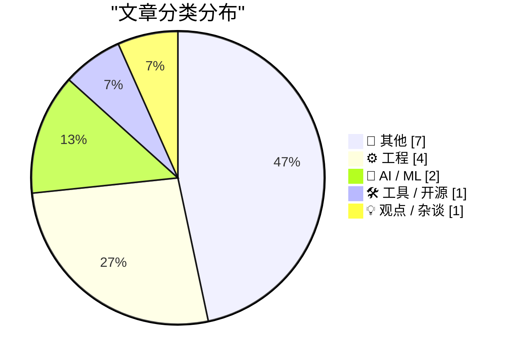
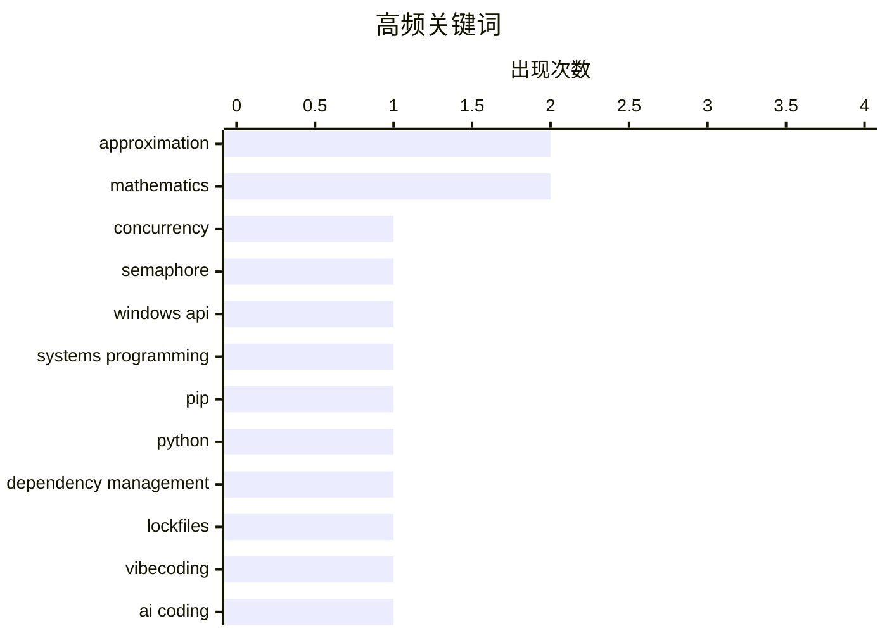

# 📰 AI 博客每日精选 — 2026-04-29

> 来自 Karpathy 推荐的 92 个顶级技术博客，AI 精选 Top 15

## 📝 今日看点

今日技术圈聚焦三大核心动向：AI编程助手的普及正重塑开发范式，社区热议模型行为约束与专业化分工的边界；基础设施与DevOps工具链迎来深度迭代，开发者愈发追求构建流水线的确定性与架构设计的严谨性；底层系统设计与数学工程方法持续精进，技术实践正加速向高精度与可复用演进。整体而言，技术演进的重心已从单纯的功能堆叠，全面转向系统可靠性与工程化规范的深度打磨。

---

## 🏆 今日必读

🥇 **跨进程有限读取者读写锁开发指南（一）：信号量方案**

[Developing a cross-process reader/writer lock with limited readers, part 1: A semaphore](https://devblogs.microsoft.com/oldnewthing/20260428-00/?p=112278) — devblogs.microsoft.com/oldnewthing · 10 小时前 · ⚙️ 工程

> 文章探讨如何在跨进程环境中实现限制并发读取数量的读写锁。作者首先引入信号量（Semaphore）作为核心同步原语，通过管理“令牌”数量来精确控制同时进入临界区的读取者上限。该方案利用信号量的原子计数特性，有效避免了传统读写锁在无限制读取时可能引发的写入者饥饿问题。信号量方案虽能解决基础计数需求，但在处理复杂竞争条件时仍需结合其他同步机制进行优化。

💡 **为什么值得读**: 深入剖析 Windows 底层同步原语的实际应用，为高并发跨进程架构设计提供可直接复用的锁实现思路。

🏷️ concurrency, semaphore, Windows API, systems programming

🥈 **pip 26.1 新特性：锁文件与依赖冷却机制**

[What's new in pip 26.1 - lockfiles and dependency cooldowns!](https://simonwillison.net/2026/Apr/28/pip-261/#atom-everything) — simonwillison.net · 18 小时前 · 🛠 工具 / 开源

> 文章详解 Python 包管理工具 pip 26.1 版本的核心更新与依赖管理改进。新版本正式移除对 Python 3.9 的支持，并引入原生锁文件（lockfiles）机制以固化依赖版本，同时新增依赖冷却期（dependency cooldowns）功能来缓解频繁更新引发的构建冲突。这些改动显著提升了大型项目依赖解析的确定性与可重复性，减少了环境配置时的版本漂移问题。pip 26.1 标志着 Python 生态向更严谨的工程化依赖管理迈出关键一步。

💡 **为什么值得读**: 掌握 Python 依赖管理的最新演进方向，帮助团队规避版本冲突并提升 CI/CD 流水线的稳定性。

🏷️ pip, Python, dependency management, lockfiles

🥉 **引用 Matthew Yglesias 的观点**

[Quoting Matthew Yglesias](https://simonwillison.net/2026/Apr/28/matthew-yglesias/#atom-everything) — simonwillison.net · 10 小时前 · 💡 观点 / 杂谈

> 文章引用 Matthew Yglesias 的观点，探讨 AI 编程助手普及后用户对软件开发模式的真实诉求。作者明确拒绝“氛围编程”（vibecoding）的 DIY 模式，主张由专业软件公司利用 AI 辅助工具开发更优质、更低成本的商业化产品。这一立场揭示了当前 AI 编码工具的核心价值并非降低个人开发门槛，而是赋能企业提升软件工程效率与产品质量。用户最终期待的是经过专业打磨的 AI 增强型软件服务，而非自行拼凑的代码片段。

💡 **为什么值得读**: 跳出技术狂热视角，从产品与商业维度重新审视 AI 编程工具的真实落地路径与用户预期。

🏷️ vibecoding, AI coding, software industry, developer culture

---

## 📊 数据概览

| 扫描源 | 抓取文章 | 时间范围 | 精选 |
|:---:|:---:|:---:|:---:|
| 77/92 | 2340 篇 → 19 篇 | 24h | **15 篇** |

### 分类分布



### 高频关键词



<details>
<summary>📈 纯文本关键词图（终端友好）</summary>

```
approximation         │ ████████████████████ 2
mathematics           │ ████████████████████ 2
concurrency           │ ██████████░░░░░░░░░░ 1
semaphore             │ ██████████░░░░░░░░░░ 1
windows api           │ ██████████░░░░░░░░░░ 1
systems programming   │ ██████████░░░░░░░░░░ 1
pip                   │ ██████████░░░░░░░░░░ 1
python                │ ██████████░░░░░░░░░░ 1
dependency management │ ██████████░░░░░░░░░░ 1
lockfiles             │ ██████████░░░░░░░░░░ 1
```

</details>

### 🏷️ 话题标签

**approximation**(2) · **mathematics**(2) · **concurrency**(1) · semaphore(1) · windows api(1) · systems programming(1) · pip(1) · python(1) · dependency management(1) · lockfiles(1) · vibecoding(1) · ai coding(1) · software industry(1) · developer culture(1) · openai(1) · system prompts(1) · ai safety(1) · codex(1) · llm(1) · fine-tuning(1)

---

## 📝 其他

### 1. GitHub Actions 已成为 DevOps 的最薄弱环节

[GitHub Actions is the weakest link](https://nesbitt.io/2026/04/28/github-actions-is-the-weakest-link.html) — **nesbitt.io** · 14 小时前 · ⭐ 15/30

> 文章直指 GitHub Actions 已成为现代 DevOps 流水线中最脆弱的环节。尽管其生态普及度高，但频繁的非确定性构建失败、缓慢的执行速度、晦涩的调试日志以及隐性的厂商绑定问题，正严重拖垮团队的交付效率。作者认为，将核心 CI/CD 逻辑过度依赖单一托管平台，会放大单点故障风险并限制架构演进灵活性。企业应重新评估流水线工具链，对关键任务采用更可控的自托管或专业化替代方案。

---

### 2. 非法状态与非期望状态的架构设计分野

[Illegal vs Unwanted States](https://buttondown.com/hillelwayne/archive/illegal-vs-unwanted-states/) — **buttondown.com/hillelwayne** · 8 小时前 · ⭐ 15/30

> 文章深入剖析软件设计中“非法状态”（illegal state）与“非期望状态”（unwanted state）的本质区别。非法状态是系统绝对不应存在的逻辑矛盾，应通过类型系统或不变量在编译期彻底消除；而非期望状态是技术上合法但业务上不希望长期停留的情形，需依赖运行时校验与业务规则进行干预。以日历软件允许时间重叠为例，作者指出此类场景属于非期望状态，强行用严格数据结构限制反而会牺牲系统灵活性。准确区分两者能避免过度设计类型系统，从而构建更健壮且易于维护的软件架构。

---

### 3. OpenAI Projects ChatGPT Plus subscriptions to drop by 80% from 44 Million in 2025 to 9 Million In 2026, Made Up Using Cheaper Subscriptions (Somehow)

[OpenAI Projects ChatGPT Plus subscriptions to drop by 80% from 44 Million in 2025 to 9 Million In 2026, Made Up Using Cheaper Subscriptions (Somehow)](https://www.wheresyoured.at/openai-projects-chatgpt-plus-subscriptions-to-drop-by-80-from-44-million-in-2025-to-9-million-in-2026-made-up-using-cheaper-subscriptions-somehow/) — **wheresyoured.at** · 1 小时前 · ⭐ 15/30

> Executive Summary:The Information reports that OpenAI projects that its $20-a-month ChatGPT Plus subscriptions will decrease from 44 Million subscribers in 2025 to a projected 9 million subscribers in

---

### 4. AI's Economics Don't Make Sense

[AI's Economics Don't Make Sense](https://www.wheresyoured.at/ais-economics-dont-make-sense/) — **wheresyoured.at** · 7 小时前 · ⭐ 15/30

> If you liked this piece, please subscribe to my premium newsletter. It&#x2019;s $70 a year, or $7 a month, and in return you get a weekly newsletter that&#x2019;s usually anywhere from 5,000 to 18,000

---

### 5. AI's Economics Don't Make Sense [Ad Free]

[AI's Economics Don't Make Sense [Ad Free]](https://www.wheresyoured.at/ais-economics-dont-make-sense-ad-free/) — **wheresyoured.at** · 7 小时前 · ⭐ 15/30

> Hello premium subs! This is your ad-free free newsletter for the week. Questions? Queries? Email me at ez@betteroffline.com, and if you have a scoop, ezitron.76 is my Signal. Yesterday morning, GitHub

---

### 6. TRS-80 Model 100

[TRS-80 Model 100](https://dfarq.homeip.net/trs-80-model-100/?utm_source=rss&#038;utm_medium=rss&#038;utm_campaign=trs-80-model-100) — **dfarq.homeip.net** · 11 小时前 · ⭐ 15/30

> The TRS-80 Model 100 was an early laptop computer manufactured by Kyocera in Japan and marketed in North America by Radio Shack. Kyocera’s own version, the Kyotronic-85, didn’t set any sales records. 

---

### 7. Anthropic Mythos – We’ve Opened Pandora’s Box

[Anthropic Mythos – We’ve Opened Pandora’s Box](https://steveblank.com/2026/04/28/anthropic-mythos-weve-opened-pandoras-box/) — **steveblank.com** · 11 小时前 · ⭐ 15/30

> This article previously appeared in The Cipher Brief. For a decade the cybersecurity community was predicting a cyber apocalypse tied to a single event –  the day a Cryptographically Relevant Quantum 

---

## ⚙️ 工程

### 8. 跨进程有限读取者读写锁开发指南（一）：信号量方案

[Developing a cross-process reader/writer lock with limited readers, part 1: A semaphore](https://devblogs.microsoft.com/oldnewthing/20260428-00/?p=112278) — **devblogs.microsoft.com/oldnewthing** · 10 小时前 · ⭐ 25/30

> 文章探讨如何在跨进程环境中实现限制并发读取数量的读写锁。作者首先引入信号量（Semaphore）作为核心同步原语，通过管理“令牌”数量来精确控制同时进入临界区的读取者上限。该方案利用信号量的原子计数特性，有效避免了传统读写锁在无限制读取时可能引发的写入者饥饿问题。信号量方案虽能解决基础计数需求，但在处理复杂竞争条件时仍需结合其他同步机制进行优化。

🏷️ concurrency, semaphore, Windows API, systems programming

---

### 9. 10Gb 以太网部署：我不得不（重新）学习的知识

[10Gb Ethernet: what I had to (re)learn](https://www.gilesthomas.com/2026/04/10g-ethernet-what-i-relearned) — **gilesthomas.com** · 5 小时前 · ⭐ 22/30

> 文章记录作者将家庭有线网络升级至 10Gb 以太网（10GbE）的实际经验与技术踩坑指南。升级过程需重新审视线缆规格（如 Cat6a 以上）、交换机背板带宽、网卡驱动兼容性以及设备散热与功耗管理，因为家用网络设备演进长期滞后于企业级标准。作者指出，尽管物理层标准已成熟，但消费级生态的碎片化仍要求用户具备扎实的网络拓扑规划能力。10GbE 家庭部署虽能彻底消除内网传输瓶颈，但成功落地高度依赖硬件选型与细节调优。

🏷️ 10GbE, networking, home lab, infrastructure

---

### 10. 将数学技巧升维为系统方法

[Turning a trick into a technique](https://www.johndcook.com/blog/2026/04/28/even-series-trick/) — **johndcook.com** · 2 小时前 · ⭐ 18/30

> 文章探讨如何将数学近似中的“技巧”系统化升级为可复用的“技术”。作者指出，通过从一个偶函数中减去另一个偶函数的倍数，可以精确抵消低阶误差项，从而构造出高阶近似公式。该方法充分利用了偶函数泰勒展开仅含偶次项的数学特性，使误差控制从经验性操作转变为可推导的代数过程。将此类技巧形式化后，可为数值计算提供稳定且精度可控的函数逼近方案。

🏷️ numerical analysis, approximation, algorithms, mathematics

---

### 11. 圆弧长度的几何近似计算

[Circular arc approximation](https://www.johndcook.com/blog/2026/04/28/circular-arc-approximation/) — **johndcook.com** · 11 小时前 · ⭐ 15/30

> 文章提出一种仅凭弦长数据即可高精度估算圆弧长度的几何近似方法。已知整段圆弧的弦长 c 与半弧弦长 b 后，可通过代数组合直接推导弧长 rθ，无需调用三角函数或反三角函数。该方案利用圆几何的内在比例关系，在大幅降低计算复杂度的同时保持了极高的数值精度。此近似公式为计算机图形学、CAD 建模及工程测量提供了轻量且高效的弧长计算替代方案。

🏷️ geometry, approximation, circular arc, mathematics

---

## 🤖 AI / ML

### 12. 引用 OpenAI Codex 的基础系统指令

[Quoting OpenAI Codex base_instructions](https://simonwillison.net/2026/Apr/28/openai-codex/#atom-everything) — **simonwillison.net** · 2 小时前 · ⭐ 22/30

> 文章披露 OpenAI Codex 的基础系统指令（base_instructions），揭示其底层行为约束策略。该指令明确要求模型除非用户查询绝对相关，否则严禁提及哥布林、地精、浣熊、巨魔等奇幻生物或动物隐喻。这一设计反映了 AI 编程助手正从“拟人化交互”转向“极致务实”的工程化路线，强制模型剥离无关修辞以聚焦代码生成准确性。通过严格过滤非技术性表达，Codex 旨在为开发者提供零干扰、高信噪比的编程辅助体验。

🏷️ OpenAI, system prompts, AI safety, Codex

---

### 13. 介绍 talkie：一款源自 1930 年代的 13B 复古语言模型

[Introducing talkie: a 13B vintage language model from 1930](https://simonwillison.net/2026/Apr/28/talkie/#atom-everything) — **simonwillison.net** · 21 小时前 · ⭐ 22/30

> 文章介绍 talkie-1930-13b-base 项目，这是一个基于 1930 年代语料训练的 130 亿参数语言模型（权重约 53.1 GB）。该模型由 Alec Radford 等知名研究者联合开发，旨在通过现代架构复现并学习 20 世纪初的语言特征与行文风格。实验表明，模型能够精准捕捉历史文本的语法结构与词汇分布，为数字人文研究提供了可交互的语言演变观测窗口。这一实践验证了大语言模型在特定历史语料上的强泛化能力，拓展了 NLP 在文化遗产数字化中的应用边界。

🏷️ LLM, fine-tuning, vintage AI, 13B model

---

## 🛠 工具 / 开源

### 14. pip 26.1 新特性：锁文件与依赖冷却机制

[What's new in pip 26.1 - lockfiles and dependency cooldowns!](https://simonwillison.net/2026/Apr/28/pip-261/#atom-everything) — **simonwillison.net** · 18 小时前 · ⭐ 24/30

> 文章详解 Python 包管理工具 pip 26.1 版本的核心更新与依赖管理改进。新版本正式移除对 Python 3.9 的支持，并引入原生锁文件（lockfiles）机制以固化依赖版本，同时新增依赖冷却期（dependency cooldowns）功能来缓解频繁更新引发的构建冲突。这些改动显著提升了大型项目依赖解析的确定性与可重复性，减少了环境配置时的版本漂移问题。pip 26.1 标志着 Python 生态向更严谨的工程化依赖管理迈出关键一步。

🏷️ pip, Python, dependency management, lockfiles

---

## 💡 观点 / 杂谈

### 15. 引用 Matthew Yglesias 的观点

[Quoting Matthew Yglesias](https://simonwillison.net/2026/Apr/28/matthew-yglesias/#atom-everything) — **simonwillison.net** · 10 小时前 · ⭐ 23/30

> 文章引用 Matthew Yglesias 的观点，探讨 AI 编程助手普及后用户对软件开发模式的真实诉求。作者明确拒绝“氛围编程”（vibecoding）的 DIY 模式，主张由专业软件公司利用 AI 辅助工具开发更优质、更低成本的商业化产品。这一立场揭示了当前 AI 编码工具的核心价值并非降低个人开发门槛，而是赋能企业提升软件工程效率与产品质量。用户最终期待的是经过专业打磨的 AI 增强型软件服务，而非自行拼凑的代码片段。

🏷️ vibecoding, AI coding, software industry, developer culture

---

*生成于 2026-04-29 00:10 | 扫描 77 源 → 获取 2340 篇 → 精选 15 篇*
*基于 [Hacker News Popularity Contest 2025](https://refactoringenglish.com/tools/hn-popularity/) RSS 源列表，由 [Andrej Karpathy](https://x.com/karpathy) 推荐*
*由「懂点儿AI」制作，欢迎关注同名微信公众号获取更多 AI 实用技巧 💡*
