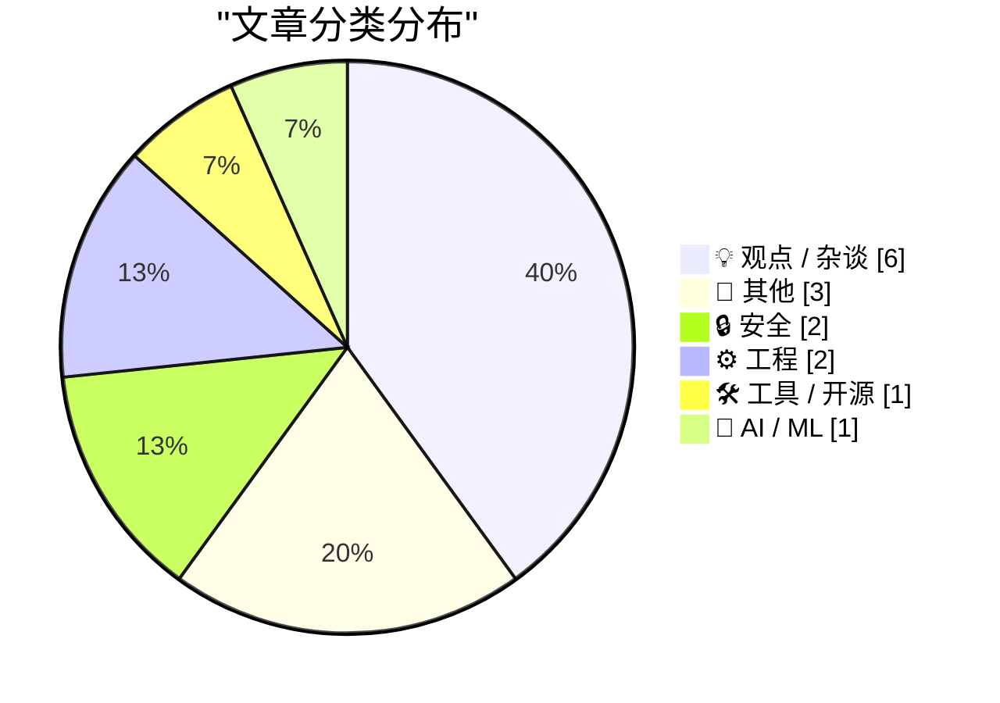
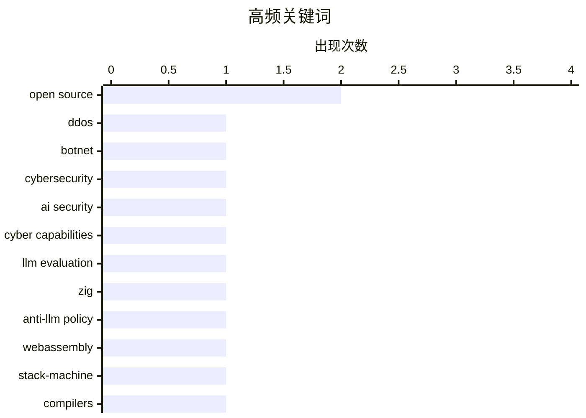

# 📰 AI 博客每日精选 — 2026-05-01

> 来自 Karpathy 推荐的 92 个顶级技术博客，AI 精选 Top 15

## 📝 今日看点

今日技术圈呈现AI赋能与底层深耕的双线并进态势。大模型正全面重塑编程与安全范式，从自动化漏洞挖掘到目标驱动编程代理的迭代，AI提效已成共识，但开源社区严禁LLM辅助及代码溯源争议，也凸显出业界对代码质量与人机协作边界的审慎博弈。与此同时，WebAssembly执行模型辨析、跨进程锁公平性调度与激活函数数学求导等硬核探讨，持续夯实系统架构与算法底座的工程基石。技术狂飙之下，如何在拥抱智能化工具的同时坚守工程严谨性，正成为开发者与生态的核心命题。

---

## 🏆 今日必读

🥇 **反DDoS公司竟对巴西ISP发动攻击**

[Anti-DDoS Firm Heaped Attacks on Brazilian ISPs](https://krebsonsecurity.com/2026/04/anti-ddos-firm-heaped-attacks-on-brazilian-isps/) — krebsonsecurity.com · 10 小时前 · 🔒 安全

> 巴西一家专业防护DDoS攻击的技术公司被曝暗中利用僵尸网络，对国内其他网络运营商发起大规模DDoS攻击。该公司CEO回应称，恶意活动源于安全漏洞，推测是竞争对手为抹黑其企业形象所为。事件揭示了网络安全防护厂商自身可能成为攻击源头的行业隐患。企业需重新审视供应链安全与第三方防护服务的信任边界。

💡 **为什么值得读**: 揭示防护厂商反成攻击源头的罕见案例，为网络安全信任模型与供应链风险评估提供重要警示。

🏷️ DDoS, botnet, cybersecurity

🥈 **OpenAI GPT-5.5网络安全能力评估**

[Our evaluation of OpenAI's GPT-5.5 cyber capabilities](https://simonwillison.net/2026/Apr/30/gpt-55-cyber-capabilities/#atom-everything) — simonwillison.net · 1 小时前 · 🔒 安全

> 英国人工智能安全研究所（AISI）对OpenAI GPT-5.5的漏洞挖掘能力进行了专项评估。测试结果显示，GPT-5.5在自动化漏洞发现方面的表现与Anthropic的Claude Mythos模型相当，但GPT-5.5已面向公众开放使用。该评估表明通用大模型在安全测试领域已达到专业级水平。企业可借助公开可用的AI模型降低安全审计门槛，但需同步加强模型输出结果的验证机制。

💡 **为什么值得读**: 首次公开对比主流大模型在真实漏洞挖掘场景下的能力差异，为AI安全工具选型提供权威基准数据。

🏷️ AI security, cyber capabilities, LLM evaluation

🥉 **Zig项目坚决禁止AI辅助贡献政策的底层逻辑**

[The Zig project's rationale for their firm anti-AI contribution policy](https://simonwillison.net/2026/Apr/30/zig-anti-ai/#atom-everything) — simonwillison.net · 22 小时前 · 💡 观点 / 杂谈

> Zig编程语言项目实施了开源社区中最严格的反大语言模型（LLM）贡献政策，明确禁止在Issue、Pull Request及Bug追踪器评论中使用LLM辅助。该政策旨在维护代码审查质量与社区沟通的纯粹性，防止AI生成的“幻觉”代码和缺乏上下文的机械回复污染技术讨论。项目维护者认为，人类开发者的错误模式与AI的生成缺陷存在本质差异，人工审查足以识别并过滤AI内容。这一举措为开源社区在AI编程工具泛滥时代如何保持代码质量与协作文化提供了明确范本。

💡 **为什么值得读**: 直面AI编程工具对开源协作质量的冲击，提供了维护代码审查标准与社区文化的可操作边界。

🏷️ Zig, anti-LLM policy, open source

---

## 📊 数据概览

| 扫描源 | 抓取文章 | 时间范围 | 精选 |
|:---:|:---:|:---:|:---:|
| 77/92 | 2340 篇 → 16 篇 | 24h | **15 篇** |

### 分类分布



### 高频关键词



<details>
<summary>📈 纯文本关键词图（终端友好）</summary>

```
open source        │ ████████████████████ 2
ddos               │ ██████████░░░░░░░░░░ 1
botnet             │ ██████████░░░░░░░░░░ 1
cybersecurity      │ ██████████░░░░░░░░░░ 1
ai security        │ ██████████░░░░░░░░░░ 1
cyber capabilities │ ██████████░░░░░░░░░░ 1
llm evaluation     │ ██████████░░░░░░░░░░ 1
zig                │ ██████████░░░░░░░░░░ 1
anti-llm policy    │ ██████████░░░░░░░░░░ 1
webassembly        │ ██████████░░░░░░░░░░ 1
```

</details>

### 🏷️ 话题标签

**open source**(2) · **ddos**(1) · **botnet**(1) · cybersecurity(1) · ai security(1) · cyber capabilities(1) · llm evaluation(1) · zig(1) · anti-llm policy(1) · webassembly(1) · stack-machine(1) · compilers(1) · architecture(1) · concurrency(1) · reader-writer lock(1) · systems programming(1) · codex cli(1) · ai coding(1) · automation(1) · surveillance pricing(1)

---

## 💡 观点 / 杂谈

### 1. Zig项目坚决禁止AI辅助贡献政策的底层逻辑

[The Zig project's rationale for their firm anti-AI contribution policy](https://simonwillison.net/2026/Apr/30/zig-anti-ai/#atom-everything) — **simonwillison.net** · 22 小时前 · ⭐ 25/30

> Zig编程语言项目实施了开源社区中最严格的反大语言模型（LLM）贡献政策，明确禁止在Issue、Pull Request及Bug追踪器评论中使用LLM辅助。该政策旨在维护代码审查质量与社区沟通的纯粹性，防止AI生成的“幻觉”代码和缺乏上下文的机械回复污染技术讨论。项目维护者认为，人类开发者的错误模式与AI的生成缺陷存在本质差异，人工审查足以识别并过滤AI内容。这一举措为开源社区在AI编程工具泛滥时代如何保持代码质量与协作文化提供了明确范本。

🏷️ Zig, anti-LLM policy, open source

---

### 2. 《多元视角》：为何马里兰州的反监控定价法案漏洞百出

[Pluralistic: How not to ban surveillance pricing (30 Apr 2026)](https://pluralistic.net/2026/04/30/something-must-be-done/) — **pluralistic.net** · 9 小时前 · ⭐ 22/30

> 本文批判性分析了马里兰州新出台的消费者保护法在禁止“监控定价”（Surveillance Pricing）方面的立法缺陷。文章指出，该法案因定义模糊、豁免条款过多及执法机制缺失，导致科技巨头可通过数据分类与合同包装轻易规避监管。这种“纸面禁令”不仅无法遏制基于用户行为数据的动态定价策略，反而可能加剧市场透明度危机。立法者需从数据溯源与算法审计角度重构监管框架，而非依赖形式化的禁令。

🏷️ surveillance pricing, tech policy, privacy

---

### 3. 引用Andrew Kelley：如何识别LLM辅助的代码提交

[Quoting Andrew Kelley](https://simonwillison.net/2026/Apr/30/andrew-kelley/#atom-everything) — **simonwillison.net** · 2 小时前 · ⭐ 20/30

> Zig语言创始人Andrew Kelley针对开源社区中“无法区分人类与LLM辅助代码”的观点提出反驳。他指出，人类开发者与AI在代码错误模式上存在本质差异，AI生成的“幻觉”代码与缺乏上下文的机械结构具有明显的“数字气味”，经验丰富的审查者极易识别。该观点强调了人工代码审查在过滤低质量AI输出方面的不可替代性。社区应建立基于错误特征与代码风格的识别标准，而非盲目禁止或放任AI工具。

🏷️ LLM, open source, code review

---

### 4. 我们需要RSS来分发海量“氛围编程”应用

[We need RSS for sharing abundant vibe-coded apps](https://simonwillison.net/2026/Apr/30/rss-vibe-coded-apps/#atom-everything) — **simonwillison.net** · 5 小时前 · ⭐ 20/30

> 本文探讨在“氛围编程”（Vibe Coding）加速应用开发的背景下，为何亟需引入RSS协议来分发海量微型应用。随着AI辅助编程降低开发门槛，个人化工具与情境化微应用的发布频率呈指数级增长，传统应用商店模式已无法适应这种碎片化分发需求。RSS订阅机制可为这些高频迭代、轻量级的工具提供标准化、去中心化的更新与安装通道。构建基于RSS的“即插即用”应用生态，将成为释放AI编程生产力的关键基础设施。

🏷️ RSS, vibe coding, app distribution

---

### 5. If I Could Make My Own GitHub

[If I Could Make My Own GitHub](https://matduggan.com/if-i-could-make-my-own-github/) — **matduggan.com** · 12 小时前 · ⭐ 19/30

> My friend and I have a game where we talk about what we&apos;d do if we were rich. Not rich like &apos;paid off the mortgage&apos; rich. Rich like a man who owns a submarine he&apos;s never been insid

🏷️ GitHub, developer-tools, platform-design, workflow

---

### 6. Why Commodore went bankrupt in 1994

[Why Commodore went bankrupt in 1994](https://dfarq.homeip.net/why-commodore-went-bankrupt-in-1994/?utm_source=rss&#038;utm_medium=rss&#038;utm_campaign=why-commodore-went-bankrupt-in-1994) — **dfarq.homeip.net** · 13 小时前 · ⭐ 17/30

> On April 29, 1994, Commodore announced it was bankrupt and was going out of business. Its demise was a long time coming. Arguably it had been inevitable for 10 years. But the reasons Commodore went ba

🏷️ commodore, tech-history, business-strategy, bankruptcy

---

## 📝 其他

### 7. I’m Starting to Wonder What They’re Smoking Over There at MacRumors

[I’m Starting to Wonder What They’re Smoking Over There at MacRumors](https://www.macrumors.com/2026/04/29/apple-questioning-iphone-magsafe/) — **daringfireball.net** · 8 小时前 · ⭐ 16/30

> 600 words from Hartley Charlton at MacRumors expounding upon a wacko post on Weibo suggesting that Apple is debating dropping MagSafe from all iPhones (which post, translated to English, is only 70-so

🏷️ Apple, MagSafe, tech rumors

---

### 8. Announcing the 2026 Open Source Fantasy Draft

[Announcing the 2026 Open Source Fantasy Draft](https://nesbitt.io/2026/04/30/open-source-fantasy-draft.html) — **nesbitt.io** · 14 小时前 · ⭐ 16/30

> Twelve teams, snake draft, standard scoring, no salary cap

🏷️ open-source, community, fantasy-draft, culture

---

### 9. How an Oil Refinery Works

[How an Oil Refinery Works](https://www.construction-physics.com/p/how-an-oil-refinery-works) — **construction-physics.com** · 12 小时前 · ⭐ 15/30

> Though wind and solar continue to carve out larger and larger shares of world energy supply, the modern world still runs on petroleum, and will continue to do so for the foreseeable future.

🏷️ oil-refinery, industrial-engineering, energy, physics

---

## 🔒 安全

### 10. 反DDoS公司竟对巴西ISP发动攻击

[Anti-DDoS Firm Heaped Attacks on Brazilian ISPs](https://krebsonsecurity.com/2026/04/anti-ddos-firm-heaped-attacks-on-brazilian-isps/) — **krebsonsecurity.com** · 10 小时前 · ⭐ 27/30

> 巴西一家专业防护DDoS攻击的技术公司被曝暗中利用僵尸网络，对国内其他网络运营商发起大规模DDoS攻击。该公司CEO回应称，恶意活动源于安全漏洞，推测是竞争对手为抹黑其企业形象所为。事件揭示了网络安全防护厂商自身可能成为攻击源头的行业隐患。企业需重新审视供应链安全与第三方防护服务的信任边界。

🏷️ DDoS, botnet, cybersecurity

---

### 11. OpenAI GPT-5.5网络安全能力评估

[Our evaluation of OpenAI's GPT-5.5 cyber capabilities](https://simonwillison.net/2026/Apr/30/gpt-55-cyber-capabilities/#atom-everything) — **simonwillison.net** · 1 小时前 · ⭐ 26/30

> 英国人工智能安全研究所（AISI）对OpenAI GPT-5.5的漏洞挖掘能力进行了专项评估。测试结果显示，GPT-5.5在自动化漏洞发现方面的表现与Anthropic的Claude Mythos模型相当，但GPT-5.5已面向公众开放使用。该评估表明通用大模型在安全测试领域已达到专业级水平。企业可借助公开可用的AI模型降低安全审计门槛，但需同步加强模型输出结果的验证机制。

🏷️ AI security, cyber capabilities, LLM evaluation

---

## ⚙️ 工程

### 12. 关于WebAssembly作为栈机器的技术思考

[Thoughts on WebAssembly as a stack machine](https://eli.thegreenplace.net/2026/thoughts-on-webassembly-as-a-stack-machine/) — **eli.thegreenplace.net** · 21 小时前 · ⭐ 25/30

> 本文针对“WebAssembly并非纯粹栈机器”的技术争议展开深度剖析。文章指出，WASM虽以栈为基础执行模型，但通过引入局部变量（locals）并省略dup、swap等显式栈操作指令，在架构设计上实现了性能优化与编译友好性的平衡。这种混合设计既保留了栈机器的简洁性，又避免了频繁栈操作带来的运行时开销。开发者在编写WASM编译器或底层优化时，需充分理解其“类栈机”特性以制定高效的指令调度策略。

🏷️ WebAssembly, stack-machine, compilers, architecture

---

### 13. 开发限制读者数量的跨进程读写锁（第三部分）：公平性设计

[Developing a cross-process reader/writer lock with limited readers, part 3: Fairness](https://devblogs.microsoft.com/oldnewthing/20260430-00/?p=112288) — **devblogs.microsoft.com/oldnewthing** · 10 小时前 · ⭐ 24/30

> 本文深入探讨跨进程读写锁在限制并发读者数量场景下的公平性实现方案。核心挑战在于如何平衡共享读取请求与独占写入请求的调度优先级，防止写操作因持续有读者进入而陷入饥饿状态。文章通过引入排队机制与状态标志位，确保独占锁获取请求能在合理时间内获得执行机会。该设计为高并发跨进程同步场景提供了兼顾吞吐量与响应确定性的锁实现参考。

🏷️ concurrency, reader-writer lock, systems programming

---

## 🛠 工具 / 开源

### 14. Codex CLI 0.128.0 版本新增 /goal 目标驱动功能

[Codex CLI 0.128.0 adds /goal](https://simonwillison.net/2026/Apr/30/codex-goals/#atom-everything) — **simonwillison.net** · 43 分钟前 · ⭐ 23/30

> OpenAI的Codex命令行编程代理在0.128.0版本中正式引入/gol目标驱动模式。该功能采用“Ralph循环”架构，代理会持续迭代执行代码生成与验证任务，直至判定目标达成或耗尽预设的Token预算。这一机制将传统的单次指令交互升级为自主规划与多步执行的闭环工作流。开发者可通过设定明确目标与预算上限，实现更可控的自动化编程任务调度。

🏷️ Codex CLI, AI coding, automation

---

## 🤖 AI / ML

### 15. ReLU激活函数的三种广义求导方法

[Three ways to differentiate ReLU](https://www.johndcook.com/blog/2026/04/30/derivative-of-relu/) — **johndcook.com** · 9 小时前 · ⭐ 21/30

> 本文系统梳理了ReLU（整流线性单元）激活函数在经典不可导点处的三种广义求导数学方法。针对ReLU在x=0处导数未定义的问题，文章分别介绍了次梯度（Subgradient）、平滑近似（Smooth Approximation）与分布导数（Distributional Derivative）的计算逻辑与适用场景。这些数学工具为神经网络反向传播算法在不可导节点处的梯度计算提供了理论支撑。开发者可根据模型训练需求选择最匹配的求导策略，以优化收敛稳定性。

🏷️ ReLU, calculus, machine-learning, derivatives

---

*生成于 2026-05-01 00:06 | 扫描 77 源 → 获取 2340 篇 → 精选 15 篇*
*基于 [Hacker News Popularity Contest 2025](https://refactoringenglish.com/tools/hn-popularity/) RSS 源列表，由 [Andrej Karpathy](https://x.com/karpathy) 推荐*
*由「懂点儿AI」制作，欢迎关注同名微信公众号获取更多 AI 实用技巧 💡*
