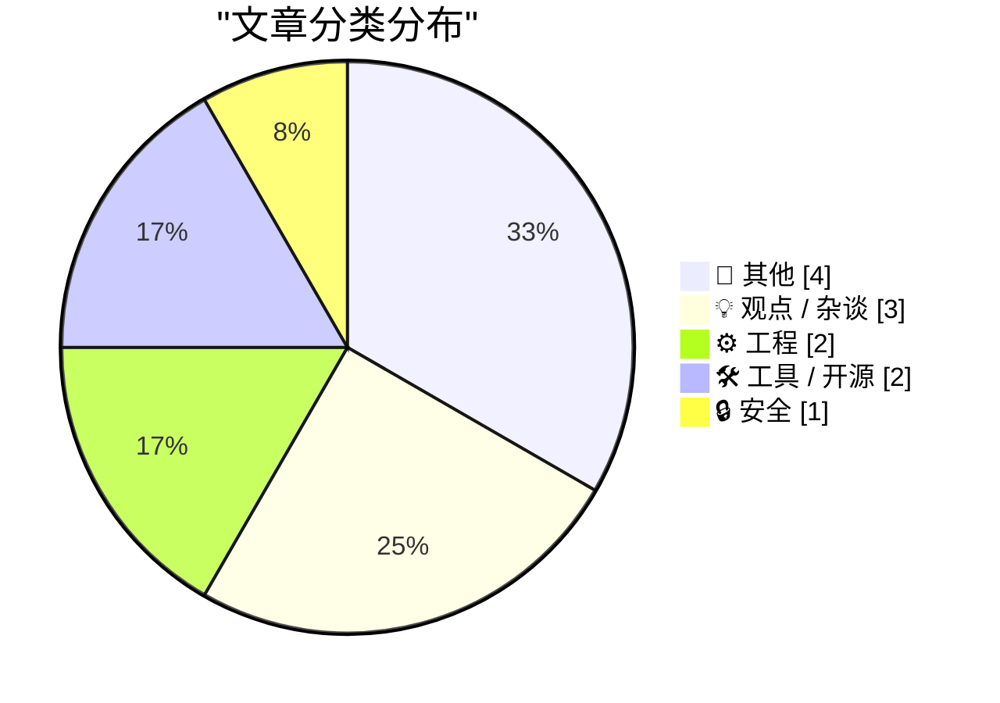
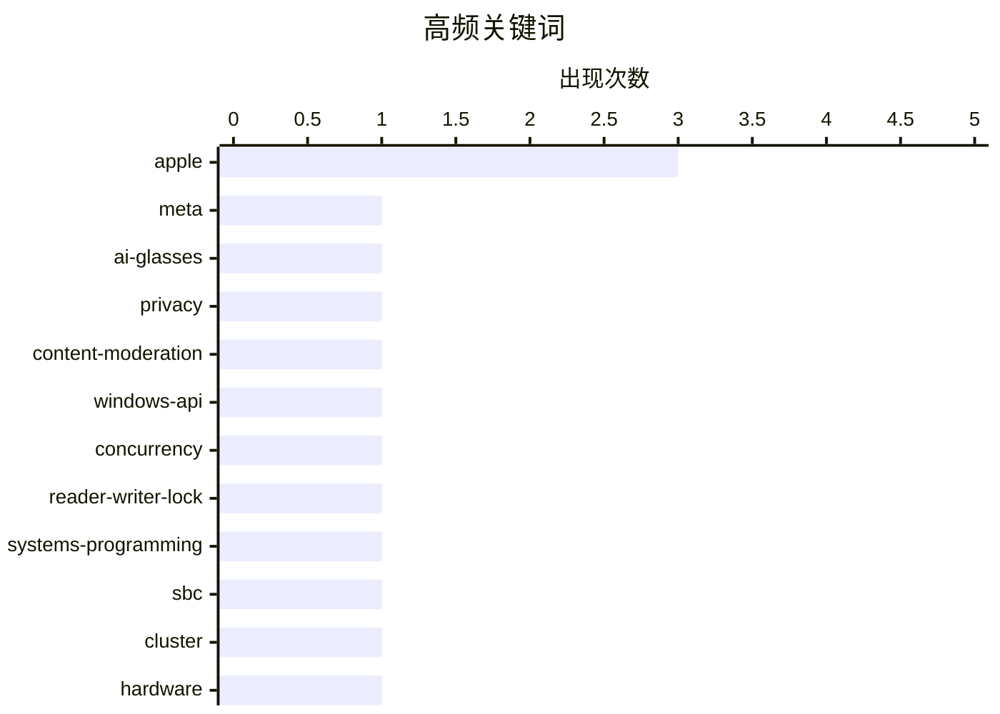

# 📰 AI 博客每日精选 — 2026-05-02

> 来自 Karpathy 推荐的 92 个顶级技术博客，AI 精选 Top 12

## 📝 今日看点

今日技术圈聚焦两大核心议题。AI隐私伦理与开源生态治理正面临严峻考验，Meta智能眼镜审核风波与英国NHS政策转向叠加，凸显技术透明化与供应链可持续性的深层矛盾。与此同时，苹果迎来历史性管理层交接，新帅上位预示硬件战略重心回归，配合关税应对策略与创纪录财报，展现其在全球供应链重构下的财务韧性。底层系统优化与硬件极客实践持续为行业创新提供底层支撑，整体而言技术产业正从规模扩张转向合规治理与战略深耕。

---

## 🏆 今日必读

🥇 **Meta如何解决肯尼亚外包人员偷窥AI眼镜用户如厕画面的问题**

[Meta Solved Their Problem With Kenyan Contractors Seeing Footage of AI Glasses Wearers on the Toilet](https://www.bbc.com/news/articles/c5y7yvgy0w6o) — daringfireball.net · 3 小时前 · 🔒 安全

> 文章探讨Meta智能眼镜隐私审核机制引发的伦理与数据安全问题。此前，Meta外包给肯尼亚的内容审核团队在人工查看视频时，频繁接触到用户更衣、性行为及如厕等极度私密画面，引发公众强烈不满。Meta随后调整策略，引入自动化AI过滤系统替代人工初审，并严格限制外包人员的访问权限与数据留存周期。这一转变标志着科技公司在平衡内容安全与用户隐私时，正加速从“人力密集型审核”向“算法驱动型治理”过渡。核心观点在于，依赖廉价外包人力处理敏感数据不仅存在道德风险，更会反噬品牌信任，自动化与权限最小化才是可持续的解决方案。

💡 **为什么值得读**: 揭示了AI硬件普及背后常被忽视的数据隐私黑箱，以及科技巨头在合规压力下如何重构内容审核架构。

🏷️ Meta, AI-glasses, privacy, content-moderation

🥈 **开发限制读者数量的跨进程读写锁（第4部分）：所有者异常退出处理**

[Developing a cross-process reader/writer lock with limited readers, part 4: Abandonment](https://devblogs.microsoft.com/oldnewthing/20260501-00/?p=112291) — devblogs.microsoft.com/oldnewthing · 10 小时前 · ⚙️ 工程

> 文章深入探讨跨进程读写锁在所有者进程意外崩溃时的状态恢复机制。当持有锁的进程非正常终止时，系统需通过检测进程句柄状态或共享内存标记来识别“废弃锁”，并安全唤醒等待队列中的其他线程。作者详细分析了Windows API中ReleaseMutex与Abandoned状态的处理差异，指出直接强制释放可能导致数据不一致，必须结合业务逻辑设计回滚或清理例程。最终结论是，健壮的并发原语必须将“进程生命周期管理”纳入锁设计核心，而非仅依赖正常的加解锁路径。

💡 **为什么值得读**: 为底层系统开发者提供了处理跨进程同步原语异常退出的实战指南，填补了常规并发编程教程中的盲区。

🏷️ Windows-API, concurrency, reader-writer-lock, systems-programming

🥉 **单板计算机集群性价比极低，但依然很好玩**

[SBC Clusters are a terrible value, but they're fun anyway](https://www.jeffgeerling.com/blog/2026/deskpi-super4c-sbc-cluster/) — jeffgeerling.com · 10 小时前 · ⚙️ 工程

> 文章评测了DeskPi Super4C四节点Raspberry Pi CM5集群主板，探讨其在家庭实验室与边缘计算场景中的实际价值。该方案通过集成化背板解决了早期集群板布线混乱与散热不均的痛点，支持热插拔与统一供电管理。尽管其硬件成本显著高于单独购买树莓派主板，且性能扩展受限于CM5的I/O带宽，但其在Kubernetes节点部署与分布式存储实验中的开箱体验依然出色。作者认为，SBC集群的核心价值不在于算力性价比，而在于提供低门槛的分布式系统学习与原型验证环境。

💡 **为什么值得读**: 客观剖析了开源硬件集群在“玩具”与“生产力工具”之间的定位差异，为边缘计算爱好者提供真实的采购决策参考。

🏷️ SBC, cluster, hardware, Raspberry-Pi

---

## 📊 数据概览

| 扫描源 | 抓取文章 | 时间范围 | 精选 |
|:---:|:---:|:---:|:---:|
| 77/92 | 2340 篇 → 12 篇 | 24h | **12 篇** |

### 分类分布



### 高频关键词



<details>
<summary>📈 纯文本关键词图（终端友好）</summary>

```
apple               │ ████████████████████ 3
meta                │ ███████░░░░░░░░░░░░░ 1
ai-glasses          │ ███████░░░░░░░░░░░░░ 1
privacy             │ ███████░░░░░░░░░░░░░ 1
content-moderation  │ ███████░░░░░░░░░░░░░ 1
windows-api         │ ███████░░░░░░░░░░░░░ 1
concurrency         │ ███████░░░░░░░░░░░░░ 1
reader-writer-lock  │ ███████░░░░░░░░░░░░░ 1
systems-programming │ ███████░░░░░░░░░░░░░ 1
sbc                 │ ███████░░░░░░░░░░░░░ 1
```

</details>

### 🏷️ 话题标签

**apple**(3) · **meta**(1) · **ai-glasses**(1) · privacy(1) · content-moderation(1) · windows-api(1) · concurrency(1) · reader-writer-lock(1) · systems-programming(1) · sbc(1) · cluster(1) · hardware(1) · raspberry-pi(1) · nhs(1) · open-source(1) · government-tech(1) · policy(1) · package-managers(1) · forking(1) · patching(1)

---

## 📝 其他

### 1. 苹果2026财年第二季度财报

[Apple Q2 2026 Results](https://www.apple.com/newsroom/2026/04/apple-reports-second-quarter-results/) — **daringfireball.net** · 23 小时前 · ⭐ 15/30

> 苹果公布2026财年第二季度业绩，实现1112亿美元营收，各地理市场均取得双位数增长，创下历年3月季度最佳纪录。iPhone 17系列凭借强劲需求刷新单季营收历史，服务业务同步创下历史新高，硬件与服务双轮驱动格局进一步巩固。财报显示，尽管面临全球宏观经济波动与供应链成本上升，苹果仍通过产品组合优化与高毛利服务扩张维持了盈利韧性。作者认为，该业绩验证了苹果高端化战略与生态闭环的有效性，为后续AI功能商业化与硬件迭代提供了充足现金流。

🏷️ Apple, earnings, revenue, iPhone

---

### 2. 雷恩堡之谜第五部分：幕后的操纵者

[The Mystery of Rennes-le-Château, Part 5: The Man Behind the Curtain](https://www.filfre.net/2026/05/the-mystery-of-rennes-le-chateau-part-5-the-man-behind-the-curtain/) — **filfre.net** · 8 小时前 · ⭐ 13/30

> 文章追溯经典冒险游戏《加百列骑士3》背后的历史原型与伪史传说，聚焦雷恩堡（Rennes-le-Château）神秘事件的核心人物皮埃尔·普朗塔（Pierre Plantard）。作者通过梳理普朗塔家族谱系与《洛比诺档案》（Lobineau dossier）的伪造痕迹，揭示其如何刻意编织墨洛温王朝后裔的虚假叙事以构建秘密结社神话。文中指出，这些被游戏改编的“历史”实为20世纪中叶精心策划的文化骗局，旨在利用宗教符号与王室血统吸引公众想象。核心观点在于，流行文化对历史谜团的再创作往往剥离了学术考证，转而服务于叙事张力与商业娱乐需求。

🏷️ Gabriel Knight, gaming lore, Rennes-le-Château

---

### 3. Ad Lib声卡公司破产始末：1992年5月1日

[Ad Lib bankruptcy: May 1, 1992](https://dfarq.homeip.net/ad-lib-bankruptcy-may-1-1992/?utm_source=rss&#038;utm_medium=rss&#038;utm_campaign=ad-lib-bankruptcy-may-1-1992) — **dfarq.homeip.net** · 13 小时前 · ⭐ 13/30

> 文章回顾加拿大Ad Lib公司于1992年5月1日申请破产的历史事件，剖析其作为早期PC声卡先驱的兴衰轨迹。该公司由音乐学者马丁·普雷维尔创立，其同名AdLib声卡首次为IBM PC兼容机引入FM合成音频标准，奠定了早期游戏音效的硬件基础。然而，因未能及时应对Creative Sound Blaster的兼容性冲击与价格战，加之缺乏持续的产品迭代与渠道支持，最终被市场淘汰。作者指出，Ad Lib的倒闭标志着PC音频硬件从“技术探索期”迈入“标准化与生态竞争期”，其失败为后续外设厂商提供了关于专利壁垒与兼容性战略的重要教训。

🏷️ Ad Lib, sound cards, hardware history

---

### 4. 山达基教会“速通”风潮

[Scientology ‘Speed Running’ Trend](https://www.theguardian.com/us-news/2026/apr/30/hollywood-church-of-scientology-speed-runs?CMP=bsky_gu) — **daringfireball.net** · 21 小时前 · ⭐ 11/30

> 文章聚焦青少年群体在好莱坞山达基教会总部发起“速通”（Speed Running）线下打卡现象的成因与传播机制。该趋势主要由年轻男性推动，参与者通过突袭教会建筑并拍摄短视频获取社交媒体流量，相关视频累计播放量已达数百万次。这种现象本质上是算法驱动的流量博弈，将线上“速通”游戏文化直接映射到线下物理空间。社交媒体平台的流量激励机制正在重塑线下行为模式，虚拟世界的打卡文化已演变为具有现实影响力的群体性事件。

🏷️ Scientology, culture, trends, sociology

---

## 💡 观点 / 杂谈

### 5. 英国NHS正全面封杀开源项目

[NHS Goes To War Against Open Source](https://shkspr.mobi/blog/2026/05/nhs-goes-to-war-against-open-source/) — **shkspr.mobi** · 12 小时前 · ⭐ 22/30

> 文章批评英国国家医疗服务体系（NHS）计划关闭几乎所有开源代码仓库的政策转向。作者结合其在英国政府数字服务局（GDS）与NHSX的工作经历，指出开源协作曾是提升公共部门软件透明度、降低重复开发成本的核心战略。NHS此次收紧代码托管权限，将导致外部开发者无法参与医疗系统迭代，同时削弱安全审计的社区监督能力。作者强调，公共机构放弃开源不仅违背数字政府建设初衷，更会长期增加系统维护成本与技术债务。

🏷️ NHS, open-source, government-tech, policy

---

### 6. 播客节目：餐饮总监与苹果CEO交接

[The Talk Show: ‘Food and Beverage Director’](https://daringfireball.net/thetalkshow/2026/04/30/ep-446) — **daringfireball.net** · 21 小时前 · ⭐ 17/30

> 本期播客聚焦苹果管理层重大人事调整，探讨蒂姆·库克卸任CEO转任执行董事长、约翰·特努斯（John Ternus）接任的深层影响。嘉宾分析指出，特努斯作为硬件工程背景的高管，其上任标志着苹果战略重心将从服务与生态扩张回归至核心硬件创新与供应链优化。节目同时讨论了库克保留执行董事长职位对苹果治理结构的意义，认为此举旨在确保AI战略与Vision Pro等长期项目的平稳过渡。作者认为，此次交接是苹果应对硬件创新瓶颈与监管压力的关键布局，新管理层需在保持财务稳健的同时重振产品差异化竞争力。

🏷️ Apple, leadership, Tim-Cook, podcast

---

### 7. 蒂姆·库克巧妙破解关税退税难题

[Tim Cook’s Clever Solution to the Tariff Refund Puzzle](https://sixcolors.com/post/2026/04/apple-results-analysis-net-net-over-the-moon/) — **daringfireball.net** · 3 小时前 · ⭐ 15/30

> 文章解析苹果在最新财报电话会议中应对关税政策的财务策略。面对分析师关于产品利润率受关税影响的提问，库克明确表示苹果正按既定流程申请已缴纳关税的退税，并承诺将退还资金全部再投资于美国本土制造与供应链升级。该策略既规避了直接转嫁成本给消费者的舆论风险，又通过政策套利优化了毛利率结构。作者指出，此举展现了苹果在宏观贸易摩擦中利用合规渠道进行财务对冲的成熟能力。核心观点在于，跨国科技巨头正将关税博弈转化为供应链本土化投资的催化剂，而非单纯的成本负担。

🏷️ Apple, tariffs, business-strategy, margins

---

## ⚙️ 工程

### 8. 开发限制读者数量的跨进程读写锁（第4部分）：所有者异常退出处理

[Developing a cross-process reader/writer lock with limited readers, part 4: Abandonment](https://devblogs.microsoft.com/oldnewthing/20260501-00/?p=112291) — **devblogs.microsoft.com/oldnewthing** · 10 小时前 · ⭐ 23/30

> 文章深入探讨跨进程读写锁在所有者进程意外崩溃时的状态恢复机制。当持有锁的进程非正常终止时，系统需通过检测进程句柄状态或共享内存标记来识别“废弃锁”，并安全唤醒等待队列中的其他线程。作者详细分析了Windows API中ReleaseMutex与Abandoned状态的处理差异，指出直接强制释放可能导致数据不一致，必须结合业务逻辑设计回滚或清理例程。最终结论是，健壮的并发原语必须将“进程生命周期管理”纳入锁设计核心，而非仅依赖正常的加解锁路径。

🏷️ Windows-API, concurrency, reader-writer-lock, systems-programming

---

### 9. 单板计算机集群性价比极低，但依然很好玩

[SBC Clusters are a terrible value, but they're fun anyway](https://www.jeffgeerling.com/blog/2026/deskpi-super4c-sbc-cluster/) — **jeffgeerling.com** · 10 小时前 · ⭐ 22/30

> 文章评测了DeskPi Super4C四节点Raspberry Pi CM5集群主板，探讨其在家庭实验室与边缘计算场景中的实际价值。该方案通过集成化背板解决了早期集群板布线混乱与散热不均的痛点，支持热插拔与统一供电管理。尽管其硬件成本显著高于单独购买树莓派主板，且性能扩展受限于CM5的I/O带宽，但其在Kubernetes节点部署与分布式存储实验中的开箱体验依然出色。作者认为，SBC集群的核心价值不在于算力性价比，而在于提供低门槛的分布式系统学习与原型验证环境。

🏷️ SBC, cluster, hardware, Raspberry-Pi

---

## 🛠 工具 / 开源

### 10. 包管理器中的补丁与分叉策略：当上游维护者失联时怎么办

[Patching and forking in package managers](https://nesbitt.io/2026/05/01/patching-and-forking-in-package-managers.html) — **nesbitt.io** · 14 小时前 · ⭐ 20/30

> 文章探讨开源生态中上游项目维护者失联（Ghosting）时，下游依赖方的应对策略。作者对比了直接打补丁（Patching）与创建分叉（Forking）两种路径的优劣，指出补丁虽能保持与上游的兼容性，但长期维护成本随版本迭代呈指数级上升；而分叉虽能重获控制权，却需承担社区分裂与安全更新滞后的风险。文中建议结合包管理器特性（如npm overrides或Cargo patches）建立临时过渡方案，并在分叉前完成依赖树评估与贡献者招募。核心观点是，面对上游断更，团队应优先采用“最小侵入式补丁”维持业务稳定，待生态成熟后再决定是否正式接管项目。

🏷️ package-managers, forking, patching, dependency-management

---

### 11. iNaturalist 观测记录聚合工具

[iNaturalist Sightings](https://simonwillison.net/2026/May/1/inat-sightings/#atom-everything) — **simonwillison.net** · 4 小时前 · ⭐ 11/30

> 该工具旨在解决跨账号自然观察记录分散、难以按时间线统一查看的问题。作者全程仅使用手机配合 Claude Code for web 完成开发，并构建了 inaturalist-clumper Python CLI 工具，用于自动抓取两个独立 iNaturalist 账号的观测数据。该方案通过命令行接口实现数据清洗与时间分组，最终生成可视化的观测时间轴。这一实践验证了 AI 编程助手在移动端快速构建个性化数据聚合应用的可行性，显著降低了个人开发者的工具构建门槛。

🏷️ iNaturalist, personal-tool, data-visualization

---

## 🔒 安全

### 12. Meta如何解决肯尼亚外包人员偷窥AI眼镜用户如厕画面的问题

[Meta Solved Their Problem With Kenyan Contractors Seeing Footage of AI Glasses Wearers on the Toilet](https://www.bbc.com/news/articles/c5y7yvgy0w6o) — **daringfireball.net** · 3 小时前 · ⭐ 23/30

> 文章探讨Meta智能眼镜隐私审核机制引发的伦理与数据安全问题。此前，Meta外包给肯尼亚的内容审核团队在人工查看视频时，频繁接触到用户更衣、性行为及如厕等极度私密画面，引发公众强烈不满。Meta随后调整策略，引入自动化AI过滤系统替代人工初审，并严格限制外包人员的访问权限与数据留存周期。这一转变标志着科技公司在平衡内容安全与用户隐私时，正加速从“人力密集型审核”向“算法驱动型治理”过渡。核心观点在于，依赖廉价外包人力处理敏感数据不仅存在道德风险，更会反噬品牌信任，自动化与权限最小化才是可持续的解决方案。

🏷️ Meta, AI-glasses, privacy, content-moderation

---

*生成于 2026-05-02 00:17 | 扫描 77 源 → 获取 2340 篇 → 精选 12 篇*
*基于 [Hacker News Popularity Contest 2025](https://refactoringenglish.com/tools/hn-popularity/) RSS 源列表，由 [Andrej Karpathy](https://x.com/karpathy) 推荐*
*由「懂点儿AI」制作，欢迎关注同名微信公众号获取更多 AI 实用技巧 💡*
