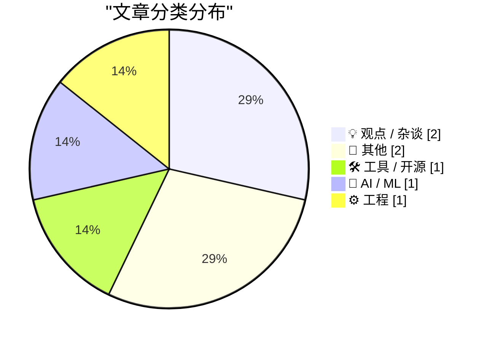
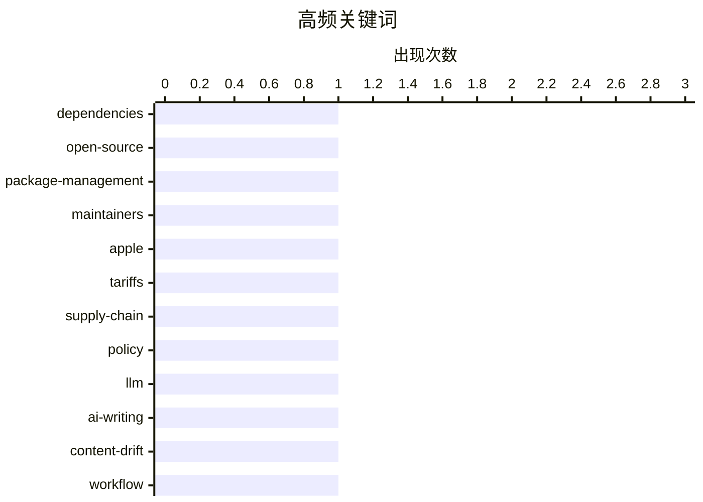

# 📰 AI 博客每日精选 — 2026-05-03

> 来自 Karpathy 推荐的 92 个顶级技术博客，AI 精选 Top 7

## 📝 今日看点

今日技术圈聚焦三大主线。AI辅助创作引发的语义漂移促使行业重新审视人机边界，人工校准与内容原创性正加速回归。软件供应链的依赖管理痛点凸显，第三方组件治理正从碎片化工具向系统化平台演进。与此同时，技术落地深度绑定地缘政策、基础设施审批与数字权利博弈，创新节奏愈发考验企业的战略缓冲与合规智慧。整体而言，技术演进已从单一工具迭代，转向内容伦理、供应链安全与宏观环境的综合较量。

---

## 🏆 今日必读

🥇 **面向维护者的 GitHub**

[A GitHub for maintainers](https://nesbitt.io/2026/05/02/a-github-for-maintainers.html) — nesbitt.io · 14 小时前 · 🛠 工具 / 开源

> 软件生态中第三方依赖的管理与维护长期缺乏系统化支持，导致维护者面临版本追踪、安全更新和协作困难。文章提出构建一个专为依赖项设计的平台，借鉴 GitHub 处理代码分支（fork）的成熟机制，为依赖项提供版本控制、贡献追踪和自动化维护工具。该方案旨在将依赖管理从被动的“引入即遗忘”转变为主动的协作生态，降低开源项目的技术债务。通过标准化依赖维护流程，可显著提升开源基础设施的稳定性与可持续性。

💡 **为什么值得读**: 该方案直击开源依赖管理的痛点，为开发者提供了重构第三方库协作模式的新思路，对提升项目长期可维护性具有直接参考价值。

🏷️ dependencies, open-source, package-management, maintainers

🥈 **关于苹果关税退款难题的精妙逻辑解法**

[More on Apple’s Logically Elegant Tariff Refund Puzzle Solution](https://daringfireball.net/linked/2026/05/01/tim-cooks-clever-solution-to-the-tariff-refund-puzzle) — daringfireball.net · 22 小时前 · 💡 观点 / 杂谈

> 苹果面临潜在关税退款时的政治与财务两难，核心在于如何接受退款而不激怒特朗普政府。库克提出将退款专项用于“美国创新与先进制造”，以此作为政治表态与资金用途的缓冲。该方案并非增加额外预算，而是对既有承诺的资金流向进行重新包装与定向分配，巧妙规避了政治风险。此举在维持企业财务纪律的同时，满足了政策合规要求。

💡 **为什么值得读**: 文章深度拆解了跨国巨头在复杂贸易政策下的财务运作与公关话术，对理解企业战略决策与政治博弈极具启发。

🏷️ Apple, tariffs, supply-chain, policy

🥉 **编辑我由大语言模型辅助撰写的文章**

[Editing my LLM assisted Articles](https://idiallo.com/byte-size/editing-llm-assisted-articles?src=feed) — idiallo.com · 21 小时前 · 🤖 AI / ML

> 使用大语言模型辅助写作虽能大幅节省时间，但会导致文章失去作者原有声音，且在后续引用时出现内容与初衷严重不符的问题。作者指出 AI 生成文本的“语义漂移”现象，并决定系统性重写过往的 AI 辅助文章，以恢复真实的个人表达与核心观点。通过对比修改前后的文本，展示了如何精准校准 AI 输出、保留人类作者的逻辑脉络与语言风格。这一过程证明，AI 仅应作为草稿生成工具，深度编辑与人工复核才是保证内容质量的关键。

💡 **为什么值得读**: 文章以亲身经历揭示了 AI 写作的隐性缺陷，并提供了一套可操作的“人机协作”内容校准方法，对内容创作者极具实战指导意义。

🏷️ LLM, AI-writing, content-drift, workflow

---

## 📊 数据概览

| 扫描源 | 抓取文章 | 时间范围 | 精选 |
|:---:|:---:|:---:|:---:|
| 77/92 | 2340 篇 → 7 篇 | 24h | **7 篇** |

### 分类分布



### 高频关键词



<details>
<summary>📈 纯文本关键词图（终端友好）</summary>

```
dependencies       │ ████████████████████ 1
open-source        │ ████████████████████ 1
package-management │ ████████████████████ 1
maintainers        │ ████████████████████ 1
apple              │ ████████████████████ 1
tariffs            │ ████████████████████ 1
supply-chain       │ ████████████████████ 1
policy             │ ████████████████████ 1
llm                │ ████████████████████ 1
ai-writing         │ ████████████████████ 1
```

</details>

### 🏷️ 话题标签

**dependencies**(1) · **open-source**(1) · **package-management**(1) · maintainers(1) · apple(1) · tariffs(1) · supply-chain(1) · policy(1) · llm(1) · ai-writing(1) · content-drift(1) · workflow(1) · robotics(1) · energy-grid(1) · manufacturing(1) · battery-storage(1) · sinusoids(1) · math(1) · signal-processing(1) · graphics(1)

---

## 💡 观点 / 杂谈

### 1. 关于苹果关税退款难题的精妙逻辑解法

[More on Apple’s Logically Elegant Tariff Refund Puzzle Solution](https://daringfireball.net/linked/2026/05/01/tim-cooks-clever-solution-to-the-tariff-refund-puzzle) — **daringfireball.net** · 22 小时前 · ⭐ 20/30

> 苹果面临潜在关税退款时的政治与财务两难，核心在于如何接受退款而不激怒特朗普政府。库克提出将退款专项用于“美国创新与先进制造”，以此作为政治表态与资金用途的缓冲。该方案并非增加额外预算，而是对既有承诺的资金流向进行重新包装与定向分配，巧妙规避了政治风险。此举在维持企业财务纪律的同时，满足了政策合规要求。

🏷️ Apple, tariffs, supply-chain, policy

---

### 2. 多元视角：民主党纽伦堡小组的前史（2026年5月2日）

[Pluralistic: The prehistory of the Democratic Nuremberg Caucus (02 May 2026)](https://pluralistic.net/2026/05/02/denazification/) — **pluralistic.net** · 12 小时前 · ⭐ 14/30

> 本期专栏以技术政策与公民权利为主线，串联起 ICE 吹哨人奖励机制、共和党学生贷款争议、媒体监督准则及版权诉讼等多元议题。文章特别点评了“信鸽传输 TCP”等极客文化现象，并回顾了版权战与数字权利领域的关键进展。通过交叉分析政治表态与技术治理的互动，揭示了政策制定对创新生态的潜在塑造力。作者呼吁读者保持对权力扩张的警惕，并支持独立新闻与开源文化。

🏷️ politics, media, journalism, digital-rights

---

## 📝 其他

### 3. 阅读清单 2026年5月2日

[Reading List 05/02/2026](https://www.construction-physics.com/p/reading-list-05022026) — **construction-physics.com** · 12 小时前 · ⭐ 18/30

> 本期清单聚焦建筑租赁市场降温、机器人制造规模化潜力、PJM 电网新互联队列机制以及电池储能项目遭遇的公众抵制等交叉议题。文章梳理了各领域的最新数据与政策动向，指出能源转型与自动化升级正面临基础设施审批滞后与社会接受度的双重瓶颈。通过对比不同技术路线的落地速度，揭示了供应链与监管环境对产业扩张的实际制约。建议从业者密切关注电网互联规则变更与储能项目的社区沟通策略。

🏷️ robotics, energy-grid, manufacturing, battery-storage

---

### 4. 观测记录

[Sightings](https://simonwillison.net/2026/May/2/sightings/#atom-everything) — **simonwillison.net** · 6 小时前 · ⭐ 9/30

> 作者分享了自己升级至佳能 R6 Mark II 相机后增加鸟类摄影的实践，并介绍了将 iNaturalist 平台数据自动同步至个人博客的技术原型。该工作流通过 API 对接与自动化脚本，实现了野外观测记录到个人网站的无缝发布。文章展示了如何利用现有开源工具与社区平台构建轻量级的内容聚合系统。这种“硬件采集+社区标注+自动发布”的模式为个人知识管理提供了可复用的模板。

🏷️ photography, wildlife, iNaturalist

---

## 🛠 工具 / 开源

### 5. 面向维护者的 GitHub

[A GitHub for maintainers](https://nesbitt.io/2026/05/02/a-github-for-maintainers.html) — **nesbitt.io** · 14 小时前 · ⭐ 21/30

> 软件生态中第三方依赖的管理与维护长期缺乏系统化支持，导致维护者面临版本追踪、安全更新和协作困难。文章提出构建一个专为依赖项设计的平台，借鉴 GitHub 处理代码分支（fork）的成熟机制，为依赖项提供版本控制、贡献追踪和自动化维护工具。该方案旨在将依赖管理从被动的“引入即遗忘”转变为主动的协作生态，降低开源项目的技术债务。通过标准化依赖维护流程，可显著提升开源基础设施的稳定性与可持续性。

🏷️ dependencies, open-source, package-management, maintainers

---

## 🤖 AI / ML

### 6. 编辑我由大语言模型辅助撰写的文章

[Editing my LLM assisted Articles](https://idiallo.com/byte-size/editing-llm-assisted-articles?src=feed) — **idiallo.com** · 21 小时前 · ⭐ 20/30

> 使用大语言模型辅助写作虽能大幅节省时间，但会导致文章失去作者原有声音，且在后续引用时出现内容与初衷严重不符的问题。作者指出 AI 生成文本的“语义漂移”现象，并决定系统性重写过往的 AI 辅助文章，以恢复真实的个人表达与核心观点。通过对比修改前后的文本，展示了如何精准校准 AI 输出、保留人类作者的逻辑脉络与语言风格。这一过程证明，AI 仅应作为草稿生成工具，深度编辑与人工复核才是保证内容质量的关键。

🏷️ LLM, AI-writing, content-drift, workflow

---

## ⚙️ 工程

### 7. 正弦波的缩放、拉伸与平移

[Scaling, stretching and shifting sinusoids](https://eli.thegreenplace.net/2026/scaling-stretching-and-shifting-sinusoids/) — **eli.thegreenplace.net** · 9 小时前 · ⭐ 17/30

> 文章系统解析了标准正弦函数 sin(x) 的通用形式中各参数对波形特征的数学影响。通过调整振幅系数、频率系数、相位偏移量与垂直偏移量，可精确控制波形的拉伸、压缩与位置移动。作者结合函数图像与代数推导，直观展示了参数变化如何对应到实际物理信号的特征改变。掌握这些基础变换是理解信号处理、振动分析与通信工程的前提。

🏷️ sinusoids, math, signal-processing, graphics

---

*生成于 2026-05-03 00:05 | 扫描 77 源 → 获取 2340 篇 → 精选 7 篇*
*基于 [Hacker News Popularity Contest 2025](https://refactoringenglish.com/tools/hn-popularity/) RSS 源列表，由 [Andrej Karpathy](https://x.com/karpathy) 推荐*
*由「懂点儿AI」制作，欢迎关注同名微信公众号获取更多 AI 实用技巧 💡*
