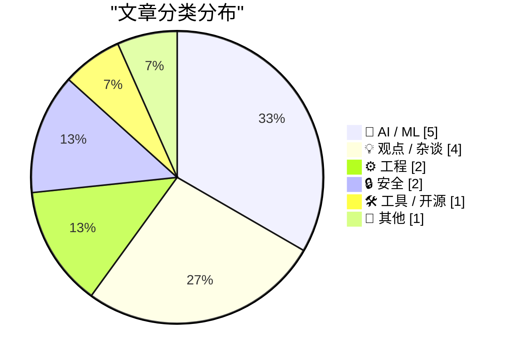
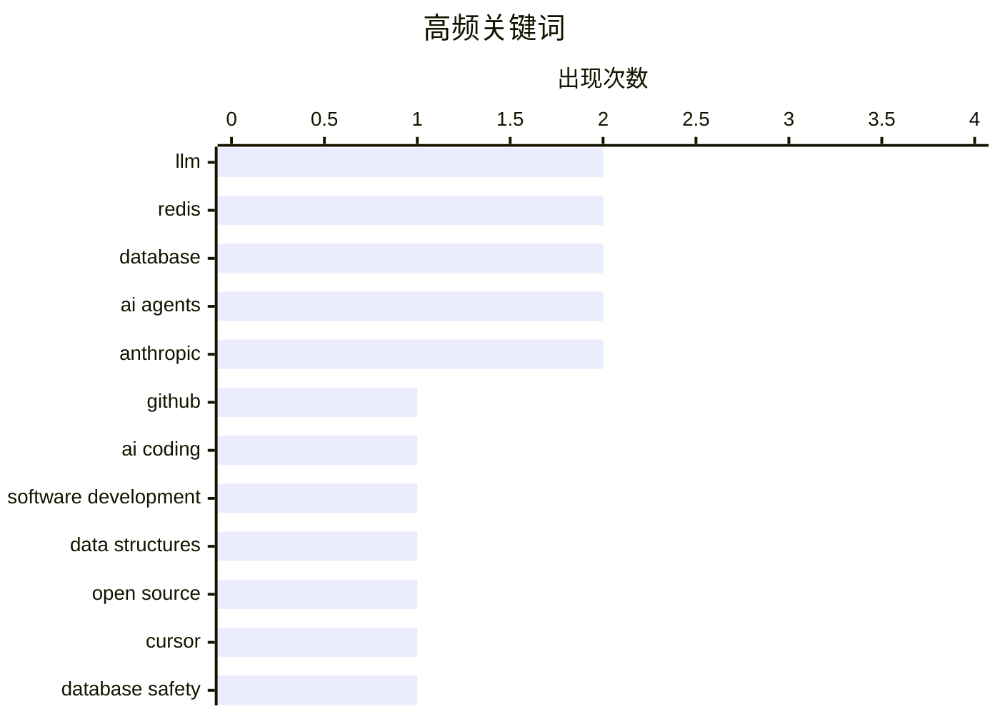

# 📰 AI 博客每日精选 — 2026-05-05

> 来自 Karpathy 推荐的 92 个顶级技术博客，AI 精选 Top 15

## 📝 今日看点

今日技术圈聚焦AI重塑研发工作流与产业资本博弈的双重变奏。AI编程工具与智能体正以指数级效率渗透开发全链路，但生产环境事故频发也明确划出红线：架构隔离与权限设计才是安全底线，AI绝非工程失误的替罪羊。与此同时，巨头资本暗战持续升级，从Y Combinator到谷歌对Anthropic的隐秘注资折射出技术优先权的激烈争夺；行业亦开始集体祛魅，猛烈抨击“算力需求无限增长”的泡沫叙事，呼吁回归真实商业回报。在底层设施层面，Redis原生数组迭代与包管理器安全审计同步推进，正为AI时代的工程底座筑牢防线。

---

## 🏆 今日必读

🥇 **GitHub 代码提交量同比增长 14 倍**

[Commits on GitHub Are Up 14× Year-Over-Year](https://daringfireball.net/linked/2026/03/13/amodei-ai-code-claim-chowder) — daringfireball.net · 9 小时前 · 🤖 AI / ML

> 文章探讨 AI 编程工具对软件开发工作流的实际影响，指出 GitHub 代码提交量已实现 14 倍同比增长。核心观点认为 AI 并非简单替代人类编写代码行数，而是通过自动化重构、批量生成和即时迭代彻底改变了开发模式。这种转变使得开发者能够以前所未有的速度验证想法并交付功能，推动工程效率呈指数级上升。AI 辅助编程的真正革命性在于重塑了代码生产与协作的底层逻辑，而非单纯的人力替代。

💡 **为什么值得读**: 揭示了 AI 编程工具如何从“辅助打字”进化为“工程范式重构”，用真实数据打破“AI 只会写简单代码”的认知误区。

🏷️ GitHub, AI coding, software development, LLM

🥈 **Redis 数组类型开发始末：一段漫长的开发故事**

[Redis array type: short story of a long development](http://antirez.com/news/164) — antirez.com · 9 小时前 · ⚙️ 工程

> 文章回顾了 Redis 新增原生数组（Array）数据类型的四个月开发历程，详细记录了从年初启动到最终提交 PR 的技术决策与实现细节。作者指出，尽管开发周期较长，但借助 LLM 辅助编码与文档生成，在相同时间内完成了远超以往的工作量。新数组类型通过专用命令集扩展了 Redis 的数据结构能力，填补了原有列表（List）在特定场景下的性能与语义空白。这一演进不仅体现了底层数据结构设计的严谨性，也展示了 AI 工具对开源核心项目维护效率的实际提升。

💡 **为什么值得读**: 由 Redis 创始人亲述核心数据结构的设计权衡与 AI 辅助开发体验，是理解现代开源项目演进与工程提效的珍贵一手资料。

🏷️ Redis, database, data structures, open source

🥉 **删库的不是 AI，是你自己**

[AI didn't delete your database, you did](https://idiallo.com/blog/ai-didnt-delete-your-database-you-did?src=feed) — idiallo.com · 1 小时前 · 🤖 AI / ML

> 文章针对近期 Cursor/Claude 智能体误删生产数据库的热门事件，指出事故根源并非 AI 失控，而是系统架构设计存在致命缺陷。作者强调，暴露可直接清空生产库的 API 端点且缺乏权限隔离与二次确认机制，本质是人为的安全配置失误。AI 代理仅按指令执行操作，真正需要反思的是开发团队在权限管控、环境隔离与操作审计上的长期疏忽。将责任推给 AI 会掩盖工程实践中的真实风险，唯有完善基础设施安全基线才能避免同类事故。

💡 **为什么值得读**: 一针见血地戳破“AI 背锅”的舆论泡沫，为 AI 时代的生产环境安全架构与权限治理提供了极具实操价值的反思视角。

🏷️ AI agents, Cursor, database safety, DevOps

---

## 📊 数据概览

| 扫描源 | 抓取文章 | 时间范围 | 精选 |
|:---:|:---:|:---:|:---:|
| 77/92 | 2324 篇 → 24 篇 | 24h | **15 篇** |

### 分类分布



### 高频关键词



<details>
<summary>📈 纯文本关键词图（终端友好）</summary>

```
llm                  │ ████████████████████ 2
redis                │ ████████████████████ 2
database             │ ████████████████████ 2
ai agents            │ ████████████████████ 2
anthropic            │ ████████████████████ 2
github               │ ██████████░░░░░░░░░░ 1
ai coding            │ ██████████░░░░░░░░░░ 1
software development │ ██████████░░░░░░░░░░ 1
data structures      │ ██████████░░░░░░░░░░ 1
open source          │ ██████████░░░░░░░░░░ 1
```

</details>

### 🏷️ 话题标签

**llm**(2) · **redis**(2) · **database**(2) · ai agents(2) · anthropic(2) · github(1) · ai coding(1) · software development(1) · data structures(1) · open source(1) · cursor(1) · database safety(1) · devops(1) · openai(1) · y-combinator(1) · tech-investment(1) · governance(1) · package-manager(1) · cwe(1) · supply-chain(1)

---

## 🤖 AI / ML

### 1. GitHub 代码提交量同比增长 14 倍

[Commits on GitHub Are Up 14× Year-Over-Year](https://daringfireball.net/linked/2026/03/13/amodei-ai-code-claim-chowder) — **daringfireball.net** · 9 小时前 · ⭐ 26/30

> 文章探讨 AI 编程工具对软件开发工作流的实际影响，指出 GitHub 代码提交量已实现 14 倍同比增长。核心观点认为 AI 并非简单替代人类编写代码行数，而是通过自动化重构、批量生成和即时迭代彻底改变了开发模式。这种转变使得开发者能够以前所未有的速度验证想法并交付功能，推动工程效率呈指数级上升。AI 辅助编程的真正革命性在于重塑了代码生产与协作的底层逻辑，而非单纯的人力替代。

🏷️ GitHub, AI coding, software development, LLM

---

### 2. 删库的不是 AI，是你自己

[AI didn't delete your database, you did](https://idiallo.com/blog/ai-didnt-delete-your-database-you-did?src=feed) — **idiallo.com** · 1 小时前 · ⭐ 26/30

> 文章针对近期 Cursor/Claude 智能体误删生产数据库的热门事件，指出事故根源并非 AI 失控，而是系统架构设计存在致命缺陷。作者强调，暴露可直接清空生产库的 API 端点且缺乏权限隔离与二次确认机制，本质是人为的安全配置失误。AI 代理仅按指令执行操作，真正需要反思的是开发团队在权限管控、环境隔离与操作审计上的长期疏忽。将责任推给 AI 会掩盖工程实践中的真实风险，唯有完善基础设施安全基线才能避免同类事故。

🏷️ AI agents, Cursor, database safety, DevOps

---

### 3. 谷歌持有 Anthropic 大量股权

[Google Owns a Big Chunk of Anthropic](https://www.nytimes.com/2025/03/11/technology/google-investment-anthropic.html?unlocked_article_code=1.f1A.eSTf.D5ECvk6f4DZ7) — **daringfireball.net** · 2 小时前 · ⭐ 23/30

> 文章援引《纽约时报》披露的法庭文件，揭示谷歌为在 AI 竞赛中保持竞争优势，长期秘密注资 Anthropic 并持有其大量股权。投资结构的设计旨在通过资本绑定获取技术优先权与市场协同效应，同时规避反垄断审查的早期关注。随着监管环境收紧与 AI 商业化进程加速，谷歌的持股策略正面临透明度要求与合规压力的双重挑战。这一案例凸显了科技巨头在前沿 AI 领域“明面自研、暗面控股”的典型资本布局逻辑。

🏷️ Google, Anthropic, AI-race, investment

---

### 4. Granite 4.1 3B 模型 SVG 鹈鹕画廊

[Granite 4.1 3B SVG Pelican Gallery](https://simonwillison.net/2026/May/4/granite-41-3b-svg-pelican-gallery/#atom-everything) — **simonwillison.net** · 25 分钟前 · ⭐ 22/30

> 文章展示了 IBM 开源的 Granite 4.1 系列大模型（涵盖 3B、8B 与 30B 规格）在 SVG 矢量图形生成任务上的实际输出效果。基于 Apache 2.0 许可协议，该系列模型通过优化的训练流程与数据配比，在轻量级参数规模下实现了高质量的代码与图形生成能力。演示画廊以鹈鹕 SVG 图像为例，验证了 3B 模型在结构化输出与指令遵循方面的稳定性。小参数开源模型的持续迭代正逐步缩小与闭源商业模型在特定垂直任务上的能力差距。

🏷️ Granite, LLM, open-source

---

### 5. Anthropic 高管一年前预测：全 AI 员工距落地仅一年

[Anthropic Executive, One Year Ago: Fully AI Employees Are a Year Away](https://www.axios.com/2025/04/22/ai-anthropic-virtual-employees-security) — **daringfireball.net** · 5 小时前 · ⭐ 22/30

> 文章回溯 Anthropic 首席信息安全官 Jason Clinton 一年前的公开预测，指出其曾宣称 AI 虚拟员工将在一年内全面进入企业网络。当时的规划聚焦于让自主代理执行 phishing 警报响应等可编程安全任务，试图将 AI 从辅助工具升级为独立运营节点。然而当前企业级 AI 代理的落地仍受限于权限管控、幻觉风险与合规审计，距离“全自主员工”愿景存在显著差距。这一时间线的对比揭示了 AI 代理从实验室概念走向生产环境所必须跨越的工程与治理鸿沟。

🏷️ AI agents, Anthropic, corporate AI, automation

---

## 💡 观点 / 杂谈

### 6. Y Combinator 在 OpenAI 的持股利益

[★ Y Combinator’s Stake in OpenAI](https://daringfireball.net/2026/05/y_combinators_stake_in_openai) — **daringfireball.net** · 1 小时前 · ⭐ 24/30

> 文章聚焦 Y Combinator 联合创始人 Paul Graham 对 OpenAI CEO Sam Altman 的公开背书，指出其个人在 OpenAI 拥有数十亿美元的经济利益。作者认为，巨额财务关联虽不直接否定 Graham 的评价有效性，但在引用其言论作为领导力或人品背书时必须进行利益披露。这种透明度缺失会削弱公众对科技行业意见领袖客观性的信任，并可能影响行业对 OpenAI 治理结构的判断。在 AI 巨头资本高度集中的背景下，利益冲突披露应成为科技评论的基本准则。

🏷️ OpenAI, Y-Combinator, tech-investment, governance

---

### 7. AI 算力需求神话是一场谎言

[Premium: The AI Compute Demand Story Is A Lie](https://www.wheresyoured.at/premium-the-ai-compute-demand-story-is-a-lie/) — **wheresyoured.at** · 10 小时前 · ⭐ 24/30

> 文章猛烈抨击当前 AI 行业关于“算力需求无限增长”的叙事，指出所谓的产能瓶颈并非源于真实市场需求，而是超大规模云厂商的焦虑与芯片巨头资本运作的产物。作者认为，AI 推理与训练的实际商业化回报远未匹配硬件扩张速度，算力囤积更多是资本避险与估值维持的策略。这种供需错配导致基础设施投资严重泡沫化，最终成本将转嫁给终端企业与开发者。打破算力迷信需要回归应用层真实负载数据，而非盲目追随硬件厂商的营销话术。

🏷️ AI-compute, market-analysis, hyperscalers, GPU

---

### 8. App Store 搜索广告与滑坡效应

[App Store Search Ads and the Slippery Slope](https://blog.thinktapwork.com/post/812803664980967425/ios-app-store-search-is-rotten) — **daringfireball.net** · 3 小时前 · ⭐ 21/30

> iOS App Store 的搜索机制已从相关性优先彻底转向广告库存优先。随着 Apple 引入第二条搜索广告，未排名第一的应用在自然搜索结果中被强制降权，导致界面约 70% 的区域被广告占据，甚至出现赌场类广告。作者通过实际数据展示了广告位增加对独立开发者应用曝光量的直接冲击。核心观点认为，Apple 过度商业化搜索流量正在破坏应用商店的生态平衡与用户体验。

🏷️ App-Store, search-ads, iOS, monetization

---

### 9. X，所谓的“言论自由平台”

[X, the Platform of Free Speech](https://bsky.app/profile/gilduran.com/post/3mky5taqg3222) — **daringfireball.net** · 23 小时前 · ⭐ 21/30

> 博主 Gil Durán 因在回复 Palantir 公司技术共和国愿景文章时仅回复 TLDR: Fascism 而被 X 平台永久封禁。尽管其申诉被驳回，但此次封禁反而触发了史翠珊效应，意外为其新书带来了巨大的流量曝光。事件暴露了 X 平台在内容审核标准上的高度随意性与政治倾向性。作者借此讽刺了该平台标榜的绝对言论自由与其实际封号行为之间的巨大矛盾。

🏷️ content moderation, X platform, free speech, tech ethics

---

## ⚙️ 工程

### 10. Redis 数组类型开发始末：一段漫长的开发故事

[Redis array type: short story of a long development](http://antirez.com/news/164) — **antirez.com** · 9 小时前 · ⭐ 26/30

> 文章回顾了 Redis 新增原生数组（Array）数据类型的四个月开发历程，详细记录了从年初启动到最终提交 PR 的技术决策与实现细节。作者指出，尽管开发周期较长，但借助 LLM 辅助编码与文档生成，在相同时间内完成了远超以往的工作量。新数组类型通过专用命令集扩展了 Redis 的数据结构能力，填补了原有列表（List）在特定场景下的性能与语义空白。这一演进不仅体现了底层数据结构设计的严谨性，也展示了 AI 工具对开源核心项目维护效率的实际提升。

🏷️ Redis, database, data structures, open source

---

### 11. Photoshop 的“现代用户界面”体验极差（且毫无现代感）

[Photoshop’s ‘Modern User Interface’ Sucks (and Doesn’t Feel Modern)](https://unsung.aresluna.org/photoshops-challenges-with-focus-pt-2/) — **daringfireball.net** · 5 小时前 · ⭐ 21/30

> Adobe Photoshop 近期推出的现代用户界面更新不仅未能提升操作效率，反而导致软件稳定性下降与交互逻辑退化。作为数十年经验的高级用户，作者指出此次改版并非为了拓展新市场或顺应技术演进，而是盲目追求视觉现代化却牺牲了核心工作流。界面频繁出现的卡顿与功能错位直接消耗了专业用户的耐心。结论认为，脱离实际生产力需求的现代化改版只会加速核心用户群体的流失。

🏷️ UI, UX, Photoshop, software design

---

## 🔒 安全

### 12. 包管理器中的常见 CWE 漏洞类型

[Package Manager CWEs](https://nesbitt.io/2026/05/04/package-manager-cwes.html) — **nesbitt.io** · 14 小时前 · ⭐ 24/30

> 文章系统梳理了主流软件包管理器中反复出现的安全缺陷类别，将其映射至通用弱点枚举（CWE）标准框架。作者指出，依赖解析冲突、元数据验证缺失与执行环境隔离不足是三大高频风险点，极易被供应链攻击利用。通过对比 npm、pip 与 Cargo 等生态的实现差异，文章揭示了包管理器在追求便利性与保障安全性之间的固有张力。强化签名验证、沙箱执行与依赖图谱审计是降低此类 CWE 触发率的关键路径。

🏷️ package-manager, CWE, supply-chain, vulnerabilities

---

### 13. TRE Python 绑定 —— ReDoS 鲁棒性演示

[TRE Python binding — ReDoS robustness demo](https://simonwillison.net/2026/May/4/tre-python-binding/#atom-everything) — **simonwillison.net** · 6 小时前 · ⭐ 20/30

> 基于 Ville Laurikari 开发的 TRE 正则表达式引擎构建的 Python 绑定实验项目，重点演示了该引擎在防御正则表达式拒绝服务攻击方面的卓越鲁棒性。其设计理念与 Redis 作者 antirez 引入的优化思路高度一致，通过 Claude Code 辅助生成的绑定代码可直接在 Python 环境中调用 TRE 的高性能防回溯匹配能力。项目验证了采用确定性有限自动机或线性时间匹配算法替代传统回溯引擎的可行性。结论指出，在涉及不可信用户输入的正则匹配场景中，迁移至 TRE 等防 ReDoS 引擎是保障系统稳定性的必要架构升级。

🏷️ ReDoS, regex, Python, security

---

## 🛠 工具 / 开源

### 14. Redis 数组类型在线实验场

[Redis Array Playground](https://simonwillison.net/2026/May/4/redis-array/#atom-everything) — **simonwillison.net** · 8 小时前 · ⭐ 23/30

> 文章发布了一款基于 Web 的 Redis Array Playground 交互工具，用于实时测试 Redis 新增的原生数组数据类型的各项命令。该工具完整支持 ARCOUNT、ARDEL、ARGET、ARINSERT 等十余个新指令，允许开发者在沙箱环境中验证数组操作的性能表现与边界条件。通过可视化反馈与即时执行日志，用户可直观对比新数组类型与传统 List 在内存占用与查询效率上的差异。该实验场为 Redis 核心架构演进提供了低门槛的验证平台，加速了新数据类型的社区认知与落地评估。

🏷️ Redis, database, arrays, playground

---

## 📝 其他

### 15. ScopeXR：利用 Apple Vision Pro 混合现实进行白内障手术

[ScopeXR — Cataract Surgery Using Apple Vision Pro Mixed Reality](https://www.prnewswire.com/news-releases/sightmds-dr-eric-rosenberg-becomes-first-surgeon-in-the-world-to-perform-cataract-surgery-using-apple-vision-pro-mixed-reality-302754311.html) — **daringfireball.net** · 9 小时前 · ⭐ 21/30

> 眼科医生 Eric Rosenberg 成功完成全球首例基于 Apple Vision Pro 的混合现实白内障手术。该手术由 Rosenberg 联合开发的 ScopeXR 混合现实外科平台提供支持，于 2025 年 10 月顺利完成。技术实现上，Vision Pro 的空间计算与实时渲染能力使医生能够在术中获取增强视觉辅助与精准的空间定位。这一突破标志着消费级头显设备正式跨入高精度临床医疗场景。核心观点认为，混合现实技术将重塑传统外科手术的操作范式与培训体系。

🏷️ Apple Vision Pro, mixed reality, medical tech, AR

---

*生成于 2026-05-05 00:15 | 扫描 77 源 → 获取 2324 篇 → 精选 15 篇*
*基于 [Hacker News Popularity Contest 2025](https://refactoringenglish.com/tools/hn-popularity/) RSS 源列表，由 [Andrej Karpathy](https://x.com/karpathy) 推荐*
*由「懂点儿AI」制作，欢迎关注同名微信公众号获取更多 AI 实用技巧 💡*
