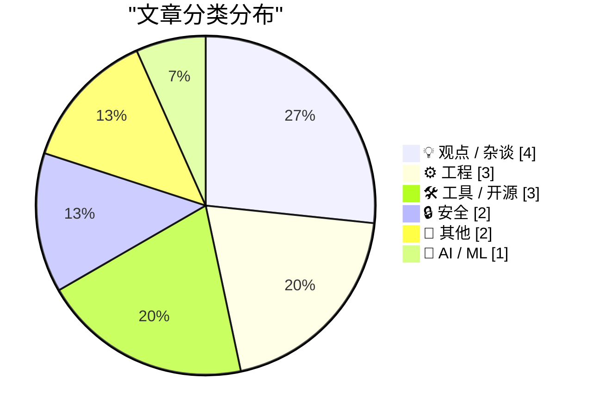
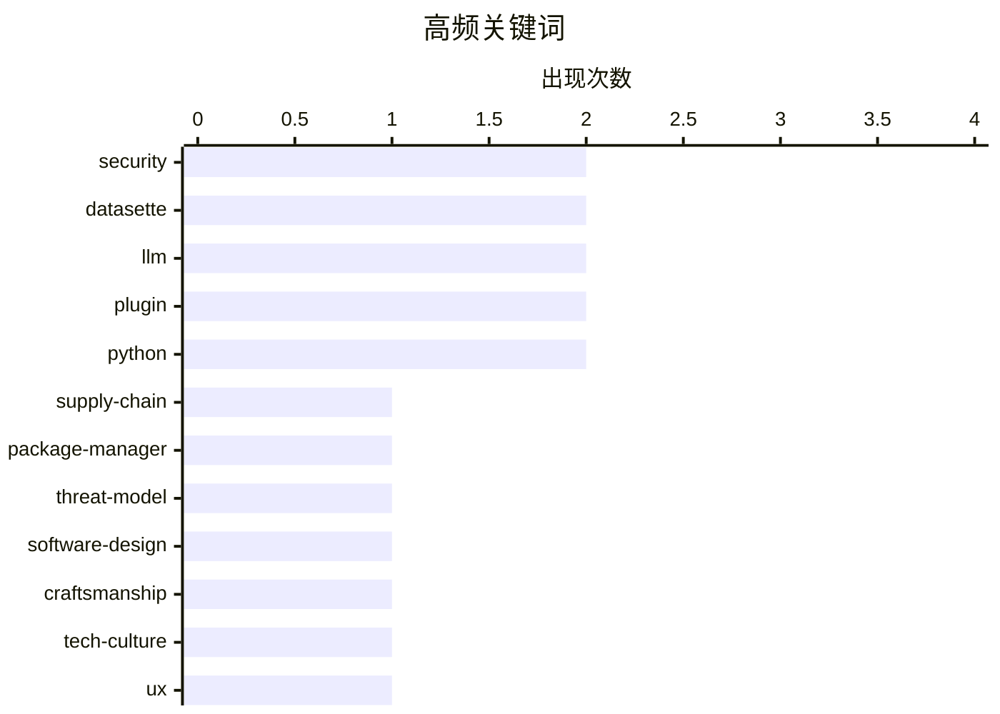

# 📰 AI 博客每日精选 — 2026-05-06

> 来自 Karpathy 推荐的 92 个顶级技术博客，AI 精选 Top 15

## 📝 今日看点

今日技术圈聚焦三大主线。AI正加速从对话交互走向实体运营与垂直工具链，展现出更强的自主性与工程化潜力。软件安全领域深度审视包管理器威胁模型与底层信任机制，供应链防御成为核心议题。界面技术栈的Web化演进与跨巨头组织协作摩擦，则折射出工程文化在效率与体验间的持续博弈。整体来看，技术演进正从单一功能突破转向系统韧性、AI赋能与工程哲学的综合较量。

---

## 🏆 今日必读

🥇 **Package Manager Threat Models**

[Package Manager Threat Models](https://nesbitt.io/2026/05/05/package-manager-threat-models.html) — nesbitt.io · 14 小时前 · 🔒 安全

> Package Manager Threat Models

🏷️ supply-chain, package-manager, threat-model, security

🥈 **★ Software as the Product of Obsession Times Voice**

[★ Software as the Product of Obsession Times Voice](https://daringfireball.net/2026/05/software_as_the_product_of_obsession_times_voice) — daringfireball.net · 3 小时前 · 💡 观点 / 杂谈

> ★ Software as the Product of Obsession Times Voice

🏷️ software-design, craftsmanship, tech-culture, ux

🥉 **Adobe’s ‘Modern’ User Interface Is Just Webpages**

[Adobe’s ‘Modern’ User Interface Is Just Webpages](https://pxlnv.com/linklog/adobe-modern-user-interface/) — daringfireball.net · 22 小时前 · ⚙️ 工程

> Adobe’s ‘Modern’ User Interface Is Just Webpages

🏷️ Electron, UI, web-technologies, desktop-apps

---

## 📊 数据概览

| 扫描源 | 抓取文章 | 时间范围 | 精选 |
|:---:|:---:|:---:|:---:|
| 76/92 | 2295 篇 → 19 篇 | 24h | **15 篇** |

### 分类分布



### 高频关键词



<details>
<summary>📈 纯文本关键词图（终端友好）</summary>

```
security        │ ████████████████████ 2
datasette       │ ████████████████████ 2
llm             │ ████████████████████ 2
plugin          │ ████████████████████ 2
python          │ ████████████████████ 2
supply-chain    │ ██████████░░░░░░░░░░ 1
package-manager │ ██████████░░░░░░░░░░ 1
threat-model    │ ██████████░░░░░░░░░░ 1
software-design │ ██████████░░░░░░░░░░ 1
craftsmanship   │ ██████████░░░░░░░░░░ 1
```

</details>

### 🏷️ 话题标签

**security**(2) · **datasette**(2) · **llm**(2) · plugin(2) · python(2) · supply-chain(1) · package-manager(1) · threat-model(1) · software-design(1) · craftsmanship(1) · tech-culture(1) · ux(1) · electron(1) · ui(1) · web-technologies(1) · desktop-apps(1) · windows(1) · keyboard(1) · organizational-culture(1) · tech-history(1)

---

## 💡 观点 / 杂谈

### 1. ★ Software as the Product of Obsession Times Voice

[★ Software as the Product of Obsession Times Voice](https://daringfireball.net/2026/05/software_as_the_product_of_obsession_times_voice) — **daringfireball.net** · 3 小时前 · ⭐ 22/30

> ★ Software as the Product of Obsession Times Voice

🏷️ software-design, craftsmanship, tech-culture, ux

---

### 2. Pluralistic: The three armies fighting for the post-American world (05 May 2026)

[Pluralistic: The three armies fighting for the post-American world (05 May 2026)](https://pluralistic.net/2026/05/05/three-is-a-magic-number/) — **pluralistic.net** · 11 小时前 · ⭐ 19/30

> Pluralistic: The three armies fighting for the post-American world (05 May 2026)

🏷️ tech-policy, geopolitics, media, culture

---

### 3. 引用约翰·格鲁伯：Y Combinator 持有 OpenAI 约 0.6% 股份

[Quoting John Gruber](https://simonwillison.net/2026/May/5/john-gruber/#atom-everything) — **simonwillison.net** · 23 小时前 · ⭐ 18/30

> 文章聚焦 Y Combinator 在 OpenAI 的具体持股比例及资本背景。约翰·格鲁伯通过内部消息源确认，Y Combinator 持有 OpenAI 约 0.6% 的股份。在 OpenAI 当前 8520 亿美元估值的背景下，该比例对应的股权价值极为可观，且非上市公司股权结构通常极难查证。早期风险投资网络在 AI 巨头崛起过程中仍保持着隐秘但重要的经济利益。

🏷️ y-combinator, openai, venture-capital, tech-news

---

### 4. RSS 订阅源带来的流量超过了 Google

[RSS Feeds Send Me More Traffic Than Google](https://shkspr.mobi/blog/2026/05/rss-feeds-send-me-more-traffic-than-google/) — **shkspr.mobi** · 12 小时前 · ⭐ 15/30

> 文章通过个人站点实测数据，对比了 RSS 订阅源与 Google 搜索引擎的流量贡献差异。作者从未采用激进的 SEO 策略，仅依靠语义化 HTML 布局与基础元数据优化，发现 RSS 订阅源带来的访问量已稳定超越搜索引擎。在算法推荐与搜索流量波动加剧的背景下，去中心化的订阅机制反而能提供更可预测且高粘性的流量基本盘。对于独立创作者而言，维护高质量的 RSS 生态比盲目追逐搜索引擎排名更具长期价值。

🏷️ RSS, SEO, web-traffic, blogging

---

## ⚙️ 工程

### 5. Adobe’s ‘Modern’ User Interface Is Just Webpages

[Adobe’s ‘Modern’ User Interface Is Just Webpages](https://pxlnv.com/linklog/adobe-modern-user-interface/) — **daringfireball.net** · 22 小时前 · ⭐ 22/30

> Adobe’s ‘Modern’ User Interface Is Just Webpages

🏷️ Electron, UI, web-technologies, desktop-apps

---

### 6. A dispute over the TAB key highlights a mismatch between Microsoft and IBM organizational structures

[A dispute over the TAB key highlights a mismatch between Microsoft and IBM organizational structures](https://devblogs.microsoft.com/oldnewthing/20260505-00/?p=112298) — **devblogs.microsoft.com/oldnewthing** · 10 小时前 · ⭐ 22/30

> A dispute over the TAB key highlights a mismatch between Microsoft and IBM organizational structures

🏷️ Windows, keyboard, organizational-culture, tech-history

---

### 7. Changing one character in a PDF

[Changing one character in a PDF](https://www.johndcook.com/blog/2026/05/05/changing-one-character-in-a-pdf/) — **johndcook.com** · 1 小时前 · ⭐ 19/30

> Changing one character in a PDF

🏷️ PDF, file-format, encoding, data-structure

---

## 🛠 工具 / 开源

### 8. datasette-llm 0.1a7

[datasette-llm 0.1a7](https://simonwillison.net/2026/May/5/datasette-llm/#atom-everything) — **simonwillison.net** · 22 小时前 · ⭐ 18/30

> datasette-llm 0.1a7

🏷️ datasette, llm, plugin, python

---

### 9. llm-echo 0.5a0

[llm-echo 0.5a0](https://simonwillison.net/2026/May/5/llm-echo/#atom-everything) — **simonwillison.net** · 22 小时前 · ⭐ 18/30

> llm-echo 0.5a0

🏷️ llm, testing, developer-tools, echo

---

### 10. datasette-referrer-policy 0.1 版本发布

[datasette-referrer-policy 0.1](https://simonwillison.net/2026/May/5/datasette-referrer-policy/#atom-everything) — **simonwillison.net** · 33 分钟前 · ⭐ 17/30

> 该条目介绍了 Datasette 插件 datasette-referrer-policy 0.1 的发布及其修复的核心缺陷。插件主要解决了全球电厂演示站点中 OpenStreetMap 瓦片地图无法加载的问题，根源在于 datasette-turnstile CAPTCHA 验证机制与浏览器引用来源策略发生冲突。通过调整 HTTP 头部的 Referrer Policy 配置，插件成功恢复了地图渲染并保障了表单验证安全。该更新为 Datasette 生态中涉及第三方地图与验证码集成的场景提供了标准化的兼容性方案。

🏷️ datasette, plugin, python, web-security

---

## 🔒 安全

### 11. Package Manager Threat Models

[Package Manager Threat Models](https://nesbitt.io/2026/05/05/package-manager-threat-models.html) — **nesbitt.io** · 14 小时前 · ⭐ 26/30

> Package Manager Threat Models

🏷️ supply-chain, package-manager, threat-model, security

---

### 12. The Impossible Things We Have to Believe

[The Impossible Things We Have to Believe](https://berthub.eu/articles/posts/the-impossible-things-we-have-to-believe/) — **berthub.eu** · 9 小时前 · ⭐ 21/30

> The Impossible Things We Have to Believe

🏷️ trust-models, cryptography, security, systems-thinking

---

## 📝 其他

### 13. Pedometer++ 8.0 发布

[Pedometer++ 8.0](https://david-smith.org/blog/2026/04/29/maps-on-watchos/) — **daringfireball.net** · 6 小时前 · ⭐ 15/30

> 开发者 David Smith 分享了其在 watchOS 平台上历时六年优化地图导航功能的实战经验。作者结合野外探险需求，强调手腕实时地图是远离文明区域时防止迷路的最关键工具。Pedometer++ 8.0 重点优化了定位刷新频率、离线地图渲染逻辑与表盘交互设计，在保障电池续航的同时大幅提升了户外场景的可用性。针对智能手表硬件特性进行深度定制，是打造专业级移动导航应用的核心路径。

🏷️ watchos, fitness-app, navigation, ios

---

### 14. 第一台台式电脑：Datapoint 2200

[First desktop computer: Datapoint 2200](https://dfarq.homeip.net/first-desktop-computer/?utm_source=rss&#038;utm_medium=rss&#038;utm_campaign=first-desktop-computer) — **dfarq.homeip.net** · 13 小时前 · ⭐ 15/30

> 文章追溯了公认的第一台台式计算机 Datapoint 2200 的研发背景与历史地位。该机型的设计工作实际上早于大众普遍认知的个人电脑诞生时间，其问世过程充满偶然性，印证了重大技术突破往往源于意外。Datapoint 2200 在架构上已具备现代台式机的核心特征，包括独立的处理单元、键盘输入与显示器输出分离的形态。重新审视该机型有助于厘清个人计算设备的发展脉络，纠正大众对计算机历史的常见误解。

🏷️ computer-history, Datapoint, hardware, legacy-systems

---

## 🤖 AI / ML

### 15. Our AI started a cafe in Stockholm

[Our AI started a cafe in Stockholm](https://simonwillison.net/2026/May/5/our-ai-started-a-cafe-in-stockholm/#atom-everything) — **simonwillison.net** · 2 小时前 · ⭐ 21/30

> Our AI started a cafe in Stockholm

🏷️ ai, automation, retail, experiment

---

*生成于 2026-05-06 00:18 | 扫描 76 源 → 获取 2295 篇 → 精选 15 篇*
*基于 [Hacker News Popularity Contest 2025](https://refactoringenglish.com/tools/hn-popularity/) RSS 源列表，由 [Andrej Karpathy](https://x.com/karpathy) 推荐*
*由「懂点儿AI」制作，欢迎关注同名微信公众号获取更多 AI 实用技巧 💡*
