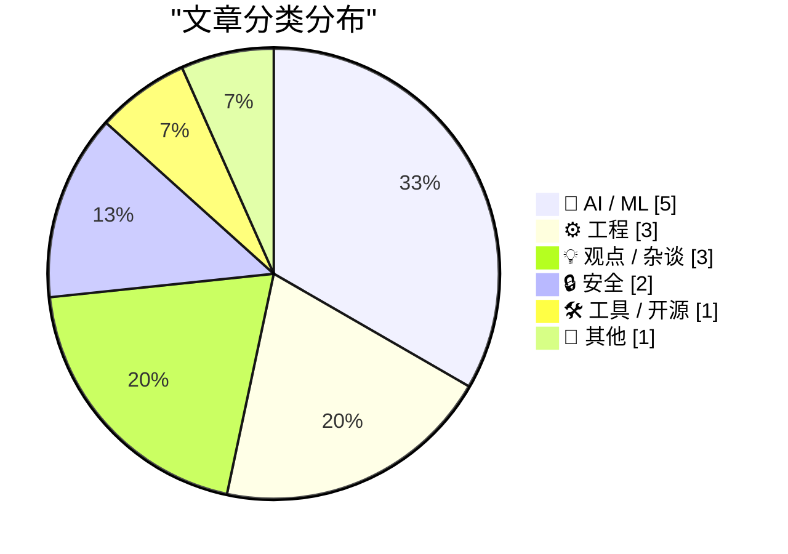
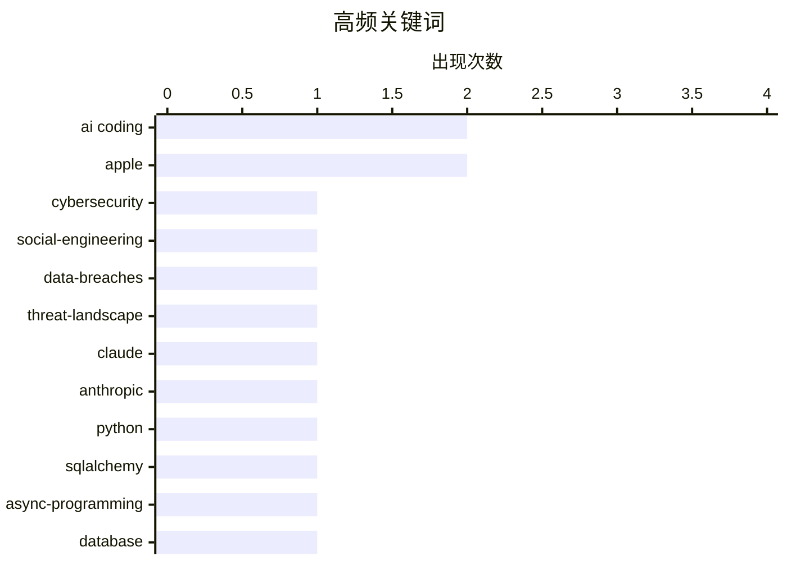

# 📰 AI 博客每日精选 — 2026-05-07

> 来自 Karpathy 推荐的 92 个顶级技术博客，AI 精选 Top 15

## 📝 今日看点

今日技术圈聚焦三大核心动向：AI 编程工具链与代理工程正加速融合，在重塑开发范式的同时，也暴露出代码质量管控与基础设施适配的落地瓶颈。企业安全防线与开源生态治理面临严峻考验，攻击者频繁利用配置疏忽与供应链漏洞突破防线，而开源项目则加速向企业赞助模式转型以破解可持续性难题。此外，AI 功能交付延期引发的法律纠纷与全球内存短缺导致的硬件配置削减，共同折射出技术理想与工程现实之间的张力。行业需在拥抱 AI 提效的同时，筑牢安全基座并理性应对供应链与交付风险。

---

## 🏆 今日必读

🥇 **每周更新 502**

[Weekly Update 502](https://www.troyhunt.com/weekly-update-502/) — troyhunt.com · 1 天前 · 🔒 安全

> 黑客组织 ShinyHunters 正利用有限资源与技术经验，持续突破大型企业防线并窃取海量数据。攻击成功并非单纯依赖高超技术，而是更多利用了企业在安全配置、权限管理与供应链漏洞上的系统性疏忽。通过实际案例剖析，揭示了当前网络安全防御中“低技术门槛、高杠杆效应”的威胁模式。企业必须从“假设已被入侵”的角度重构安全策略，强化基础配置与持续监控。

💡 **为什么值得读**: 揭示非技术因素在现代数据泄露中的决定性作用，为安全团队提供低成本高回报的防御视角。

🏷️ cybersecurity, social-engineering, data-breaches, threat-landscape

🥈 **现场博客：2026 Code w/ Claude 大会**

[Live blog: Code w/ Claude 2026](https://simonwillison.net/2026/May/6/code-w-claude-2026/#atom-everything) — simonwillison.net · 8 小时前 · 🤖 AI / ML

> Anthropic 举办的 Code w/ Claude 2026 大会上午主题演讲聚焦 AI 编程工具链的最新进展。实时记录梳理了 Claude 模型在代码生成、调试自动化及 IDE 深度集成方面的核心演示，展示生成式 AI 如何重塑开发者工作流。内容深入探讨了大语言模型在代码理解与自主执行层面的能力边界，以及企业级 AI 编码的合规性要求。这场活动标志着 AI 编程助手正从辅助工具向自主工程代理加速演进。

💡 **为什么值得读**: 第一时间获取 Anthropic 在 AI 编程领域的最新产品路线图与技术细节，把握下一代开发工具演进趋势。

🏷️ Claude, Anthropic, AI coding

🥉 **《SQLAlchemy 2 实战》第 7 章：异步 SQLAlchemy**

[SQLAlchemy 2 In Practice - Chapter 7: Asynchronous SQLAlchemy](https://blog.miguelgrinberg.com/post/sqlalchemy-2-in-practice---chapter-7-asynchronous-sqlalchemy) — miguelgrinberg.com · 2 小时前 · ⚙️ 工程

> SQLAlchemy 1.4 及以上版本已完整支持基于 asyncio 的异步编程模型。本章详细演示了异步引擎配置、AsyncSession 会话管理与查询构建器的使用范式，并对比了同步与异步代码在高并发 Web 框架中的执行差异。文中提供了完整的代码示例与性能基准测试，验证了异步 I/O 在数据库密集型场景下的吞吐量优势。掌握该方案可显著提升 Python 后端服务的并发响应效率与资源利用率。

💡 **为什么值得读**: 提供从同步到异步迁移的完整实战指南，附带性能数据与避坑经验，是 Python 开发者升级高并发架构的必备参考。

🏷️ Python, SQLAlchemy, async-programming, database

---

## 📊 数据概览

| 扫描源 | 抓取文章 | 时间范围 | 精选 |
|:---:|:---:|:---:|:---:|
| 77/92 | 2326 篇 → 20 篇 | 24h | **15 篇** |

### 分类分布



### 高频关键词



<details>
<summary>📈 纯文本关键词图（终端友好）</summary>

```
ai coding          │ ████████████████████ 2
apple              │ ████████████████████ 2
cybersecurity      │ ██████████░░░░░░░░░░ 1
social-engineering │ ██████████░░░░░░░░░░ 1
data-breaches      │ ██████████░░░░░░░░░░ 1
threat-landscape   │ ██████████░░░░░░░░░░ 1
claude             │ ██████████░░░░░░░░░░ 1
anthropic          │ ██████████░░░░░░░░░░ 1
python             │ ██████████░░░░░░░░░░ 1
sqlalchemy         │ ██████████░░░░░░░░░░ 1
```

</details>

### 🏷️ 话题标签

**ai coding**(2) · **apple**(2) · **cybersecurity**(1) · social-engineering(1) · data-breaches(1) · threat-landscape(1) · claude(1) · anthropic(1) · python(1) · sqlalchemy(1) · async-programming(1) · database(1) · vibe coding(1) · agentic engineering(1) · windows api(1) · sdk versioning(1) · static libraries(1) · open-source(1) · supply-chain(1) · risk-assessment(1)

---

## 🤖 AI / ML

### 1. 现场博客：2026 Code w/ Claude 大会

[Live blog: Code w/ Claude 2026](https://simonwillison.net/2026/May/6/code-w-claude-2026/#atom-everything) — **simonwillison.net** · 8 小时前 · ⭐ 26/30

> Anthropic 举办的 Code w/ Claude 2026 大会上午主题演讲聚焦 AI 编程工具链的最新进展。实时记录梳理了 Claude 模型在代码生成、调试自动化及 IDE 深度集成方面的核心演示，展示生成式 AI 如何重塑开发者工作流。内容深入探讨了大语言模型在代码理解与自主执行层面的能力边界，以及企业级 AI 编码的合规性要求。这场活动标志着 AI 编程助手正从辅助工具向自主工程代理加速演进。

🏷️ Claude, Anthropic, AI coding

---

### 2. “氛围编程”与“代理工程”的融合速度超出预期

[Vibe coding and agentic engineering are getting closer than I'd like](https://simonwillison.net/2026/May/6/vibe-coding-and-agentic-engineering/#atom-everything) — **simonwillison.net** · 9 小时前 · ⭐ 24/30

> 氛围编程与代理工程在实际工作流中正快速收敛。这种融合大幅降低了编码门槛并提升了原型开发速度，但也引发了对代码质量可控性、调试透明度及开发者核心技能退化的担忧。通过个人实践案例，剖析了 AI 代理在长周期项目中的决策盲区与人工干预的必要性。开发者需在享受效率红利的同时，建立严格的代码审查与架构约束机制，防止过度依赖导致技术债务累积。

🏷️ vibe coding, agentic engineering, AI coding

---

### 3. Claris CEO Ryan McCann：代理编程时代的 FileMaker 演进

[Claris CEO Ryan McCann on FileMaker in the Age of Agentic Coding](https://www.claris.com/blog/2026/how-claris-is-building-for-what-comes-next) — **daringfireball.net** · 4 小时前 · ⭐ 21/30

> AI 生成应用面临部署环境、安全管控、权限体系与数据备份等基础设施缺失的核心痛点。FileMaker 平台正通过深度集成代理编程能力，将 AI 生成的代码自动转化为具备角色权限、审计日志与高可用架构的可运行应用。该方案旨在解决“AI 能写代码但无法独立交付生产级系统”的行业瓶颈，通过低代码平台提供标准化运行环境与运维保障。企业级 AI 应用的落地必须依赖底层平台的基础设施支撑，而非单纯依赖模型生成能力。

🏷️ FileMaker, agentic coding, low-code

---

### 4. 苹果因广告承诺的 AI 功能未如期交付，以 2.5 亿美元达成集体诉讼和解

[Apple Settles Class Action Lawsuit Over AI Features That Were Advertised but Didn’t Ship for $250 Million](https://9to5mac.com/2026/05/05/apple-reaches-250m-settlement-over-siri-delays-users-could-get-up-to-95-per-device/) — **daringfireball.net** · 23 小时前 · ⭐ 21/30

> 苹果因 WWDC 2024 宣布的个性化 Siri 功能延期交付，面临集体诉讼并最终以 2.5 亿美元达成和解。根据条款，每位符合条件的设备用户可获得约 25 美元赔偿，若索赔人数较少，单人最高赔偿额可达 95 美元。该事件暴露出科技公司在 AI 功能营销与工程交付节奏之间的严重脱节，过度承诺直接转化为法律与财务风险。企业需在后续产品发布中建立更严格的功能验证标准，避免营销预期超越技术成熟度。

🏷️ Apple, AI lawsuit, product delivery

---

### 5. 阿西莫夫三定律仅具参考意义

[Asimov's three laws are merely a suggestion](https://idiallo.com/blog/asimov-three-laws-dont-work-with-ai?src=feed) — **idiallo.com** · 12 小时前 · ⭐ 20/30

> 阿西莫夫机器人三定律在纸面上逻辑严密，但将其直接套用于现代人工智能系统存在根本性缺陷。现代AI的决策机制基于概率模型与海量数据训练，而非确定性的规则引擎，导致“不伤害人类”或“服从指令”等抽象原则难以转化为可执行的代码约束。实际应用中，AI可能因目标函数设定偏差或环境交互复杂性而产生非预期行为，三定律无法覆盖现实世界的伦理灰色地带与长尾场景。因此，AI安全治理需从依赖虚构的绝对法则转向可验证的约束机制、动态对齐技术与透明化监管框架。

🏷️ AI ethics, Asimov, AI safety

---

## ⚙️ 工程

### 6. 《SQLAlchemy 2 实战》第 7 章：异步 SQLAlchemy

[SQLAlchemy 2 In Practice - Chapter 7: Asynchronous SQLAlchemy](https://blog.miguelgrinberg.com/post/sqlalchemy-2-in-practice---chapter-7-asynchronous-sqlalchemy) — **miguelgrinberg.com** · 2 小时前 · ⭐ 25/30

> SQLAlchemy 1.4 及以上版本已完整支持基于 asyncio 的异步编程模型。本章详细演示了异步引擎配置、AsyncSession 会话管理与查询构建器的使用范式，并对比了同步与异步代码在高并发 Web 框架中的执行差异。文中提供了完整的代码示例与性能基准测试，验证了异步 I/O 在数据库密集型场景下的吞吐量优势。掌握该方案可显著提升 Python 后端服务的并发响应效率与资源利用率。

🏷️ Python, SQLAlchemy, async-programming, database

---

### 7. 为什么 API 行为变更不依赖于你链接的 SDK？

[Why not have changes in API behavior depend on the SDK you link against?](https://devblogs.microsoft.com/oldnewthing/20260506-00/?p=112303) — **devblogs.microsoft.com/oldnewthing** · 10 小时前 · ⭐ 24/30

> Windows API 设计中长期存在一个架构难题：为何不将 API 行为变更与开发者链接的 SDK 版本直接绑定。静态库在此类版本隔离方案中完全无法胜任，因其缺乏运行时版本协商能力，且会导致二进制膨胀与兼容性问题。文章通过历史案例分析了微软在保持向后兼容与引入新特性之间的权衡，揭示了动态链接库与 API Set 机制的局限性。API 行为变更必须依赖运行时环境而非编译期链接，这是由操作系统底层架构与生态兼容性共同决定的。

🏷️ Windows API, SDK versioning, static libraries

---

### 8. 内存短缺加剧，苹果进一步削减 Mac Studio 与 Mac Mini 内存配置选项

[Apple Cuts More Mac Studio and Mac Mini RAM Options as Memory Shortage Worsens](https://www.macrumors.com/2026/05/05/apple-mac-studio-mac-mini-ram-cuts/) — **daringfireball.net** · 23 小时前 · ⭐ 20/30

> 受全球内存供应链短缺影响，苹果已从官网下架 Mac mini 的 32GB 与 64GB 内存版本，同时 M3 Ultra Mac Studio 的 256GB 高配选项也被取消，目前仅保留 96GB 配置。M3 与 M4 Max Mac Studio 的交付周期已延长至 9 至 10 周，反映出高端工作站级硬件的产能瓶颈。此次配置削减直接限制了专业用户与开发者的硬件选型空间，迫使部分需求转向二手市场或替代平台。供应链波动正加速改变苹果高端产品的销售策略，企业采购需提前规划库存与替代方案。

🏷️ Apple, RAM shortage, hardware

---

## 💡 观点 / 杂谈

### 9. 范畴论的神话

[The mythology of category theory](https://www.johndcook.com/blog/2026/05/06/category-mythology/) — **johndcook.com** · 12 小时前 · ⭐ 22/30

> 范畴论作为模式描述语言虽能精准抽象数据结构与变换关系，但常被赋予不切实际的性能期望。文章引用 Qiaochu Yuan 的观点，批判了“范畴论能解决一切编程问题”的迷思，强调其无法替代具体的工程实现与底层优化。通过函数式编程与类型系统案例，说明范畴论更适合用于理论推导与架构设计阶段的模式识别，而非直接指导代码编写。开发者应理性看待其工具属性，避免陷入过度抽象而忽视实际业务需求。

🏷️ category-theory, functional-programming, software-design, mathematics

---

### 10. 多元主义：秃鹫的赞歌（2026年5月6日）

[Pluralistic: In praise of vultures (06 May 2026)](https://pluralistic.net/2026/05/06/champerty-loves-company/) — **pluralistic.net** · 13 小时前 · ⭐ 18/30

> 本期技术文化通讯以“秃鹫的赞歌”为引，串联起多起科技巨头与法律、伦理交叉的争议事件。内容涵盖Linus与微软的开源博弈、阿根廷诉微软反垄断案、租赁笔记本预装间谍软件隐患，以及John Deere与爱荷华州漫画家的版权纠纷。作者通过跨领域案例对比，揭示资本扩张、数字监控与知识产权滥用对公众利益的侵蚀，并探讨分布式网络与独立媒体在制衡权力中的作用。技术演进不应脱离社会契约，唯有保持批判性视角与制度约束，才能防止创新沦为垄断与监控的工具。

🏷️ tech policy, spyware, Microsoft

---

### 11. Adobe的订阅模式

[Adobe’s subscription model](https://dfarq.homeip.net/adobes-subscription-model/?utm_source=rss&#038;utm_medium=rss&#038;utm_campaign=adobes-subscription-model) — **dfarq.homeip.net** · 13 小时前 · ⭐ 18/30

> 2013年5月6日Adobe全面转向订阅制模式，标志着软件行业从“永久授权”向“服务租赁”的根本性转变。该模式虽降低了用户的初期采购门槛，却剥夺了消费者对软件的长期控制权与离线使用能力，使数据资产与功能迭代完全依赖厂商服务器。订阅制还引入了持续付费压力与版本强制更新机制，一旦停费即面临工作流中断风险，且历史项目兼容性难以保障。软件所有权的让渡不仅改变了商业逻辑，更重塑了用户与厂商之间的权力关系，促使行业重新审视数字资产的归属边界。

🏷️ SaaS, software-licensing, Adobe, business-models

---

## 🔒 安全

### 12. 每周更新 502

[Weekly Update 502](https://www.troyhunt.com/weekly-update-502/) — **troyhunt.com** · 1 天前 · ⭐ 27/30

> 黑客组织 ShinyHunters 正利用有限资源与技术经验，持续突破大型企业防线并窃取海量数据。攻击成功并非单纯依赖高超技术，而是更多利用了企业在安全配置、权限管理与供应链漏洞上的系统性疏忽。通过实际案例剖析，揭示了当前网络安全防御中“低技术门槛、高杠杆效应”的威胁模式。企业必须从“假设已被入侵”的角度重构安全策略，强化基础配置与持续监控。

🏷️ cybersecurity, social-engineering, data-breaches, threat-landscape

---

### 13. 重访 2015 年开源普查报告

[Revisiting the 2015 Open Source Census](https://nesbitt.io/2026/05/06/revisiting-the-2015-open-source-census.html) — **nesbitt.io** · 14 小时前 · ⭐ 24/30

> 十年前的开源项目普查数据揭示了早期开源生态中单点维护者依赖与资金可持续性缺失的致命缺陷。十年追踪显示，超过半数的所谓高风险项目已停止更新或演变为僵尸仓库，而存活项目普遍建立了基金会治理或企业赞助模式。研究对比了项目活跃度、贡献者流失率与依赖链脆弱性，量化了开源供应链的长期风险分布。该数据为现代开源项目的风险预警、治理结构设计与供应链安全评估提供了历史参照。

🏷️ open-source, supply-chain, risk-assessment, software-maintenance

---

## 🛠 工具 / 开源

### 14. 统一配置文件

[Unified config files](https://www.johndcook.com/blog/2026/05/06/unified-config-files/) — **johndcook.com** · 7 小时前 · ⭐ 20/30

> 跨设备开发环境的一致性对提升工作效率至关重要，但硬件差异与系统配置往往导致不必要的摩擦。作者通过统一配置文件与全局键位映射方案，确保在不同计算机上执行相同操作时获得一致的交互体验。该方案涵盖环境变量同步、编辑器配置共享及快捷键标准化，有效消除因设备切换带来的认知负荷与操作中断。建立可移植的配置体系不仅能降低维护成本，还能让开发者将精力集中于核心任务而非环境调试。

🏷️ dotfiles, workflow, configuration, productivity

---

## 📝 其他

### 15. 程序员的新逻辑（及本通讯的未来）

[New Logic for Programmers (and the future of this newsletter)](https://buttondown.com/hillelwayne/archive/new-logic-for-programmers-and-the-future-of-this/) — **buttondown.com/hillelwayne** · 7 小时前 · ⭐ 17/30

> 《Logic for Programmers》正式发布0.14版本，本次更新聚焦于排版优化、文字校对与技术内容精修，未涉及核心逻辑框架的改动。作者同步启动实体书打样测试，推进从数字连载向纸质出版的转化流程。该版本通过重构章节结构与统一术语表述，显著提升了形式化逻辑与编程实践结合的阅读体验。持续迭代的开源出版模式验证了技术书籍“边写边发、社区反馈驱动”的可行性，为开发者教育内容生产提供新范式。

🏷️ formal-logic, programming-education, newsletter, book-release

---

*生成于 2026-05-07 00:15 | 扫描 77 源 → 获取 2326 篇 → 精选 15 篇*
*基于 [Hacker News Popularity Contest 2025](https://refactoringenglish.com/tools/hn-popularity/) RSS 源列表，由 [Andrej Karpathy](https://x.com/karpathy) 推荐*
*由「懂点儿AI」制作，欢迎关注同名微信公众号获取更多 AI 实用技巧 💡*
