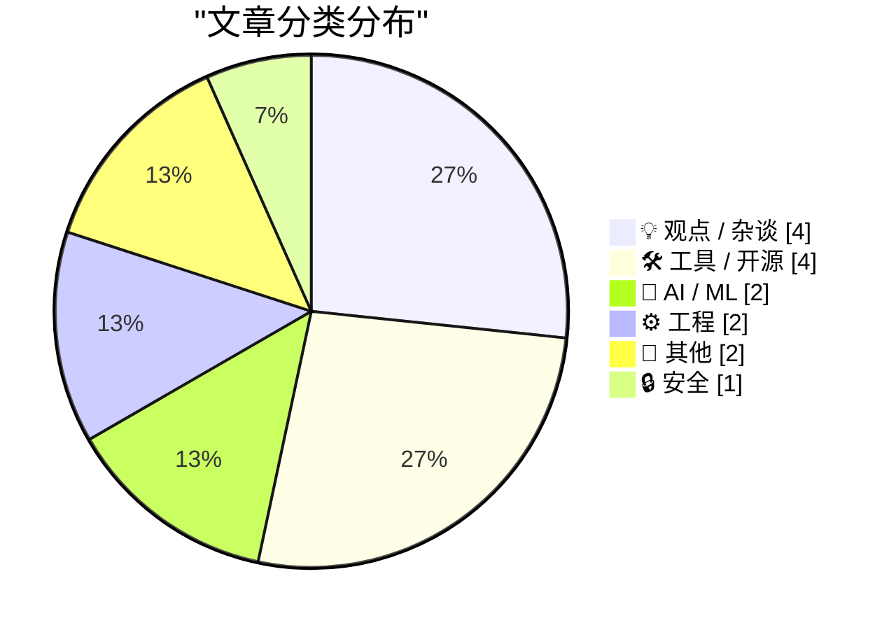
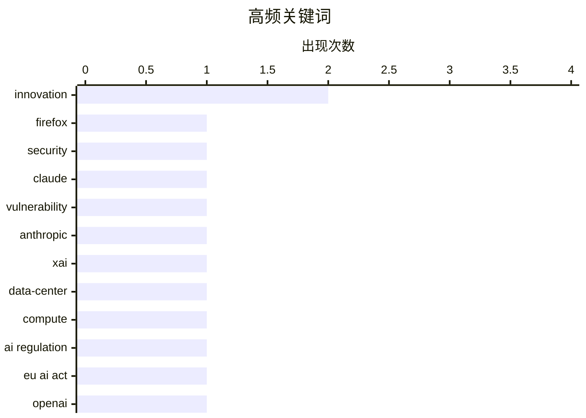

# 📰 AI 博客每日精选 — 2026-05-08

> 来自 Karpathy 推荐的 92 个顶级技术博客，AI 精选 Top 15

## 📝 今日看点

今日技术圈的竞争焦点正从算法模型向底层算力与安全基建转移，头部企业的算力整合与AI代码审计的突破标志着基础设施争夺战全面打响。与此同时，监管立法的滞后性与技术迭代的指数级速度产生剧烈碰撞，合规约束与技术狂奔的博弈已成为行业核心议题。在技术狂飙的背后，数字权利捍卫、反垄断审查与创新周期的理性反思，正推动科技生态走向更可持续的演进路径。

---

## 🏆 今日必读

🥇 **幕后揭秘：使用 Claude Mythos 预览版强化 Firefox 安全性**

[Behind the Scenes Hardening Firefox with Claude Mythos Preview](https://simonwillison.net/2026/May/7/firefox-claude-mythos/#atom-everything) — simonwillison.net · 7 小时前 · 🔒 安全

> Mozilla 利用 Claude Mythos 预览版模型开展 Firefox 浏览器的底层安全加固工作。过去 AI 生成的安全漏洞报告多为无效噪声，但此次预览版模型展现出极高的代码审计准确性，成功定位并修复了数百个潜在漏洞。该方案将大语言模型直接集成到自动化安全测试流水线中，显著提升了漏洞挖掘与补丁验证的效率。AI 辅助安全开发已从概念验证迈入高可用阶段，为开源项目的自动化防御提供了可复用的技术范式。

💡 **为什么值得读**: 揭示了大模型如何从“玩具”蜕变为生产级安全工具，为开发者提供了 AI 赋能漏洞挖掘的实战参考。

🏷️ Firefox, security, Claude, vulnerability

🥈 **关于 xAI 与 Anthropic 数据中心合作协议的观察**

[Notes on the xAI/Anthropic data center deal](https://simonwillison.net/2026/May/7/xai-anthropic/#atom-everything) — simonwillison.net · 7 小时前 · 🤖 AI / ML

> Anthropic 与 xAI 达成深度基础设施合作，全面接管 SpaceX 旗下 Colossus 数据中心的全部算力容量。该协议标志着 AI 竞赛已从模型算法竞争转向底层算力资源的直接争夺，Colossus 作为全球顶尖超算设施之一，其全部产能的独占将极大加速下一代大模型的训练与推理部署。尽管合作涉及环保与能源消耗争议，但算力垄断已成为头部 AI 公司的核心战略壁垒。基础设施的垂直整合将成为决定大模型迭代速度与商业格局的关键变量。

💡 **为什么值得读**: 深度剖析 AI 巨头从“拼算法”到“抢算力”的战略转向，帮助读者理解大模型时代基础设施垄断的商业逻辑。

🏷️ Anthropic, xAI, data-center, compute

🥉 **“速度”与“合规”的战争已经打响**

[The war between fast and legitimate is here](https://www.joanwestenberg.com/the-war-between-fast-and-legitimate-is-here/) — joanwestenberg.com · 23 小时前 · 🤖 AI / ML

> 欧盟《人工智能法案》的漫长立法周期与 AI 技术的指数级迭代速度之间产生了不可调和的冲突。欧盟耗时四年才完成法案起草，而 OpenAI 仅用两个月就让 GPT-4 触达一亿用户。当监管机构终于敲定“高风险系统”的定义时，相关技术架构与功能形态已经历了两次重大迭代。传统“先立法、后治理”的线性监管模式在面对快速演进的 AI 技术时显得严重滞后，监管框架必须从静态合规转向动态敏捷治理。

💡 **为什么值得读**: 直击技术狂奔与监管滞后的核心矛盾，为政策制定者与技术从业者提供平衡创新与合规的破局思路。

🏷️ AI regulation, EU AI Act, OpenAI, innovation

---

## 📊 数据概览

| 扫描源 | 抓取文章 | 时间范围 | 精选 |
|:---:|:---:|:---:|:---:|
| 75/92 | 2276 篇 → 16 篇 | 24h | **15 篇** |

### 分类分布



### 高频关键词



<details>
<summary>📈 纯文本关键词图（终端友好）</summary>

```
innovation    │ ████████████████████ 2
firefox       │ ██████████░░░░░░░░░░ 1
security      │ ██████████░░░░░░░░░░ 1
claude        │ ██████████░░░░░░░░░░ 1
vulnerability │ ██████████░░░░░░░░░░ 1
anthropic     │ ██████████░░░░░░░░░░ 1
xai           │ ██████████░░░░░░░░░░ 1
data-center   │ ██████████░░░░░░░░░░ 1
compute       │ ██████████░░░░░░░░░░ 1
ai regulation │ ██████████░░░░░░░░░░ 1
```

</details>

### 🏷️ 话题标签

**innovation**(2) · **firefox**(1) · **security**(1) · claude(1) · vulnerability(1) · anthropic(1) · xai(1) · data-center(1) · compute(1) · ai regulation(1) · eu ai act(1) · openai(1) · privacy(1) · digital-rights(1) · policy(1) · mozilla(1) · llm-gemini(1) · cli(1) · plugin(1) · gemini(1)

---

## 💡 观点 / 杂谈

### 1. 多元视角：泡沫确实极其有害（2026年5月7日）

[Pluralistic: Bubbles are REALLY evil (07 May 2026)](https://pluralistic.net/2026/05/07/dump-the-pumpers/) — **pluralistic.net** · 16 小时前 · ⭐ 22/30

> 本期专栏汇总了科技、隐私、劳工权益与反垄断领域的多篇深度报道与评论。文章重点探讨了 Mozilla 对抗美国国土安全部网络窃听、法官抵制 FCC 互联网监控等数字权利议题，同时分析了“香农定律”在通信垄断中的应用及零工经济对传统就业的冲击。内容还涉及密码学最佳实践与职场微观管理现象的批判。技术垄断与权力滥用正在侵蚀互联网开放生态，亟需通过跨领域的公民行动与法律制衡加以遏制。

🏷️ privacy, digital-rights, policy, Mozilla

---

### 2. 我们等待新发明需要多久？

[How Long Do We Wait for New Inventions?](https://www.construction-physics.com/p/how-long-do-we-wait-for-new-inventions) — **construction-physics.com** · 9 小时前 · ⭐ 18/30

> 本文探讨了技术创新从概念提出到实际落地应用的时间周期规律。历史数据表明多数突破性发明的商业化等待期远低于公众预期，技术扩散曲线往往呈现长期酝酿与短期爆发的特征。作者通过对比蒸汽机、电力与互联网等关键技术的普及时间线，指出基础设施配套与供应链成熟度是缩短等待期的核心变量。当前 AI 与新能源领域的迭代速度进一步印证了技术转化周期的压缩趋势，创新落地的瓶颈已从科学发现转向工程化与规模化。

🏷️ innovation, technology history, R&D, invention

---

### 3. 网络自由主义不可容忍的虚伪性

[The Intolerable Hypocrisy of Cyberlibertarianism](https://matduggan.com/the-intolerable-hypocrisy-of-cyberlibertarianism/) — **matduggan.com** · 15 小时前 · ⭐ 18/30

> 本文批判了当代网络自由主义在享受互联网便利的同时，却对早期互联网精神与基础设施演进缺乏基本认知的态度。年轻一代常浪漫化前互联网时代的简单生活，却无视纸质地图导航、信息闭塞与通信低效带来的实际困境。现代网络自由主义者往往在依赖中心化云服务与算法推荐的同时高呼去中心化，这种选择性怀旧掩盖了技术普惠的真实代价。真正的数字自由应建立在对技术演进史的客观认知之上，而非脱离现实的乌托邦式口号。

🏷️ cyberlibertarianism, internet culture, tech policy, digital rights

---

### 4. Free as in Tribbles

[Free as in Tribbles](https://nesbitt.io/2026/05/07/free-as-in-tribbles.html) — **nesbitt.io** · 14 小时前 · ⭐ 17/30

> The next metaphor after free-as-in-puppy

🏷️ open source, software maintenance, tech culture, dependencies

---

## 🛠 工具 / 开源

### 5. llm-gemini 0.31 版本发布

[llm-gemini 0.31](https://simonwillison.net/2026/May/7/llm-gemini/#atom-everything) — **simonwillison.net** · 5 小时前 · ⭐ 21/30

> 开源工具 llm-gemini 发布 0.31 版本，正式支持 Gemini 3.1 Flash-Lite 模型的稳定版接口。该版本移除了此前预览版的限制，全面对接 Google Cloud 官方 GA 商用通道，开发者可通过标准 CLI 命令直接调用该模型。此次更新同步优化了上下文窗口处理与流式输出稳定性，进一步降低了本地 AI 应用的接入门槛。轻量级 Gemini 模型已具备生产环境部署条件，为低成本、高效率的 AI 自动化工作流提供了可靠支撑。

🏷️ llm-gemini, CLI, plugin, Gemini

---

### 6. 在 FreeBSD 上使用 LibreNMS 监控你的设备

[Monitor your devices with LibreNMS on FreeBSD](https://it-notes.dragas.net/2026/05/07/monitor-your-services-with-librenms-on-freebsd/) — **it-notes.dragas.net** · 14 小时前 · ⭐ 20/30

> 本文详细演示了在 FreeBSD 系统上部署 LibreNMS 网络监控平台的完整流程。LibreNMS 基于 SNMP 与 Ping 协议自动发现并持续追踪服务器、网络设备与服务状态，相较于 Zabbix 等重型方案大幅降低了运维配置成本。系统提供实时告警、性能指标采集与可视化图表，且对 FreeBSD 的 Jails 与 ZFS 文件系统兼容性极佳。对于中小型基础设施而言，LibreNMS 是兼顾监控深度与部署效率的优质开源替代方案。

🏷️ LibreNMS, FreeBSD, monitoring, DevOps

---

### 7. GitHub Repo Stats

[GitHub Repo Stats](https://simonwillison.net/2026/May/7/github-repo-stats/#atom-everything) — **simonwillison.net** · 17 小时前 · ⭐ 15/30

> <p><strong>Tool:</strong> <a href="https://tools.simonwillison.net/github-repo-stats">GitHub Repo Stats</a></p>
        <p>One of the things I always look for when evaluating a new GitHub repository i

🏷️ GitHub, repository, stats, mobile

---

### 8. Big Words

[Big Words](https://simonwillison.net/2026/May/7/big-words/#atom-everything) — **simonwillison.net** · 6 小时前 · ⭐ 14/30

> <p><strong>Tool:</strong> <a href="https://tools.simonwillison.net/big-words">Big Words</a></p>
        <p>I'm using my <a href="https://simonwillison.net/2026/Feb/25/present/">vibe coded macOS presen

🏷️ macOS, presentation, vibe-coding, utility

---

## 🤖 AI / ML

### 9. 关于 xAI 与 Anthropic 数据中心合作协议的观察

[Notes on the xAI/Anthropic data center deal](https://simonwillison.net/2026/May/7/xai-anthropic/#atom-everything) — **simonwillison.net** · 7 小时前 · ⭐ 25/30

> Anthropic 与 xAI 达成深度基础设施合作，全面接管 SpaceX 旗下 Colossus 数据中心的全部算力容量。该协议标志着 AI 竞赛已从模型算法竞争转向底层算力资源的直接争夺，Colossus 作为全球顶尖超算设施之一，其全部产能的独占将极大加速下一代大模型的训练与推理部署。尽管合作涉及环保与能源消耗争议，但算力垄断已成为头部 AI 公司的核心战略壁垒。基础设施的垂直整合将成为决定大模型迭代速度与商业格局的关键变量。

🏷️ Anthropic, xAI, data-center, compute

---

### 10. “速度”与“合规”的战争已经打响

[The war between fast and legitimate is here](https://www.joanwestenberg.com/the-war-between-fast-and-legitimate-is-here/) — **joanwestenberg.com** · 23 小时前 · ⭐ 24/30

> 欧盟《人工智能法案》的漫长立法周期与 AI 技术的指数级迭代速度之间产生了不可调和的冲突。欧盟耗时四年才完成法案起草，而 OpenAI 仅用两个月就让 GPT-4 触达一亿用户。当监管机构终于敲定“高风险系统”的定义时，相关技术架构与功能形态已经历了两次重大迭代。传统“先立法、后治理”的线性监管模式在面对快速演进的 AI 技术时显得严重滞后，监管框架必须从静态合规转向动态敏捷治理。

🏷️ AI regulation, EU AI Act, OpenAI, innovation

---

## ⚙️ 工程

### 11. 将资源字符串升级为 Unicode 时，切勿忘记添加 L 前缀

[When you upgrade your resource strings to Unicode, don’t forget to specify the L prefix](https://devblogs.microsoft.com/oldnewthing/20260507-00/?p=112307) — **devblogs.microsoft.com/oldnewthing** · 10 小时前 · ⭐ 21/30

> Windows 平台开发中，将传统资源字符串迁移至 Unicode 编码时极易因遗漏 L 前缀导致编码降级。若未在字符串字面量前添加 L 标识，编译器会将其默认映射回 8 位代码页，从而引发字符乱码或截断错误。该问题在跨语言本地化与老旧系统重构场景中尤为常见，且调试时难以直接定位。遵循 Windows API 的字符集规范并严格检查 TCHAR 与字符串资源的宏包装，是避免底层编码陷阱的关键。

🏷️ C++, Unicode, Windows, resource-strings

---

### 12. 平滑多边形

[Smoothed polygons](https://www.johndcook.com/blog/2026/05/07/smoothed-polygons/) — **johndcook.com** · 6 小时前 · ⭐ 19/30

> 本文探讨了基于 p-范数的数学几何构造，重点分析了平滑多边形与 squircle 的三角类比。当 p=2 时单位圆退化为标准欧几里得圆，当 p→∞ 时则趋近于欧几里得正方形。作者引入了三个特定函数 Li(x, y)，通过调整其水平集参数可在连续空间中生成从圆形到多边形的平滑过渡形态。该数学模型为计算机图形学中的抗锯齿渲染与路径插值提供了新的解析解，拓展了参数化形状生成的理论边界。

🏷️ geometry, p-norm, squircle, level-sets

---

## 📝 其他

### 13. Prolost Watches 1.0

[Prolost Watches 1.0](https://prolost.com/blog/prolostwatches) — **daringfireball.net** · 3 小时前 · ⭐ 11/30

> Stu Maschwitz:


  Prolost Watches is an iPhone app for managing your watch
collection. It’s part database, part journal; designed for the
detail-obsessed mind of the watch fanatic. As you log each da

🏷️ iOS, app, watch-collection, database

---

### 14. The Greatest Match Cut in Cinematic History, Improved by Amazon Prime

[The Greatest Match Cut in Cinematic History, Improved by Amazon Prime](https://bsky.app/profile/gethill.bsky.social/post/3ml6fyfv7kc2l) — **daringfireball.net** · 9 小时前 · ⭐ 11/30

> I’m sure there’s a scene marker right at the cut, so that’s why an ad got inserted there. But, my god. Someone at Amazon should go to prison for this.

(I think it’s a total coincidence that the Febre

🏷️ Amazon-Prime, streaming, ads, cinema

---

## 🔒 安全

### 15. 幕后揭秘：使用 Claude Mythos 预览版强化 Firefox 安全性

[Behind the Scenes Hardening Firefox with Claude Mythos Preview](https://simonwillison.net/2026/May/7/firefox-claude-mythos/#atom-everything) — **simonwillison.net** · 7 小时前 · ⭐ 25/30

> Mozilla 利用 Claude Mythos 预览版模型开展 Firefox 浏览器的底层安全加固工作。过去 AI 生成的安全漏洞报告多为无效噪声，但此次预览版模型展现出极高的代码审计准确性，成功定位并修复了数百个潜在漏洞。该方案将大语言模型直接集成到自动化安全测试流水线中，显著提升了漏洞挖掘与补丁验证的效率。AI 辅助安全开发已从概念验证迈入高可用阶段，为开源项目的自动化防御提供了可复用的技术范式。

🏷️ Firefox, security, Claude, vulnerability

---

*生成于 2026-05-08 00:58 | 扫描 75 源 → 获取 2276 篇 → 精选 15 篇*
*基于 [Hacker News Popularity Contest 2025](https://refactoringenglish.com/tools/hn-popularity/) RSS 源列表，由 [Andrej Karpathy](https://x.com/karpathy) 推荐*
*由「懂点儿AI」制作，欢迎关注同名微信公众号获取更多 AI 实用技巧 💡*
