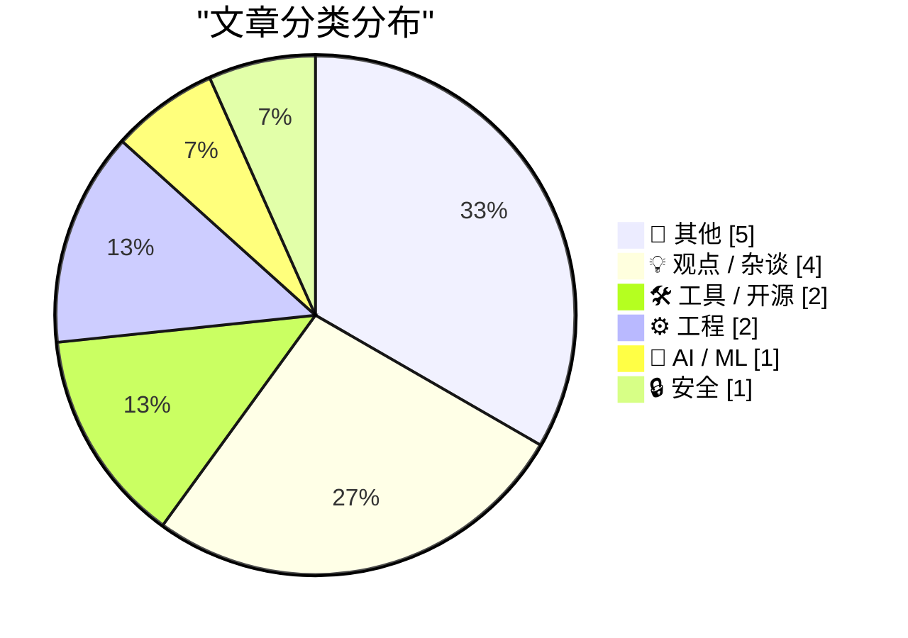
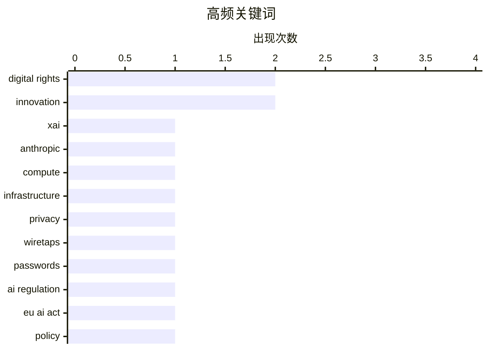

# 📰 AI 博客每日精选 — 2026-05-08

> 来自 Karpathy 推荐的 92 个顶级技术博客，AI 精选 Top 15

## 📝 今日看点

今日技术圈呈现三大核心动向：AI大模型加速向安全审计与工程工具链渗透，前沿模型正实质性重塑漏洞挖掘与开发工作流。底层工程与基础设施运维同步回归务实，开发者愈发聚焦代码健壮性、算法优化及轻量级系统监控。与此同时，技术社区开始冷静审视创新落地周期与网络文化演进，在追逐新范式之际重拾历史经验与人文反思。整体来看，技术演进正全面迈入工程落地与理性沉淀并重的新周期。

---

## 🏆 今日必读

🥇 **我们等待新发明需要多久？**

[Notes on the xAI/Anthropic data center deal](https://simonwillison.net/2026/May/7/xai-anthropic/#atom-everything) — simonwillison.net · 7 小时前 · 🤖 AI / ML

> 文章探讨新技术从概念提出到实际落地应用所需的平均时间周期。传统观念常认为重大发明需要数十年酝酿，但实际数据显示多数突破性技术的商业化等待期远短于公众预期。作者通过梳理历史创新案例指出，基础设施迭代、供应链成熟与市场需求共同加速了技术转化进程。结论表明，当前技术扩散速度已进入快车道，等待新发明普及的时间正显著缩短。

💡 **为什么值得读**: 用历史数据打破“技术落地漫长”的认知偏差，帮助读者更准确地评估新兴技术的商业化时间表。

🏷️ xAI, Anthropic, compute, infrastructure

🥈 **1997年5月7日英特尔发布奔腾II处理器**

[Pluralistic: Bubbles are REALLY evil (07 May 2026)](https://pluralistic.net/2026/05/07/dump-the-pumpers/) — pluralistic.net · 16 小时前 · 🔒 安全

> 文章回顾1997年5月7日英特尔发布奔腾II（Pentium II）处理器的历史节点与技术背景。作为奔腾系列的后续产品，奔腾II针对前代奔腾Pro存在的成本高昂与插槽兼容性问题进行了架构优化，采用单边接触卡匣设计并整合L2缓存。这一改进成功打破高端桌面市场的普及瓶颈，使高性能x86架构迅速覆盖主流消费级PC。该处理器的发布标志着英特尔在性能与成本平衡上的关键转折，为后续处理器演进奠定基础。

💡 **为什么值得读**: 通过经典CPU迭代案例，揭示芯片厂商如何在架构缺陷与市场成本之间找到平衡，对理解现代处理器演进逻辑具有参考价值。

🏷️ privacy, wiretaps, digital rights, passwords

🥉 **幕后：利用 Claude Mythos 预览版加固 Firefox 浏览器**

[The war between fast and legitimate is here](https://www.joanwestenberg.com/the-war-between-fast-and-legitimate-is-here/) — joanwestenberg.com · 23 小时前 · 💡 观点 / 杂谈

> 文章详细披露 Mozilla 团队如何利用 Claude Mythos 预览版模型定位并修复 Firefox 浏览器中的数百个安全漏洞。过去AI生成的安全漏洞报告往往质量低下且难以复现，但新一代大模型在代码审计与漏洞挖掘场景下展现出显著精度提升。技术团队通过构建自动化扫描流水线，将AI发现的潜在风险直接转化为可验证的补丁建议，大幅缩短安全响应周期。该实践验证了前沿AI模型在开源软件安全加固中的实战价值，标志着AI辅助漏洞挖掘正从实验阶段迈向生产级应用。

💡 **为什么值得读**: 提供一线大厂使用最新AI模型进行安全审计的完整工作流与实战数据，为开发者探索AI赋能软件安全提供可复用的技术路径。

🏷️ AI regulation, EU AI Act, innovation, policy

---

## 📊 数据概览

| 扫描源 | 抓取文章 | 时间范围 | 精选 |
|:---:|:---:|:---:|:---:|
| 77/92 | 2326 篇 → 17 篇 | 24h | **15 篇** |

### 分类分布



### 高频关键词



<details>
<summary>📈 纯文本关键词图（终端友好）</summary>

```
digital rights │ ████████████████████ 2
innovation     │ ████████████████████ 2
xai            │ ██████████░░░░░░░░░░ 1
anthropic      │ ██████████░░░░░░░░░░ 1
compute        │ ██████████░░░░░░░░░░ 1
infrastructure │ ██████████░░░░░░░░░░ 1
privacy        │ ██████████░░░░░░░░░░ 1
wiretaps       │ ██████████░░░░░░░░░░ 1
passwords      │ ██████████░░░░░░░░░░ 1
ai regulation  │ ██████████░░░░░░░░░░ 1
```

</details>

### 🏷️ 话题标签

**digital rights**(2) · **innovation**(2) · **xai**(1) · anthropic(1) · compute(1) · infrastructure(1) · privacy(1) · wiretaps(1) · passwords(1) · ai regulation(1) · eu ai act(1) · policy(1) · open source(1) · licensing(1) · tech culture(1) · technology history(1) · r&d(1) · github(1) · developer tools(1) · repo stats(1)

---

## 📝 其他

### 1. Prolost Watches 1.0

[Prolost Watches 1.0](https://prolost.com/blog/prolostwatches) — **daringfireball.net** · 3 小时前 · ⭐ 15/30

> Stu Maschwitz:


  Prolost Watches is an iPhone app for managing your watch
collection. It’s part database, part journal; designed for the
detail-obsessed mind of the watch fanatic. As you log each da

🏷️ iOS app, watch collection, indie software, database

---

### 2. Free as in Tribbles

[Free as in Tribbles](https://nesbitt.io/2026/05/07/free-as-in-tribbles.html) — **nesbitt.io** · 14 小时前 · ⭐ 15/30

> The next metaphor after free-as-in-puppy

---

### 3. How Long Do We Wait for New Inventions?

[How Long Do We Wait for New Inventions?](https://www.construction-physics.com/p/how-long-do-we-wait-for-new-inventions) — **construction-physics.com** · 9 小时前 · ⭐ 15/30

> Mostly not very long

---

### 4. Intel Pentium II introduced May 7, 1997

[Intel Pentium II introduced May 7, 1997](https://dfarq.homeip.net/intel-pentium-ii-introduced-may-7-1997/?utm_source=rss&#038;utm_medium=rss&#038;utm_campaign=intel-pentium-ii-introduced-may-7-1997) — **dfarq.homeip.net** · 13 小时前 · ⭐ 15/30

> 29 years ago, on May 7, 1997, Intel introduced its Pentium II processor. It wasn’t the first followup to the very successful Pentium. But the Pentium II overcame problems with the Pentium Pro that kep

---

### 5. Behind the Scenes Hardening Firefox with Claude Mythos Preview

[Behind the Scenes Hardening Firefox with Claude Mythos Preview](https://simonwillison.net/2026/May/7/firefox-claude-mythos/#atom-everything) — **simonwillison.net** · 6 小时前 · ⭐ 9/30

> <p><strong><a href="https://hacks.mozilla.org/2026/05/behind-the-scenes-hardening-firefox/">Behind the Scenes Hardening Firefox with Claude Mythos Preview</a></strong></p>
Fascinating, in-depth detail

🏷️ Intel, Pentium II, hardware history

---

## 💡 观点 / 杂谈

### 6. 幕后：利用 Claude Mythos 预览版加固 Firefox 浏览器

[The war between fast and legitimate is here](https://www.joanwestenberg.com/the-war-between-fast-and-legitimate-is-here/) — **joanwestenberg.com** · 23 小时前 · ⭐ 23/30

> 文章详细披露 Mozilla 团队如何利用 Claude Mythos 预览版模型定位并修复 Firefox 浏览器中的数百个安全漏洞。过去AI生成的安全漏洞报告往往质量低下且难以复现，但新一代大模型在代码审计与漏洞挖掘场景下展现出显著精度提升。技术团队通过构建自动化扫描流水线，将AI发现的潜在风险直接转化为可验证的补丁建议，大幅缩短安全响应周期。该实践验证了前沿AI模型在开源软件安全加固中的实战价值，标志着AI辅助漏洞挖掘正从实验阶段迈向生产级应用。

🏷️ AI regulation, EU AI Act, innovation, policy

---

### 7. llm-gemini 0.31

[llm-gemini 0.31](https://simonwillison.net/2026/May/7/llm-gemini/#atom-everything) — **simonwillison.net** · 4 小时前 · ⭐ 22/30

> <p><strong>Release:</strong> <a href="https://github.com/simonw/llm-gemini/releases/tag/0.31">llm-gemini 0.31</a></p>
        <blockquote>
<ul>
<li><code>gemini-3.1-flash-lite</code> is <a href="https

🏷️ open source, licensing, tech culture

---

### 8. Big Words

[Big Words](https://simonwillison.net/2026/May/7/big-words/#atom-everything) — **simonwillison.net** · 5 小时前 · ⭐ 20/30

> <p><strong>Tool:</strong> <a href="https://tools.simonwillison.net/big-words">Big Words</a></p>
        <p>I'm using my <a href="https://simonwillison.net/2026/Feb/25/present/">vibe coded macOS presen

🏷️ innovation, technology history, R&D

---

### 9. The Intolerable Hypocrisy of Cyberlibertarianism

[The Intolerable Hypocrisy of Cyberlibertarianism](https://matduggan.com/the-intolerable-hypocrisy-of-cyberlibertarianism/) — **matduggan.com** · 14 小时前 · ⭐ 16/30

> I like the Internet. I am old enough to remember the pre-Internet era and despite the younger generations pining for those simpler days, I was there. Paper maps were absolutely horrible, just you and 

🏷️ cyberlibertarianism, internet culture, tech philosophy, digital rights

---

## 🛠 工具 / 开源

### 10. GitHub Repo Stats

[GitHub Repo Stats](https://simonwillison.net/2026/May/7/github-repo-stats/#atom-everything) — **simonwillison.net** · 17 小时前 · ⭐ 20/30

> <p><strong>Tool:</strong> <a href="https://tools.simonwillison.net/github-repo-stats">GitHub Repo Stats</a></p>
        <p>One of the things I always look for when evaluating a new GitHub repository i

🏷️ GitHub, developer tools, repo stats, mobile

---

### 11. 在 FreeBSD 上使用 LibreNMS 监控网络设备与服务

[Monitor your devices with LibreNMS on FreeBSD](https://it-notes.dragas.net/2026/05/07/monitor-your-services-with-librenms-on-freebsd/) — **it-notes.dragas.net** · 13 小时前 · ⭐ 17/30

> 文章分享了在 FreeBSD 系统上部署 LibreNMS 进行基础设施监控的实践经验。作为 Zabbix 等重型监控方案的轻量级替代，LibreNMS 能够自动发现网络设备、服务器与服务状态，并提供告警通知、性能数据与可视化图表。该方案在 FreeBSD 环境下运行稳定，资源占用低，且无需频繁维护即可实现全天候监控覆盖。对于追求开箱即用与低运维成本的中小规模 IT 环境，LibreNMS 是兼顾功能与效率的优选方案。

🏷️ LibreNMS, FreeBSD, monitoring, sysadmin

---

## ⚙️ 工程

### 12. 升级资源字符串为 Unicode 时，别忘了加上 L 前缀

[When you upgrade your resource strings to Unicode, don’t forget to specify the L prefix](https://devblogs.microsoft.com/oldnewthing/20260507-00/?p=112307) — **devblogs.microsoft.com/oldnewthing** · 10 小时前 · ⭐ 18/30

> 在 Windows C/C++ 开发中，将资源字符串迁移至 Unicode 编码时，开发者常因遗漏宽字符前缀导致编码回退。若未在字符串字面量前添加 L 前缀，编译器会将其视为窄字符串，并在运行时自动映射回系统的 8-bit 代码页，从而引发乱码或字符截断问题。正确的做法是统一使用 L"..." 语法声明宽字符串，并确保相关 API 调用匹配 W 后缀的宽字符版本。只有严格遵循宽字符规范，才能彻底发挥 Unicode 在多语言环境下的兼容性优势。

🏷️ Unicode, C++, Windows, encoding

---

### 13. 平滑多边形：基于 p-范数与等高线的数学构造

[Smoothed polygons](https://www.johndcook.com/blog/2026/05/07/smoothed-polygons/) — **johndcook.com** · 6 小时前 · ⭐ 18/30

> 文章探讨了如何利用数学函数生成边缘平滑的多边形与类圆图形。通过引入 p-范数概念，当 p=2 时对应标准欧几里得圆，p 趋近无穷大时逼近正方形，而 p 取 4 左右时可构造出类似方圆形的过渡形态。作者进一步定义了三个函数 Li(x, y)，通过调整其等高线方程，能够精确控制三角形、四边形等基础多边形的圆角平滑程度。该方法为计算机图形学中的形状插值与抗锯齿渲染提供了简洁的解析解。

🏷️ p-norm, computational geometry, graphics, mathematics

---

## 🤖 AI / ML

### 14. 我们等待新发明需要多久？

[Notes on the xAI/Anthropic data center deal](https://simonwillison.net/2026/May/7/xai-anthropic/#atom-everything) — **simonwillison.net** · 7 小时前 · ⭐ 26/30

> 文章探讨新技术从概念提出到实际落地应用所需的平均时间周期。传统观念常认为重大发明需要数十年酝酿，但实际数据显示多数突破性技术的商业化等待期远短于公众预期。作者通过梳理历史创新案例指出，基础设施迭代、供应链成熟与市场需求共同加速了技术转化进程。结论表明，当前技术扩散速度已进入快车道，等待新发明普及的时间正显著缩短。

🏷️ xAI, Anthropic, compute, infrastructure

---

## 🔒 安全

### 15. 1997年5月7日英特尔发布奔腾II处理器

[Pluralistic: Bubbles are REALLY evil (07 May 2026)](https://pluralistic.net/2026/05/07/dump-the-pumpers/) — **pluralistic.net** · 16 小时前 · ⭐ 23/30

> 文章回顾1997年5月7日英特尔发布奔腾II（Pentium II）处理器的历史节点与技术背景。作为奔腾系列的后续产品，奔腾II针对前代奔腾Pro存在的成本高昂与插槽兼容性问题进行了架构优化，采用单边接触卡匣设计并整合L2缓存。这一改进成功打破高端桌面市场的普及瓶颈，使高性能x86架构迅速覆盖主流消费级PC。该处理器的发布标志着英特尔在性能与成本平衡上的关键转折，为后续处理器演进奠定基础。

🏷️ privacy, wiretaps, digital rights, passwords

---

*生成于 2026-05-08 00:35 | 扫描 77 源 → 获取 2326 篇 → 精选 15 篇*
*基于 [Hacker News Popularity Contest 2025](https://refactoringenglish.com/tools/hn-popularity/) RSS 源列表，由 [Andrej Karpathy](https://x.com/karpathy) 推荐*
*由「懂点儿AI」制作，欢迎关注同名微信公众号获取更多 AI 实用技巧 💡*
