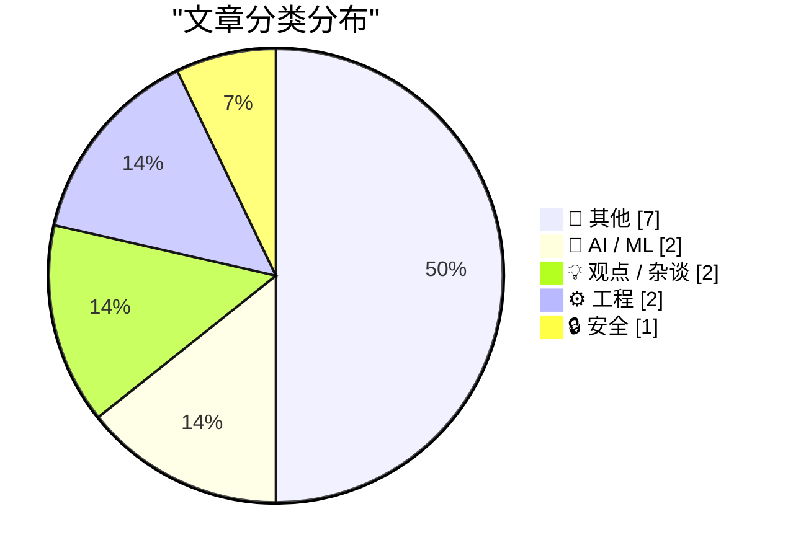
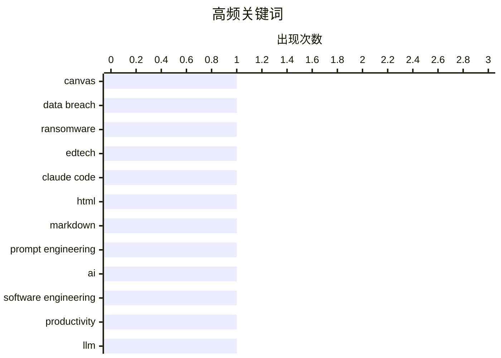

# 📰 AI 博客每日精选 — 2026-05-09

> 来自 Karpathy 推荐的 92 个顶级技术博客，AI 精选 Top 14

## 📝 今日看点

今日技术圈聚焦于AI浪潮的双面性与数字基础设施的安全韧性。一方面，AI编程工具正重塑软件工程效能，有效弥合开发者能力差距，但高昂的算力成本与脆弱的商业模型也暴露出产业繁荣背后的财务隐忧。另一方面，从教育平台遭遇大规模勒索攻击到开源供应链中僵尸依赖泛滥，关键系统的脆弱性再次敲响警钟。在技术快速迭代的同时，构建安全可控的底层架构与可持续的AI生态，已成为行业破局的核心命题。

---

## 🏆 今日必读

🥇 **Canvas 数据泄露事件导致全美学校与高校教学瘫痪**

[Canvas Breach Disrupts Schools & Colleges Nationwide](https://krebsonsecurity.com/2026/05/canvas-breach-disrupts-schools-colleges-nationwide/) — krebsonsecurity.com · 21 小时前 · 🔒 安全

> 广泛使用的教育技术平台 Canvas 遭遇持续的数据勒索攻击，导致全美数千所学校的在线教学与课程提交系统全面中断。黑客组织在登录页面张贴勒索信息，威胁泄露涵盖近 9000 所教育机构、约 2.75 亿名师生的敏感数据。攻击直接瘫痪了依赖该平台进行日常教学管理的学区与大学，迫使大量课程转为线下或延期。此次事件凸显了教育科技基础设施在面临定向网络犯罪时的脆弱性，迫使机构重新评估第三方 SaaS 平台的数据安全与业务连续性预案。

💡 **为什么值得读**: 揭示了教育行业高度依赖单一 SaaS 平台带来的系统性风险，为机构制定数据备份与应急响应策略提供了紧迫的现实案例。

🏷️ Canvas, data breach, ransomware, edtech

🥈 **使用 Claude Code：HTML 的非凡有效性**

[Using Claude Code: The Unreasonable Effectiveness of HTML](https://simonwillison.net/2026/May/8/unreasonable-effectiveness-of-html/#atom-everything) — simonwillison.net · 3 小时前 · 🤖 AI / ML

> 探讨在调用 Claude Code 生成代码或内容时，为何强制要求 AI 输出 HTML 格式比传统的 Markdown 更具优势。Anthropic 团队成员通过大量实测案例证明，HTML 的标签结构能为大模型提供更明确的语义边界与层级关系，显著降低格式解析错误与幻觉率。配合特定的 Prompt 模板，开发者能直接获取可渲染、易维护的前端组件，减少后期二次转换成本。在 AI 辅助编程工作流中，将输出格式从 Markdown 转向 HTML 是提升代码生成质量与工程可用性的关键实践。

💡 **为什么值得读**: 提供了 Anthropic 官方团队的一线实战经验，直接优化了 AI 代码生成的 Prompt 策略，能显著提升开发效率与输出稳定性。

🏷️ Claude Code, HTML, Markdown, prompt engineering

🥉 **AI 让能力较弱的工程师危害性降低**

[AI makes weak engineers less harmful](https://seangoedecke.com/ai-makes-weak-engineers-less-harmful/) — seangoedecke.com · 13 分钟前 · 💡 观点 / 杂谈

> 分析 AI 编程工具如何改变软件工程领域长期存在的“能力重尾分布”现象及其对团队效能的影响。传统模式下，顶尖工程师产出远超平均水平，而能力不足的工程师往往因引入缺陷或技术债成为团队的净负资产，促使企业倾向组建高薪精干团队。AI 辅助工具的普及有效填补了基础编码与调试的能力缺口，使中等及偏下水平工程师的代码质量与交付稳定性显著提升。AI 并未消除工程师的能力差异，但大幅拉平了基础开发门槛，使企业能够以更合理的成本结构维持团队整体产出。

💡 **为什么值得读**: 深入剖析了 AI 对软件工程生产力分布的结构性影响，为技术管理者优化团队配置、调整招聘标准提供了基于数据趋势的决策参考。

🏷️ AI, software engineering, productivity, LLM

---

## 📊 数据概览

| 扫描源 | 抓取文章 | 时间范围 | 精选 |
|:---:|:---:|:---:|:---:|
| 77/92 | 2329 篇 → 14 篇 | 24h | **14 篇** |

### 分类分布



### 高频关键词



<details>
<summary>📈 纯文本关键词图（终端友好）</summary>

```
canvas               │ ████████████████████ 1
data breach          │ ████████████████████ 1
ransomware           │ ████████████████████ 1
edtech               │ ████████████████████ 1
claude code          │ ████████████████████ 1
html                 │ ████████████████████ 1
markdown             │ ████████████████████ 1
prompt engineering   │ ████████████████████ 1
ai                   │ ████████████████████ 1
software engineering │ ████████████████████ 1
```

</details>

### 🏷️ 话题标签

**canvas**(1) · **data breach**(1) · **ransomware**(1) · edtech(1) · claude code(1) · html(1) · markdown(1) · prompt engineering(1) · ai(1) · software engineering(1) · productivity(1) · llm(1) · ai economy(1) · cloud costs(1) · anthropic(1) · tech policy(1) · copyright(1) · culture(1) · fbi(1) · windows api(1)

---

## 📝 其他

### 1. HomePod mini 体验如魔法，实则只是时机恰到好处

[HomePod mini feels like magic, but it's just good timing](https://www.jeffgeerling.com/blog/2026/homepod-mini-feels-like-magic--but-it-s-just-good-timing/) — **jeffgeerling.com** · 10 小时前 · ⭐ 18/30

> 剖析 Apple HomePod mini 发布六年后的产品体验，指出其“魔法感”并非源于硬件突破，而是生态协同与发布时机的精准匹配。尽管智能音箱市场竞争早已白热化，但 HomePod mini 凭借与 iPhone 的无缝立体声配对、HomeKit 深度集成以及渐进式的固件更新，在延迟体验与多设备协同上建立了差异化优势。作者认为，其成功关键在于 Apple 等待了蓝牙与 Wi-Fi 协议成熟及用户习惯养成的窗口期，而非单纯依赖声学技术。消费电子产品的竞争力往往取决于软硬件生态的成熟度与市场切入时机，技术堆料并非唯一决胜因素。

🏷️ HomePod, Apple, UX, hardware

---

### 2. 胆大者胜

[The Bold Ones Win](https://feed.tedium.co/link/15204/17336568/ted-turner-bold-ceo-bets) — **tedium.co** · 1 天前 · ⭐ 16/30

> 以传媒大亨 Ted Turner 的传奇经历为引，探讨在高度不确定的市场环境中大胆押注对商业与技术突破的决定性作用。文章对比了 Turner 当年颠覆传统媒体格局的激进策略与当代创业者面临的类似抉择，指出在技术范式转移期保守迭代往往错失窗口。通过拆解历史案例与近期商业动向，分析风险偏好与创新回报之间的非线性关系。在技术快速迭代的时代，成功的创业者与工程师不仅需要执行力，更需在关键节点敢于承担经过计算的非对称风险。

🏷️ entrepreneurship, business strategy, Ted Turner, risk

---

### 3. 计算曲率

[Calculating curvature](https://www.johndcook.com/blog/2026/05/08/calculating-curvature/) — **johndcook.com** · 10 小时前 · ⭐ 15/30

> 探讨隐式曲线水平集曲率计算的数学难点与工程实现优化。尽管曲率概念直观，但直接代入梯度与 Hessian 矩阵公式会导致表达式极度复杂且数值不稳定。文章通过引入中间变量与链式法则重构计算路径，将二阶偏导数运算转化为更紧凑的代数形式，显著降低浮点误差与计算开销。在计算机图形学与物理仿真中，采用代数化简与数值稳定策略处理曲率公式，是提升渲染精度与模拟性能的关键数学基础。

🏷️ curvature, mathematics, level set, calculus

---

### 4. 乔治·奥威尔评罗素《权力：一种新的社会分析》

[George Orwell's review of Russel's Power: A New Social Analysis](https://berthub.eu/articles/posts/orwell-review-bertrand-russells-power/) — **berthub.eu** · 3 小时前 · ⭐ 15/30

> 文章复原了乔治·奥威尔于1939年1月在《The Adelphi》杂志发表的书评，实质是对伯特兰·罗素《权力：一种新的社会分析》的深度思想剖析。奥威尔跳出传统书评框架，结合当时欧洲政治动荡背景，批判性审视了罗素关于权力本质与社会结构的理论。作者通过互联网档案馆找回了这篇一度从公开网络消失的文献，并保留了原始扫描件来源。该文献为理解20世纪知识分子对权力机制的早期反思提供了珍贵的一手资料。

🏷️ George Orwell, philosophy, social analysis, literary review

---

### 5. 嗨，陌生人

[Hi stranger](https://idiallo.com/blog/hi?src=feed) — **idiallo.com** · 10 小时前 · ⭐ 12/30

> 作者以厨房餐桌旁的日常随笔为切入点，探讨了独立写作在持续输出与读者反馈之间的真实状态。文章指出，规律性写作容易营造“深刻洞察者”的假象，但实际创作往往更接近私人日记，依赖偶然的邮件互动或沉默来维持动力。这种去中心化的个人发布模式打破了传统媒体的单向传播，将写作还原为自我对话与偶然连接的结合体。坚持记录本身比追求流量更能建立真实的创作者与读者关系。

🏷️ writing, blogging, personal, consistency

---

### 6. 戴尔收购外星人电脑，2006年5月8日

[Dell buys Alienware, May 8, 2006](https://dfarq.homeip.net/dell-buys-alienware-may-8-2006/?utm_source=rss&#038;utm_medium=rss&#038;utm_campaign=dell-buys-alienware-may-8-2006) — **dfarq.homeip.net** · 13 小时前 · ⭐ 11/30

> 文章回顾了2006年5月8日戴尔正式完成对高端游戏电脑品牌外星人（Alienware）收购的商业事件。经过长达四年的谈判与磨合，主打企业级标准化市场的戴尔成功整合了以激进设计和极客文化著称的外星人团队。此次并购标志着传统PC制造商向高利润游戏细分市场战略转型的关键节点，也反映了当时硬件行业品牌矩阵扩张的典型路径。收购后外星人保持独立运营的模式，为科技巨头并购垂直领域品牌提供了经典范本。

🏷️ tech history, acquisition, Dell, Alienware

---

### 7. 本周《模拟古董商》专栏更新

[This Week on The Analog Antiquarian](https://www.filfre.net/2026/05/this-week-on-the-analog-antiquarian/) — **filfre.net** · 8 小时前 · ⭐ 4/30

> 该专栏宣布因作者家庭春季园艺与房屋维护工作，下周将暂停更新一期。作者承诺将在两周后恢复发布，并明确下一期内容将直接聚焦电子游戏领域的历史考据与深度分析。作为长期关注复古计算与游戏文化的专栏，其更新节奏受个人生活安排影响，体现了独立内容创作者在兴趣驱动与现实事务间的平衡。读者可据此调整阅读预期，并期待后续针对游戏本体的专项内容。

🏷️ newsletter, hiatus, gaming

---

## 🤖 AI / ML

### 8. 使用 Claude Code：HTML 的非凡有效性

[Using Claude Code: The Unreasonable Effectiveness of HTML](https://simonwillison.net/2026/May/8/unreasonable-effectiveness-of-html/#atom-everything) — **simonwillison.net** · 3 小时前 · ⭐ 25/30

> 探讨在调用 Claude Code 生成代码或内容时，为何强制要求 AI 输出 HTML 格式比传统的 Markdown 更具优势。Anthropic 团队成员通过大量实测案例证明，HTML 的标签结构能为大模型提供更明确的语义边界与层级关系，显著降低格式解析错误与幻觉率。配合特定的 Prompt 模板，开发者能直接获取可渲染、易维护的前端组件，减少后期二次转换成本。在 AI 辅助编程工作流中，将输出格式从 Markdown 转向 HTML 是提升代码生成质量与工程可用性的关键实践。

🏷️ Claude Code, HTML, Markdown, prompt engineering

---

### 9. 付费专栏：AI 的循环性精神错乱

[Premium: AI's Circular Psychosis](https://www.wheresyoured.at/premium-ais-circular-psychosis/) — **wheresyoured.at** · 9 小时前 · ⭐ 23/30

> 揭示当前 AI 产业繁荣背后隐藏的“循环经济”财务困境与基础设施依赖风险。以 Anthropic 为例，指出其高昂的算力与运营成本已远超当前产品收入，公司维持运转完全依赖外部资金注入或客户付费来支付云服务商账单。这种“用客户的钱付云账单，用云算力训练模型再卖给客户”的闭环模式，本质上是一种资金与算力的相互输血。若下游应用商业化变现不及预期，整个 AI 基础设施层的资金链将面临断裂风险，行业亟需从烧钱换规模转向可持续的盈利模型。

🏷️ AI economy, cloud costs, Anthropic

---

## 💡 观点 / 杂谈

### 10. AI 让能力较弱的工程师危害性降低

[AI makes weak engineers less harmful](https://seangoedecke.com/ai-makes-weak-engineers-less-harmful/) — **seangoedecke.com** · 13 分钟前 · ⭐ 25/30

> 分析 AI 编程工具如何改变软件工程领域长期存在的“能力重尾分布”现象及其对团队效能的影响。传统模式下，顶尖工程师产出远超平均水平，而能力不足的工程师往往因引入缺陷或技术债成为团队的净负资产，促使企业倾向组建高薪精干团队。AI 辅助工具的普及有效填补了基础编码与调试的能力缺口，使中等及偏下水平工程师的代码质量与交付稳定性显著提升。AI 并未消除工程师的能力差异，但大幅拉平了基础开发门槛，使企业能够以更合理的成本结构维持团队整体产出。

🏷️ AI, software engineering, productivity, LLM

---

### 11. 多元视角：李莱的《大炮》（2026年5月8日）

[Pluralistic: Lee Lai's "Cannon" (08 May 2026)](https://pluralistic.net/2026/05/08/gung-gung/) — **pluralistic.net** · 11 小时前 · ⭐ 20/30

> 本期技术文化通讯聚焦独立漫画作品《大炮》及近期科技与互联网领域的跨界动态。文章首先推荐了李莱创作的图像小说，探讨职场责任、人性与荒诞管理之间的张力。随后串联了 eBay 重启报纸分类广告、FBI 与 TOR 的隐私博弈、以及网络诈骗手法演变等多个独立议题，呈现技术演进与社会文化的交叉影响。在算法与 AI 主导的时代，回归人文叙事与底层技术伦理的讨论，有助于保持对数字生态多样性的清醒认知。

🏷️ tech policy, copyright, culture, FBI

---

## ⚙️ 工程

### 12. 通过 ReadDirectoryChangesW 跟踪文件重命名时提升开发信心

[Developing more confidence when tracking renames via Read­Directory­ChangesW](https://devblogs.microsoft.com/oldnewthing/20260508-00/?p=112310) — **devblogs.microsoft.com/oldnewthing** · 10 小时前 · ⭐ 20/30

> 解决 Windows 开发中使用 ReadDirectoryChangesW API 监控文件系统时，难以准确追踪文件重命名操作的痛点。传统路径匹配方式在文件被移动或重命名后极易失效，文章提出通过绑定并跟踪底层文件 ID 来建立持久化关联。结合 Windows 卷影副本与 NTFS 元数据特性，开发者可构建更稳健的文件变更监听逻辑，避免因路径断裂导致的同步丢失或状态错乱。利用文件 ID 替代路径字符串进行状态追踪，是提升 Windows 桌面应用与同步工具可靠性的关键底层实践。

🏷️ Windows API, file system, ReadDirectoryChangesW, C++

---

### 13. 周末去伯尼家：你的依赖项谁在“戴墨镜装死”？

[Weekend at Bernie’s](https://nesbitt.io/2026/05/08/weekend-at-bernies.html) — **nesbitt.io** · 14 小时前 · ⭐ 17/30

> 探讨现代软件开发中普遍存在的“僵尸依赖”问题，即那些名义上仍在维护、实则已停止更新或存在安全隐患的第三方库。文章借用电影隐喻提醒开发者警惕供应链中那些长期未提交代码、Issue 堆积或仅靠自动化机器人维持仓库活跃的依赖项。通过静态分析、提交频率监控与许可证合规检查，团队可识别并替换这些隐性技术债。主动治理依赖供应链是保障项目长期可维护性的必要手段，盲目信任看似活跃的开源包将埋下严重的安全与兼容性隐患。

🏷️ dependencies, supply chain, maintenance, open source

---

## 🔒 安全

### 14. Canvas 数据泄露事件导致全美学校与高校教学瘫痪

[Canvas Breach Disrupts Schools & Colleges Nationwide](https://krebsonsecurity.com/2026/05/canvas-breach-disrupts-schools-colleges-nationwide/) — **krebsonsecurity.com** · 21 小时前 · ⭐ 27/30

> 广泛使用的教育技术平台 Canvas 遭遇持续的数据勒索攻击，导致全美数千所学校的在线教学与课程提交系统全面中断。黑客组织在登录页面张贴勒索信息，威胁泄露涵盖近 9000 所教育机构、约 2.75 亿名师生的敏感数据。攻击直接瘫痪了依赖该平台进行日常教学管理的学区与大学，迫使大量课程转为线下或延期。此次事件凸显了教育科技基础设施在面临定向网络犯罪时的脆弱性，迫使机构重新评估第三方 SaaS 平台的数据安全与业务连续性预案。

🏷️ Canvas, data breach, ransomware, edtech

---

*生成于 2026-05-09 00:13 | 扫描 77 源 → 获取 2329 篇 → 精选 14 篇*
*基于 [Hacker News Popularity Contest 2025](https://refactoringenglish.com/tools/hn-popularity/) RSS 源列表，由 [Andrej Karpathy](https://x.com/karpathy) 推荐*
*由「懂点儿AI」制作，欢迎关注同名微信公众号获取更多 AI 实用技巧 💡*
