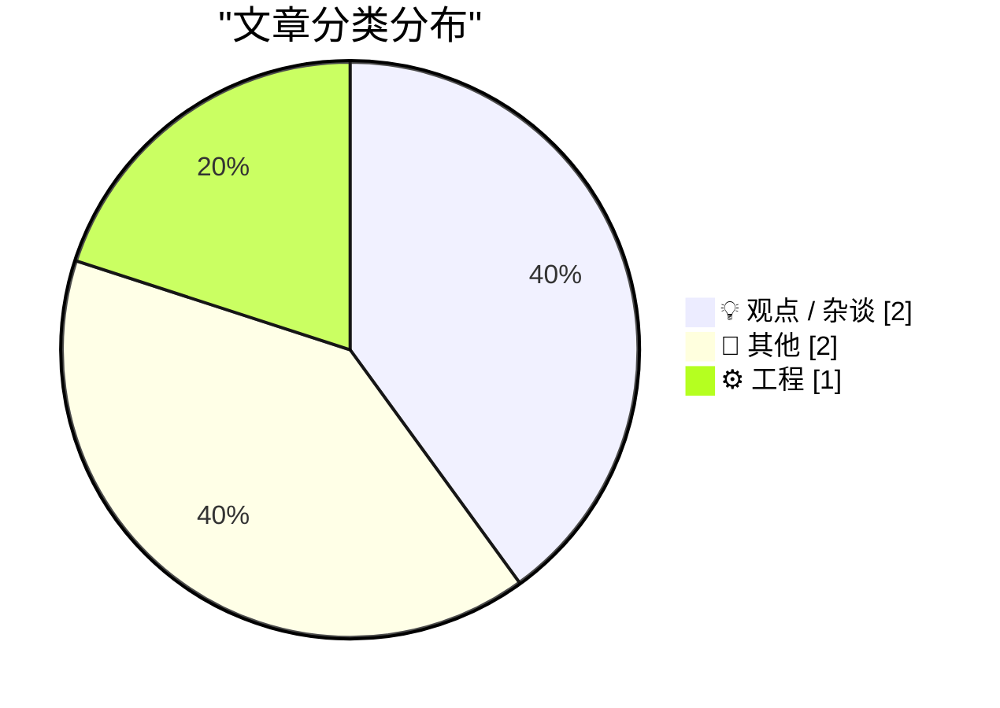
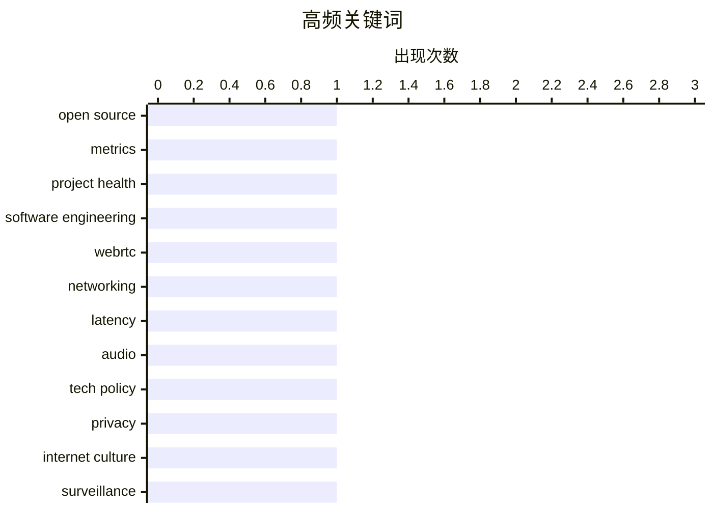

# 📰 AI 博客每日精选 — 2026-05-10

> 来自 Karpathy 推荐的 92 个顶级技术博客，AI 精选 Top 5

## 📝 今日看点

今日技术圈聚焦于底层架构评估与设计哲学的深度反思。开源生态正警惕量化指标的“路灯效应”，呼吁从表面活跃度转向项目长期可持续性；同时，WebRTC等实时通信协议“保延迟弃质量”的传统设计，在现代异步沟通场景下面临适用性争议。另一方面，边缘计算与低成本基础设施加速跨界融合，家庭数据中心部署与微型无人机研发正推动技术向平民化与实用化演进。整体而言，技术演进正从追求单一性能指标，转向兼顾生态健康、场景适配与普惠落地的多维平衡。

---

## 🏆 今日必读

🥇 **开源项目的误测：项目健康度评分中的“路灯效应”**

[The Mismeasure of Open Source](https://nesbitt.io/2026/05/09/the-mismeasure-of-open-source.html) — nesbitt.io · 14 小时前 · 💡 观点 / 杂谈

> 开源项目的健康度评估往往陷入“路灯效应”，即过度依赖易于量化但缺乏实际意义的指标（如 Star 数、提交频率），而忽视真正影响项目可持续性的核心因素。这种片面的评分机制会导致维护者倦怠、依赖链脆弱性被掩盖，以及社区贡献者流失。通过对比传统指标与真实项目生命周期数据，揭示了当前评估体系在预测项目存活率和安全性方面的严重偏差。建立以维护者负荷、依赖关系透明度和社区治理结构为核心的新型健康度评估框架，是破解开源生态数据幻觉的必由之路。

💡 **为什么值得读**: 本文直击开源生态评估体系的盲区，为项目维护者和企业选型提供了跳出“数据幻觉”的实用评估思路。

🏷️ open source, metrics, project health, software engineering

🥈 **引用 Luke Curley 对 WebRTC 设计哲学的批评**

[Quoting Luke Curley](https://simonwillison.net/2026/May/9/luke-curley/#atom-everything) — simonwillison.net · 23 小时前 · ⚙️ 工程

> WebRTC 在网络状况不佳时会为了保持低延迟而激进地丢弃音频数据包，导致会议通话中出现严重的音频失真。这种“保延迟、弃质量”的设计初衷是为了适应传统实时双向对话场景，但在现代异步或半同步沟通中往往适得其反。用户普遍更倾向于短暂等待以换取完整清晰的音频，而非接受频繁卡顿和破音。WebRTC 及基于该协议的应用应重新权衡延迟与音质的优先级，提供更符合用户实际体验的降级策略。

💡 **为什么值得读**: 本文以一线开发者的真实痛点切入，揭示了底层通信协议设计逻辑与终端用户体验之间的典型错位，对音视频产品优化极具启发。

🏷️ WebRTC, networking, latency, audio

🥉 **多元视角：特朗普徒劳寻找可攻击的靶子（2026年5月9日）**

[Pluralistic: Trump's fruitless search for a goreable ox (09 May 2026)](https://pluralistic.net/2026/05/09/cossie-livvie-crissie/) — pluralistic.net · 11 小时前 · 💡 观点 / 杂谈

> 本期专栏聚焦政治与经济政策的根本矛盾，指出试图同时取悦亿万富翁与解决生活成本危机在现实中无法兼得。文章通过一系列精选链接，涵盖了打字机复兴、老牌黑客杂志《Phrack》新刊发布、巴拿马文件举报人发声、《PRO法案》进展以及扎克伯格最新脑机接口技术争议等多元议题。以批判性视角串联科技、文化与社会动态，揭示技术演进与资本权力交织下的现实困境。提醒读者警惕政治叙事中的虚假对立，并持续关注技术垄断对公共利益的潜在侵蚀。

💡 **为什么值得读**: 本文以犀利的科技社会评论串联前沿动态，帮助读者在碎片化信息中快速把握技术、资本与政策的交叉脉络。

🏷️ tech policy, privacy, internet culture, surveillance

---

## 📊 数据概览

| 扫描源 | 抓取文章 | 时间范围 | 精选 |
|:---:|:---:|:---:|:---:|
| 78/92 | 2340 篇 → 5 篇 | 24h | **5 篇** |

### 分类分布



### 高频关键词



<details>
<summary>📈 纯文本关键词图（终端友好）</summary>

```
open source          │ ████████████████████ 1
metrics              │ ████████████████████ 1
project health       │ ████████████████████ 1
software engineering │ ████████████████████ 1
webrtc               │ ████████████████████ 1
networking           │ ████████████████████ 1
latency              │ ████████████████████ 1
audio                │ ████████████████████ 1
tech policy          │ ████████████████████ 1
privacy              │ ████████████████████ 1
```

</details>

### 🏷️ 话题标签

**open source**(1) · **metrics**(1) · **project health**(1) · software engineering(1) · webrtc(1) · networking(1) · latency(1) · audio(1) · tech policy(1) · privacy(1) · internet culture(1) · surveillance(1) · data centers(1) · infrastructure(1) · tech news(1) · drones(1) · fiction(1) · literature(1) · book review(1)

---

## 💡 观点 / 杂谈

### 1. 开源项目的误测：项目健康度评分中的“路灯效应”

[The Mismeasure of Open Source](https://nesbitt.io/2026/05/09/the-mismeasure-of-open-source.html) — **nesbitt.io** · 14 小时前 · ⭐ 23/30

> 开源项目的健康度评估往往陷入“路灯效应”，即过度依赖易于量化但缺乏实际意义的指标（如 Star 数、提交频率），而忽视真正影响项目可持续性的核心因素。这种片面的评分机制会导致维护者倦怠、依赖链脆弱性被掩盖，以及社区贡献者流失。通过对比传统指标与真实项目生命周期数据，揭示了当前评估体系在预测项目存活率和安全性方面的严重偏差。建立以维护者负荷、依赖关系透明度和社区治理结构为核心的新型健康度评估框架，是破解开源生态数据幻觉的必由之路。

🏷️ open source, metrics, project health, software engineering

---

### 2. 多元视角：特朗普徒劳寻找可攻击的靶子（2026年5月9日）

[Pluralistic: Trump's fruitless search for a goreable ox (09 May 2026)](https://pluralistic.net/2026/05/09/cossie-livvie-crissie/) — **pluralistic.net** · 11 小时前 · ⭐ 20/30

> 本期专栏聚焦政治与经济政策的根本矛盾，指出试图同时取悦亿万富翁与解决生活成本危机在现实中无法兼得。文章通过一系列精选链接，涵盖了打字机复兴、老牌黑客杂志《Phrack》新刊发布、巴拿马文件举报人发声、《PRO法案》进展以及扎克伯格最新脑机接口技术争议等多元议题。以批判性视角串联科技、文化与社会动态，揭示技术演进与资本权力交织下的现实困境。提醒读者警惕政治叙事中的虚假对立，并持续关注技术垄断对公共利益的潜在侵蚀。

🏷️ tech policy, privacy, internet culture, surveillance

---

## 📝 其他

### 3. 阅读清单 2026年5月9日

[Reading List 05/09/2026](https://www.construction-physics.com/p/reading-list-05092026) — **construction-physics.com** · 12 小时前 · ⭐ 19/30

> 本期清单聚焦建筑安全、边缘计算基础设施与低成本国防科技的交叉领域，精选了关于“被困建筑”结构隐患、家庭数据中心部署方案、纸板军用无人机研发以及 Brightline 高铁潜在破产风险等深度报道。通过对比传统基建模式与新型分布式计算、轻量化军事装备的演进路径，揭示了资源约束下技术创新的实际落地瓶颈。家庭级算力节点与可消耗型无人机正逐步重塑局部产业链，但商业化与供应链稳定性仍面临严峻考验。关注这些边缘创新如何反向推动主流工程标准的迭代，将有助于把握未来硬件与基建的转型方向。

🏷️ data centers, infrastructure, tech news, drones

---

### 4. 书评：《名字》（弗洛伦斯·纳普 著）★★⯪☆☆

[Book Review: The Names by Florence Knapp ★★⯪☆☆](https://shkspr.mobi/blog/2026/05/book-review-the-names-by-florence-knapp/) — **shkspr.mobi** · 12 小时前 · ⭐ 11/30

> 弗洛伦斯·纳普的小说《名字》虽具备精巧的平行叙事结构与优美的文字表达，但沉重的家庭暴力主题严重削弱了阅读体验。作品采用类似《滑动门》与《明年同此日》的多线叙事手法，围绕一位母亲是否将孩子冠以施暴丈夫姓氏的抉择，在三个时间分支中展开截然不同的命运推演。尽管小说在结构设计与文学性上表现优异，但过度聚焦创伤叙事导致情感压抑，难以引发广泛共鸣。该书更适合偏好严肃文学与心理剖析的读者，而非大众娱乐向受众。

🏷️ fiction, literature, book review

---

## ⚙️ 工程

### 5. 引用 Luke Curley 对 WebRTC 设计哲学的批评

[Quoting Luke Curley](https://simonwillison.net/2026/May/9/luke-curley/#atom-everything) — **simonwillison.net** · 23 小时前 · ⭐ 22/30

> WebRTC 在网络状况不佳时会为了保持低延迟而激进地丢弃音频数据包，导致会议通话中出现严重的音频失真。这种“保延迟、弃质量”的设计初衷是为了适应传统实时双向对话场景，但在现代异步或半同步沟通中往往适得其反。用户普遍更倾向于短暂等待以换取完整清晰的音频，而非接受频繁卡顿和破音。WebRTC 及基于该协议的应用应重新权衡延迟与音质的优先级，提供更符合用户实际体验的降级策略。

🏷️ WebRTC, networking, latency, audio

---

*生成于 2026-05-10 00:10 | 扫描 78 源 → 获取 2340 篇 → 精选 5 篇*
*基于 [Hacker News Popularity Contest 2025](https://refactoringenglish.com/tools/hn-popularity/) RSS 源列表，由 [Andrej Karpathy](https://x.com/karpathy) 推荐*
*由「懂点儿AI」制作，欢迎关注同名微信公众号获取更多 AI 实用技巧 💡*
