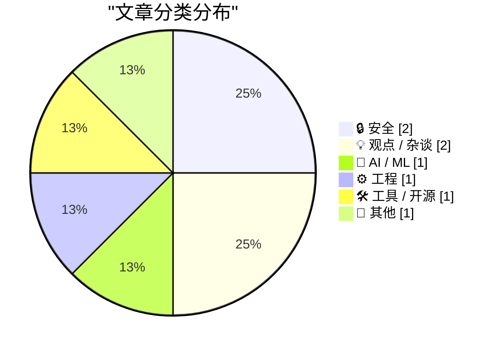
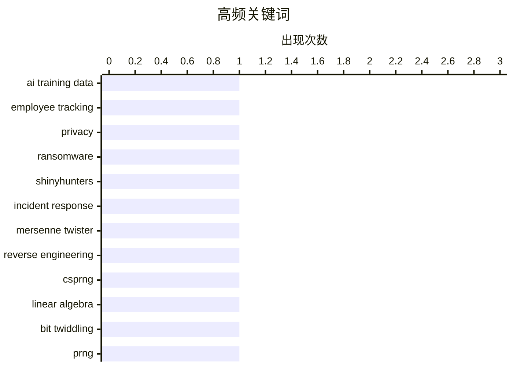

# 📰 AI 博客每日精选 — 2026-05-11

> 来自 Karpathy 推荐的 92 个顶级技术博客，AI 精选 Top 8

## 📝 今日看点

今日技术圈呈现三大演进主线。AI训练正加速向员工行为数据延伸，数据获取与隐私合规的博弈日趋激烈。底层安全与性能优化深度回归数学原理，线性代数与有限状态机正被广泛用于算法逆向与工程提效。企业级身份认证与版本控制哲学等规范话题持续升温，折射出开发者对标准化基建与可维护架构的底层追求。整体而言，技术演进正从表层应用向数据伦理、数学内核与工程架构纵深推进。

---

## 🏆 今日必读

🥇 **Meta 将开始采集员工鼠标移动与键盘输入数据用于 AI 训练**

[Meta to Start Capturing Employee Mouse Movements, Keystrokes for AI Training Data](https://www.reuters.com/sustainability/boards-policy-regulation/meta-start-capturing-employee-mouse-movements-keystrokes-ai-training-data-2026-04-21/) — daringfireball.net · 10 小时前 · 🤖 AI / ML

> Meta 启动名为“模型能力计划”（MCI）的内部监控项目，旨在采集美国员工电脑上的鼠标移动、点击及键盘输入数据。该追踪软件将专门针对工作相关的应用程序与网站运行，所收集的行为数据将直接用于训练 Meta 的自主 AI 智能体（AI Agents）。此举标志着企业级 AI 训练数据获取方式从传统的公开网络抓取转向内部员工真实工作流记录。这一举措在提升 AI 代理自动化办公能力的同时，也引发了关于员工隐私边界与企业数据伦理的广泛争议。

💡 **为什么值得读**: 揭示了企业级 AI 训练数据源的最新演变趋势，为关注 AI 开发伦理、员工隐私合规及智能体工作流自动化的从业者提供关键参考。

🏷️ AI training data, employee tracking, privacy

🥈 **每周更新 第503期**

[Weekly Update 503](https://www.troyhunt.com/weekly-update-503/) — troyhunt.com · 17 分钟前 · 🔒 安全

> 本期安全资讯聚焦于 Instructure 数据泄露事件的最新进展与勒索软件组织 ShinyHunters 的博弈动态。在“付费或泄露”的最后期限前夕，Instructure 已从 ShinyHunters 的泄露网站撤下相关条目，仅保留一份“不予置评”的官方声明。这表明受害企业可能已采取紧急公关或技术干预措施，试图阻断数据公开流程。事件后续发展将验证企业面对勒索软件攻击时“不妥协、不发声”策略的实际有效性。

💡 **为什么值得读**: 提供了勒索软件攻击中企业应对策略与黑客组织博弈的一线实战案例，有助于安全团队理解数据泄露事件的生命周期与公关处置逻辑。

🏷️ ransomware, ShinyHunters, incident response

🥉 **使用线性代数逆向工程梅森旋转算法**

[Reverse engineering Mersenne Twister with Linear Algebra](https://www.johndcook.com/blog/2026/05/10/reverse-mersenne-twister/) — johndcook.com · 6 小时前 · 🔒 安全

> 文章深入剖析了梅森旋转算法（Mersenne Twister, MT）作为伪随机数生成器（PRNG）在密码学场景下的安全缺陷。作者演示了如何仅通过观察算法输出序列，利用线性代数方法完整恢复 MT 的内部状态。该方案将复杂的位运算（bit twiddling）转化为模 2 域上的矩阵乘法，从而绕过了传统逆向分析中对底层比特操作的繁琐推导。这一数学化逆向路径不仅验证了 MT 不适用于加密场景，也为理解其他基于线性反馈移位寄存器的随机数算法提供了通用分析框架。

💡 **为什么值得读**: 将晦涩的密码学逆向问题转化为直观的线性代数矩阵运算，为开发者提供了一条清晰、可复现的算法漏洞分析路径。

🏷️ Mersenne Twister, reverse engineering, CSPRNG

---

## 📊 数据概览

| 扫描源 | 抓取文章 | 时间范围 | 精选 |
|:---:|:---:|:---:|:---:|
| 76/92 | 2318 篇 → 8 篇 | 24h | **8 篇** |

### 分类分布



### 高频关键词



<details>
<summary>📈 纯文本关键词图（终端友好）</summary>

```
ai training data    │ ████████████████████ 1
employee tracking   │ ████████████████████ 1
privacy             │ ████████████████████ 1
ransomware          │ ████████████████████ 1
shinyhunters        │ ████████████████████ 1
incident response   │ ████████████████████ 1
mersenne twister    │ ████████████████████ 1
reverse engineering │ ████████████████████ 1
csprng              │ ████████████████████ 1
linear algebra      │ ████████████████████ 1
```

</details>

### 🏷️ 话题标签

**ai training data**(1) · **employee tracking**(1) · **privacy**(1) · ransomware(1) · shinyhunters(1) · incident response(1) · mersenne twister(1) · reverse engineering(1) · csprng(1) · linear algebra(1) · bit twiddling(1) · prng(1) · b2b saas(1) · authentication(1) · sso(1) · semver(1) · versioning(1) · software releases(1) · imposter syndrome(1) · developer journey(1)

---

## 🔒 安全

### 1. 每周更新 第503期

[Weekly Update 503](https://www.troyhunt.com/weekly-update-503/) — **troyhunt.com** · 17 分钟前 · ⭐ 25/30

> 本期安全资讯聚焦于 Instructure 数据泄露事件的最新进展与勒索软件组织 ShinyHunters 的博弈动态。在“付费或泄露”的最后期限前夕，Instructure 已从 ShinyHunters 的泄露网站撤下相关条目，仅保留一份“不予置评”的官方声明。这表明受害企业可能已采取紧急公关或技术干预措施，试图阻断数据公开流程。事件后续发展将验证企业面对勒索软件攻击时“不妥协、不发声”策略的实际有效性。

🏷️ ransomware, ShinyHunters, incident response

---

### 2. 使用线性代数逆向工程梅森旋转算法

[Reverse engineering Mersenne Twister with Linear Algebra](https://www.johndcook.com/blog/2026/05/10/reverse-mersenne-twister/) — **johndcook.com** · 6 小时前 · ⭐ 24/30

> 文章深入剖析了梅森旋转算法（Mersenne Twister, MT）作为伪随机数生成器（PRNG）在密码学场景下的安全缺陷。作者演示了如何仅通过观察算法输出序列，利用线性代数方法完整恢复 MT 的内部状态。该方案将复杂的位运算（bit twiddling）转化为模 2 域上的矩阵乘法，从而绕过了传统逆向分析中对底层比特操作的繁琐推导。这一数学化逆向路径不仅验证了 MT 不适用于加密场景，也为理解其他基于线性反馈移位寄存器的随机数算法提供了通用分析框架。

🏷️ Mersenne Twister, reverse engineering, CSPRNG

---

## 💡 观点 / 杂谈

### 3. 语义版本控制女士现在可以见您了

[Madame Semver Will See You Now](https://nesbitt.io/2026/05/10/madame-semver-will-see-you-now.html) — **nesbitt.io** · 14 小时前 · ⭐ 17/30

> 文章以隐喻手法探讨了软件发布中语义化版本控制（SemVer）的规范与实践哲学。作者通过“占卜”式的叙事结构，剖析了主版本号、次版本号与修订号变更背后的决策逻辑。内容强调了版本迭代不应仅依赖机械规则，而需结合 API 兼容性、用户预期与破坏性变更的实际影响进行综合判断。遵循 SemVer 的核心在于建立清晰的契约精神，而非盲目追求版本号数字的增长。

🏷️ SemVer, versioning, software releases

---

### 4. 引用 Andrew Quinn 的观点

[Quoting Andrew Quinn](https://simonwillison.net/2026/May/10/andrew-quinn/#atom-everything) — **simonwillison.net** · 9 小时前 · ⭐ 15/30

> 文章引述了 Andrew Quinn 关于利用有限状态转换器（FST）大幅优化文本处理工具存储与性能的技术实践。作者将原本占用 3 GB 的 SQLite 数据库成功替换为仅 7 MB 的 FST 二进制文件，实现了数据体积的指数级压缩。这一方案不仅解决了传统关系型数据库在纯文本检索场景下的冗余问题，也引发了开发者对“重复造轮子”与“复用经典算法”之间价值取舍的深刻反思。在构建现代工具链时，重新审视并应用数十年前的成熟数据结构，往往能带来远超预期的性能突破与工程简洁性。

🏷️ imposter syndrome, developer journey, programming

---

## 🤖 AI / ML

### 5. Meta 将开始采集员工鼠标移动与键盘输入数据用于 AI 训练

[Meta to Start Capturing Employee Mouse Movements, Keystrokes for AI Training Data](https://www.reuters.com/sustainability/boards-policy-regulation/meta-start-capturing-employee-mouse-movements-keystrokes-ai-training-data-2026-04-21/) — **daringfireball.net** · 10 小时前 · ⭐ 26/30

> Meta 启动名为“模型能力计划”（MCI）的内部监控项目，旨在采集美国员工电脑上的鼠标移动、点击及键盘输入数据。该追踪软件将专门针对工作相关的应用程序与网站运行，所收集的行为数据将直接用于训练 Meta 的自主 AI 智能体（AI Agents）。此举标志着企业级 AI 训练数据获取方式从传统的公开网络抓取转向内部员工真实工作流记录。这一举措在提升 AI 代理自动化办公能力的同时，也引发了关于员工隐私边界与企业数据伦理的广泛争议。

🏷️ AI training data, employee tracking, privacy

---

## ⚙️ 工程

### 6. 位运算的线性代数原理

[The linear algebra of bit twiddling](https://www.johndcook.com/blog/2026/05/10/the-linear-algebra-of-bit-twiddling/) — **johndcook.com** · 5 小时前 · ⭐ 23/30

> 本文作为前作的技术延伸，详细拆解了梅森旋转算法中“温度化”（tempering）步骤的底层数学结构。作者将一系列看似离散的位操作（如异或、移位）严格映射为二元域（GF(2)）上的矩阵乘法，证明了线性代数定理在有限域中同样完全适用。通过构建具体的变换矩阵，原本依赖经验调试的比特级混淆过程被转化为可解析的线性方程组。这种跨域数学视角的引入，彻底打破了位级编程与高等代数之间的认知壁垒，使复杂随机数算法的状态推导变得系统化且可证明。

🏷️ linear algebra, bit twiddling, PRNG

---

## 🛠 工具 / 开源

### 7. WorkOS

[WorkOS](https://workos.com/?utm_source=daringfireball&amp;utm_medium=newsletter&amp;utm_campaign=q22026) — **daringfireball.net** · 10 小时前 · ⭐ 17/30

> WorkOS 为面向企业客户的 B2B SaaS 及 AI 产品提供开箱即用的身份认证与访问控制基础设施。该平台通过标准化 API 直接集成单点登录（SSO）、系统对系统跨域身份管理（SCIM）及审计日志等核心企业级功能。开发团队无需重复造轮子构建底层权限系统，可将工程资源集中于核心业务逻辑与差异化竞争点上。采用此类托管认证方案能显著缩短产品商业化周期，是初创团队快速满足企业采购合规要求的务实选择。

🏷️ B2B SaaS, authentication, SSO

---

## 📝 其他

### 8. [RSS Club] 即将发布文章的抢先预览

[[RSS Club] A Sneak Preview of Upcoming Posts](https://shkspr.mobi/blog/2026/05/rss-club-a-sneak-preview-of-upcoming-posts/) — **shkspr.mobi** · 12 小时前 · ⭐ 11/30

> 本文是面向 RSS Club 订阅用户的专属内容，提前披露了作者未来一个月的博客发布计划与内容规划。作者借助 Editorial Calendar 插件对排期文章进行可视化管理，并透露了其“集中创作、分批发布”的内容生产模式。预告内容涵盖了技术实践、工具评测及行业观察等多个维度，旨在为订阅者提供持续且结构化的阅读体验。这种基于插件调度的内容运营策略，有效平衡了高质量输出与发布频率之间的矛盾，为独立技术博主提供了可复用的工作流参考。

🏷️ RSS, blogging, content planning

---

*生成于 2026-05-11 00:10 | 扫描 76 源 → 获取 2318 篇 → 精选 8 篇*
*基于 [Hacker News Popularity Contest 2025](https://refactoringenglish.com/tools/hn-popularity/) RSS 源列表，由 [Andrej Karpathy](https://x.com/karpathy) 推荐*
*由「懂点儿AI」制作，欢迎关注同名微信公众号获取更多 AI 实用技巧 💡*
