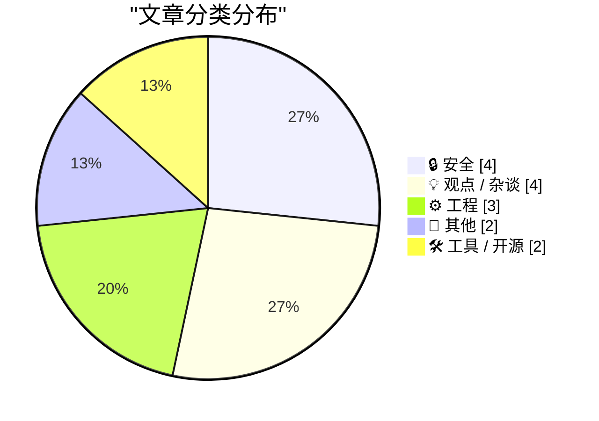
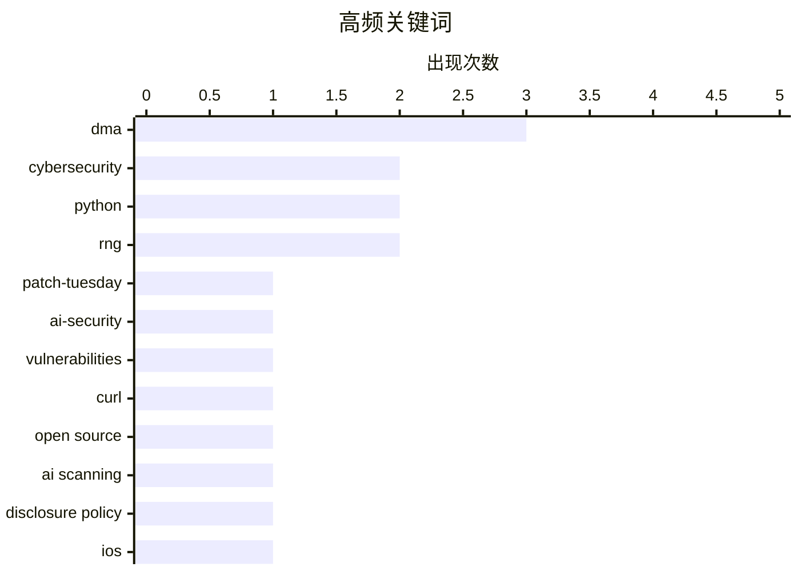

# 📰 AI 博客每日精选 — 2026-05-13

> 来自 Karpathy 推荐的 92 个顶级技术博客，AI 精选 Top 15

## 📝 今日看点

今日技术圈聚焦AI效能、算力基建与生态治理的三重变局。AI正深度重塑安全攻防与开发工作流，既以卓越能力倒逼厂商加速修复漏洞，也迫使社区建立机制过滤扫描噪音，同时引发对开发者深度思考被碎片化交互侵蚀的警惕。算力狂飙推动数据中心建设进入新周期，但电力供应与供应链约束正成为不可忽视的扩张瓶颈。与此同时，欧盟DMA合规加速落地与开源硬件生态争议，标志着科技监管与开源治理正从规则制定迈向实质博弈阶段。

---

## 🏆 今日必读

🥇 **2026年5月补丁星期二**

[Patch Tuesday, May 2026 Edition](https://krebsonsecurity.com/2026/05/patch-tuesday-may-2026-edition/) — krebsonsecurity.com · 2 小时前 · 🔒 安全

> 本月补丁星期二显示，AI在挖掘人类编写代码的安全漏洞方面表现卓越，正推动各大厂商加速修复。Apple、Google、Microsoft、Mozilla和Oracle等主流软件开发商修复的安全漏洞数量接近历史最高纪录，且补丁发布节奏显著加快。AI驱动的安全扫描工具已成为发现底层代码缺陷的核心力量，彻底改变了传统漏洞挖掘的效率边界。厂商必须适应AI加速的漏洞披露周期，将安全防线与代码审查前置至开发早期阶段。

💡 **为什么值得读**: 揭示了AI如何实质性改变软件漏洞挖掘与修复的产业节奏，为安全团队调整漏洞管理策略提供关键趋势参考。

🏷️ patch-tuesday, ai-security, vulnerabilities, cybersecurity

🥈 **并非安全问题**

[Not a Security Issue](https://nesbitt.io/2026/05/12/not-a-security-issue.html) — nesbitt.io · 14 小时前 · 🔒 安全

> curl项目通过其披露政策，在源头过滤了AI安全扫描器产生的大量误报与低价值漏洞发现。该政策明确区分了真正威胁与AI工具过度敏感生成的噪音，避免了无效漏洞报告对维护者精力的消耗。通过设定严格的漏洞验证标准与披露门槛，curl成功阻断了AI扫描器“广撒网”式的漏洞提交模式。开源项目需建立适配AI时代的漏洞过滤机制，以维持健康的协作生态与代码质量。

💡 **为什么值得读**: 提供了开源项目应对AI漏洞扫描器“报告洪水”的实操策略，对维护者优化安全协作流程极具借鉴价值。

🏷️ curl, open source, AI scanning, disclosure policy

🥉 **iOS 26.5为欧盟用户新增DMA合规功能（或许欧盟终于对科技监管开窍了）**

[New DMA Compliance Features for EU Users in iOS 26.5 (and Perhaps the EU Has Finally Come to Their Senses on Tech Regulation)](https://www.macrumors.com/2026/05/11/ios-26-5-eu-third-party-wearable-changes/) — daringfireball.net · 5 小时前 · ⚙️ 工程

> 为遵守欧盟《数字市场法案》（DMA），iOS 26.5向欧盟用户开放了原本仅限Apple Watch和AirPods使用的硬件级交互功能。第三方耳机现支持“近场配对”（Proximity Pairing），靠近iPhone即可触发类似AirPods的一键配对流程，彻底打破苹果生态的硬件绑定壁垒。此举标志着欧盟反垄断监管正从软件接口开放延伸至底层硬件协议与系统级权限。苹果在合规压力下逐步瓦解封闭生态，第三方外设厂商将获得更平等的底层接入权限。

💡 **为什么值得读**: 深入剖析欧盟DMA监管如何实质性撬动苹果硬件生态壁垒，为理解全球科技反垄断趋势提供一线案例。

🏷️ iOS, DMA, Apple, mobile development

---

## 📊 数据概览

| 扫描源 | 抓取文章 | 时间范围 | 精选 |
|:---:|:---:|:---:|:---:|
| 77/92 | 2331 篇 → 23 篇 | 24h | **15 篇** |

### 分类分布



### 高频关键词



<details>
<summary>📈 纯文本关键词图（终端友好）</summary>

```
dma             │ ████████████████████ 3
cybersecurity   │ █████████████░░░░░░░ 2
python          │ █████████████░░░░░░░ 2
rng             │ █████████████░░░░░░░ 2
patch-tuesday   │ ███████░░░░░░░░░░░░░ 1
ai-security     │ ███████░░░░░░░░░░░░░ 1
vulnerabilities │ ███████░░░░░░░░░░░░░ 1
curl            │ ███████░░░░░░░░░░░░░ 1
open source     │ ███████░░░░░░░░░░░░░ 1
ai scanning     │ ███████░░░░░░░░░░░░░ 1
```

</details>

### 🏷️ 话题标签

**dma**(3) · **cybersecurity**(2) · **python**(2) · rng(2) · patch-tuesday(1) · ai-security(1) · vulnerabilities(1) · curl(1) · open source(1) · ai scanning(1) · disclosure policy(1) · ios(1) · apple(1) · mobile development(1) · data centers(1) · ai infrastructure(1) · cloud computing(1) · nvidia(1) · llm-cli(1) · openai(1)

---

## 🔒 安全

### 1. 2026年5月补丁星期二

[Patch Tuesday, May 2026 Edition](https://krebsonsecurity.com/2026/05/patch-tuesday-may-2026-edition/) — **krebsonsecurity.com** · 2 小时前 · ⭐ 27/30

> 本月补丁星期二显示，AI在挖掘人类编写代码的安全漏洞方面表现卓越，正推动各大厂商加速修复。Apple、Google、Microsoft、Mozilla和Oracle等主流软件开发商修复的安全漏洞数量接近历史最高纪录，且补丁发布节奏显著加快。AI驱动的安全扫描工具已成为发现底层代码缺陷的核心力量，彻底改变了传统漏洞挖掘的效率边界。厂商必须适应AI加速的漏洞披露周期，将安全防线与代码审查前置至开发早期阶段。

🏷️ patch-tuesday, ai-security, vulnerabilities, cybersecurity

---

### 2. 并非安全问题

[Not a Security Issue](https://nesbitt.io/2026/05/12/not-a-security-issue.html) — **nesbitt.io** · 14 小时前 · ⭐ 26/30

> curl项目通过其披露政策，在源头过滤了AI安全扫描器产生的大量误报与低价值漏洞发现。该政策明确区分了真正威胁与AI工具过度敏感生成的噪音，避免了无效漏洞报告对维护者精力的消耗。通过设定严格的漏洞验证标准与披露门槛，curl成功阻断了AI扫描器“广撒网”式的漏洞提交模式。开源项目需建立适配AI时代的漏洞过滤机制，以维持健康的协作生态与代码质量。

🏷️ curl, open source, AI scanning, disclosure policy

---

### 3. 破解 lehmer64 随机数生成器

[Hacking the lehmer64 RNG](https://www.johndcook.com/blog/2026/05/12/hacking-the-lehmer64-rng/) — **johndcook.com** · 13 小时前 · ⭐ 23/30

> 通过观测连续输出流可逆向恢复 lehmer64 随机数生成器的内部状态。与 Mersenne Twister 需要 640 个输出值不同，lehmer64 因其极简的线性同余结构，仅需少量连续输出即可被完整破解。Daniel Lemire 曾指出该算法是“最快的”实现之一，但其数学结构的透明性也使其天然缺乏密码学安全性。该分析揭示了高性能非加密 RNG 在安全敏感场景中的致命缺陷，强调必须严格区分性能型与密码学型随机数生成器的使用边界。

🏷️ RNG, cryptography, reverse engineering, security

---

### 4. 为何 WannaCry 勒索软件爆发如此严重

[Why the Wannacry outbreak was so bad](https://dfarq.homeip.net/why-the-wannacry-outbreak-was-so-bad/?utm_source=rss&#038;utm_medium=rss&#038;utm_campaign=why-the-wannacry-outbreak-was-so-bad) — **dfarq.homeip.net** · 13 小时前 · ⭐ 21/30

> 文章复盘了 2017 年 5 月 12 日 WannaCry 勒索病毒全球大爆发的技术成因与扩散路径。该病毒利用 Windows 系统漏洞 CVE-2017-0144 进行横向传播，尽管微软早在两个月前已发布 MS17-010 安全补丁，但大量企业内网因未及时更新或关闭 SMBv1 协议而沦陷。攻击者结合 EternalBlue 漏洞利用工具与蠕虫式自我复制机制，在数小时内感染了全球数十万台设备，造成医疗、交通等关键基础设施瘫痪。此次事件暴露了企业安全运维中补丁管理滞后与网络分段缺失的致命短板。

🏷️ ransomware, cybersecurity, patching, WannaCry

---

## 💡 观点 / 杂谈

### 5. 欧盟竞争委员特蕾莎·里维拉访美却未引起关注

[Teresa Ribera Visited the U.S. and No One Noticed](https://www.politico.eu/article/eu-big-tech-rulebook-shifting-digital-economy-ribera-dma-pulse-forum/) — **daringfireball.net** · 4 小时前 · ⭐ 23/30

> 欧盟竞争委员特蕾莎·里维拉指出，欧盟科技监管法规已取得显著成效，正逐步缩小硅谷巨头与欧洲本土数字企业的竞争差距。随着欧盟准备对《数字市场法案》（DMA）展开正式审查，监管重心将从初期合规执法转向规则优化与效果评估。DMA 通过强制开放核心平台接口与限制自我优待行为，已实质性重塑欧洲数字市场的竞争格局。里维拉的低调访美与高调表态形成反差，折射出欧盟在科技主权与全球规则输出上的战略定力。

🏷️ eu-regulation, tech-policy, dma, silicon-valley

---

### 6. 拓竹科技正在滥用开源社会契约

[Bambu Lab is abusing the open source social contract](https://www.jeffgeerling.com/blog/2026/bambu-lab-abusing-open-source-social-contract/) — **jeffgeerling.com** · 10 小时前 · ⭐ 22/30

> 拓竹科技（Bambu Lab）将“始终在线”的云解决方案设为默认配置，打破了硬件厂商与开源社区之间的信任契约。作者通过 OPNsense 防火墙阻断打印机联网、停止固件更新、锁定开发者模式并弃用官方切片软件，以极端方式捍卫设备的本地控制权。此举反映出智能硬件厂商在数据收集与云端服务商业化压力下，正逐步侵蚀用户对本机设备的完全支配权。开源硬件生态的可持续性依赖于厂商对本地优先原则的尊重，而非强制绑定云端服务。

🏷️ open-source, iot, cloud-dependency, bambu-lab

---

### 7. 多元主义专栏：法西斯范式（2026年5月12日）

[Pluralistic: A fascist paradigm (12 May 2026)](https://pluralistic.net/2026/05/12/donella-meadows/) — **pluralistic.net** · 16 小时前 · ⭐ 21/30

> 本期专栏以系统思考学者 Donella Meadows 的理论为切入点，探讨技术范式转变对社会结构的深层影响。作者通过 OpenStreetMap 与怀特岛地理数据结合、市政道路维护困境等现实案例，剖析了技术工具在应对复杂社会问题时的局限性。文章同时列出了作者近期在巴塞罗那、柏林、伦敦等地的公开演讲行程及出版动态。核心观点强调，面对系统性危机，单纯依赖技术优化无法解决根本矛盾，必须重构决策逻辑与社会协作模式。

🏷️ tech policy, digital rights, surveillance, Cory Doctorow

---

### 8. 引用 Mitchell Hashimoto：技术决策者的真实动机

[Quoting Mitchell Hashimoto](https://simonwillison.net/2026/May/12/mitchell-hashimoto/#atom-everything) — **simonwillison.net** · 1 小时前 · ⭐ 20/30

> 文章引用 HashiCorp 联合创始人 Mitchell Hashimoto 的观点，直指企业技术决策者（TDM）的核心行为逻辑。他指出 90% 的 TDM 首要动机是“避免被解雇”，而非追求技术前沿或极客文化，因此他们高度依赖 Gartner 等分析师报告与行业主流趋势来规避风险。这种保守倾向导致企业在技术选型时往往偏向成熟但可能过时的方案，而非真正创新或高效的工具。作者借此提醒开源社区与技术布道者，推广新技术必须理解企业决策者的风险厌恶心理，并提供可量化的合规与稳定性证明。

🏷️ tech-leadership, decision-making, corporate-culture, engineering

---

## ⚙️ 工程

### 9. iOS 26.5为欧盟用户新增DMA合规功能（或许欧盟终于对科技监管开窍了）

[New DMA Compliance Features for EU Users in iOS 26.5 (and Perhaps the EU Has Finally Come to Their Senses on Tech Regulation)](https://www.macrumors.com/2026/05/11/ios-26-5-eu-third-party-wearable-changes/) — **daringfireball.net** · 5 小时前 · ⭐ 24/30

> 为遵守欧盟《数字市场法案》（DMA），iOS 26.5向欧盟用户开放了原本仅限Apple Watch和AirPods使用的硬件级交互功能。第三方耳机现支持“近场配对”（Proximity Pairing），靠近iPhone即可触发类似AirPods的一键配对流程，彻底打破苹果生态的硬件绑定壁垒。此举标志着欧盟反垄断监管正从软件接口开放延伸至底层硬件协议与系统级权限。苹果在合规压力下逐步瓦解封闭生态，第三方外设厂商将获得更平等的底层接入权限。

🏷️ iOS, DMA, Apple, mobile development

---

### 10. 软件开发需要“消化”时间

[Building Software Requires Digestion](https://blog.jim-nielsen.com/2026/software-requires-digestion/) — **blog.jim-nielsen.com** · 5 小时前 · ⭐ 23/30

> 聊天机器人界面的“输入-阅读-回复”交互模式正在重塑开发者的认知工作流，但也带来了深度思考被碎片化反应取代的风险。该界面本质上是被动响应式的，AI 快速生成复杂文本会诱导用户快速浏览并立即输入反馈，从而维持表面的交互 momentum。这种高频互动结构容易让人误以为正在进行深度架构设计或代码审查，实则削弱了系统性消化与批判性评估的时间。软件开发的核心价值仍依赖于离线的深度思考与知识内化，而非即时对话的堆砌。

🏷️ software, AI-interfaces, workflow, cognition

---

### 11. 在 C 语言中初始化与打印 128 位整数

[Initialize and print 128-bit integers in C](https://www.johndcook.com/blog/2026/05/12/c-128-bit-int/) — **johndcook.com** · 11 小时前 · ⭐ 22/30

> 在 C 语言中处理 128 位无符号整数面临编译器字面量支持的天然限制。尽管 128 位整数常用于表示高性能随机数生成器的内部状态，但直接赋值 128 位常量会引发代码复杂度与可移植性问题。通过分步初始化与自定义打印逻辑，开发者可在不依赖外部库的前提下安全操作大整数。该实践揭示了 C 语言底层类型系统的边界，为高性能计算场景提供了轻量级的大数处理范式。

🏷️ C programming, 128-bit integers, RNG, systems programming

---

## 📝 其他

### 12. 数据中心都去哪了？

[Where Are All The Data Centers?](https://www.wheresyoured.at/where-are-all-the-data-centers/) — **wheresyoured.at** · 7 小时前 · ⭐ 24/30

> AI算力爆发正推动全球数据中心选址与基础设施扩张进入新阶段。作者结合NVIDIA、Anthropic和OpenAI等头部企业的算力部署数据，剖析了数据中心建设在电力供应、地理分布与供应链约束下的现实瓶颈。当前AI军备竞赛正推动基础设施从传统集群向高能耗、定制化方向快速演进。物理基础设施的扩张速度已成为制约大模型迭代的关键变量，算力布局将深刻重塑未来AI产业格局。

🏷️ data centers, AI infrastructure, cloud computing, NVIDIA

---

### 13. 广播联盟敦促欧盟利用《数字市场法》监管智能电视平台

[Broadcasters Urge EU to Use the DMA to Go After Smart TV Platforms, None of Which Are From European Companies](https://www.reuters.com/sustainability/boards-policy-regulation/eu-digital-rules-should-apply-big-techs-smart-tvs-broadcasters-tell-antitrust-2026-03-23/) — **daringfireball.net** · 4 小时前 · ⭐ 21/30

> 欧洲商业电视与视频点播服务协会（ACT）联合多家国际主流媒体，呼吁欧盟反垄断机构将《数字市场法》（DMA）的严格监管范围扩展至智能电视操作系统。该倡议直指 Google、Amazon、Apple 和 Samsung 等占据市场主导地位的电视平台，认为其虚拟助手与应用生态已形成事实上的市场壁垒。传统广播机构指出，这些非欧洲科技巨头的封闭策略正在挤压内容分发渠道，需通过 DMA 的“守门人”规则强制开放接口与数据。此举旨在打破智能电视生态的垄断格局，保障内容提供商的公平竞争环境。

🏷️ DMA, antitrust, smart TV, EU regulation

---

## 🛠 工具 / 开源

### 14. llm 0.32a2 版本发布

[llm 0.32a2](https://simonwillison.net/2026/May/12/llm/#atom-everything) — **simonwillison.net** · 6 小时前 · ⭐ 23/30

> llm 0.32a2 版本核心升级在于全面适配 OpenAI 推理模型的 API 架构变更。该版本将底层调用端点从 /v1/chat/completions 迁移至 /v1/responses，从而原生支持模型输出过程中的推理与回答交替生成（interleaved reasoning）。这一改动使开发者能够更精准地捕获和流式处理模型的思考链，提升复杂任务的处理透明度。工具链的及时跟进确保了本地 LLM 工作流与最新 API 规范的无缝兼容。

🏷️ llm-cli, openai, reasoning-models, python

---

### 15. Datasette 1.0a29 版本发布说明

[datasette 1.0a29](https://simonwillison.net/2026/May/12/datasette/#atom-everything) — **simonwillison.net** · 29 分钟前 · ⭐ 21/30

> 该版本主要面向开发者与插件作者优化了权限控制与界面交互体验。新增 TokenRestrictions.abbreviated(datasette) 工具方法，用于快速生成 "_r" 权限字典，简化了访问控制逻辑的配置流程。同时修复了表格渲染问题，确保即使表格内容较长，表头与列选项也能保持可见，提升了数据浏览的可用性。此次更新进一步巩固了 Datasette 作为轻量级 SQLite 数据发布平台的开发友好性。

🏷️ datasette, python, sqlite, release

---

*生成于 2026-05-13 00:11 | 扫描 77 源 → 获取 2331 篇 → 精选 15 篇*
*基于 [Hacker News Popularity Contest 2025](https://refactoringenglish.com/tools/hn-popularity/) RSS 源列表，由 [Andrej Karpathy](https://x.com/karpathy) 推荐*
*由「懂点儿AI」制作，欢迎关注同名微信公众号获取更多 AI 实用技巧 💡*
