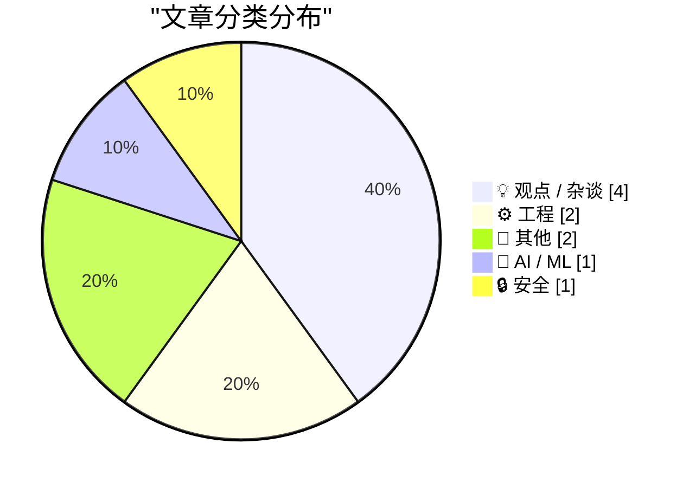
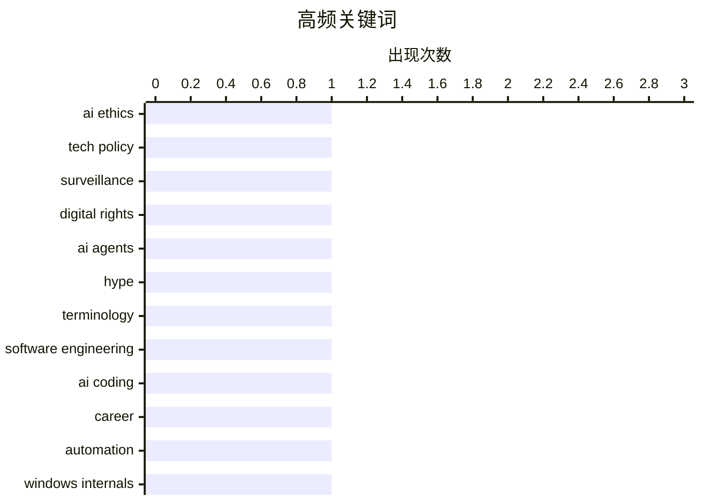

# 📰 AI 博客每日精选 — 2026-05-14

> 来自 Karpathy 推荐的 92 个顶级技术博客，AI 精选 Top 10

## 📝 今日看点

今日技术圈呈现三大核心趋势：AI 领域正从营销狂热转向工程落地与伦理边界探讨，全栈架构能力与系统级思维的价值在自动化浪潮中被重新强调。开发者高度聚焦底层系统稳定性、动态安全策略与交互体验的精细化打磨，力求在复杂环境中构建可靠且人性化的技术产品。开源生态的透明度评估与技术商业化的价值重估，亦成为推动行业健康演进的重要风向标。整体而言，技术实践正全面回归理性务实，强调安全、体验与可持续生态的深度融合。

---

## 🏆 今日必读

🥇 **亿万富翁唯我论、独裁者唯我论、AI 与法西斯范式**

[Pluralistic: Billionaire solipsism, dictator solipsism, AI, and the fascist paradigm (13 May 2026)](https://pluralistic.net/2026/05/13/vibe-governance/) — pluralistic.net · 8 小时前 · 💡 观点 / 杂谈

> 亿万富翁与独裁者的“唯我论”思维正与人工智能发展及法西斯主义范式深度交织。AGI 的研发环境往往脱离现实社会约束，如同处于“K-hole”般的封闭状态，这种技术路径极易被权力集中者用于强化控制。科技寡头收购、政治献金合并及开源软件生存危机等案例，清晰揭示了技术演进与威权治理之间的隐性共谋。若不打破技术精英的封闭认知与权力垄断，AI 将成为巩固法西斯式治理的工具。

💡 **为什么值得读**: 以犀利的科技社会学视角揭示 AI 狂热背后的权力结构风险，为理解技术伦理与未来治理提供不可或缺的批判性框架。

🏷️ AI ethics, tech policy, surveillance, digital rights

🥈 **引用 Boris Mann 的观点**

[Quoting Boris Mann](https://simonwillison.net/2026/May/13/boris-mann/#atom-everything) — simonwillison.net · 7 小时前 · 🤖 AI / ML

> 盲目追求“智能体数量”的营销话术在工程实践中毫无意义。“拥有 11 个 AI 智能体”的表述与使用 11 个电子表格或浏览器标签页完成工作并无本质区别。智能体的核心价值不在于堆砌数量，而在于能否无缝融入现有工作流并解决具体业务问题。行业必须停止用空洞的指标制造焦虑，转而聚焦 AI 工具的实际效能与系统集成深度。

💡 **为什么值得读**: 一针见血地戳破当前 AI 智能体营销泡沫，帮助开发者与企业管理者回归工具本质，避免在无效指标上浪费资源。

🏷️ AI agents, hype, terminology

🥉 **软件工程师已过时**

[Software Engineers are Obsolete](https://idiallo.com/blog/everyone-is-better-than-you?src=feed) — idiallo.com · 1 小时前 · 💡 观点 / 杂谈

> 独立从零构建 PHP 应用、设计数据库架构并整合前端交互的完整工程能力，依然是区分普通开发者与优秀工程师的关键。尽管自动化工具日益普及，但能够自主规划、开发并交付可运行系统的“全栈思维”，远比单纯掌握语法或依赖 AI 生成代码更具不可替代性。软件工程师的职业护城河并未消失，而是向具备产品架构与独立交付能力的“数字工匠”方向迁移。掌握端到端的项目落地能力，是应对技术迭代的最优解。

💡 **为什么值得读**: 在“AI 取代程序员”的焦虑蔓延之际，用实战案例重新定义工程师护城河，为技术人职业成长提供务实转型方向。

🏷️ software engineering, AI coding, career, automation

---

## 📊 数据概览

| 扫描源 | 抓取文章 | 时间范围 | 精选 |
|:---:|:---:|:---:|:---:|
| 62/92 | 2022 篇 → 10 篇 | 24h | **10 篇** |

### 分类分布



### 高频关键词



<details>
<summary>📈 纯文本关键词图（终端友好）</summary>

```
ai ethics            │ ████████████████████ 1
tech policy          │ ████████████████████ 1
surveillance         │ ████████████████████ 1
digital rights       │ ████████████████████ 1
ai agents            │ ████████████████████ 1
hype                 │ ████████████████████ 1
terminology          │ ████████████████████ 1
software engineering │ ████████████████████ 1
ai coding            │ ████████████████████ 1
career               │ ████████████████████ 1
```

</details>

### 🏷️ 话题标签

**ai ethics**(1) · **tech policy**(1) · **surveillance**(1) · digital rights(1) · ai agents(1) · hype(1) · terminology(1) · software engineering(1) · ai coding(1) · career(1) · automation(1) · windows internals(1) · debugging(1) · keyboard layout(1) · systems programming(1) · csp(1) · iframe(1) · web security(1) · sandbox(1) · open source(1)

---

## 💡 观点 / 杂谈

### 1. 亿万富翁唯我论、独裁者唯我论、AI 与法西斯范式

[Pluralistic: Billionaire solipsism, dictator solipsism, AI, and the fascist paradigm (13 May 2026)](https://pluralistic.net/2026/05/13/vibe-governance/) — **pluralistic.net** · 8 小时前 · ⭐ 25/30

> 亿万富翁与独裁者的“唯我论”思维正与人工智能发展及法西斯主义范式深度交织。AGI 的研发环境往往脱离现实社会约束，如同处于“K-hole”般的封闭状态，这种技术路径极易被权力集中者用于强化控制。科技寡头收购、政治献金合并及开源软件生存危机等案例，清晰揭示了技术演进与威权治理之间的隐性共谋。若不打破技术精英的封闭认知与权力垄断，AI 将成为巩固法西斯式治理的工具。

🏷️ AI ethics, tech policy, surveillance, digital rights

---

### 2. 软件工程师已过时

[Software Engineers are Obsolete](https://idiallo.com/blog/everyone-is-better-than-you?src=feed) — **idiallo.com** · 1 小时前 · ⭐ 24/30

> 独立从零构建 PHP 应用、设计数据库架构并整合前端交互的完整工程能力，依然是区分普通开发者与优秀工程师的关键。尽管自动化工具日益普及，但能够自主规划、开发并交付可运行系统的“全栈思维”，远比单纯掌握语法或依赖 AI 生成代码更具不可替代性。软件工程师的职业护城河并未消失，而是向具备产品架构与独立交付能力的“数字工匠”方向迁移。掌握端到端的项目落地能力，是应对技术迭代的最优解。

🏷️ software engineering, AI coding, career, automation

---

### 3. 展示我们的工作

[Showing Our Work](https://nesbitt.io/2026/05/13/showing-our-work.html) — **nesbitt.io** · 14 小时前 · ⭐ 22/30

> 针对 ecosyste.ms Python 基金的独立基准评估，通过量化资金分配效率、项目覆盖率及开发者参与度等核心指标，客观检验了该资助计划对开源生态的实际推动作用。透明化的基准测试不仅能验证资金使用的有效性，还能为后续的资源倾斜提供可靠的数据支撑。开源生态的可持续发展必须依赖可验证的绩效评估体系，而非单纯依赖社区口碑或主观判断。建立数据驱动的资助模型是保障技术基础设施长期健康的必由之路。

🏷️ open source, Python, funding, benchmark

---

### 4. Nextpad++

[★ Nextpad++](https://daringfireball.net/2026/05/nextpad) — **daringfireball.net** · 21 小时前 · ⭐ 11/30

> Nextpad++ 的交互逻辑与界面美学呈现出极端的反直觉设计，严重剥夺了用户的自定义空间与操作直觉。此类产品往往以“效率”或“规范”为名，实则用强制性的框架驯化用户，背离了人机交互的基本认知规律。优秀的软件设计必须服务于人的思维习惯，而非通过复杂的层级结构增加认知负荷。尊重用户控制权与操作直觉，是衡量现代应用设计优劣的绝对标准。

🏷️ Mac, UI, critique

---

## ⚙️ 工程

### 5. 用户切换键盘布局导致挂起的排查案例

[The case of the hang when the user changed keyboard layouts](https://devblogs.microsoft.com/oldnewthing/20260513-00/?p=112318) — **devblogs.microsoft.com/oldnewthing** · 10 小时前 · ⭐ 24/30

> 用户切换键盘布局时导致的应用程序挂起，根源在于 Windows 消息循环与输入法编辑器（IME）交互过程中的线程死锁或资源竞争。通过系统调试工具精准定位挂起点，并针对键盘状态同步机制实施修复，可有效阻断此类连锁性系统卡顿。处理底层输入事件时必须严格遵循 Windows 消息传递规范，任何异步状态更新都可能引发界面冻结。遵循标准消息队列处理逻辑是保障系统响应性的唯一途径。

🏷️ Windows internals, debugging, keyboard layout, systems programming

---

### 6. 极简 SVG 迷你图

[Stupidly Simple SVG Sparklines](https://shkspr.mobi/blog/2026/05/stupidly-simple-svg-sparklines/) — **shkspr.mobi** · 12 小时前 · ⭐ 21/30

> 将数据序列直接转换为 x,y 坐标对列表，即可通过原生 SVG polyline 元素快速渲染无坐标轴的迷你趋势图（Sparkline）。直接映射坐标时极易出现比例失真或边界裁剪问题，需配合 viewBox 属性进行自适应缩放。掌握原生 SVG 绘图逻辑不仅能彻底摆脱重型图表库的依赖，还能在性能敏感场景中实现毫秒级渲染。轻量级可视化方案的核心在于精准控制坐标空间与渲染开销。

🏷️ SVG, sparklines, data visualization, frontend

---

## 📝 其他

### 7. 《创智赢家》Kevin O’Leary 如何致富

[How Shark Tank’s Kevin O’Leary became rich](https://dfarq.homeip.net/how-shark-tanks-kevin-oleary-became-rich/?utm_source=rss&#038;utm_medium=rss&#038;utm_campaign=how-shark-tanks-kevin-oleary-became-rich) — **dfarq.homeip.net** · 13 小时前 · ⭐ 16/30

> Kevin O’Leary 的财富积累并非依赖互联网泡沫红利，而是通过精准收购教育软件公司并成功套现完成原始资本积累。与马克·库班的纯技术路线不同，其商业版图扩张严格遵循“技术产品商业化+资本运作”的双轮驱动逻辑。对技术产品市场周期的敏锐判断与果断退出机制，构成了其跨越科技与金融领域的核心壁垒。技术创业者的终极目标应是掌握估值周期与资本退出节奏，而非局限于代码实现。

🏷️ tech business, entrepreneurship, history

---

### 8. 评论规范

[Commenting Guidelines](https://susam.net/commenting.html) — **susam.net** · 8 分钟前 · ⭐ 7/30

> 评论系统支持 HTML 与 Markdown 语法输入，并在发布前执行严格的自动化清洗（Sanitization）以过滤潜在安全风险。所有提交内容均进入人工审核队列，最终公开权限完全由作者独立裁决。技术过滤与人工把关的双重防线在保障交互自由的同时，有效维护了社区讨论质量与站点安全。明确的评论规范与可控的审核流程是构建高质量技术博客生态的基础设施。

🏷️ blog policy, commenting, markdown

---

## 🤖 AI / ML

### 9. 引用 Boris Mann 的观点

[Quoting Boris Mann](https://simonwillison.net/2026/May/13/boris-mann/#atom-everything) — **simonwillison.net** · 7 小时前 · ⭐ 24/30

> 盲目追求“智能体数量”的营销话术在工程实践中毫无意义。“拥有 11 个 AI 智能体”的表述与使用 11 个电子表格或浏览器标签页完成工作并无本质区别。智能体的核心价值不在于堆砌数量，而在于能否无缝融入现有工作流并解决具体业务问题。行业必须停止用空洞的指标制造焦虑，转而聚焦 AI 工具的实际效能与系统集成深度。

🏷️ AI agents, hype, terminology

---

## 🔒 安全

### 10. CSP 白名单实验

[CSP Allow-list Experiment](https://simonwillison.net/2026/May/13/csp-allow/#atom-everything) — **simonwillison.net** · 19 小时前 · ⭐ 23/30

> 在沙盒化 iframe 中加载应用并利用自定义 fetch() 拦截器捕获 CSP 违规请求，可实现动态域名白名单机制。拦截信息传递给父窗口后，系统可弹出提示允许用户手动将新域名加入白名单并自动刷新页面重新加载资源。该方案证明了在严格 CSP 限制下，仍可通过跨窗口通信实现灵活且安全的资源加载策略。动态白名单机制能在不牺牲安全性的前提下，显著提升第三方应用集成的用户体验。

🏷️ CSP, iframe, web security, sandbox

---

*生成于 2026-05-14 00:08 | 扫描 62 源 → 获取 2022 篇 → 精选 10 篇*
*基于 [Hacker News Popularity Contest 2025](https://refactoringenglish.com/tools/hn-popularity/) RSS 源列表，由 [Andrej Karpathy](https://x.com/karpathy) 推荐*
*由「懂点儿AI」制作，欢迎关注同名微信公众号获取更多 AI 实用技巧 💡*
